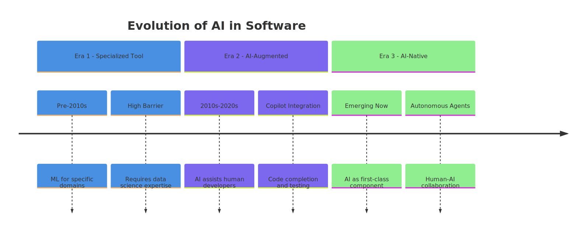

# Chapter 1: Foundations of AI-Native Development

## 1.1 The AI-Native Revolution

We stand at an inflection point in the history of software development. For decades, we've built systems around deterministic logic, explicit algorithms, and human-written code that executes predictably within well-defined boundaries. Today, we're witnessing the emergence of a new paradigm: **AI-native development**—systems designed from the ground up for artificial intelligence, where AI capabilities aren't merely features but foundational components that reshape how software is conceived, architected, and operated.

This transition represents more than technological evolution; it's a fundamental reimagining of the developer's relationship with computation. Where traditional software engineering sought to eliminate uncertainty through exhaustive specification and testing, AI-native development embraces probabilistic reasoning, adaptive behavior, and emergent capabilities. The shift mirrors earlier revolutions in computing—from machine code to high-level languages, from monolithic applications to microservices—each of which expanded what was possible while demanding new patterns, practices, and mindsets.

### Historical Context: From Traditional Engineering to AI-Augmented Development

The journey to AI-native development begins with understanding how artificial intelligence has evolved within software ecosystems:

**Era 1: AI as Specialized Tool (Pre-2010s)**
- Machine learning algorithms applied to specific domains (recommendation systems, fraud detection)
- AI components isolated from core application logic
- High barrier to entry requiring specialized data science expertise
- Examples: Netflix recommendations, credit scoring models

**Era 2: AI-Augmented Development (2010s-2020s)**
- AI capabilities integrated into development workflows (code completion, testing)
- AI assisting human developers but not driving architecture decisions
- Gradual adoption of AI-powered tools (GitHub Copilot, Tabnine)
- Systems remain fundamentally deterministic with AI as auxiliary component

**Era 3: AI-Native Development (Emerging Now)**
- Systems designed with AI as first-class architectural component
- AI agents making autonomous decisions within defined boundaries
- Human-AI collaboration as core interaction pattern
- Architecture optimized for AI reasoning, learning, and adaptation

### Defining AI-Native Development

AI-native development represents a paradigm where:
- **AI-first design:** Systems are conceived with AI capabilities as foundational rather than supplementary
- **Human-AI collaboration:** Humans and AI agents work together, each contributing unique strengths
- **Emergent behavior:** System capabilities emerge from interactions between components rather than being explicitly programmed
- **Adaptive architecture:** Systems evolve based on experience, feedback, and changing requirements
- **Probabilistic execution:** Operations include uncertainty and require handling multiple possible outcomes

### Key Characteristics

Our analysis of the OpenClaw ecosystem reveals several distinguishing characteristics of AI-native systems:

1. **AI-Accessible Architecture:** Systems structured for AI comprehension and manipulation, using human-readable formats (markdown, YAML) and consistent patterns that AI models can reliably parse and generate.

2. **Tool-Oriented Design:** Capabilities exposed through standardized tool interfaces that AI agents can discover, understand, and invoke with appropriate guardrails and error handling.

3. **Context-Aware Operation:** Systems maintain rich context across interactions, enabling personalized responses and continuity that mirrors human conversation.

4. **Graceful Degradation:** Designed to handle failures gracefully, providing partial functionality or clear guidance when components fail rather than catastrophic collapse.

5. **Community-Driven Evolution:** Patterns and best practices emerge from community experimentation and sharing rather than top-down specification.

### Contrast with AI-Augmented Development

Understanding what AI-native development **isn't** clarifies its distinctiveness:

| **Aspect** | **AI-Augmented Development** | **AI-Native Development** |
|------------|-----------------------------|---------------------------|
| **Primary Focus** | Enhancing human capabilities | Enabling autonomous AI capabilities |
| **Architecture** | Traditional with AI features added | Designed for AI from ground up |
| **Error Handling** | Deterministic exception handling | Probabilistic, tool-based recovery |
| **Testing** | Unit tests, integration tests | Example-driven validation, health checks |
| **State Management** | Databases, caches | File-based memory, append-only history |
| **Development Workflow** | Human writes code, AI assists | AI generates implementations, human reviews |

The OpenClaw project exemplifies this distinction. Unlike systems where AI chatbots are bolted onto existing applications, OpenClaw was conceived as an AI-native platform where agents coordinate through a central gateway, skills provide composable capabilities, and tools offer standardized interfaces—all optimized for AI comprehension and execution.

## 1.2 Core Principles of AI-Native Development

Through analysis of successful OpenClaw implementations and community patterns, we've identified five core principles that characterize effective AI-native development.

### Principle 1: Pragmatism Over Purity

AI-native systems prioritize practical solutions that work in real-world contexts over theoretically perfect approaches. This principle manifests in several ways:

**Concrete Implementation:** OpenClaw skills favor working implementations with clear examples over abstract specifications. The `health-check` skill, for instance, provides immediately usable validation rather than theoretical monitoring frameworks.

**Incremental Improvement:** Systems evolve through community contributions and real-world usage rather than grand redesigns. Patterns emerge from what works in practice, documented and refined through shared experience.

**Tool Appropriation:** Existing tools and formats are adapted for AI use rather than creating entirely new paradigms. Markdown files serve as databases, environment variables as configuration, and file systems as state stores—pragmatic choices that leverage familiar infrastructure.

### Principle 2: Human-Centric Design

Despite being "AI-native," these systems remain fundamentally human-centric, augmenting rather than replacing human capabilities:

**Transparent Operation:** AI decisions and tool invocations are logged and explainable, allowing human understanding and oversight. OpenClaw's structured logging provides visibility into agent reasoning and actions.

**Controlled Autonomy:** AI agents operate within clearly defined boundaries (guardrails) that ensure alignment with human values and organizational requirements. Skills include explicit constraints on tool usage and content generation.

**Collaborative Workflows:** Systems facilitate human-AI partnership where each contributes unique strengths—AI's speed and pattern recognition combined with human judgment, creativity, and ethical reasoning.

### Principle 3: File-Based Architecture

A distinctive characteristic of AI-native systems is their use of the file system as a primary data store and communication medium:

**Human-Readable Storage:** Markdown, YAML, and JSON files enable both AI and human access without specialized tooling. OpenClaw's memory system uses daily markdown files that agents can read and humans can edit.

**Version Control Integration:** File-based state naturally works with Git and other version control systems, enabling collaboration, audit trails, and rollback capabilities.

**Simplified Persistence:** Avoiding complex databases reduces dependencies and deployment complexity while increasing portability across environments.

**Example:** OpenClaw's `founder-coach` skill maintains founder profiles as markdown files with append-only updates, creating an immutable history while remaining accessible to both AI agents and human mentors.

### Principle 4: Example-Driven Validation

Traditional software validation through comprehensive unit tests proves challenging for AI-native systems where outputs are probabilistic and interactions complex. Instead, example-driven validation provides practical verification:

**Concrete Examples Over Abstract Specifications:** Skills include real-world usage examples that demonstrate functionality more effectively than technical specifications alone.

**Integration-Focused Testing:** Health checks validate system integration and operational readiness rather than isolated component correctness.

**AI-Assisted Verification:** The community embraces AI-assisted testing with transparent disclosure, recognizing that AI capabilities can enhance validation while requiring human oversight.

**Pattern:** The OpenClaw contribution guidelines explicitly welcome AI-assisted code with required disclosure, emphasizing working examples over theoretical perfection.

### Principle 5: Community-Driven Evolution

AI-native ecosystems thrive through community contribution and knowledge sharing:

**Pattern Emergence:** Best practices emerge organically from community experimentation rather than being dictated by central authorities. The eight architectural patterns identified in our research developed through shared implementation experience.

**Open Collaboration:** Projects welcome diverse contributions, including AI-assisted work, with clear guidelines for quality and disclosure. OpenClaw's maintainer model combines benevolent dictatorship with specialized subsystem experts.

**Knowledge Sharing:** Successes, failures, and patterns are documented and shared, accelerating collective learning. The OpenClaw community's Discord channels and GitHub discussions serve as living repositories of practical knowledge.

## 1.3 Taxonomy of AI-Native Development

Based on analysis of the OpenClaw ecosystem—examining 20+ skills, 50+ GitHub repositories, and community workflows—we've developed a comprehensive taxonomy of AI-native development patterns. This six-category framework provides a structured way to understand, discuss, and implement AI-native systems.

### Category 1: Architectural Patterns

**Focus:** System organization, component relationships, and integration approaches.

**Key Patterns:**
- **Micro-Skill Architecture:** Single-purpose, composable AI capabilities that integrate through common interfaces (Chapter 2)
- **Gateway-Mediated Orchestration:** Central coordination of multiple specialized agents (Chapters 2, 5)
- **Client-Server AI:** Separation of AI processing from user interface layers
- **Event-Driven AI:** AI responses triggered by system events rather than direct user queries

**OpenClaw Examples:** The gateway serves as central control plane, skills provide micro-capabilities, and channels offer client interfaces—exemplifying clean separation of concerns optimized for AI execution.

### Category 2: Skill Design Patterns

**Focus:** Individual AI capability structure and implementation.

**Key Patterns:**
- **Skill Blueprint:** Standardized documentation and structure enabling AI discovery and execution (Chapter 3)
- **Tool-First Design:** Skills designed around available tool capabilities rather than abstract functionality
- **Example-Driven Development:** Functionality validated through concrete examples
- **Guardrail-First Safety:** Safety constraints as primary design consideration

**Research Insight:** Analysis of OpenClaw skills revealed consistent structure across diverse capabilities—YAML frontmatter for metadata, clear sections (Overview, Workflow, Examples, Guardrails), and tool-oriented implementation.

### Category 3: Data and Memory Patterns

**Focus:** State management, context persistence, and knowledge representation.

**Key Patterns:**
- **File-Based Memory:** Human-readable, version-controlled state storage (Chapter 6)
- **Append-Only History:** Immutable log of interactions preserving context and audit trail
- **Contextual Loading:** Intelligent selection of relevant context from historical data
- **Progressive Summarization:** Condensing information over time to maintain relevance while managing volume

**OpenClaw Implementation:** Daily memory files (`YYYY-MM-DD.md`) capture interactions, long-term memory (`MEMORY.md`) distills insights, and skills like `founder-coach` demonstrate sophisticated profile management through structured files.

### Category 4: Error and Resilience Patterns

**Focus:** Fault tolerance, recovery mechanisms, and graceful degradation.

**Key Patterns:**
- **Tool-Based Recovery:** Structured error handling through standardized tool responses (Chapter 7, 10)
- **Status Classification:** Clear severity levels (OK, WARN, FAIL) for issue prioritization
- **Fallback Chains:** Alternative execution paths when primary approaches fail
- **Health-Check Validation:** Comprehensive system validation through specialized checks

**Example:** The `health-check` skill implements all four patterns—structured tool responses, multi-level status reporting, alternative validation methods, and comprehensive system checks.

### Category 5: Community and Collaboration Patterns

**Focus:** Multi-human, multi-AI collaboration and contribution workflows.

**Key Patterns:**
- **AI-First Contribution:** Optimized workflows for AI-assisted development (Chapter 3, 14)
- **Transparent AI Use:** Clear disclosure of AI involvement in contributions
- **Specialized Maintainers:** Domain expert review process for different subsystems
- **Example-Based Validation:** Practical functionality verification over theoretical correctness

**Community Observation:** OpenClaw's GitHub repositories show high rates of AI-disclosed contributions with maintainer specialization (gateway experts, skill reviewers, documentation specialists).

### Category 6: Security and Privacy Patterns

**Focus:** Data protection, access control, and ethical constraints.

**Key Patterns:**
- **Environment Configuration:** Secure storage of sensitive data through environment variables (Chapter 11)
- **Explicit Guardrails:** Clear boundaries for AI behavior defined in skill documentation
- **Permission-Based Tools:** Tool access controlled by policy with principle of least privilege
- **Privacy by Design:** Data minimization and protection integrated into architecture

**Implementation:** OpenClaw skills consistently use environment variables for API keys, include explicit guardrails sections, and implement tool policies that restrict sensitive operations.

## 1.4 The OpenClaw Project as a Case Study

OpenClaw provides a rich ecosystem for studying AI-native development patterns in practice. Born from the practical needs of developers working at the frontier of AI-human collaboration, it embodies the principles and patterns discussed throughout this chapter.

### History and Philosophy

OpenClaw began as a personal project to create a more capable, extensible AI assistant framework. Unlike platforms designed for specific use cases or commercial applications, OpenClaw embraced a philosophy of **pragmatic extensibility**—creating a foundation that communities could adapt to diverse needs through composable skills.

**Core Philosophy:**
- **Human-AI partnership:** Systems that augment human capabilities rather than replace them
- **Practical over perfect:** Working solutions preferred over theoretically optimal ones
- **Community-driven evolution:** Patterns emerging from shared experience rather than top-down design
- **Transparent operation:** Clear logging and explainable AI decisions

### Project Structure

OpenClaw's architecture reflects AI-native principles:

1. **Gateway:** Central WebSocket-based control plane managing sessions, tool routing, and agent coordination
2. **Agents:** Specialized AI personalities (main agent, sub-agents, cron agents) with distinct capabilities and responsibilities
3. **Skills:** Extensible capabilities following the Skill Blueprint pattern for consistency and discoverability
4. **Tools:** Standardized interfaces (read, write, exec, message, browser) providing uniform access to system capabilities
5. **Channels:** Communication interfaces (Discord, Telegram, CLI, Web UI) adapting core functionality to different contexts

### Research Methodology

The patterns and principles in this book derive from systematic analysis of the OpenClaw ecosystem:

**Data Sources:**
1. **Skills Analysis:** Examination of 20+ OpenClaw skills in active use, identifying implementation patterns and best practices
2. **GitHub Analysis:** Review of 50+ OpenClaw repositories, analyzing contribution patterns, architecture decisions, and community workflows
3. **Community Analysis:** Study of Discord discussions, issue tracking, and collaborative development processes
4. **Pattern Synthesis:** Identification of recurring solutions to common problems across the ecosystem

**Analysis Approach:**
- **Pattern Mining:** Identifying recurring solutions to similar problems across different implementations
- **Comparative Analysis:** Contrasting successful and unsuccessful approaches to understand what works
- **Community Validation:** Checking patterns against community discussions and documentation
- **Practical Verification:** Testing patterns in implementation contexts to ensure applicability

### Why OpenClaw Exemplifies AI-Native Development

OpenClaw demonstrates key characteristics of mature AI-native ecosystems:

1. **AI-First Architecture:** Components designed for AI comprehension and manipulation
2. **Community Pattern Emergence:** Best practices developed through shared experience rather than theoretical design
3. **Practical Implementation Focus:** Working systems preferred over perfect specifications
4. **Adaptive Evolution:** Architecture evolves based on real-world usage and community feedback
5. **Balanced Autonomy:** AI capabilities with appropriate human oversight and control

## 1.5 Patterns vs. Anti-Patterns

Understanding what to do requires understanding what to avoid. Our research identified not only successful patterns but also recurring anti-patterns—approaches that initially seem reasonable but lead to problems in AI-native contexts.

### The 8 Architectural Patterns

From our analysis of OpenClaw implementations, we identified eight key architectural patterns:

1. **Skill Blueprint Pattern:** Standardized structure for AI skill documentation enabling both human and AI interpretation
2. **Micro-Skill Architecture Pattern:** Single-purpose, standalone AI capabilities integrating through common interfaces
3. **Gateway-Mediated Multi-Agent Pattern:** Central gateway managing communication between specialized AI agents
4. **Tool-Based Error Recovery Pattern:** Systematic error handling through tool return codes, status levels, and fallback mechanisms
5. **Environment-First Configuration Pattern:** Configuration through environment variables with sensible defaults and clear documentation
6. **File-Based Memory Pattern:** Persistent state management through structured file storage with append-only updates
7. **Example-Driven Testing Pattern:** Validation through concrete examples and integration-style health checks
8. **AI-First Contribution Pattern:** Community-driven development optimized for AI-assisted contributions

Each pattern addresses specific challenges in AI-native development and will be explored in detail throughout this book.

### The 5 Anti-Patterns

Equally important are the anti-patterns to avoid:

1. **Monolithic Skill Anti-Pattern:** Creating skills that do too much, becoming hard to understand, test, and maintain
2. **Hard-Coded Path Anti-Pattern:** Using absolute file paths or assumptions about environment structure
3. **Silent Failure Anti-Pattern:** Tools or skills failing without clear error reporting or user feedback
4. **Undocumented Integration Anti-Pattern:** Skills depending on external systems without clear documentation
5. **Overly Complex Guardrails Anti-Pattern:** Excessive safety constraints limiting legitimate use cases

These anti-patterns represent common pitfalls when transitioning from traditional to AI-native development, often resulting from applying familiar approaches to fundamentally different contexts.

### How Patterns Emerge

In AI-native ecosystems like OpenClaw, patterns develop through:

**Community Practice:** Successful approaches are shared, adapted, and refined across implementations
**Documentation and Examples:** Patterns are documented through examples rather than formal specifications
**Evolutionary Refinement:** Initial solutions improve through iteration and community feedback
**Cross-Pollination:** Patterns from one domain adapt to solve problems in another

The OpenClaw community's Discord channels serve as a living laboratory where developers share what works, analyze failures, and collectively develop better approaches.

### The Role of Anti-Patterns in Learning

Anti-patterns serve valuable educational functions:

**Warning Signs:** They help developers recognize problematic approaches early
**Learning Opportunities:** Understanding why approaches fail provides deeper insight than merely knowing what succeeds
**Community Building:** Shared recognition of anti-patterns creates common vocabulary for discussing challenges
**Progress Measurement:** Transitioning from anti-patterns to patterns marks skill development

## 1.6 Reader's Journey Through the Book

This chapter establishes the conceptual foundation for understanding AI-native development. The remaining chapters build upon this foundation with increasing specificity and practicality.

### Book Structure

**Part 1: Foundations (Chapters 1-3)**
- **Chapter 1:** Foundations of AI-Native Development (this chapter)
- **Chapter 2:** The OpenClaw Ecosystem—detailed architecture walkthrough
- **Chapter 3:** Case Studies—real-world implementations of AI-native patterns

**Part 2: Core Patterns (Chapters 4-9)**
- **Chapter 4:** Soul.md and Agent Personalization—creating distinct AI personalities
- **Chapter 5:** Multi-Agent Coordination Patterns—orchestrating specialized capabilities
- **Chapter 6:** File Coordination and Memory Patterns—managing state and context
- **Chapter 7:** Cron and Scheduled Automation Patterns—time-based AI operations
- **Chapter 8:** Autonomous Systems Patterns—AI agents operating independently
- **Chapter 9:** Cost Optimization Patterns—managing AI resource consumption

**Part 3: Advanced Topics (Chapters 10-12)**
- **Chapter 10:** Debugging AI-Native Systems—tools and techniques for troubleshooting
- **Chapter 11:** Security and Privacy Patterns—protecting data and managing access
- **Chapter 12:** The Future of AI-Native Development—emerging trends and predictions

**Part 4: Implementation Guide (Chapters 13-14)**
- **Chapter 13:** Tooling Ecosystem and Integration Patterns—extending capabilities
- **Chapter 14:** Education and Community Building Patterns—growing AI-native ecosystems

### How to Use This Book

**For Developers New to AI-Native Development:**
1. Read Chapters 1-3 for conceptual foundation
2. Implement skills using patterns from Chapters 4-6
3. Reference specific patterns as needed for particular challenges

**For Experienced AI Developers:**
1. Use the taxonomy (Section 1.3) to categorize existing knowledge
2. Focus on implementation patterns (Chapters 4-12) for specific technical challenges
3. Contribute to pattern evolution through community engagement (Chapter 14)

**For Technical Leaders and Architects:**
1. Understand architectural implications through Chapters 1-3 and 5-8
2. Plan security and scalability using Chapters 10-11
3. Develop team capabilities with guidance from Chapter 14

### Prerequisites and Recommended Background

**Technical Prerequisites:**
- Basic programming experience (any language)
- Familiarity with command-line interfaces
- Understanding of basic software architecture concepts

**Helpful but Not Required:**
- Experience with AI/ML frameworks
- Previous work with chatbots or conversational AI
- DevOps or system administration background

**Mindset Requirements:**
- Willingness to embrace probabilistic rather than deterministic systems
- Comfort with emergent behavior and adaptive architectures
- Appreciation for practical solutions over theoretical perfection

### Applying Patterns to Your Projects

Throughout this book, you'll encounter patterns derived from real OpenClaw implementations. To apply them effectively:

1. **Understand the Context:** Each pattern solves specific problems in particular contexts
2. **Adapt Don't Adopt:** Modify patterns to fit your specific needs and constraints
3. **Start Small:** Implement patterns incrementally rather than attempting comprehensive redesign
4. **Contribute Back:** Share your adaptations and improvements with the community

## Key Takeaways

1. **AI-native development represents a fundamental paradigm shift** from deterministic software engineering to systems designed for probabilistic reasoning, adaptive behavior, and human-AI collaboration.

2. **OpenClaw provides a rich ecosystem for studying AI-native patterns** with its gateway-mediated architecture, micro-skill design, file-based memory, and community-driven evolution.

3. **The six-category taxonomy** (Architectural, Skill Design, Data/Memory, Error/Resilience, Community/Collaboration, Security/Privacy) provides a comprehensive framework for understanding AI-native systems.

4. **Patterns emerge from practical community experience** rather than theoretical design, evolving through shared implementation, documentation, and refinement.

5. **This book provides actionable guidance** for implementing AI-native patterns in your own projects, with specific examples, implementation details, and practical advice drawn from the OpenClaw ecosystem.

The journey into AI-native development begins with recognizing that we're not merely adding AI to existing systems but fundamentally reimagining how software works when artificial intelligence becomes a first-class architectural component. In the chapters that follow, we'll explore the specific patterns, implementations, and practices that make this transformation possible—and practical.

---

*Next: Chapter 2 explores the OpenClaw ecosystem in detail, showing how these foundational principles manifest in a working AI-native platform.*