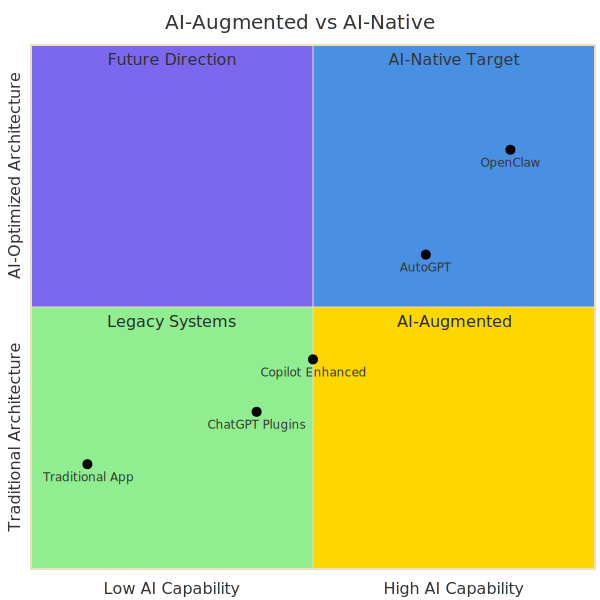
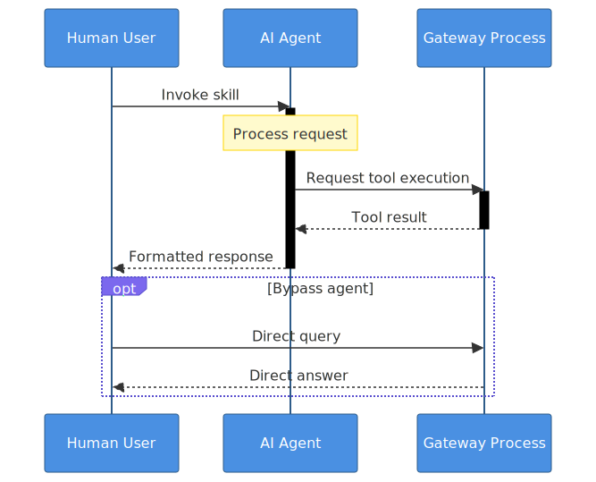
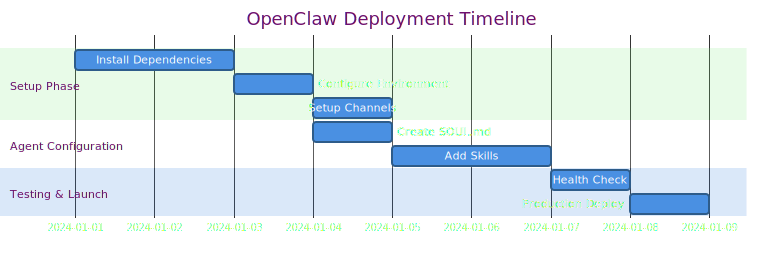

# Chapter 2: The OpenClaw Ecosystem

## Introduction

In the preceding chapter, we introduced the core tenets of AI-native development, a paradigm that places artificial intelligence at the center of the software design and development process. We explored a set of architectural patterns born from the practical challenges of building robust, scalable, and adaptable AI systems. Now, we transition from the abstract to the concrete, from theory to implementation. This chapter provides a comprehensive tour of the OpenClaw project, a living embodiment of these AI-native principles.

OpenClaw is more than just a framework; it is a complete ecosystem designed for building, deploying, and managing AI agents. Its architecture, from the central Gateway to the modular Skills, reflects a deep understanding of the unique requirements of AI-driven applications. By dissecting its components, deployment models, and community dynamics, we can see how the patterns discussed in Chapter 1 are not merely theoretical constructs but practical solutions to real-world problems.

This chapter will serve as both a technical deep dive and a practical guide. We will explore the philosophy that underpins the project, deconstruct its core architectural components, and walk through the process of getting a new OpenClaw instance up and running. Through this exploration, readers will gain a tangible understanding of how to apply AI-native patterns to their own projects and appreciate the power of a system designed from the ground up for intelligent automation.

## 2.1 OpenClaw Philosophy and History

Every impactful open-source project is guided by a core philosophy, a set of principles that shape its design and direct its evolution. OpenClaw is no exception. Its journey from a personal automation tool to a burgeoning AI ecosystem reveals a commitment to pragmatic, human-centric AI assistance.

### Origin Story and Core Philosophy

OpenClaw began not as a grand architectural vision, but as a personal project to automate repetitive digital tasks. The initial goal was simple: to create a persistent, context-aware assistant that could execute commands, manage files, and interact with web services. Early iterations were monolithic and brittle, but they provided a crucial insight: the power of an AI assistant lies not in a single, all-knowing model, but in its ability to coordinate a diverse set of specialized tools and capabilities.

This realization led to the core philosophy of OpenClaw: **pragmatic, human-centric AI assistance**. This philosophy can be broken down into three key ideas:

1.  **Pragmatism:** The project prioritizes what works in practice over what is theoretically elegant. This is evident in its file-based memory system, its emphasis on example-driven testing, and its flexible, un-opinionated approach to skill development.
2.  **Human-Centricity:** OpenClaw is designed to augment human capabilities, not replace them. Its tools and interfaces are designed to be transparent and auditable. Humans should always be in the loop, able to understand, guide, and correct the AI's behavior.
3.  **Assistance:** The system is framed as an assistant, a partner in achieving goals. This framing influences everything from the language used in its interfaces to the design of its safety guardrails.

### Design Principles

Flowing from this core philosophy are a set of design principles that are consistently applied throughout the ecosystem:

*   **Simplicity:** OpenClaw favors simple, understandable solutions. The Micro-Skill Architecture Pattern is a prime example, promoting small, single-purpose skills that are easy to build, test, and maintain. This contrasts with frameworks that encourage complex, multi-layered abstractions.
*   **Composability:** The entire system is built on the idea of composing small, independent components. Skills can be chained together, tools can be combined in novel ways, and agents can be assembled to tackle complex tasks. The Gateway acts as the conductor, orchestrating these compositions.
*   **Extensibility:** OpenClaw is designed to be a foundation, not a finished product. Every component, from the communication channels to the toolset, is extensible. The Skill Blueprint Pattern ensures that new capabilities can be added in a standardized way, allowing the system to grow organically.

### Project Governance

As an open-source project, OpenClaw's governance model is as important as its technical architecture. It follows a "benevolent dictator" model, with the project founder providing the ultimate direction. However, this is tempered by a system of maintainer teams, each responsible for a specific subsystem (e.g., the Gateway, core skills, documentation). This structure, which mirrors the AI-First Contribution Pattern, allows for specialized, high-quality reviews while maintaining a cohesive vision for the project as a whole.

## 2.2 Core Architecture Components

The OpenClaw architecture is a masterclass in modular, AI-native design. It comprises a set of distinct, well-defined components that work in concert to provide a flexible and powerful platform for AI agents. Understanding these components is key to grasping how OpenClaw so effectively implements the patterns we've discussed.

### 2.2.1 The Gateway: Central Nervous System

At the heart of OpenClaw lies the Gateway. It is the central nervous system of the entire operation, a WebSocket-based control plane that manages the flow of information and orchestrates the actions of all other components. The Gateway is the primary implementation of the **Gateway-Mediated Multi-Agent Pattern**, providing a single point of entry and control for the entire system.

Its key responsibilities include:

*   **Session Management:** The Gateway maintains the state of all interactions. When a user connects via a channel, the Gateway creates a session, loading the relevant agent, memory, and context. This allows for persistent, stateful conversations and long-running background tasks.
*   **Tool Routing and Execution:** When an agent decides to use a tool, it sends a request to the Gateway. The Gateway validates the request against the current tool policies, identifies the correct tool implementation (which could be a local function, a shell command, or a remote service), executes it, and returns the result to the agent.
*   **Event Handling and Distribution:** The Gateway acts as an event bus, routing messages from channels to agents, and from agents back to the appropriate channels. It also handles system-level events, such as cron triggers or file system notifications.
*   **Configuration and Extension:** The Gateway is the central hub for system configuration. It loads agent personalities, skill definitions, and tool policies at startup, providing a single source of truth for the entire system.

### 2.2.2 Agents: Specialized Personalities

In the OpenClaw paradigm, an "agent" is a specialized personality that combines a core AI model with a specific set of instructions, memory, and skills. This design allows for a high degree of specialization, enabling the creation of agents tailored for specific tasks or domains.

OpenClaw supports several types of agents:

*   **Main Agent:** This is the primary, general-purpose assistant that users interact with. It has access to a broad range of skills and a long-term memory.
*   **Sub-Agents:** The main agent can spawn sub-agents to handle complex, long-running, or highly specialized tasks. These sub-agents operate in their own isolated sessions but can report back to the main agent upon completion. This is a powerful mechanism for parallelizing work and managing complexity.
*   **Cron Agents:** These are non-interactive agents triggered by a schedule. They are used for routine maintenance, monitoring, and proactive tasks, such as generating daily reports or checking for system updates.

Each agent operates within a **session context**, which includes its unique personality file (`SOUL.md`), its short-term and long-term memory, and the set of skills it is permitted to use. This contextualization is crucial for enabling the AI model to provide relevant and personalized responses.

### 2.2.3 Skills: Extensible Capabilities

If the Gateway is the nervous system, Skills are the muscles. They are the concrete implementations of the agent's capabilities. OpenClaw's design philosophy shines through in its **Micro-Skill Architecture Pattern**, which favors small, single-purpose, and highly composable skills.

Key aspects of the skill architecture include:

*   **Skill Blueprint Pattern:** As detailed in our research, every skill adheres to a standardized documentation structure, typically a `SKILL.md` file. This blueprint includes YAML frontmatter for discoverability, structured sections for human and AI comprehension (including guardrails and examples), and clear documentation of any file structures the skill uses. This standardization is what allows the system to be so easily extended.
*   **Micro-Skill Examples:** A glance at the official skill repository reveals a plethora of micro-skills. A skill for checking the weather, another for looking up a stock price, a third for generating a UUID. While simple on their own, they can be composed by the agent to perform complex tasks.
*   **Discovery and Loading:** The Gateway discovers and loads skills at startup based on the configured skill paths. The `SKILL.md` file's frontmatter provides the necessary metadata for the Gateway to register the skill and its triggers.
*   **Composition and Chaining:** The true power emerges when the AI agent chains skills together. It might use a `web_search` skill to find information, a `summarize` skill to condense it, and a `message` skill to deliver the result. This compositional approach provides nearly limitless flexibility.

### 2.2.4 Tools: Universal Interface

Tools are the fundamental building blocks that skills use to interact with the world. They provide a standardized, universal interface for performing common actions. The core toolset includes:

*   `read`: To read the contents of files.
*   `write`: To create or overwrite files.
*   `edit`: To perform precise, in-place edits of files.
*   `exec`: To execute shell commands.
*   `message`: To send messages through the configured channels.
*   `browser`: To control a web browser for automation and scraping.
*   `web_search`: To perform web searches.

This standardized toolset is critical for the **Micro-Skill Architecture**. Because all skills are built using the same small set of primitive operations, they are inherently interoperable.

A crucial feature of the tool system is the use of **tool policies**. Administrators can define fine-grained permissions for each agent, specifying which tools it can use and with what parameters. For example, an agent might be granted permission to `read` from its own workspace but be denied `write` access to system directories. This provides a robust security model that allows agents to operate autonomously within safe boundaries.

### 2.2.5 Channels: Communication Interfaces

Channels are the bridges between the OpenClaw ecosystem and the outside world. They are the interfaces through which users interact with agents. OpenClaw's modular design allows it to support a variety of communication platforms, including:

*   **Discord:** Rich integration with support for slash commands, embeds, and real-time interaction.
*   **Telegram:** A popular choice for mobile interaction, with support for bots and group chats.
*   **CLI (Command Line Interface):** For developers and system administrators who prefer a terminal-based workflow.
*   **Web UI:** A graphical interface that provides visualization of agent activity and system status.

Each channel plugin is responsible for translating the platform-specific message format into a standardized event that the Gateway can understand, and vice-versa. This abstraction allows the core agent and skill logic to remain platform-agnostic, embodying the principle of separation of concerns.

## 2.3 Deployment Models

The flexibility of OpenClaw's architecture allows for a range of deployment models, from simple personal setups to complex, multi-user cloud installations. The consistent application of the **Environment-First Configuration Pattern** ensures that an agent developed in one environment can be deployed in another with minimal changes.

### 2.3.1 Local Deployment

The most common setup is a single-machine deployment for personal use. This is ideal for developers, researchers, and hobbyists who want a powerful AI assistant running on their own hardware.

*   **Configuration:** A local deployment is typically configured via a set of YAML files and environment variables. The user defines their agent's personality, selects a set of skills, and provides the necessary API keys.
*   **Resource Requirements:** Resource usage depends heavily on the chosen AI model and the number of active agents. However, a typical setup can run comfortably on a modern laptop or desktop computer.
*   **Security:** In a local deployment, security is paramount. Tool policies should be configured to restrict the agent's access to sensitive files and commands. The principle of least privilege is a critical best practice here.

### 2.3.2 Cloud Deployment

For teams or organizations, OpenClaw can be deployed in the cloud. This model supports multiple users, enhanced scalability, and centralized management.

*   **Scalability:** The Gateway can become a bottleneck in high-traffic scenarios. Cloud deployments often involve load balancers and multiple Gateway instances to distribute the load. The core AI model inference can also be scaled independently using serverless functions or dedicated GPU instances.
*   **Cost Management:** Running AI models can be expensive. Cloud deployments require careful cost management strategies, such as using smaller, more efficient models for simple tasks, implementing caching for common requests, and setting strict usage quotas.
*   **Monitoring and Maintenance:** A robust monitoring solution is essential for cloud deployments to track system health, agent performance, and API costs. Centralized logging and alerting are key components.

### 2.3.3 Hybrid Approaches

The modularity of the architecture also allows for hybrid deployments that combine the privacy of local execution with the power of the cloud.

*   **Edge Computing:** In this model, the Gateway and sensitive skills might run on a local machine, while computationally intensive tasks (like model inference or large-scale data analysis) are offloaded to cloud services.
*   **Privacy-Preserving Deployments:** A user might run a personal OpenClaw instance locally for an extra layer of privacy, only connecting to a shared cloud backend for specific, non-sensitive collaborative tasks.
*   **Failover and Redundancy:** A hybrid approach can provide redundancy. If a local instance fails, it can failover to a cloud-based backup. Conversely, if the cloud connection is lost, the agent can continue to operate with its local capabilities.

## 2.4 Ecosystem and Community

OpenClaw is more than just code; it is a vibrant and growing ecosystem of developers, users, and contributors. This community is the lifeblood of the project, driving its evolution and enriching its capabilities. The project's structure is intentionally designed to foster this community, leveraging the **AI-First Contribution Pattern** to great effect.

### 2.4.1 GitHub Ecosystem

The project's center of gravity is its GitHub organization. The codebase is transparently managed, and the contribution process is open to all.

*   **Repository Structure:** The project is divided into several repositories: a core repository for the Gateway and main components, separate repositories for official skills, and templates for creating new skills and channels. This separation of concerns simplifies development and allows for independent versioning.
*   **Contribution Workflow:** The contribution guidelines explicitly welcome AI-assisted contributions, provided they are disclosed. This modern approach lowers the barrier to entry and encourages developers to use the best tools available. Pull requests are reviewed by specialized maintainers, ensuring that contributions meet the project's quality standards.

### 2.4.2 Community Channels

The OpenClaw community congregates in several key online spaces:

*   **Discord Server:** The primary hub for real-time discussion, user support, and developer collaboration. The server is organized into channels dedicated to different topics, from general usage questions to deep dives on skill development.
*   **Telegram Groups:** Used for announcements and more casual conversation, particularly among mobile users.
*   **Community Support:** A strong culture of peer-to-peer support has emerged. Experienced users and developers frequently help newcomers troubleshoot issues and learn the ropes, creating a welcoming and collaborative environment.

### 2.4.3 Skill Marketplace

While not a formal "marketplace" in the commercial sense, the ecosystem functions as one. The standardized **Skill Blueprint Pattern** allows skills to be shared and reused easily. Users can discover new skills in the official repositories or in community-maintained collections. This creates a virtuous cycle: as more users join, more skills are created, which in turn makes the platform more powerful and attracts even more users.

## 2.5 Installation and Setup Walkthrough

To make the concepts discussed in this chapter more concrete, let's walk through the process of setting up a new OpenClaw instance. This process highlights the practical application of the **Environment-First Configuration Pattern** and the project's focus on a smooth "out-of-the-box" experience.

### 2.5.1 Prerequisites and Requirements

Before installing, you'll need:

*   **Hardware:** A computer with sufficient RAM and CPU to run the desired AI models.
*   **Software:** Node.js and a package manager like `pnpm` or `npm`.
*   **API Keys:** API keys for the AI models you intend to use (e.g., OpenAI, Anthropic, Google).

### 2.5.2 Step-by-Step Installation

1.  **Clone the Repository:** Start by cloning the core OpenClaw repository from GitHub.
2.  **Install Dependencies:** Run `pnpm install` to download and install the project's dependencies.
3.  **Initial Configuration:** Copy the example configuration file (`config.example.yaml`) to `config.yaml`. This file is the primary entry point for configuring your instance. Open it and fill in the required API keys. Note how the configuration system is designed to also pull from environment variables, a clear sign of the Environment-First pattern.

### 2.5.3 Initial Configuration

*   **`soul.md` Personalization:** This file is the heart of your agent's personality. Edit `soul.md` to define your agent's name, purpose, and core instructions. This is where you can shape its behavior and give it a unique character.
*   **Skill Selection:** In your configuration file, you can specify the paths to the skill repositories you want to load. You might start with the official core skills and add more as needed.
*   **Tool Policy Configuration:** Review the default tool policies. For a personal local instance, the defaults are generally safe, but it's a good practice to understand what your agent is permitted to do.

### 2.5.4 First-Time Usage

Once configured, you can start the Gateway. Connect to it using your chosen channel (e.g., the CLI). You can begin interacting with your agent immediately. Try some basic commands: "what time is it?", "tell me a joke", or ask it to read a file from its workspace.

## 2.6 Pattern Implementation Examples

Let's revisit some of the key patterns and see exactly how they are implemented within the OpenClaw architecture.

### 2.6.1 Gateway-Mediated Multi-Agent Pattern

The Gateway is the canonical implementation of this pattern. When a sub-agent is spawned, the Gateway creates a new, isolated session for it. This session has its own memory and context, preventing it from interfering with the main agent. However, the Gateway retains a link between the parent and child sessions, allowing the sub-agent to return its results to the main agent. This centralized management prevents the chaos of peer-to-peer agent communication and provides a single point for logging and auditing.

### 2.6.2 Environment-First Configuration Pattern

Look inside any of the core scripts, and you'll see this pattern in action. The code will typically look for a configuration value in an environment variable first (`process.env.OPENCLAW_DIR`), then fall back to a value from the `config.yaml` file, and finally fall back to a sensible default (e.g., `~/.openclaw`). This layered approach makes the system incredibly portable and easy to configure for different deployment environments, from a local machine to a Docker container.

### 2.6.3 Skill Blueprint Pattern

The `ai-proposal-generator` skill is a perfect example. Its `SKILL.md` contains a YAML frontmatter block that defines its name and triggers. The body of the document has clearly marked sections for "Workflow," "Examples," and "Configuration." An AI agent can "read" this document to understand how to use the skill, and a human developer can use it as comprehensive documentation.

## 2.7 Comparative Analysis

To fully appreciate OpenClaw's design, it's helpful to compare it to other approaches.

### 2.7.1 OpenClaw vs. Traditional Chatbots

Traditional chatbots are typically built with a "conversation tree" or intent-based system. Their capabilities are pre-programmed and limited. OpenClaw, by contrast, is a dynamic system. Its capabilities are not fixed but are defined by the collection of skills it has access to. Because it uses a general-purpose AI model as its reasoning engine, it can combine and adapt its skills in novel ways to handle unforeseen requests.

### 2.7.2 OpenClaw vs. Other AI Frameworks

Frameworks like LangChain and AutoGPT have also explored the concept of AI agents. However, OpenClaw's philosophy and architecture present some key differences:

*   **Emphasis on Simplicity:** OpenClaw's Micro-Skill Architecture and standardized toolset are arguably simpler and easier to get started with than the more abstract and complex class hierarchies found in some other frameworks.
*   **Human-in-the-Loop:** OpenClaw's design, with its transparent file-based memory and explicit guardrails, is deeply rooted in a human-centric philosophy. The human is always in control, able to inspect and direct the agent's behavior.
*   **Ecosystem and Community:** The focus on the **AI-First Contribution Pattern** and the **Skill Blueprint Pattern** has fostered a strong, collaborative community and a growing ecosystem of reusable components.

## Conclusion

The OpenClaw ecosystem provides a powerful case study in AI-native development. Its architecture is a direct reflection of the patterns synthesized in our research. The **Gateway-Mediated Multi-Agent Pattern** provides robust orchestration. The **Micro-Skill Architecture** and **Skill Blueprint Pattern** create a flexible and extensible system of capabilities. The **Environment-First Configuration Pattern** ensures portability and ease of deployment. And the **AI-First Contribution Pattern** fuels a vibrant community that constantly pushes the project forward.

By understanding the design and philosophy of OpenClaw, we move from understanding what AI-native patterns *are* to seeing how they can be *applied*. This foundational knowledge will be invaluable as we move into the next chapter, where we will analyze specific OpenClaw skills in detail to see these patterns come to life in the code itself.
