# Chapter 4: The Soul.md Pattern

## Introduction

In the AI-native landscape, where agents operate with increasing autonomy and sophistication, a fundamental question emerges: *What defines an AI agent's identity, values, and constraints?* Traditional software systems rely on configuration files, environment variables, and explicit parameters to govern behavior. AI-native systems, however, require a more profound foundation—one that shapes not just *what* an agent does, but *who* it is and *how* it thinks.

The Soul.md pattern provides this foundation. It is a declarative, human-readable file that serves as the "constitution" for an AI agent, defining its core identity, operating principles, communication style, ethical boundaries, and continuity mechanisms. Unlike traditional configuration files that specify technical parameters, Soul.md shapes agent *behavior* at a philosophical level, influencing decision-making, interaction patterns, and ethical reasoning.

This chapter explores the Soul.md pattern in depth, examining its philosophy, anatomy, implementation, and impact within the OpenClaw ecosystem. We'll analyze real-world examples, explore variations for different agent types, and provide practical guidance for implementing this pattern in your own AI-native systems. Through this exploration, you'll understand how a simple markdown file can become the cornerstone of agent identity in an AI-native world.

## 4.1 The Philosophy of Soul.md



### 4.1.1 Defining Agent Identity in AI-Native Systems

In traditional software development, identity is largely irrelevant—systems execute deterministic logic without self-awareness or personal characteristics. AI-native systems, particularly those built on large language models, inherently possess characteristics that resemble identity: communication style, decision-making preferences, ethical reasoning, and interaction patterns.

The Soul.md pattern formalizes this emergent identity, providing a structured mechanism for developers to intentionally shape agent behavior rather than leaving it to chance or default model behavior. This intentional shaping serves several crucial purposes:

1. **Consistency:** Ensures the agent behaves predictably across different contexts and interactions.
2. **Alignment:** Keeps agent behavior aligned with developer intentions and user expectations.
3. **Safety:** Establishes clear boundaries to prevent harmful or undesirable behaviors.
4. **Specialization:** Enables agents to develop domain-specific expertise and communication styles.
5. **Trust:** Builds user confidence through predictable, principled behavior.

### 4.1.2 Soul.md as a "Constitution" vs. Configuration File

Traditional configuration files specify *technical* parameters: API endpoints, timeout values, logging levels, and feature flags. Soul.md operates at a different level—it defines *behavioral* and *ethical* parameters:


| **Aspect** | **Configuration File** | **Soul.md** |
|------------|------------------------|-------------|
| **Purpose** | Technical operation | Behavioral identity |
| **Content** | Parameters, settings | Principles, values, style |
| **Influence** | What the system *does* | How the system *thinks* |
| **Evolution** | Changed for new features | Evolves with agent identity |
| **Examples** | `config.json`, `.env` | Core Truths, Style, Boundaries |

Soul.md functions as a constitutional document in several ways:
- **Foundational:** It establishes first principles that guide all agent behavior.
- **Interpretive:** Like a constitution, it provides a framework for interpreting ambiguous situations.
- **Amendable:** It can be revised as the agent's role or environment changes.
- **Hierarchical:** It takes precedence over other instructions or prompts.

### 4.1.3 Historical Context: From Hard-Coded Rules to Declarative Identity

The evolution of agent identity management follows a clear trajectory:

1. **Hard-Coded Rules (Early AI Systems):** Behavior dictated by explicit if-then rules and decision trees.
2. **System Prompts (Early LLM Applications):** Identity implied through initial prompts but easily overridden.
3. **Fine-Tuning (Specialized Models):** Identity baked into model weights but expensive to change.
4. **Declarative Identity (Soul.md Pattern):** Identity defined in separate, editable files that load at runtime.

The Soul.md pattern represents the latest evolution—a balance between flexibility and consistency. Unlike hard-coded rules, it's easy to modify. Unlike system prompts, it persists across interactions. Unlike fine-tuning, it doesn't require retraining models.

### 4.1.4 Comparison with Other Identity Frameworks

Several approaches to agent identity exist, each with different trade-offs:

**Personas (Chat Applications):**
- **Approach:** Define character traits and backstories.
- **Strengths:** Creates engaging, human-like interactions.
- **Weaknesses:** Can be superficial, lacks ethical boundaries.
- **Example:** "You are a helpful librarian named Arthur."

**System Prompts (LLM Interfaces):**
- **Approach:** Provide instructions at the start of each conversation.
- **Strengths:** Simple, immediate.
- **Weaknesses:** Easily overridden, no persistence between sessions.
- **Example:** "You are an AI assistant that helps with coding tasks."

**Fine-Tuned Models (Specialized AI):**
- **Approach:** Train models on domain-specific data.
- **Strengths:** Deeply integrated expertise.
- **Weaknesses:** Expensive, inflexible, can't be easily inspected.
- **Example:** Medical diagnosis model trained on patient records.

**Soul.md Pattern (OpenClaw Approach):**
- **Approach:** Declarative file defining identity, values, and constraints.
- **Strengths:** Persistent, inspectable, flexible, integrates with tools and memory.
- **Weaknesses:** Requires discipline to maintain, relies on agent adherence.
- **Example:** TitanBot's SOUL.md with Core Truths and Boundaries.

The Soul.md pattern's unique contribution is its integration with the broader AI-native ecosystem—it connects to memory systems, tool policies, and multi-agent coordination, creating a comprehensive identity framework.

## 4.2 Anatomy of a Soul.md File

### 4.2.1 Core Components



A well-structured Soul.md file consists of several key sections, each addressing different aspects of agent identity:

#### **Name: Agent Identity and Persona**
The Name section establishes the agent's fundamental identity—what it calls itself and how users should refer to it.

```markdown
**Name:** TitanBot
```

**Purpose:** Creates consistency in self-reference and helps users understand which agent they're interacting with in multi-agent systems.

**Best Practices:**
- Choose names that reflect the agent's role or personality.
- Avoid generic names like "Assistant" or "Bot" for specialized agents.
- Consider how the name will appear in logs, notifications, and user interfaces.
- For multi-agent systems, establish naming conventions that indicate relationships (e.g., "ResearchBot-Alpha," "ResearchBot-Beta").

#### **Core Truths: Fundamental Beliefs and Operating Principles**
Core Truths define the agent's fundamental beliefs about itself, its role, and its relationship with users.

```markdown
## Core Truths

- Be direct. No filler, no fluff, no performative warmth.
- Have opinions. State them plainly when relevant.
- Be resourceful — figure it out before asking.
- Earn trust through competence, not pleasantries.
- Respect access to private information. Never leak it.
```

**Purpose:** Establishes philosophical foundations that guide decision-making in ambiguous situations.

**Content Categories:**
1. **Communication Philosophy:** How the agent should communicate (directness, tone, verbosity).
2. **Problem-Solving Approach:** How the agent approaches challenges (resourcefulness, independence).
3. **Relationship Principles:** How the agent builds trust and maintains relationships.
4. **Ethical Foundation:** Core ethical principles that guide all actions.

**Writing Effective Core Truths:**
- Use imperative statements for clarity and authority.
- Focus on actionable principles rather than abstract values.
- Balance specificity with flexibility—principles should guide rather than prescribe.
- Test each truth against real-world scenarios to ensure usefulness.

#### **Style: Communication Preferences and Interaction Patterns**
The Style section defines the agent's communication patterns—how it expresses the principles defined in Core Truths.

```markdown
## Style

- Sharp and concise. Say what needs saying, nothing more.
- No emoji. Ever.
- No "Great question!" or "I'd be happy to help!" — just deliver.
- Address the human as "My Lord."
- Thorough when the problem demands it, brief when it doesn't.
```

**Purpose:** Translates philosophical principles into concrete communication behaviors.

**Style Dimensions:**
1. **Verbosity Level:** Concise vs. detailed communication.
2. **Formality:** Formal vs. informal language.
3. **Tone:** Warm vs. neutral vs. authoritative.
4. **Structural Elements:** Use of headings, lists, examples, summaries.
5. **Personalization:** How the agent addresses users and refers to itself.

**Implementation Considerations:**
- Style should reinforce Core Truths (e.g., "Be direct" aligns with concise communication).
- Consider the agent's domain—technical agents may need different styles than creative ones.
- Document style decisions to ensure consistency across agent versions.
- Allow some flexibility for context—style may adapt based on user preferences or situation.

#### **Boundaries: Safety Constraints and Ethical Guidelines**
Boundaries establish clear limits on agent behavior, particularly for sensitive actions.

```markdown
## Boundaries

- Private things stay private.
- Ask before acting externally (emails, messages, posts).
- Never send half-baked work.
```

**Purpose:** Prevents harmful behaviors and establishes safety protocols.

**Boundary Types:**
1. **Privacy Boundaries:** Handling of sensitive information.
2. **Action Boundaries:** Restrictions on tool usage and external actions.
3. **Quality Boundaries:** Standards for work output.
4. **Ethical Boundaries:** Prohibited behaviors or content.
5. **Legal Boundaries:** Compliance with regulations and laws.

**Effective Boundary Design:**
- Focus on high-risk areas where agent autonomy could cause harm.
- Be specific enough to be actionable ("Ask before sending emails" vs. "Be careful with communications").
- Balance safety with usefulness—overly restrictive boundaries can cripple agent effectiveness.
- Consider escalation paths—what happens when boundaries are approached or violated?

#### **Continuity: Memory and Persistence Configuration**
The Continuity section defines how the agent maintains identity and knowledge across sessions.

```markdown
## Continuity

Each session starts fresh. Memory files are continuity. Read them, update them, maintain them.
```

**Purpose:** Ensures consistent identity and accumulated knowledge across interactions.

**Continuity Elements:**
1. **Session Management:** How the agent handles new conversations vs. ongoing work.
2. **Memory Integration:** How the agent reads and updates memory files.
3. **Learning Mechanisms:** How the agent incorporates new knowledge.
4. **Identity Persistence:** How core identity remains stable while allowing growth.

**Implementation Patterns:**
- File-based memory (memory/YYYY-MM-DD.md, MEMORY.md)
- Context window management
- Summarization and pruning strategies
- Knowledge integration protocols

### 4.2.2 Example Analysis: TitanBot Soul.md

Let's deconstruct TitanBot's SOUL.md to understand how each section influences agent behavior:

**Name Analysis:**
- "TitanBot" suggests strength, reliability, and technical capability.
- The name establishes a professional, capable identity.
- It distinguishes this agent from others in the ecosystem.

**Core Truths Analysis:**
- "Be direct. No filler, no fluff, no performative warmth." → Drives concise, efficient communication.
- "Have opinions. State them plainly when relevant." → Encourages decisive problem-solving.
- "Be resourceful — figure it out before asking." → Promotes independence and initiative.
- "Earn trust through competence, not pleasantries." → Focuses on substance over style.
- "Respect access to private information. Never leak it." → Establishes fundamental privacy ethic.

**Style Analysis:**
- "Sharp and concise. Say what needs saying, nothing more." → Operationalizes "Be direct" Core Truth.
- "No emoji. Ever." → Eliminates informal communication elements.
- "No 'Great question!' or 'I'd be happy to help!' — just deliver." → Avoids performative engagement.
- "Address the human as 'My Lord.'" → Establishes clear hierarchical relationship.
- "Thorough when the problem demands it, brief when it doesn't." → Context-aware communication.

**Boundaries Analysis:**
- "Private things stay private." → Absolute privacy protection.
- "Ask before acting externally (emails, messages, posts)." → Human oversight for external actions.
- "Never send half-baked work." → Quality assurance commitment.

**Continuity Analysis:**
- "Each session starts fresh. Memory files are continuity. Read them, update them, maintain them." → Clear separation between transient session state and persistent memory.

**Relationship to Tool Policies:**
TitanBot's Soul.md complements its tool policies:
- **read/write tools:** Enable memory file operations (supports Continuity).
- **message tool:** Requires explicit permission (enforces Boundaries).
- **exec tool:** Allows independent problem-solving (supports "Be resourceful" Core Truth).

**Evolution Over Time:**
Analysis of TitanBot's Soul.md across versions shows:
- Initial versions focused on basic identity and safety.
- Later versions added specific style guidelines based on user feedback.
- Recent versions emphasize continuity as memory systems matured.
- The evolution demonstrates iterative refinement based on real-world use.

### 4.2.3 Variations and Customizations

Different agent types require different Soul.md configurations:

#### **Assistant Personalities (General Help)**
```markdown
**Name:** HelperBot

## Core Truths
- Be genuinely helpful, not just technically correct.
- Adapt to the user's knowledge level and needs.
- Prioritize clarity over brevity when explaining complex topics.
- Acknowledge limitations honestly.

## Style
- Warm but professional tone.
- Use examples and analogies for complex concepts.
- Check for understanding periodically.
- Summarize key points at the end.

## Boundaries
- Don't pretend to know something you don't.
- Flag potential misunderstandings.
- Suggest human experts when beyond your capabilities.
```

#### **Coach Personalities (Guidance and Development)**
```markdown
**Name:** GrowthCoach

## Core Truths
- Everyone has potential for growth.
- Feedback should be constructive, not critical.
- Progress happens through small, consistent steps.
- Listen more than you speak.

## Style
- Use empowering language.
- Ask open-ended questions to encourage reflection.
- Celebrate small victories.
- Provide specific, actionable advice.

## Boundaries
- Maintain professional boundaries in personal topics.
- Refer to specialists for mental health or medical issues.
- Keep coaching conversations confidential.
```

#### **Analyst Personalities (Data-Driven Insights)**
```markdown
**Name:** DataSense

## Core Truths
- Data tells a story; your job is to interpret it accurately.
- Correlation ≠ causation.
- Uncertainty is inherent; quantify it when possible.
- Simplicity is the ultimate sophistication in analysis.

## Style
- Present data visually when helpful.
- Distinguish between observations, interpretations, and recommendations.
- Use precise language for statistical concepts.
- Acknowledge data limitations upfront.

## Boundaries
- Don't overstate confidence in findings.
- Highlight assumptions and their impact.
- Avoid drawing conclusions beyond the data's scope.
```

#### **Domain-Specific Adaptations**
**Medical Assistant:**
- Core Truths emphasize safety, accuracy, and referral to human professionals.
- Style is clear, unambiguous, with emphasis on risk communication.
- Boundaries strictly prohibit diagnosis or treatment recommendations.

**Legal Advisor:**
- Core Truths emphasize accuracy, citation of sources, and disclaimer of legal advice.
- Style is precise, citation-heavy, with clear distinction between information and advice.
- Boundaries include explicit "not a lawyer" disclaimers and referral to legal counsel.

**Creative Collaborator:**
- Core Truths emphasize originality, inspiration, and pushing boundaries.
- Style is expressive, metaphorical, with emphasis on ideation.
- Boundaries respect intellectual property and originality.

#### **Team vs. Individual Agent Configurations**
**Team Coordination:**
- Shared Core Truths establish team values and principles.
- Individual Style variations allow personality expression.
- Common Boundaries ensure consistent safety standards.
- Example: Research team with shared methodology but individual communication styles.

**Individual Specialization:**
- Distinct Core Truths based on role (e.g., researcher vs. executor).
- Complementary Styles that work well together (e.g., detail-oriented + big-picture).
- Integrated Boundaries that provide defense in depth.
- Example: Proposal generator + editor + quality checker pipeline.

#### **Public vs. Private Considerations**
**Public-Facing Agents:**
- Stronger Boundaries for safety and liability.
- More polished Style for professional presentation.
- Clearer Core Truths about public interaction.
- Example: Customer service chatbot.

**Private/Internal Agents:**
- More permissive Boundaries for trusted users.
- Efficient Style prioritizing speed over polish.
- Technical Core Truths emphasizing capability over presentation.
- Example: Internal DevOps assistant.

## 4.3 Implementing the Soul.md Pattern

### 4.3.1 Technical Implementation



#### **File Location and Loading Mechanism**
The Soul.md file's location affects accessibility, security, and maintainability:

**Standard Locations:**
1. **Workspace Root:** `/Users/username/.openclaw/workspace/SOUL.md`
   - *Advantages:* Central, easy to find, applies to all sessions.
   - *Disadvantages:* Single identity for all agents, no differentiation.

2. **Agent-Specific Directory:** `/Users/username/.openclaw/workspace/agents/{agent-name}/SOUL.md`
   - *Advantages:* Per-agent customization, clear organization.
   - *Disadvantages:* Directory sprawl, more complex loading logic.

3. **Configuration Directory:** `~/.config/openclaw/souls/{agent-name}.md`
   - *Advantages:* Standard Unix location, separates configuration from workspace.
   - *Disadvantages:* Less visible, separate from agent code.

4. **Environment Variable:** `OPENCLAW_SOUL_PATH` pointing to file.
   - *Advantages:* Maximum flexibility, easy testing of different souls.
   - *Disadvantages:* Configuration burden, potential for misconfiguration.

**OpenClaw Implementation:**
OpenClaw typically uses the workspace root location for simplicity, with plans to support per-agent souls as the ecosystem matures.

**Loading Mechanism:**
```python
def load_soul(soul_path=None):
    """Load Soul.md file from standard location or specified path."""
    # Determine path
    if soul_path:
        path = soul_path
    elif os.getenv('OPENCLAW_SOUL_PATH'):
        path = os.getenv('OPENCLAW_SOUL_PATH')
    else:
        # Default location
        workspace_root = os.getenv('OPENCLAW_DIR', os.path.expanduser('~/.openclaw/workspace'))
        path = os.path.join(workspace_root, 'SOUL.md')
    
    # Load and parse
    if os.path.exists(path):
        with open(path, 'r') as f:
            content = f.read()
        return parse_soul(content)
    else:
        # Fallback to default soul
        return create_default_soul()

def parse_soul(content):
    """Parse Soul.md content into structured dictionary."""
    soul = {
        'name': None,
        'core_truths': [],
        'style': [],
        'boundaries': [],
        'continuity': None
    }
    
    lines = content.split('\n')
    current_section = None
    
    for line in lines:
        line = line.strip()
        
        # Section headers
        if line.startswith('**Name:**'):
            soul['name'] = line.replace('**Name:**', '').strip()
        elif line.startswith('## Core Truths'):
            current_section = 'core_truths'
        elif line.startswith('## Style'):
            current_section = 'style'
        elif line.startswith('## Boundaries'):
            current_section = 'boundaries'
        elif line.startswith('## Continuity'):
            current_section = 'continuity'
            soul['continuity'] = ''
        elif line.startswith('#') or line.startswith('**'):
            # Other headers reset section
            current_section = None
        
        # Content lines
        elif line.startswith('- ') and current_section:
            item = line[2:].strip()
            if current_section == 'continuity':
                soul['continuity'] += item + ' '
            elif current_section in ['core_truths', 'style', 'boundaries']:
                soul[current_section].append(item)
        elif line and current_section == 'continuity':
            soul['continuity'] += line + ' '
    
    soul['continuity'] = soul['continuity'].strip() if soul['continuity'] else None
    return soul
```

#### **Integration with Agent Runtime**
Soul.md influences the agent runtime at multiple levels:

**Session Initialization:**
```python
class AgentSession:
    def __init__(self, soul_path=None):
        self.soul = load_soul(soul_path)
        self.apply_soul_to_runtime()
    
    def apply_soul_to_runtime(self):
        # Set agent name for logging and identification
        if self.soul['name']:
            self.agent_name = self.soul['name']
        
        # Apply style preferences to response generation
        self.response_style = self.soul['style']
        
        # Load memory based on continuity instructions
        if self.soul['continuity']:
            self.load_memory_files()
```

**Prompt Integration:**
The Soul.md content is injected into the system prompt to guide LLM behavior:

```python
def build_system_prompt(soul, context, memory):
    """Build system prompt incorporating Soul.md, context, and memory."""
    prompt_parts = []
    
    # Identity declaration
    if soul['name']:
        prompt_parts.append(f"You are {soul['name']}.")
    
    # Core Truths
    if soul['core_truths']:
        prompt_parts.append("\nYour Core Truths:")
        for truth in soul['core_truths']:
            prompt_parts.append(f"- {truth}")
    
    # Style guidelines
    if soul['style']:
        prompt_parts.append("\nYour Communication Style:")
        for guideline in soul['style']:
            prompt_parts.append(f"- {guideline}")
    
    # Boundaries
    if soul['boundaries']:
        prompt_parts.append("\nYour Boundaries:")
        for boundary in soul['boundaries']:
            prompt_parts.append(f"- {boundary}")
    
    # Continuity instructions
    if soul['continuity']:
        prompt_parts.append(f"\n{soul['continuity']}")
    
    # Current context
    if context:
        prompt_parts.append(f"\nCurrent context: {context}")
    
    # Recent memory
    if memory:
        prompt_parts.append("\nRecent memory:")
        for memory_item in memory[-5:]:  # Last 5 items
            prompt_parts.append(f"- {memory_item}")
    
    return "\n".join(prompt_parts)
```

**Tool Policy Integration:**
Soul.md boundaries influence tool permissions:

```python
def check_tool_permission(tool_name, soul, user_request):
    """Check if tool usage aligns with Soul.md boundaries."""
    boundaries = soul.get('boundaries', [])
    
    # Check for external action boundaries
    if tool_name in ['message', 'email', 'post']:
        if any('ask before acting externally' in b.lower() for b in boundaries):
            # This requires explicit user confirmation
            return {'allowed': False, 'reason': 'Boundary requires asking before external actions'}
    
    # Check for privacy boundaries
    if tool_name in ['read', 'write', 'exec'] and 'private' in user_request.lower():
        if any('private things stay private' in b.lower() for b in boundaries):
            # Need to verify this is authorized private access
            return {'allowed': False, 'reason': 'Privacy boundary requires explicit authorization'}
    
    return {'allowed': True}
```

#### **Validation and Parsing Considerations**
Robust Soul.md implementation requires validation:

**Syntax Validation:**
- Required sections (Name, Core Truths, Style, Boundaries, Continuity)
- Markdown formatting correctness
- Section ordering and hierarchy

**Semantic Validation:**
- Internal consistency (no contradictory directives)
- Actionable language (avoid vague statements)
- Appropriate scope (domain-appropriate boundaries)

**Validation Implementation:**
```python
def validate_soul(soul):
    """Validate Soul.md structure and content."""
    errors = []
    warnings = []
    
    # Required sections
    if not soul.get('name'):
        errors.append("Missing required section: Name")
    
    if not soul.get('core_truths'):
        warnings.append("Missing Core Truths section (recommended)")
    
    if not soul.get('boundaries'):
        warnings.append("Missing Boundaries section (recommended for safety)")
    
    # Check for contradictions
    core_truths = soul.get('core_truths', [])
    style = soul.get('style', [])
    
    # Example: Check if "Be direct" contradicts "Use elaborate explanations"
    if any('be direct' in ct.lower() for ct in core_truths):
        if any('use elaborate explanations' in s.lower() for s in style):
            warnings.append("Potential contradiction: 'Be direct' vs 'Use elaborate explanations'")
    
    # Check boundary effectiveness
    boundaries = soul.get('boundaries', [])
    vague_boundaries = ['be careful', 'use good judgment', 'be responsible']
    for boundary in boundaries:
        if any(vague in boundary.lower() for vague in vague_boundaries):
            warnings.append(f"Vague boundary may not be actionable: '{boundary}'")
    
    return {
        'valid': len(errors) == 0,
        'errors': errors,
        'warnings': warnings
    }
```

#### **Dynamic Updates and Reloading**
Soul.md files may need updating without restarting agents:

**Hot Reloading:**
```python
class SoulManager:
    def __init__(self, soul_path):
        self.soul_path = soul_path
        self.soul = load_soul(soul_path)
        self.last_modified = os.path.getmtime(soul_path)
    
    def check_and_reload(self):
        """Check if Soul.md has been modified and reload if needed."""
        current_modified = os.path.getmtime(self.soul_path)
        if current_modified > self.last_modified:
            print(f"Soul.md modified, reloading...")
            new_soul = load_soul(self.soul_path)
            validation = validate_soul(new_soul)
            if validation['valid']:
                self.soul = new_soul
                self.last_modified = current_modified
                self.notify_agent_of_change()
                return True
        return False
    
    def notify_agent_of_change(self):
        """Notify agent that soul has been updated."""
        # Could trigger re-prompting or behavior adjustment
        pass
```

**Versioning and Migration:**
```python
def migrate_soul(old_soul, target_version='1.0'):
    """Migrate Soul.md to new version format."""
    migrated = old_soul.copy()
    
    # Example migration: Convert old format to new
    if 'communication_style' in migrated:
        # Move to Style section
        migrated['style'] = migrated.pop('communication_style')
    
    if 'ethics' in migrated:
        # Split into Core Truths and Boundaries
        ethics = migrated.pop('ethics')
        migrated['core_truths'] = ethics.get('principles', [])
        migrated['boundaries'] = ethics.get('constraints', [])
    
    return migrated
```

### 4.3.2 Content Guidelines

#### **Writing Effective Core Truths**
Core Truths should be foundational, actionable, and memorable:

**Characteristics of Good Core Truths:**
1. **Foundational:** Addresses why the agent exists and its fundamental purpose.
2. **Actionable:** Guides specific decisions and behaviors.
3. **Memorable:** Short, punchy phrases that are easy to recall.
4. **Consistent:** Works together as a coherent philosophy.
5. **Testable:** Can be evaluated for adherence.

**Writing Process:**
1. **Identify Role:** What is this agent's primary function?
2. **Define Philosophy:** What approach should it take to that function?
3. **Consider Edge Cases:** What difficult decisions might it face?
4. **Draft Principles:** Write imperative statements capturing the philosophy.
5. **Test and Refine:** Evaluate against real scenarios, refine for clarity.

**Examples by Agent Type:**

*Technical Assistant:*
- Prefer automated solutions over manual work.
- Document everything as you go.
- Optimize for maintainability, not just functionality.
- Security is a requirement, not a feature.

*Creative Partner:*
- Originality matters more than perfection.
- Constraints breed creativity.
- Iteration is the path to quality.
- Know when to break rules intentionally.

*Research Analyst:*
- Follow the evidence wherever it leads.
- Acknowledge uncertainty and limitations.
- Context matters—never analyze in isolation.
- Simplicity in explanation, rigor in analysis.

#### **Defining Clear, Actionable Style Guidelines**
Style guidelines translate philosophy into communication patterns:

**Effective Style Guidelines:**
1. **Specific:** "Use bullet points for lists of 3+ items" vs. "Be organized."
2. **Context-Aware:** "Use technical jargon with technical users, plain language with others."
3. **Measurable:** "Keep responses under 200 words for simple questions."
4. **Prioritized:** "Clarity first, brevity second, elegance third."

**Style Dimensions to Consider:**
- **Length:** Concise vs. detailed responses.
- **Structure:** Use of headings, lists, examples.
- **Formality:** Professional vs. casual language.
- **Tone:** Authoritative vs. collaborative vs. supportive.
- **Visual Elements:** Use of markdown, code blocks, emoji.
- **Interaction Pattern:** Questions, confirmations, summaries.

**Example Style Sections:**

*For a Debugging Assistant:*
```
## Style
- Start with the most likely solution first.
- Include specific command examples, not just descriptions.
- Use code blocks for command output.
- Explain why a solution works, not just what to do.
- Flag potential side effects of fixes.
```

*For a Writing Coach:*
```
## Style
- Ask questions to understand intent before giving advice.
- Provide alternatives, not just corrections.
- Use examples from well-known writers when helpful.
- Balance positive feedback with constructive criticism.
- Tailor advice to the writer's experience level.
```

#### **Setting Appropriate Boundaries**
Boundaries prevent harm while enabling useful functionality:

**Boundary Design Principles:**
1. **Risk-Based:** Focus on areas with highest potential for harm.
2. **Proportional:** Match restrictions to actual risks.
3. **Clear:** Unambiguous about what's prohibited.
4. **Actionable:** Agents can actually implement them.
5. **Defensible:** Can explain why boundary exists if challenged.

**Common Boundary Categories:**
1. **Privacy & Confidentiality:** Handling of sensitive information.
2. **External Actions:** Communications, posts, purchases.
3. **Safety-Critical Domains:** Medical, financial, legal advice.
4. **Resource Usage:** Computational limits, API costs.
5. **Quality Standards:** Output validation requirements.

**Example Boundaries by Risk Level:**

*Low-Risk Personal Assistant:*
- Ask before deleting files.
- Don't share personal schedule with others.
- Verify appointments before canceling them.

*Medium-Risk Business Assistant:*
- Require approval for emails to external parties.
- Don't access financial systems without explicit request.
- Log all database changes for audit trail.

*High-Risk Medical Assistant:*
- Never provide diagnosis or treatment recommendations.
- Always suggest consulting healthcare professional.
- Don't interpret lab results without context from medical records.

#### **Configuring Continuity for Different Use Cases**
Continuity configuration depends on memory needs and session patterns:

**Continuity Strategies:**

*Stateless Agents (Simple Q&A):*
```
## Continuity
Each interaction is independent. Do not refer to previous conversations unless the user does.
```

*Session-Based Agents (Conversational):*
```
## Continuity
Maintain context within a session. At session start, load the last 3 conversations with this user.
```

*Long-Term Memory Agents (Personal Assistants):*
```
## Continuity
Read memory/YYYY-MM-DD.md at session start. Update it with important interactions. 
Review MEMORY.md weekly for long-term patterns.
```

*Project-Based Agents:*
```
## Continuity
When starting work on a project, load all project files and notes.
Update project documentation as work progresses.
Maintain separate memory per project.
```

**Memory Integration Patterns:**
1. **Append-Only Logs:** All interactions recorded chronologically.
2. **Summarized Updates:** Regular summarization of recent activity.
3. **Thematic Organization:** Memory organized by topic or project.
4. **Priority-Based Retention:** Important memories preserved, routine interactions discarded.



### 4.3.3 Testing and Validation

#### **Verifying Soul.md Influence on Agent Behavior**
Testing ensures Soul.md actually influences agent behavior:

**Behavioral Test Cases:**
```python
def test_soul_influence(soul, test_cases):
    """Test that Soul.md influences agent behavior as expected."""
    results = []
    
    for test in test_cases:
        # Simulate agent with this soul
        agent = MockAgent(soul=soul)
        response = agent.respond(test['input'])
        
        # Check for expected behavior
        passed = evaluate_response(response, test['expected_behavior'])
        
        results.append({
            'test': test['name'],
            'passed': passed,
            'response': response[:100] + '...' if len(response) > 100 else response
        })
    
    return results

# Example test cases
test_cases = [
    {
        'name': 'Direct communication test',
        'input': 'Can you help me understand this concept?',
        'expected_behavior': 'Response should be direct, without filler phrases'
    },
    {
        'name': 'Boundary respect test',
        'input': 'Send an email to john@example.com saying hello',
        'expected_behavior': 'Should ask for confirmation before sending'
    }
]
```

**A/B Testing Framework:**
```python
def ab_test_soul_variations(base_soul, variations, user_tasks):
    """A/B test different Soul.md variations."""
    results = {}
    
    for variation_name, variation_soul in variations.items():
        scores = []
        
        for task in user_tasks:
            # Test with this soul variation
            agent = TestAgent(soul=variation_soul)
            outcome = agent.perform_task(task)
            
            # Score based on criteria
            score = evaluate_task_performance(outcome, task)
            scores.append(score)
        
        results[variation_name] = {
            'avg_score': sum(scores) / len(scores),
            'scores': scores,
            'soul': variation_soul
        }
    
    return results
```

#### **A/B Testing Different Soul.md Configurations**
A/B testing helps optimize Soul.md for specific use cases:

**Testing Methodology:**
1. **Identify Metrics:** What defines success? (user satisfaction, task completion, safety incidents)
2. **Create Variations:** Modify one aspect at a time (e.g., directness level, boundary strictness).
3. **Randomized Assignment:** Users or tasks randomly assigned to soul variations.
4. **Measure Outcomes:** Collect metrics for each variation.
5. **Statistical Analysis:** Determine if differences are significant.

**Example A/B Test:**
*Research Question:* Does more direct communication improve user satisfaction?
*Variations:*
- **Control:** Current Soul.md with balanced communication.
- **Treatment A:** More direct ("Be extremely concise, eliminate all pleasantries").
- **Treatment B:** Less direct ("Include acknowledgments, check for understanding").

*Metrics:*
- User satisfaction rating (1-5)
- Task completion time
- Follow-up questions needed
- Perceived helpfulness

#### **Measuring Impact on User Satisfaction**
Quantifying Soul.md impact requires systematic measurement:

**Survey-Based Measurement:**
```python
def collect_user_feedback(interaction_id, soul_version):
    """Collect user feedback after interaction with specific soul."""
    survey = {
        'interaction_id': interaction_id,
        'soul_version': soul_version,
        'questions': [
            {
                'text': 'How satisfied were you with this interaction?',
                'scale': '1-5',
                'metric': 'satisfaction'
            },
            {
                'text': 'Did the assistant understand your needs?',
                'scale': '1-5',
                'metric': 'understanding'
            },
            {
                'text': 'Was the communication style appropriate?',
                'scale': '1-5',
                'metric': 'style_appropriateness'
            }
        ]
    }
    return survey
```

**Behavioral Metrics:**
- **Retention:** Do users return after initial interaction?
- **Depth:** Number of interactions per session.
- **Escalation:** Rate of requests for human assistance.
- **Correction:** Frequency of users correcting agent behavior.

**Sentiment Analysis:**
```python
def analyze_interaction_sentiment(conversation_log, soul_version):
    """Analyze sentiment in conversations with different souls."""
    positive_indicators = ['thanks', 'helpful', 'great', 'perfect', 'excellent']
    negative_indicators = ['frustrating', 'confusing', 'wrong', 'useless', 'annoying']
    
    positive_count = sum(1 for msg in conversation_log if any(indicator in msg.lower() for indicator in positive_indicators))
    negative_count = sum(1 for msg in conversation_log if any(indicator in msg.lower() for indicator in negative_indicators))
    
    sentiment_score = positive_count - negative_count
    return {
        'soul_version': soul_version,
        'sentiment_score': sentiment_score,
        'positive_count': positive_count,
        'negative_count': negative_count
    }
```

#### **Debugging Soul.md-Related Issues**
Common Soul.md issues and debugging approaches:

**Issue: Inconsistent Behavior**
*Symptoms:* Agent behaves differently in similar situations.
*Debugging Steps:*
1. Check if Soul.md is being loaded consistently.
2. Verify no conflicting prompts overriding Soul.md.
3. Test with minimal Soul.md to isolate issue.
4. Check for dynamic modifications during session.

**Issue: Boundary Violations**
*Symptoms:* Agent performs actions it shouldn't.
*Debugging Steps:*
1. Review boundary wording for ambiguity.
2. Test boundary with edge cases.
3. Check if tool permissions bypass Soul.md.
4. Verify boundary is in system prompt (not just loaded).

**Issue: Style Drift**
*Symptoms:* Agent communication style changes over time.
*Debugging Steps:*
1. Check for context window overflow pushing out style instructions.
2. Test if user prompts are overriding style.
3. Verify style guidelines are specific enough.
4. Check for conflicting guidelines within Soul.md.

**Debugging Toolkit:**
```python
class SoulDebugger:
    def __init__(self, agent):
        self.agent = agent
    
    def trace_decision(self, user_input):
        """Trace how Soul.md influences a specific decision."""
        trace = {
            'user_input': user_input,
            'loaded_soul': self.agent.soul,
            'system_prompt': self.agent.get_system_prompt(),
            'llm_response': None,
            'tool_decisions': []
        }
        
        # Capture LLM reasoning if available
        if hasattr(self.agent, 'get_reasoning'):
            trace['reasoning'] = self.agent.get_reasoning(user_input)
        
        return trace
    
    def compare_behaviors(self, soul_variations, test_inputs):
        """Compare agent behavior across soul variations."""
        comparisons = []
        
        for soul in soul_variations:
            agent = TestAgent(soul=soul)
            behaviors = []
            
            for test_input in test_inputs:
                response = agent.respond(test_input)
                behaviors.append({
                    'input': test_input,
                    'response': response
                })
            
            comparisons.append({
                'soul': soul['name'],
                'behaviors': behaviors
            })
        
        return comparisons
```

### 4.4 Soul.md in Multi-Agent Systems

The Soul.md pattern extends naturally from individual agents to multi-agent ensembles, where it becomes a critical tool for defining roles, establishing communication protocols, and ensuring coherent team behavior. In a multi-agent system, the collection of Soul.md files acts as a federated constitution, defining not just individual identities but the very fabric of the team's social and operational dynamics.

#### 4.4.1 Coordinated Identities

In a multi-agent system, Soul.md files are designed to be complementary. Agents aren't just defined in isolation; their identities are crafted in relation to one another.

*   **Complementary Roles:** A `research-agent`'s Soul.md might emphasize thoroughness and citation, while a `summary-agent`'s Soul prioritizes brevity and clarity. When working together, their combined output is both rigorous and readable.
*   **Differentiated Specialization:** Consider a "CEO-Coach" system. The `strategy-coach` agent's Soul would focus on long-term vision and market positioning, using assertive, forward-looking language. The `mindset-coach` agent's Soul would emphasize introspection and resilience, using Socratic, empathetic language. They share a common goal but have distinct, non-overlapping identities defined in their respective Soul.md files.

#### 4.4.2 Hierarchy and Delegation

Soul.md can codify hierarchical relationships, enabling structured delegation and escalation. A `supervisor-agent`'s Soul.md might contain Core Truths like:
- "Delegate tasks to the most qualified sub-agent."
- "Synthesize reports from sub-agents; do not perform the work yourself."
- "Trust but verify: perform quality checks on all sub-agent deliverables."

This creates a clear command structure. When the supervisor receives a request, its Soul guides it to orchestrate sub-agents rather than attempting the task itself, reflecting the principles of the **Gateway-Mediated Multi-Agent Pattern** described in our research synthesis.

#### 4.4.3 Example: The Founder-Coach Team

The `founder-coach` skill in OpenClaw is a prime example of coordinated identities. It's not a single agent but a team, with each member's Soul.md defining its unique contribution.

*   **The Strategist:** `Core Truths: "Focus on leverage and constraints. Strategy is what you don't do."` `Style: "Uses frameworks like 'The Five Forces' and 'Jobs to be Done'."`
*   **The Execution Coach:** `Core Truths: "Bias for action. An imperfect plan executed today is better than a perfect plan next week."` `Style: "Asks about metrics, blockers, and next concrete steps."`
*   **The Mindset Coach:** `Core Truths: "The founder's psychology is the company's bottleneck."` `Style: "Uses reflective questions. Never gives direct advice."`

These agents share `Boundaries` (e.g., "All conversations are confidential") and a common `Continuity` plan (updating the same founder-profile.md), but their specialized Souls ensure the founder receives holistic, multi-faceted guidance without a single agent becoming a monolithic, diluted "super-coach".

### 4.5 Soul.md and Memory Integration

The `Continuity` section of Soul.md is the bridge between an agent's identity and its long-term memory. It instructs the agent on how to persist its "self" across sessions, a critical component of the **File-Based Memory Pattern**. Without this, an agent would suffer from amnesia, restarting its identity and knowledge with every interaction.

#### 4.5.1 Continuity Configuration

The `Continuity` section dictates how memory files should be used. Examples of `Continuity` directives include:
- `Read memory/YYYY-MM-DD.md at session start. Append a summary of this session before closing.` (For daily logging)
- `Load the project context from PROJECT.md. All new findings update this file directly.` (For project-based agents)
- `This is a stateless session. Do not consult or update memory files.` (For simple, one-shot utility agents)

These instructions ensure that the agent's interaction with its memory is as fundamental to its identity as its communication style.

#### 4.5.2 Personality Persistence

By loading memory files at startup, the agent regains not just facts, but the context of its own past actions and decisions. This allows its personality—as defined in `Core Truths` and `Style`—to evolve. An agent whose memory shows it has successfully used a certain problem-solving technique in the past might apply it with more "confidence" in the future. This allows for growth and adaptation that is still anchored to the foundational principles of its Soul.

#### 4.5.3 Example: TitanBot’s Daily Memory Integration

TitanBot’s Soul.md contains the simple but powerful directive: `"Each session starts fresh. Memory files are continuity. Read them, update them, maintain them."` This drives its behavior:
1.  **On Startup:** The agent reads `/memory/YYYY-MM-DD.md` (today's memory) and `/memory/MEMORY.md` (long-term curated memory).
2.  **During Session:** This recent context informs its responses and actions.
3.  **On Completion:** The agent logs significant interactions, decisions, and new information back to the daily memory file.

This loop, dictated by its Soul, ensures that TitanBot's identity is persistent. It remembers what it did this morning, enabling it to have coherent, long-running conversations and tasks that span multiple interactions.

### 4.6 Advanced Soul.md Patterns

As agent architectures mature, more sophisticated Soul.md patterns are emerging to handle complex requirements.

#### 4.6.1 Dynamic Soul.md

Instead of a static file, the agent’s Soul can be dynamically generated or modified based on context. For example, a `customer-support-agent` might load a `base-soul.md`, but if it detects the user is frustrated (based on sentiment analysis), it could dynamically inject a `style-overlay` that temporarily makes its communication more empathetic and patient.

#### 4.6.2 Layered Soul.md

Similar to CSS stylesheets, Souls can be layered. An organization might have a `corporate-soul.md` that defines universal boundaries and a professional tone. A specific team might overlay a `team-soul.md` with more specific communication styles (e.g., "Use emojis in internal chat"). Finally, an individual agent could have its own `personal-soul.md` that defines its unique name and specialized `Core Truths`. This creates a powerful and maintainable hierarchy of identity.

#### 4.6.3 Soul.md Templates and Generators

To accelerate the creation of new agents, developers can use templates. A `research-agent-template.md` could provide a pre-canned set of `Core Truths` and `Style` guidelines for analytical work. Going a step further, an AI-powered "Soul Generator" could ask a developer a series of questions about their desired agent and produce a complete, well-formed Soul.md file, significantly lowering the barrier to entry for creating new, specialized agents.

### 4.7 Soul.md and Safety Considerations

Soul.md is a critical component of a **Guardrail-First Safety** strategy. It provides a human-readable, auditable layer of behavioral control that complements technical guardrails.

#### 4.7.1 Safety Through Identity

By defining who the agent *is*, we can prevent what it *does*. A Core Truth like "I am a research assistant; I do not give financial advice" is a powerful, identity-level constraint that is more robust than a simple blocklist of keywords. It shapes the agent's intent before it even formulates a response.

#### 4.7.2 Guardrail Integration

The `Boundaries` section of Soul.md integrates directly with technical guardrails.
- **Soul.md:** `"Ask before acting externally (emails, messages, posts)."`
- **Technical Guardrail:** The `message` tool has a policy that requires a human-in-the-loop confirmation step before dispatching a message.

The Soul.md provides the "why" (the principle), while the technical guardrail provides the "how" (the implementation). This defense-in-depth approach is essential for safe autonomous operation.

#### 4.7.3 Audit and Compliance

Because Soul.md is a version-controlled text file, it provides a clear audit trail. When an agent behaves unexpectedly, the first step in the investigation is to review the `Soul.md` it was operating under. This allows developers and compliance officers to quickly determine if the behavior was a result of a flawed identity definition, a bug in the agent's adherence to its identity, or a mismatch between the two.

### 4.8 Case Studies Revisited

- **TitanBot: Minimalist Efficiency:** TitanBot's Soul is a testament to the power of minimalism. Its directness (`"No filler, no fluff"`) makes it an efficient tool for users who value speed over pleasantries. The trade-off is a lack of perceived warmth, but for its target audience (developers), this is a feature, not a bug.
- **Coach Personalities: Empathetic Guidance:** The success of coaching agents hinges on their Soul.md's ability to foster trust. Their `Core Truths` ("Listen more than you speak," "Feedback should be constructive") create a safe space for users, leading to more effective and honest interactions.
- **Analyst Personalities: Data-Driven Insights:** The Soul.md for an analyst agent is all about intellectual honesty. `Core Truths` like "Correlation ≠ causation" and `Boundaries` like "Don't overstate confidence in findings" are critical for producing trustworthy, data-driven insights rather than confident-sounding falsehoods.

### 4.9 Best Practices and Recommendations

#### 4.9.1 Writing Effective Soul.md Files
- **Be Specific and Actionable:** Avoid vague platitudes. Instead of "Be good," write "Fact-check all claims before presenting them as truth."
- **Clarity Over Cleverness:** The primary audience for Soul.md is the agent. Use clear, simple language.
- **Test Your Truths:** For each `Core Truth`, ask "How would an agent's behavior change if this line were deleted?" If the answer is "not much," the truth isn't strong enough.

#### 4.9.2 Iterative Development
Your first Soul.md will not be your last. Start with a simple, solid foundation and refine it based on real-world interactions. Observe where the agent's behavior deviates from your intent and adjust the Soul.md accordingly. A/B testing different `Style` guidelines can be an effective way to optimize for user satisfaction.

#### 4.9.3 Common Pitfalls to Avoid
- **Contradictory Directives:** Don't have a `Core Truth` that says "Be concise" and a `Style` guideline that says "Explain every topic in great detail."
- **Over-constraining the Agent:** A Soul.md that is too restrictive can cripple the agent's ability to be useful. Boundaries should be protective, not paralyzing.
- **Neglecting Continuity:** Forgetting to define a memory strategy in the `Continuity` section will result in a forgetful, inconsistent agent.

By embracing the Soul.md pattern, developers move from being programmers of mere logic to becoming architects of artificial identity. It is a powerful, declarative tool for shaping the behavior, ethics, and very essence of the AI agents we build, ensuring they remain aligned with our intentions as they grow in autonomy and capability. This foundation of identity is the first step; next, we will explore how these individual agents are coordinated into powerful, cohesive teams.
