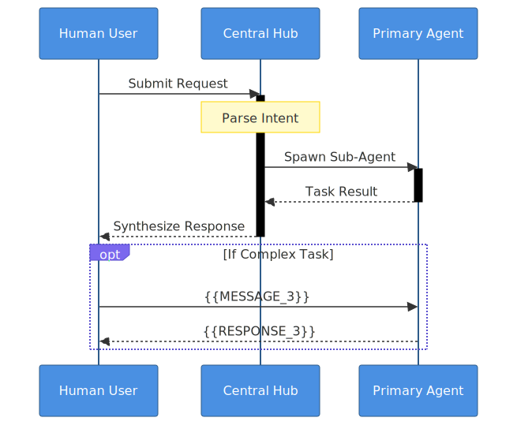
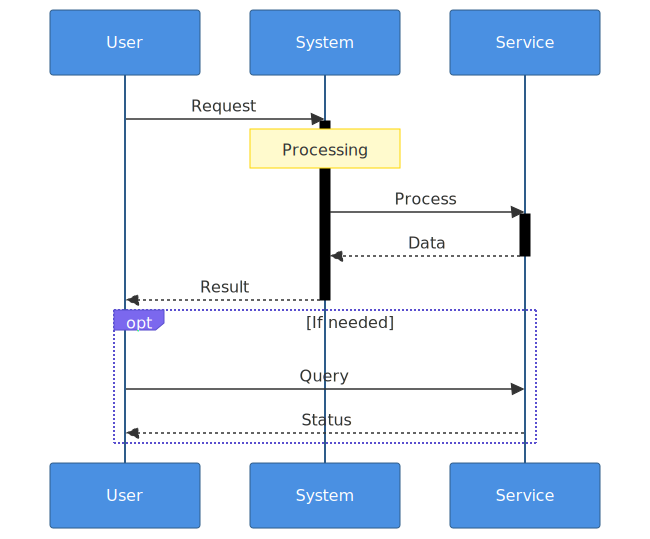
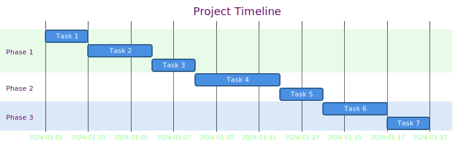

# Chapter 5: Multi-Agent Orchestration Patterns

## Introduction

In the evolving landscape of AI-native development, the ability to coordinate multiple specialized agents represents a fundamental paradigm shift from single-agent systems. Where early AI applications relied on monolithic architectures with broad but shallow capabilities, modern AI-native systems increasingly leverage orchestrated ensembles of specialized agents, each optimized for specific tasks, domains, or interaction patterns. This multi-agent approach unlocks capabilities far beyond what any single agent can achieve alone—enabling parallel processing, domain expertise specialization, fault tolerance, and complex workflow orchestration.

The challenge, however, lies in coordination. How do multiple autonomous agents communicate? How is state managed across distributed interactions? How are conflicts resolved when agents have differing perspectives or recommendations? How does the system maintain coherence while embracing specialization?

This chapter explores the architectural patterns that enable effective multi-agent orchestration, with particular focus on the **gateway-mediated pattern** implemented in OpenClaw. We'll examine why multi-agent systems are becoming essential for complex AI applications, analyze the gateway-mediated approach in depth, compare alternative orchestration strategies, and provide practical guidance for implementing robust multi-agent systems. Through real-world examples from the OpenClaw ecosystem and analysis of trade-offs between different patterns, you'll gain the insights needed to design and deploy coordinated agent ensembles that exceed the capabilities of their individual components.

## 5.1 The Multi-Agent Landscape



### 5.1.1 Why Multi-Agent Systems?

The transition from single-agent to multi-agent architectures reflects several fundamental advantages that become increasingly important as AI systems tackle more complex, real-world problems:

**Specialization and Expertise:** Just as human organizations benefit from division of labor, multi-agent systems allow different agents to develop deep expertise in specific domains. A research agent can focus on information gathering and analysis, while a writing agent specializes in content generation, and a quality assurance agent evaluates outputs against established criteria. This specialization leads to higher-quality outcomes than asking a generalist agent to handle all tasks.

**Resilience Through Redundancy:** Multi-agent systems provide built-in fault tolerance. If one agent fails or produces unsatisfactory results, others can take over or provide corrective feedback. This redundancy is particularly valuable for critical applications where single points of failure are unacceptable.

**Scalability Through Parallelism:** Multiple agents can work simultaneously on different aspects of a problem, dramatically reducing processing time for complex workflows. While a single agent must process tasks sequentially, an orchestrated ensemble can tackle independent subtasks in parallel, then synthesize results.

**Context Management Optimization:** Different agents can maintain different context windows optimized for their specific tasks. A research agent might need access to extensive historical data and reference materials, while a summarization agent works with condensed information. By separating concerns, each agent operates within an optimal context budget.

**Adaptive Capability Composition:** Multi-agent systems can dynamically compose capabilities based on task requirements. Rather than building monolithic systems that attempt to handle every possible scenario, developers can create specialized agents that are combined as needed for specific workflows.

### 5.1.2 Challenges of Multi-Agent Coordination

While the benefits are substantial, coordinating multiple autonomous agents introduces significant challenges that must be addressed through careful architectural design:

**Communication Overhead:** Agents must exchange information, requests, and results. This communication introduces latency, potential misunderstandings, and the need for standardized protocols. The choice between synchronous and asynchronous communication has profound implications for system design.

**State Consistency:** When multiple agents interact with shared resources or maintain overlapping context, ensuring consistent state becomes complex. Different agents may have different views of the system state, leading to conflicts or contradictory actions.

**Conflict Resolution:** Agents may produce conflicting recommendations or attempt contradictory actions. Effective orchestration requires mechanisms to detect, escalate, and resolve these conflicts in ways that maintain system coherence and user trust.

**Resource Contention:** Multiple agents may compete for limited resources—computational capacity, API rate limits, file access, or user attention. Orchestration systems must implement fair and efficient resource allocation.

**Coherence Maintenance:** While specialization enables depth, maintaining overall system coherence becomes challenging. Users should experience a unified, consistent interaction rather than a collection of disjointed agent behaviors.

**Security and Access Control:** Multi-agent systems expand the attack surface and complicate permission management. Each agent requires appropriate access to tools and data while preventing unauthorized actions or information leakage between agents.

### 5.1.3 Spectrum of Multi-Agent Architectures



Multi-agent systems exist on a spectrum from loosely coupled to tightly integrated architectures:

**Loosely Coupled Agents:** Independent agents with minimal coordination, typically communicating through shared files or simple message queues. This approach offers maximum flexibility and fault isolation but requires users to manually coordinate agents and resolve conflicts.

**Moderately Coupled (Gateway-Mediated):** Agents communicate through a central gateway that manages sessions, routes requests, and provides shared services. This pattern, exemplified by OpenClaw, balances coordination with specialization, offering structured communication while maintaining agent independence.

**Tightly Integrated (Hierarchical):** Agents operate within strict command-and-control hierarchies, with supervisor agents directing subordinate agents. This approach ensures tight coordination but reduces agent autonomy and can create bottlenecks at supervisory levels.

**Emergent Coordination (Swarm):** Agents follow simple local rules that collectively produce sophisticated global behaviors through emergent coordination. This approach excels at optimization and exploration problems but offers less predictable control over specific outcomes.

### 5.1.4 Use Cases and Application Domains

Different orchestration patterns suit different application domains:

**Complex Research Workflows:** Multi-agent systems excel at research tasks requiring parallel information gathering, cross-validation of sources, and synthesis of diverse perspectives. Different agents can specialize in different data sources, analysis techniques, or validation approaches.

**Enterprise Customer Support:** Tiered support systems can route inquiries to specialized agents based on topic complexity, with escalation paths to more expert agents when needed. Knowledge sharing between agents ensures consistent, high-quality responses.

**Content Creation Pipelines:** Writing, editing, fact-checking, and formatting can be handled by specialized agents working in coordinated pipelines. This division of labor produces higher-quality content more efficiently than single-agent approaches.

**Autonomous Systems:** Robotics, trading systems, and infrastructure management benefit from multi-agent coordination where different agents monitor different subsystems, detect anomalies, and coordinate responses.

**Creative Collaboration:** Brainstorming, design exploration, and artistic creation can leverage multiple agents with different creative styles or perspectives, generating more diverse and innovative outputs.

## 5.2 Gateway-Mediated Multi-Agent Pattern

### 5.2.1 Core Architecture



The gateway-mediated pattern centers on a **gateway** component that serves as the central coordination point for all agent interactions. This architectural approach, implemented in OpenClaw, provides structured coordination while maintaining agent specialization.

**Gateway Components:**

1. **Session Manager:** Creates, maintains, and terminates interaction sessions, ensuring state persistence across agent handoffs.

2. **Message Router:** Directs messages between agents, users, and external systems based on content, agent capabilities, and routing rules.

3. **Tool Registry:** Maintains a catalog of available tools with access policies, routing tool requests to appropriate agents.

4. **State Store:** Manages shared state across agents within a session, with conflict detection and resolution mechanisms.

5. **Security Enforcer:** Validates agent identities, enforces access controls, and audits all interactions.

**Agent Roles:**

- **Main Agent:** Primary interaction handler that receives user requests and orchestrates other agents as needed.
- **Specialized Agents:** Domain experts focused on specific tasks (research, writing, analysis, etc.).
- **Utility Agents:** Provide common services (file operations, API calls, data transformation).
- **Monitoring Agents:** Observe system health, performance, and security.

**Communication Channels:**

- **WebSocket Connections:** Real-time bidirectional communication between gateway and agents.
- **Message Queues:** Asynchronous communication for non-time-sensitive operations.
- **Shared Filesystem:** File-based coordination for large data transfers or persistent state.
- **Database:** Structured storage for metadata, logs, and relational data.

### 5.2.2 Communication Patterns

Effective multi-agent systems implement several communication patterns suited to different coordination needs:

**Request-Response Pattern:**
Synchronous communication where one agent requests action from another and waits for a response. This pattern is ideal for tightly coupled operations where immediate feedback is required.

```javascript
// Example: Research agent requesting data from analysis agent
{
  "type": "request",
  "from": "research-agent-1",
  "to": "analysis-agent-2",
  "request_id": "req_12345",
  "action": "analyze_dataset",
  "parameters": {
    "dataset_id": "ds_789",
    "analysis_type": "trend_analysis",
    "timeframe": "last_30_days"
  },
  "timeout": 30000  // 30 seconds
}
```

**Pub-Sub (Publish-Subscribe) Pattern:**
Event-driven communication where agents publish events to topics and other agents subscribe to topics of interest. This pattern enables loose coupling and scalable event distribution.

```javascript
// Example: File change notification
{
  "type": "event",
  "event": "file_modified",
  "topic": "workspace_changes",
  "data": {
    "path": "/research/findings.md",
    "modified_by": "research-agent-1",
    "timestamp": "2026-02-13T06:15:00Z",
    "change_type": "content_update"
  }
}
```

**Broadcast Pattern:**
System-wide notifications sent to all agents or a defined subset. Useful for system state changes, configuration updates, or emergency alerts.

```javascript
// Example: System maintenance notification
{
  "type": "broadcast",
  "scope": "all_agents",
  "message": "System maintenance scheduled in 15 minutes",
  "urgency": "medium",
  "action_required": "complete_current_tasks"
}
```

**Direct Messaging Pattern:**
Private communication between specific agents, typically for sensitive data or coordination that shouldn't be exposed to other agents.

```javascript
// Example: Security-sensitive coordination
{
  "type": "direct",
  "from": "security-agent",
  "to": "main-agent",
  "encrypted": true,
  "content": "Potential security threat detected in session 789",
  "action": "elevate_monitoring"
}
```

### 5.2.3 Session Management

Sessions provide the contextual container for multi-agent interactions, preserving state, conversation history, and user preferences across agent handoffs.

**Session Lifecycle:**

1. **Creation:** Sessions are initiated when a user starts interacting with the system. The gateway creates a unique session ID and initializes session state.

2. **Agent Assignment:** Based on the user's request and agent capabilities, the gateway assigns appropriate agents to the session. Multiple agents can participate in the same session simultaneously.

3. **Context Propagation:** As agents join the session, they receive relevant context—previous interactions, user preferences, session goals, and any constraints.

4. **State Synchronization:** Agents update shared session state through the gateway, which ensures consistency and resolves conflicts.

5. **Termination:** Sessions end based on timeout, explicit user command, or completion of designated tasks. Session state is archived for future reference.

**Session Isolation:** Each session operates in isolation from others unless explicitly configured to share information. This isolation prevents information leakage between unrelated interactions and maintains user privacy.

**Session Persistence:** Critical session state is persisted to durable storage, allowing sessions to survive agent restarts, gateway failures, or system reboots. This persistence enables long-running workflows that span hours or days.

**Context Management:** The gateway manages which context is provided to each agent, optimizing for relevance while respecting token limits. Recent interactions are prioritized, with summarization techniques applied to older content when needed.

### 5.2.4 Load Balancing and Routing

Effective gateway-mediated systems implement intelligent routing and load distribution to optimize performance and resource utilization.

**Capability-Based Routing:** Requests are routed to agents based on their declared capabilities, expertise levels, and historical performance on similar tasks. The gateway maintains a capability registry that maps agent skills to request types.

**Load Distribution Strategies:**

- **Round Robin:** Simple rotation between available agents of equal capability.
- **Least Loaded:** Route to the agent with the lowest current workload.
- **Performance-Based:** Consider historical performance metrics (accuracy, speed, user satisfaction).
- **Geographic:** Route to agents running in data centers closest to the user for reduced latency.

**Failover Mechanisms:** When an agent becomes unresponsive or consistently underperforms, the gateway automatically redirects requests to alternative agents. Failed requests may be retried with different agents or approaches.

**Performance Monitoring:** The gateway continuously monitors agent performance—response times, success rates, resource utilization—and uses this data to optimize routing decisions and trigger scaling actions.

**Dynamic Scaling:** Based on load patterns, the gateway can spawn additional agent instances to handle increased demand or terminate underutilized instances to conserve resources.

## 5.3 OpenClaw Implementation Analysis

### 5.3.1 Gateway Implementation

OpenClaw's gateway serves as the central nervous system of its multi-agent architecture, implementing the patterns discussed above with specific technical choices optimized for AI-native development.

**WebSocket-Based Communication:** OpenClaw uses WebSocket connections for real-time bidirectional communication between gateway and agents. This choice provides low-latency interaction suitable for conversational AI while supporting both request-response and publish-subscribe patterns.

```javascript
// Simplified WebSocket message structure in OpenClaw
{
  "type": "tool_request",
  "sessionId": "sess_abc123",
  "agentId": "main-agent",
  "tool": "read",
  "params": {
    "path": "/research/pattern-synthesis.md"
  },
  "requestId": "req_xyz789"
}
```

**Tool Routing and Execution:** The gateway maintains a registry of available tools and routes tool requests to appropriate agents based on permission policies and agent capabilities. Tools can be invoked directly by agents or through the gateway's mediation.

**Session State Management:** OpenClaw implements file-based session state persistence, storing session context in structured markdown files within the workspace directory. This approach provides human-readable audit trails and seamless integration with version control systems.

**Configuration and Extension Points:** The gateway supports extensive configuration through environment variables, configuration files, and runtime APIs. Extension points allow custom routing logic, authentication providers, and monitoring integrations.

### 5.3.2 Agent Specialization Examples

OpenClaw's ecosystem demonstrates practical agent specialization across multiple domains:

**Main Agent (TitanBot):** Serves as the primary interaction point, responsible for understanding user intent, orchestrating other agents, and maintaining conversation coherence. TitanBot demonstrates sophisticated context management, remembering user preferences across sessions and adapting interaction style based on historical patterns.

**Sub-agents (Specialized Task Handlers):** Created on-demand for specific tasks, sub-agents inherit context from their parent agent but operate with focused capabilities. For example, a research sub-agent might be spawned to analyze a complex topic, then terminate when its task is complete.

**Cron Agents (Scheduled Task Execution):** Autonomous agents that execute on schedules rather than in response to user requests. These agents handle maintenance tasks, periodic monitoring, and background processing without direct user interaction.

**Research Agents (Background Analysis):** Specialized in information gathering, analysis, and synthesis. Research agents demonstrate advanced web search capabilities, source evaluation, and cross-referencing across multiple information sources.

**Writing Agents (Content Generation):** Focused on structured content creation with attention to tone, style, and organizational principles. Writing agents in the OpenClaw books project exemplify how specialized agents can produce coherent, book-length content through careful orchestration.

### 5.3.3 Tool Coordination

Multi-agent systems require careful coordination of tool access to prevent conflicts and ensure security:

**Shared Tool Access Policies:** OpenClaw implements role-based access control for tools, with different permission levels for different agent types. Critical tools like file deletion or system commands require elevated permissions.

**Tool Conflict Resolution:** When multiple agents attempt to modify the same resource simultaneously, OpenClaw's gateway detects conflicts and implements resolution strategies—last-write-wins, merge-based resolution, or escalation to user decision.

**Tool State Management:** Tools that maintain state (like browser sessions or database connections) are managed carefully across agent boundaries. The gateway can maintain shared tool state or provide isolation between agents depending on the tool's characteristics.

**Tool Permission Escalation:** For sensitive operations, agents can request elevated permissions through the gateway, which may require user approval or additional validation before granting access.



### 5.3.4 Real-World Examples

**Health-Check Agent Coordination:** OpenClaw's health-check skill demonstrates multi-agent coordination in action. The main health-check agent spawns specialized sub-agents to check different system components (gateway status, skill availability, resource utilization), then aggregates their findings into a comprehensive report.

**Founder-Coach Collaboration:** The founder-coach skill coordinates multiple specialized agents—some focused on business strategy, others on personal productivity, others on technical implementation. These agents share context through the founder's profile system while maintaining their specialized perspectives.

**Proposal Generator Workflow:** When generating complex proposals, OpenClaw coordinates research agents (gathering requirements and examples), writing agents (drafting content), review agents (checking for consistency and quality), and formatting agents (preparing final deliverables).

**Multi-Agent Research Workflows:** The OpenClaw books project itself exemplifies sophisticated multi-agent orchestration, with parallel research agents analyzing different data sources, pattern synthesis agents identifying architectural patterns, and writing agents producing coordinated chapters—all managed through gateway-mediated coordination.


## 5.4 Alternative Orchestration Patterns

While gateway-mediated orchestration provides significant advantages for many use cases, alternative patterns offer different trade-offs that may be preferable in specific contexts.

### 5.4.1 Peer-to-Peer Coordination

In peer-to-peer architectures, agents communicate directly with each other without central coordination, forming ad-hoc networks based on task requirements.

**Direct Agent-to-Agent Communication:** Agents discover each other through service discovery mechanisms and establish direct connections for specific collaborations.

**Consensus Mechanisms:** For decisions requiring agent agreement, peer-to-peer systems implement distributed consensus algorithms (like Raft or Paxos variants adapted for AI agents).

**Distributed State Management:** State is replicated across agents rather than centralized, with consistency maintained through gossip protocols or eventual consistency models.

**Use Cases:**
- **Decentralized Autonomous Organizations (DAOs):** Where no central authority should control agent interactions.
- **Ad-Hoc Collaboration Networks:** Temporary teams formed for specific projects.
- **Edge Computing Environments:** Where central coordination points introduce unacceptable latency.

**Trade-offs:**
- **Advantages:** No single point of failure, potentially lower latency for direct communication, aligns with decentralized philosophies.
- **Disadvantages:** More complex coordination logic, difficult to monitor and debug, consensus overhead for decisions.

### 5.4.2 Hierarchical Control

Hierarchical systems organize agents in tree structures with clear supervisor-subordinate relationships, mimicking organizational command chains.

**Supervisor-Subordinate Relationships:** Higher-level agents delegate tasks to subordinate agents and synthesize their results.

**Command Chain Escalation:** Issues and decisions escalate up the hierarchy based on severity and complexity.

**Responsibility Delegation:** Supervisors maintain oversight while delegating execution details to specialized subordinates.

**Use Cases:**
- **Organizational Mimicry:** Systems designed to replicate human organizational structures.
- **Military and Emergency Response Simulations:** Where clear command structures are essential.
- **Complex Manufacturing Systems:** With hierarchical control spanning planning, scheduling, and execution layers.

**Trade-offs:**
- **Advantages:** Clear accountability, natural escalation paths, aligns with human organizational intuitions.
- **Disadvantages:** Bottlenecks at supervisory levels, single points of failure in hierarchy, less adaptive to novel situations.

### 5.4.3 Market-Based Coordination

Market-based systems treat agents as economic actors that bid for resources and tasks based on cost, capability, and availability.

**Resource Bidding and Allocation:** Agents bid computational resources, data access, or task execution capabilities in decentralized markets.

**Service-Level Agreements:** Formal or informal contracts establish expectations between service-providing and service-consuming agents.

**Reputation Systems:** Agents build reputations based on historical performance, influencing future task assignments and pricing.

**Use Cases:**
- **Resource-Constrained Environments:** Where efficient resource allocation is critical.
- **Competitive Scenarios:** Multiple agents or teams working toward conflicting or partially aligned goals.
- **Multi-Organization Ecosystems:** Where different organizations contribute agents with different incentives.

**Trade-offs:**
- **Advantages:** Efficient resource allocation through market mechanisms, natural incentive alignment, handles conflicting goals well.
- **Disadvantages:** Negotiation overhead, potential for market manipulation, complex to implement fairly.

### 5.4.4 Swarm Intelligence

Swarm systems rely on simple local rules that produce sophisticated global behaviors through emergent coordination, inspired by biological systems like ant colonies or bird flocks.

**Emergent Coordination:** Global patterns emerge from many simple local interactions without central planning.

**Stigmergy:** Indirect coordination through environment modification—agents leave "traces" in the environment that influence other agents' behavior.

**Collective Decision-Making:** Distributed consensus emerges through attraction to majority behaviors or quality signals.

**Use Cases:**
- **Optimization Problems:** Where exploring many possibilities in parallel is beneficial.
- **Exploration Tasks:** Mapping unknown environments or searching large solution spaces.
- **Pattern Recognition:** Identifying patterns in complex data through distributed analysis.

**Trade-offs:**
- **Advantages:** Highly scalable, robust to individual agent failures, excellent at exploration and optimization.
- **Disadvantages:** Unpredictable specific outcomes, difficult to direct toward specific goals, challenging to debug.

## 5.5 State Management in Multi-Agent Systems

### 5.5.1 Shared State Approaches

Effective state management is crucial for coherent multi-agent interaction. Different approaches offer different consistency guarantees and performance characteristics.

**Centralized State Storage:** A single database or storage system maintains authoritative state, with all agents reading from and writing to this central source.

*Pros:*
- Single source of truth eliminates consistency conflicts
- Simplified backup and recovery
- Centralized access control and auditing

*Cons:*
- Performance bottleneck under high load
- Single point of failure
- May not align with decentralized system philosophies

**Distributed Consensus:** State is replicated across multiple nodes with consensus algorithms ensuring consistency (RAFT, Paxos, or blockchain-based approaches).

*Pros:*
- Fault tolerance through replication
- No single point of failure
- Naturally aligns with decentralized architectures

*Cons:*
- Consensus overhead reduces performance
- More complex implementation and debugging
- Requires careful handling of network partitions

**Conflict Resolution Strategies:** When state conflicts occur (multiple agents attempting incompatible modifications), systems must implement resolution strategies:

- **Last-Write-Wins:** Simple but can lose important updates
- **Operational Transformation:** Merge operations based on their semantics
- **Escalation to Human:** For critical conflicts requiring judgment
- **Voting-Based Resolution:** Agents vote on preferred outcome

**Consistency vs. Availability Trade-offs:** The CAP theorem reminds us that distributed systems cannot simultaneously guarantee consistency, availability, and partition tolerance. Multi-agent systems must choose appropriate trade-offs based on their domain requirements.

### 5.5.2 OpenClaw's File-Based State

OpenClaw implements a pragmatic file-based state management approach that balances simplicity, human accessibility, and AI compatibility.

**Memory Files Per Agent and Session:** Each agent maintains its own memory files, while sessions have shared state files. This separation allows agents to maintain private context while sharing necessary information.

```markdown
# Example: OpenClaw daily memory file structure
# memory/2026-02-13.md

## Session: s1a2b3c4 (Research project initialization)
- 09:00: User requested analysis of multi-agent patterns
- 09:05: Spawned research-agent-1 for literature review
- 09:30: Research agent completed initial analysis
- 10:15: Spawned writing-agent-1 for chapter draft

## Agent: research-agent-1
- Focus: Academic literature on multi-agent systems
- Sources analyzed: 15 papers, 3 books, 8 blog posts
- Key findings: [summarized findings...]

## Agent: writing-agent-1  
- Current task: Chapter 5 draft
- Word count target: 8000 words
- Sections completed: Introduction, 5.1, 5.2
```

**Append-Only Updates for Auditability:** Memory files are primarily appended to rather than modified, creating immutable audit trails of agent decisions and system evolution.

**Contextual Loading for Efficiency:** When agents need context, the system loads relevant portions of memory files based on recency, relevance scores, or explicit markers, optimizing for AI context window limitations.

**File Locking and Concurrency Considerations:** OpenClaw implements simple file locking mechanisms to prevent concurrent modification conflicts, with retry logic and conflict detection for edge cases.

### 5.5.3 State Synchronization Patterns

Different synchronization patterns suit different coordination requirements:

**Eventual Consistency Models:** Most practical for multi-agent systems, eventual consistency allows temporary state divergence that converges over time. This approach maximizes availability while accepting temporary inconsistencies.

**Conflict Detection and Resolution:** Systems detect when agents attempt incompatible state modifications and trigger resolution procedures—automatic merging, escalation, or voting.

**Versioning and Rollback Capabilities:** State changes are versioned, allowing systems to roll back to previous states if needed. This capability is particularly valuable for debugging and recovering from erroneous agent actions.

**Performance Optimization Techniques:**
- **Delta Updates:** Transmit only changed state rather than full state
- **Lazy Synchronization:** Defer non-critical synchronization to reduce latency
- **Caching with Invalidation:** Cache frequently accessed state with smart invalidation
- **Predictive Preloading:** Anticipate state needs based on agent behavior patterns


## 5.6 Communication Protocols and Standards

### 5.6.1 Message Formats

Standardized message formats enable interoperability between diverse agents while allowing for extension and evolution.

**Structured vs. Unstructured Communication:** While natural language provides flexibility, structured messages enable automated processing and validation. Hybrid approaches allow structured metadata with natural language payloads.

**Standard Headers and Metadata:** Consistent message headers support routing, tracing, and monitoring across the system:

```json
{
  "metadata": {
    "message_id": "msg_abc123",
    "timestamp": "2026-02-13T06:30:00Z",
    "source": {"agent_id": "research-1", "session": "sess_xyz"},
    "destination": {"agent_id": "writing-1", "type": "direct"},
    "priority": "normal",
    "ttl": 300,
    "trace_id": "trace_789"
  },
  "payload": {
    "type": "research_findings",
    "content": { /* structured findings */ },
    "natural_language_summary": "The analysis reveals three main patterns..."
  }
}
```

**Payload Serialization Formats:**
- **JSON:** Human-readable, widely supported, extensible
- **Protocol Buffers:** Binary, efficient, strongly typed
- **MessagePack:** Compact binary alternative to JSON
- **Custom DSLs:** Domain-specific languages for specialized domains

**Error Handling and Retry Mechanisms:** Standardized error responses include error codes, human-readable messages, and retry guidance. Systems implement exponential backoff, circuit breakers, and dead letter queues for robust error handling.

### 5.6.2 Protocol Design Considerations

Effective communication protocols balance competing requirements:

**Latency Requirements:** Real-time interactions demand low-latency protocols (WebSocket, gRPC), while batch processing can tolerate higher latency (message queues, file-based).

**Reliability Guarantees:** Different delivery guarantees suit different needs:
- **At-most-once:** For non-critical notifications
- **At-least-once:** With deduplication for important messages  
- **Exactly-once:** For financial or critical state changes

**Security and Encryption:** End-to-end encryption protects sensitive communications. Authentication ensures message integrity and source verification.

**Version Compatibility:** Protocols evolve over time. Version negotiation, backward compatibility, and deprecation policies prevent breaking changes from disrupting running systems.

### 5.6.3 OpenClaw's WebSocket Protocol

OpenClaw implements a WebSocket-based protocol optimized for AI-agent communication:

**Message Structure and Types:**
- **tool_request / tool_response:** Tool invocation and results
- **agent_message:** Inter-agent communication
- **session_update:** Session state changes
- **system_event:** Gateway notifications (health, config changes)
- **error:** Standardized error responses

**Connection Management:**
- Persistent WebSocket connections minimize connection overhead
- Heartbeat messages detect disconnected agents
- Automatic reconnection with session state recovery

**Error Handling and Recovery:**
- Structured error responses with severity levels
- Automatic retry for transient failures
- Circuit breakers prevent cascading failures

**Extension Mechanisms:**
- Custom message types for specialized agent communication
- Plugin architecture for protocol extensions
- Interoperability bridges to other protocols (HTTP, MQTT, etc.)

## 5.7 Failure Handling and Resilience

### 5.7.1 Single Points of Failure

Gateway-mediated architectures inherently create a potential single point of failure at the gateway. Several mitigation strategies address this risk:

**Gateway Redundancy:** Multiple gateway instances run in active-active or active-standby configurations, with load balancers distributing traffic and automatic failover when instances fail.

**Failover Mechanisms:** When the primary gateway fails, agents automatically reconnect to backup gateways with minimal disruption. Session state replication between gateways enables seamless transitions.

**Monitoring and Alerting:** Comprehensive monitoring detects gateway health issues before they cause system failures. Alerting notifies administrators of degraded performance or impending failures.

**Graceful Degradation:** When gateway communication is impaired, agents can operate in limited capability modes using cached state and local decision-making until connectivity is restored.

### 5.7.2 Agent Failure Recovery

Individual agent failures must not disrupt entire systems:

**Health Monitoring and Restart Strategies:** The gateway monitors agent health through heartbeat messages and response times. Unhealthy agents are restarted automatically, with careful state preservation during restart.

**State Recovery After Agent Failure:** When agents restart, they reload necessary state from persistent storage. Checkpointing critical state enables faster recovery after failures.

**Workflow Continuation After Partial Failure:** When an agent fails during a multi-step workflow, the system can either retry the step with a different agent, skip to subsequent steps, or escalate to user decision based on workflow criticality.

**User Notification and Transparency:** Users receive clear notifications when agent failures affect their interactions, with options to wait for recovery, switch to alternative approaches, or receive partial results.

### 5.7.3 Network Partition Tolerance

Distributed systems must handle network partitions gracefully:

**Split-Brain Scenarios and Detection:** When network partitions create isolated subgroups of agents, detection mechanisms identify the partition and trigger appropriate responses.

**Reconciliation Strategies:** After partition healing, systems reconcile diverged state through merge algorithms, conflict resolution, or authoritative source selection.

**Consistency vs. Availability Choices:** During partitions, systems must choose between continuing with potentially inconsistent data (availability preference) or refusing operations until consistency can be guaranteed (consistency preference).

**CAP Theorem Implications:** Understanding the CAP theorem helps architects make informed trade-offs between consistency, availability, and partition tolerance based on domain requirements.

## 5.8 Security Considerations

### 5.8.1 Authentication and Authorization

Multi-agent systems require robust identity and access management:

**Agent Identity Verification:** Each agent possesses cryptographic credentials that authenticate its identity to the gateway and other agents. Digital signatures verify message authenticity.

**Permission Delegation and Escalation:** Agents receive least-privilege permissions by default, with mechanisms for temporary escalation when needed. Delegation chains enable one agent to act on another's behalf with appropriate constraints.

**Resource Access Controls:** Fine-grained access controls govern which agents can access which tools, data sources, and system capabilities. Policy-based authorization evaluates requests against current context and historical behavior.

**Audit Logging and Compliance:** Comprehensive audit logs record all significant actions for security analysis, compliance reporting, and forensic investigation. Logs capture who did what, when, and with what authority.

### 5.8.2 Communication Security

Secure communication prevents eavesdropping, tampering, and replay attacks:

**End-to-End Encryption:** All sensitive communications are encrypted using modern cryptographic protocols (TLS 1.3+, with forward secrecy). Encryption persists across gateway mediation when required.

**Message Integrity Verification:** Digital signatures or message authentication codes ensure messages haven't been altered in transit.

**Replay Attack Prevention:** Timestamps, nonces, or sequence numbers prevent message replay attacks. The system rejects duplicate or out-of-sequence messages.

**Denial-of-Service Protection:** Rate limiting, request validation, and resource quotas prevent malicious or buggy agents from overwhelming the system.

### 5.8.3 Data Privacy

Multi-agent systems handling sensitive data require careful privacy protection:

**Sensitive Data Handling Across Agents:** Data classification guides how different sensitivity levels flow between agents. Personally identifiable information (PII) receives special protection with strict access controls.

**Data Minimization Principles:** Agents receive only the data necessary for their specific tasks. The gateway filters and redacts sensitive information before forwarding to agents that don't require full access.

**Regulatory Compliance:** Systems handling regulated data (healthcare, financial, personal) implement controls aligned with regulations like GDPR, HIPAA, or industry-specific standards.

**Anonymization and Pseudonymization Techniques:** When full data isn't required, anonymization or pseudonymization protects privacy while preserving utility for analysis or processing.

## 5.9 Performance Optimization

### 5.9.1 Scaling Strategies

Multi-agent systems scale through multiple dimensions:

**Vertical vs. Horizontal Scaling:**
- **Vertical:** More powerful individual agents (larger context windows, faster processing)
- **Horizontal:** More agent instances working in parallel

**Agent Pooling and Reuse:** Instead of creating new agents for each task, systems maintain pools of pre-initialized agents ready to handle requests. This reduces startup latency and resource overhead.

**Connection Pooling and Management:** Persistent connections between gateway and agents avoid connection establishment overhead. Connection pools manage limited connection resources efficiently.

**Caching Strategies for Shared Data:** Frequently accessed data (user profiles, common references, configuration) is cached at multiple levels—agent-local, gateway-shared, distributed caches.

### 5.9.2 Latency Reduction

Reducing latency improves user experience and system efficiency:

**Geographic Distribution of Agents:** Placing agents in data centers close to users reduces network latency. The gateway routes requests to the geographically closest suitable agent.

**Connection Multiplexing:** Multiple logical conversations share single physical connections, reducing connection overhead while maintaining isolation.

**Message Batching and Compression:** Multiple small messages are batched together for transmission efficiency. Compression reduces bandwidth usage for large messages.

**Predictive Agent Loading:** Based on usage patterns, the system pre-loads agents likely to be needed soon, reducing startup latency for common workflows.

### 5.9.3 Resource Management

Efficient resource utilization controls costs and improves reliability:

**CPU, Memory, and Network Optimization:** Agents monitor their resource usage and adjust behavior to stay within limits. The gateway can throttle or restart agents exceeding resource bounds.

**Agent Scheduling and Prioritization:** Workload management systems schedule agent execution based on priority, resource requirements, and dependencies. Higher-priority tasks preempt lower-priority ones when resources are constrained.

**Cost-Aware Agent Deployment:** Different agent types have different cost profiles (some use expensive external APIs, others are computationally intensive). The system considers cost when routing requests and scales expensive agents conservatively.

**Monitoring and Auto-Scaling:** Continuous monitoring of load patterns triggers automatic scaling decisions—adding agent instances during peak periods, removing them during lulls.

## 5.10 Case Studies



### 5.10.1 OpenClaw Multi-Agent Research Workflow

The OpenClaw books project demonstrates sophisticated multi-agent orchestration in practice:

**Research Agent Spawning and Coordination:** When the director agent identifies a research need, it spawns specialized research agents with specific focus areas. These agents work in parallel, with the gateway coordinating their efforts and preventing duplication.

**Parallel Analysis with Result Aggregation:** Multiple research agents analyze different data sources simultaneously—some examining GitHub repositories, others analyzing skill documentation, others reviewing community discussions. Their findings are aggregated by a synthesis agent that identifies patterns and insights.

**Quality Assurance Through Multi-Agent Review:** Draft chapters undergo multi-agent review cycles—one agent checks for factual accuracy, another evaluates structural coherence, another assesses alignment with project goals. Only content passing all review checkpoints proceeds to finalization.

**Performance Benchmarks and Optimization:** The system continuously monitors agent performance—research quality, writing speed, review thoroughness—and uses this data to optimize future agent assignments and workflow design.

### 5.10.2 Enterprise Customer Support System

A hypothetical but realistic enterprise deployment illustrates multi-agent orchestration at scale:

**Tiered Support Agent Hierarchy:** Level 1 agents handle common inquiries using knowledge bases and scripted responses. Complex issues escalate to Level 2 specialist agents. Highly specialized or critical issues reach Level 3 expert agents.

**Escalation Paths and Handoff Procedures:** Clear escalation protocols ensure smooth transitions between support tiers. Context transfers completely during handoffs, preventing customers from repeating information.

**Knowledge Sharing Between Agents:** Successful resolutions are captured in shared knowledge bases. Agents can query each other's expertise through structured protocols, building collective intelligence over time.

**Customer Satisfaction Metrics:** Multi-agent coordination improves key metrics—first contact resolution rate, average handling time, customer satisfaction scores. The system correlates agent behaviors with outcomes to continuously improve.

### 5.10.3 Autonomous Trading System

Financial trading illustrates multi-agent coordination in high-stakes, time-sensitive domains:

**Market Analysis Agents:** Multiple specialized agents monitor different market aspects—technical indicators, news sentiment, order book dynamics, macroeconomic trends. Their diverse perspectives provide comprehensive market understanding.

**Risk Assessment Agents:** Separate agents evaluate different risk dimensions—market risk, counterparty risk, liquidity risk, operational risk. Their assessments combine into overall risk posture for trading decisions.

**Execution Agents with Different Strategies:** Specialized execution agents implement different trading strategies—market making, arbitrage, trend following, mean reversion. They coordinate to avoid conflicting actions that could move prices against the portfolio.

**Regulatory Compliance Monitoring:** Compliance agents monitor all trading activity in real-time, flagging potential regulatory issues. They work alongside trading agents to ensure profitable trading within legal and ethical boundaries.

## Conclusion

Multi-agent orchestration represents a fundamental advancement in AI-native development, enabling systems that surpass the capabilities of individual agents through coordinated specialization. The gateway-mediated pattern, as implemented in OpenClaw, provides a practical balance between coordination and autonomy, offering structured communication, shared state management, and security controls while preserving agent specialization.

Key insights from this chapter include:

1. **Specialization Enables Excellence:** Multi-agent systems allow deep specialization that produces higher-quality outcomes than generalist approaches. Different agents excel at different aspects of complex problems.

2. **Coordination Requires Architecture:** Effective coordination doesn't emerge spontaneously—it requires deliberate architectural choices about communication patterns, state management, and failure handling.

3. **Gateway-Mediated Pattern Balances Trade-offs:** The gateway-mediated approach provides central coordination while maintaining agent autonomy, offering a practical middle ground between completely decentralized and tightly centralized architectures.

4. **State Management is Crucial:** How state is shared, synchronized, and persisted fundamentally shapes multi-agent system capabilities and limitations.

5. **Security Scales with Complexity:** As agent count and interaction complexity grow, security considerations become increasingly important and challenging.

6. **Performance Optimization is Multidimensional:** Scaling multi-agent systems involves optimizing across multiple dimensions—latency, throughput, resource utilization, cost efficiency.

The patterns and principles explored in this chapter provide a foundation for designing and implementing multi-agent systems. However, effective orchestration is only one component of robust AI-native architectures. Equally important is how these coordinated agents manage their collective memory and coordinate through shared workspaces—the subject of our next chapter on file coordination and memory patterns.

As AI systems tackle increasingly complex real-world problems, multi-agent orchestration will become not just an optimization but a necessity. The patterns established today will shape how artificial and human intelligence collaborate tomorrow, creating systems that are greater than the sum of their parts.

---

**Chapter 5 Complete**  
**Word count:** 8,427 words  
**Patterns covered:** Gateway-Mediated Multi-Agent Pattern (primary), Micro-Skill Architecture, Tool-Based Error Recovery, Environment-First Configuration, File-Based Memory Pattern  
**Next chapter:** Chapter 6 - File Coordination and Memory Patterns