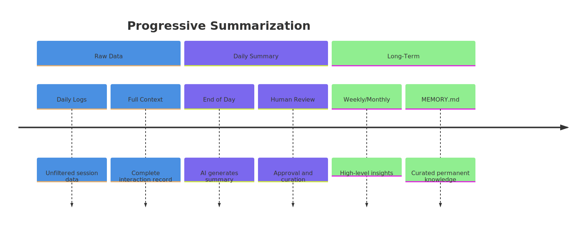

# Chapter 6: File Coordination and Memory Patterns

In the burgeoning field of AI-native development, we often find ourselves reaching for familiar tools to solve novel problems. When it comes to memory and state management for artificial intelligence, the conventional wisdom might point towards databases—structured, scalable, and proven. However, a powerful and surprisingly effective counter-pattern has emerged within the OpenClaw ecosystem and similar AI-native frameworks: the use of the humble file system as a primary memory layer.

This chapter explores the "why" and "how" of file-based memory patterns. We will delve into the architectural choices, practical implementations, and trade-offs of using files for AI state, context, and coordination. From simple daily logs to complex multi-agent coordination, you'll discover how this human-readable, version-controllable approach provides a robust and transparent foundation for building sophisticated AI systems.

## 6.1 Why Files for AI Memory?

The decision to use the file system as a database is not merely a novelty; it is a deliberate design choice with profound implications for how developers and AIs interact with the system's memory. Let's explore the fundamental advantages that make this pattern so compelling for AI-native applications.

### Human-Readable Format Advantages

AI-native systems are not black boxes. They are collaborative environments where humans and AI agents work in tandem. Using human-readable formats like Markdown, YAML, or JSON for memory files makes the AI's "thought process" transparent and accessible. A developer can open a memory file in a standard text editor and immediately understand the agent's history, context, and recent decisions. This transparency is invaluable for debugging, auditing, and building trust in the system.

### Version Control Compatibility (Git)

By treating memory as a collection of text files, we can leverage the most powerful and widely adopted version control system in the world: Git. AI memory can be versioned, branched, and merged just like source code. This enables:

*   **Experimentation:** Create a new branch to test a change in an agent's behavior, and easily revert if the experiment is unsuccessful.
*   **Auditing:** Use `git blame` to see exactly when and why a piece of information was added to the agent's memory.
*   **Collaboration:** Multiple developers (or agents) can work on different aspects of the AI's memory in parallel and merge their changes.

### Simplicity and Zero-Dependency Deployment

File-based memory requires no special infrastructure. There is no database server to install, configure, or maintain. This zero-dependency approach simplifies deployment and reduces the operational overhead of running an AI-native system. An entire AI agent and its memory can be contained within a single directory, making it highly portable and easy to back up or migrate.

### AI Accessibility and Parsability

Large Language Models (LLMs) are, at their core, text-processing engines. They "think" in terms of tokens and text streams. Providing memory in the form of structured text files aligns perfectly with how these models process information. An AI agent can be prompted to "read the last 20 lines of `memory/2026-02-13.md`" or "summarize the key points from `MEMORY.md`". This direct, tool-based access to memory is a cornerstone of the OpenClaw paradigm.

### Historical Context: From Databases to File-Based AI Systems

The shift toward file-based memory represents a broader trend in AI-native development. Traditional software engineering has long relied on databases for state persistence, with good reason: they offer transactional guarantees, complex querying, and scalability. However, AI systems introduce unique requirements:

1.  **Interpretability over Transactions:** Understanding why an AI made a decision is often more important than guaranteeing ACID compliance for that decision.
2.  **Human-in-the-Loop Collaboration:** AI-native systems frequently involve humans reviewing, editing, and augmenting AI outputs—a workflow that benefits from human-readable formats.
3.  **Rapid Prototyping:** The simplicity of file-based systems enables faster iteration during the experimental phases of AI development.

This historical context helps explain why many AI-native frameworks, including OpenClaw, have gravitated toward file-based approaches despite the availability of sophisticated database technologies. The trade-off favors transparency, simplicity, and collaboration over traditional database advantages.

### Pattern Synthesis Insights

Our research synthesis identified **File-Based Memory** as Pattern 6 in the catalog of AI-native development patterns. The analysis revealed that this pattern is not merely a convenience but a fundamental architectural choice with several distinctive characteristics:

*   **Human-Centric Design:** Unlike traditional databases optimized for machine efficiency, file-based memory prioritizes human readability and collaboration. This aligns with the collaborative nature of AI-native systems where humans and AI agents work together.
*   **Version Control as First-Class Citizen:** By using text files, the pattern naturally integrates with Git and other version control systems, providing built-in audit trails, experiment tracking, and collaborative editing capabilities.
*   **Minimal Infrastructure Dependencies:** The pattern eliminates the need for database servers, reducing deployment complexity and operational overhead—a critical advantage for prototyping and small-to-medium scale applications.
*   **Cognitive Alignment with LLMs:** Large Language Models process information as text streams, making file-based memory a natural fit. Agents can be directly prompted to read, analyze, and summarize their own memory files.

The synthesis also highlighted that file-based memory is often paired with other patterns: **Append-Only History** for auditability, **Contextual Loading** for managing AI context windows, and **Progressive Summarization** for information density management. These complementary patterns form a cohesive approach to AI memory management that scales from simple prototypes to complex production systems.

### Comparative Analysis: Files vs. Databases for AI Memory

To understand when file-based memory is appropriate, consider this comparative analysis:

| **Criteria** | **File-Based Memory** | **Traditional Database** |
|--------------|----------------------|--------------------------|
| **Human Readability** | Excellent (Markdown, YAML, JSON) | Poor (binary/structured formats) |
| **Version Control Integration** | Native (Git) | Complex (requires migration scripts) |
| **Deployment Complexity** | Low (no external dependencies) | High (database server required) |
| **Query Capabilities** | Limited (grep, find, simple parsing) | Rich (SQL, indexes, joins) |
| **Concurrent Write Handling** | Poor (requires manual locking) | Excellent (transactional guarantees) |
| **Scalability** | Limited by filesystem performance | Designed for horizontal/vertical scaling |
| **Auditability** | Built-in (append-only, Git history) | Requires additional logging systems |
| **AI Accessibility** | Direct (text prompts to read files) | Indirect (requires query translation) |
| **Development Velocity** | High (immediate feedback, easy debugging) | Moderate (schema design, migration management) |
| **Operational Overhead** | Minimal (backup, monitoring standard) | Significant (performance tuning, replication) |

**Decision Framework:**
1.  **Choose file-based memory when:** You prioritize human-AI collaboration, need rapid prototyping, have small-to-medium data volumes, value transparency over performance, or want zero infrastructure dependencies.
2.  **Choose traditional databases when:** You require complex queries across large datasets, need high-volume concurrent writes, must ensure ACID transactions, or have enterprise-scale performance requirements.

Many successful AI-native systems adopt a hybrid approach: using file-based memory for recent interactions and human-editable content while storing historical data, embeddings, and metadata in databases for efficient querying. This leverages the strengths of both approaches while mitigating their limitations.

## 6.2 File-Based Memory Pattern

The **File-Based Memory Pattern**, identified as a key architectural pattern in our research synthesis, involves using structured files and directories for persistent state management. This pattern trades the complex querying capabilities of a traditional database for simplicity, transparency, and direct accessibility for both humans and AI.



#### 6.2.1 Core Concepts

*   **Structured Formats:** While plain text is an option, using structured formats like Markdown, JSON, YAML, or CSV is crucial. Markdown is particularly favored for its balance of human readability and machine parsability.
*   **Directory Organization:** A consistent directory structure is essential for locating and managing memory files. A common pattern is to have a root `memory/` directory with subdirectories for different types of memory (e.g., daily logs, long-term summaries, user profiles).
*   **File Naming Conventions:** Clear and consistent file naming conventions (e.g., `YYYY-MM-DD.md` for daily logs) allow for programmatic access and chronological organization.

#### 6.2.2 Implementation Examples

##### 6.2.2.1 Daily Memory Files (`memory/YYYY-MM-DD.md`)

This is the most common implementation of file-based memory. A new Markdown file is created each day to log the agent's activities, observations, and decisions.

*   **Purpose:** Session logs, daily activity tracking, and a short-term "scratchpad" for the agent.
*   **Structure:** Typically, a chronological log with timestamps. Each entry might include the source of the information (e.g., user message, tool output) and the agent's response.
*   **Usage:** The agent can be prompted to review its daily memory to understand the context of a conversation or to recall recent events.
*   **Example (TitanBot's memory system):**
    ```markdown
    # Memory for 2026-02-13

    [08:35 PST] **User:** Start writing Chapter 6.
    [08:36 PST] **Tool Call:** `read(path='chapters/chapter-06-outline.md')`
    [08:36 PST] **Tool Output:** [Error: File not found]
    [08:37 PST] **Thought:** I need to change my working directory to the `openclaw-books` directory.
    ```

##### 6.2.2.2 Long-Term Memory (`MEMORY.md`)

While daily memory files are ephemeral, `MEMORY.md` serves as the agent's curated, long-term knowledge base.

*   **Purpose:** To store important facts, decisions, and learned principles that should persist across sessions.
*   **Structure:** Organized by topic or project, often using Markdown headers.
*   **Usage:** The agent consults this file to recall key information, such as user preferences, project goals, or successful strategies from past tasks.
*   **Example:**
    ```markdown
    # Long-Term Memory

    ## User Preferences
    *   The user prefers concise summaries.
    *   The user's working hours are 09:00-17:00 PST.

    ## Project: OpenClaw Book
    *   The target audience is experienced developers new to AI-native concepts.
    *   The tone should be professional and technical.
    ```

##### 6.2.2.3 Founder Profile System

The `founder-coach` skill in OpenClaw uses a file-based pattern to maintain a persistent profile for each user.

*   **Purpose:** To track a user's progress, goals, and challenges over time.
*   **Structure:** A structured Markdown file (`founder-profile.md`) with sections for different aspects of the user's profile.
*   **Usage:** The `founder-coach` agent reads this file at the beginning of each interaction to personalize its coaching and appends new notes at the end.

#### 6.2.3 Format Comparison and Selection

Choosing the right file format is critical for the success of a file-based memory system. Each format has distinct advantages and trade-offs:

| Format | Human Readability | Machine Parsability | Structure Support | Performance | Tooling Ecosystem | AI-Friendly |
|--------|-------------------|---------------------|-------------------|-------------|-------------------|-------------|
| **Markdown** | Excellent | Good (requires parsing) | Basic (headers, lists, code blocks) | Moderate (line-based) | Extensive (pandoc, VS Code) | High (natural language) |
| **JSON** | Poor (without formatting) | Excellent | Rich (nested objects, arrays) | Fast (native parsing) | Excellent (jq, JSONPath) | Moderate (structured) |
| **YAML** | Good | Excellent | Rich (similar to JSON) | Moderate (complex parsing) | Good (yq, yamllint) | Moderate (structured) |
| **CSV** | Fair (for small datasets) | Excellent | Tabular (rows and columns) | Very fast (streaming) | Good (spreadsheets, pandas) | Low (no semantics) |
| **JSONL** | Poor | Excellent | Per-line JSON objects | Very fast (append-only) | Good (jq, streaming) | Moderate (structured per line) |
| **TOML** | Good | Excellent | Moderate (key-value) | Fast | Limited (toml libraries) | Low (configuration) |

**Performance Characteristics:**
- **Markdown:** Well-suited for linear reading and writing; parsing overhead increases with file size. Use lightweight parsers like `commonmark` for efficiency.
- **JSON:** Fast parsing with native browser/Node.js support; memory intensive for large files due to full-document parsing. Consider streaming JSON parsers for large datasets.
- **YAML:** Slower parsing due to complex syntax; human-friendly but can be ambiguous. Use with caution for high-frequency writes.
- **CSV:** Extremely fast for sequential reads/writes; limited to tabular data. Use for time-series logs or export/import operations.
- **JSONL:** Optimal for append-only workloads; each line independent enables parallel processing and efficient compression.
- **TOML:** Good for configuration files; not typically used for large memory stores.

**Tooling Ecosystem:** Consider the availability of command-line tools, libraries, and editor support. For example, `jq` for JSON, `yq` for YAML, `pandoc` for Markdown conversion, and `csvkit` for CSV processing.

**AI-Friendly Considerations:** Formats that preserve natural language (Markdown) are easier for LLMs to understand directly. Structured formats (JSON, YAML) require the AI to understand schema but enable precise extraction. Choose based on how the AI will interact with the data: if the AI needs to read and summarize, Markdown is ideal; if the AI needs to extract specific fields, JSON/YAML is better.

#### 6.2.4 File Naming Conventions and Versioning

Consistent file naming is essential for programmatic access and organization. Effective naming conventions enable chronological sorting, pattern matching, and automated processing.

**Common Naming Patterns:**

1.  **Chronological:** `YYYY-MM-DD.md` for daily logs, `YYYY-MM-DD-HH-mm.jsonl` for high-frequency logs. ISO 8601 format ensures lexicographic ordering matches chronological order.
2.  **Semantic:** `project-name_status_v1.2.3.md` includes project, status, and version. Useful for curated memory files.
3.  **Hierarchical:** Combine date and topic: `2026/02/13/project-a.md` uses directory structure for organization.
4.  **UUID-Based:** `c3a4b5d6-e7f8-90a1-b2c3-d4e5f6a7b8c9.json` ensures uniqueness but obscures content.

**Versioning Strategies:**

- **Semantic Versioning:** Use `v1.0.0`, `v1.0.1` for curated memory files that evolve over time.
- **Timestamp Versioning:** Append timestamp: `memory_20260213T143000Z.md` for precise version tracking.
- **Hash-Based:** Use content hash (SHA-256) as filename: ensures integrity and deduplication.

**Implementation Example:**
```bash
# Daily memory file naming
memory_file="memory/$(date +%Y-%m-%d).md"

# Versioned configuration file
config_file="config/project-config_v$(cat version.txt).yaml"

# UUID-based session log
session_log="sessions/$(uuidgen).jsonl"
```

**Best Practices:**
1.  **Use ISO 8601 dates** for chronological files: `2026-02-13.md` not `02-13-2026.md`.
2.  **Include version suffix** for files that change: `profile_v1.md`, `profile_v2.md`.
3.  **Avoid spaces and special characters**; use hyphens or underscores.
4.  **Consider filesystem limits:** Maximum filename length (255 bytes on most systems), case sensitivity.
5.  **Document naming conventions** in a `CONVENTIONS.md` file within the memory directory.

**Version Control Integration:** File naming conventions complement Git versioning. While Git tracks changes within files, naming conventions help organize different types of memory and facilitate automated workflows (e.g., cron jobs that process yesterday's logs).

**Guidelines for Format Selection:**
1.  **Use Markdown** when human readability and documentation are priorities, especially for logs and notes that humans will regularly review.
2.  **Use JSON or YAML** for configuration files and structured data that require complex nesting and programmatic access.
3.  **Use CSV** for tabular data that might be analyzed in spreadsheet software or exported to other systems.
4.  **Use JSONL** for high-volume append-only logs where each line represents a complete event record.

#### 6.2.4 Advantages and Trade-offs

*   **Advantages:** As discussed, this pattern offers simplicity, transparency, version control, and requires no external database.
*   **Trade-offs:**
    *   **Performance at Scale:** Searching through a large number of files or very large files can be slow.
    *   **Concurrency:** Handling simultaneous writes from multiple agents can be complex, often requiring file locking mechanisms.
    *   **Query Capabilities:** Complex queries that would be simple in SQL (e.g., "find all user interactions from the last month that mention 'Project X'") are difficult to implement.

#### 6.2.5 When to Use and When to Avoid

**Use File-Based Memory When:**
- You're building a prototype or proof-of-concept
- The dataset is small to medium (e.g., less than 10,000 files or 1GB total)
- Human readability and transparency are high priorities
- You want zero external dependencies for deployment
- Your access patterns are primarily sequential or by filename

**Avoid File-Based Memory When:**
- You need complex queries across the entire dataset
- You have high-volume concurrent writes from multiple agents
- The dataset exceeds available disk I/O capacity
- You require real-time analytics or aggregations
- ACID transactions are critical for data integrity

## 6.3 Append-Only History Pattern

A crucial sub-pattern of file-based memory is the **Append-Only History Pattern**. Instead of modifying files in place, new information is always appended to the end. This creates an immutable log of all events, which is critical for auditability and debugging.

#### 6.3.1 Pattern Definition

*   **Immutability:** Once written, data is never changed or deleted.
*   **Chronological Order:** New entries are added to the end of the file, creating a natural timeline.
*   **Traceability:** Every piece of information in the memory can be traced back to its origin.

#### 6.3.2 Implementation Strategies

##### Simple File Appending
The most straightforward approach is to open a file in append mode and write new entries. This works well for simple text logs but lacks structure.

**Implementation Example:**
```python
import datetime

def append_to_log(filepath, message):
    """Append a timestamped message to a log file."""
    timestamp = datetime.datetime.now().isoformat()
    with open(filepath, 'a', encoding='utf-8') as f:
        f.write(f"[{timestamp}] {message}\n")

# Usage
append_to_log("memory/2026-02-13.md", "User requested weather update for Seattle")
```

##### Structured Log Formats
For more complex data, structured formats like JSONL (JSON Lines) provide better machine readability while maintaining append-only characteristics. Each line is a complete JSON object.

**JSONL Implementation Example:**
```python
import json
import datetime

def append_jsonl_log(filepath, event_type, data, metadata=None):
    """Append a structured JSONL entry to a log file."""
    entry = {
        "timestamp": datetime.datetime.now(datetime.timezone.utc).isoformat(),
        "event_type": event_type,
        "data": data,
        "metadata": metadata or {}
    }
    
    with open(filepath, 'a', encoding='utf-8') as f:
        f.write(json.dumps(entry) + "\n")

# Usage: Log a user interaction
append_jsonl_log(
    "memory/2026-02-13.jsonl",
    "user_message",
    {"content": "What's the weather in Seattle?", "user_id": "user123"},
    {"session_id": "session_abc123", "agent_version": "1.2.3"}
)

# Usage: Log a tool call
append_jsonl_log(
    "memory/2026-02-13.jsonl",
    "tool_call",
    {"tool": "weather", "parameters": {"location": "Seattle"}},
    {"session_id": "session_abc123", "status": "pending"}
)
```

**Benefits of JSONL:**
- Each line is independent; corruption of one line doesn't affect others
- Supports streaming processing (read line-by-line)
- Enables parallel processing (different lines can be processed by different workers)
- Compresses well (gzip, zstd)

##### Compaction and Archiving Strategies
Over time, append-only logs can grow large. Implementations often include:

**Log Rotation:**
```python
import os
import datetime
from pathlib import Path

def rotate_log_if_needed(filepath, max_size_mb=10, max_age_days=7):
    """Rotate log file if it exceeds size or age limits."""
    path = Path(filepath)
    
    # Check file size
    if path.exists() and path.stat().st_size > max_size_mb * 1024 * 1024:
        # Archive current file
        archive_name = f"{path.stem}_{datetime.date.today().isoformat()}{path.suffix}"
        archive_path = path.parent / "archive" / archive_name
        archive_path.parent.mkdir(exist_ok=True)
        path.rename(archive_path)
        return True
    
    # Check file age (if file is older than max_age_days)
    if path.exists():
        file_age = datetime.date.today() - datetime.date.fromtimestamp(path.stat().st_mtime)
        if file_age.days > max_age_days:
            archive_name = f"{path.stem}_{datetime.date.fromtimestamp(path.stat().st_mtime).isoformat()}{path.suffix}"
            archive_path = path.parent / "archive" / archive_name
            archive_path.parent.mkdir(exist_ok=True)
            path.rename(archive_path)
            return True
    
    return False

# Usage in logging function
def safe_append_log(filepath, message):
    """Append to log with automatic rotation."""
    rotate_log_if_needed(filepath)
    append_to_log(filepath, message)
```

**Compression Strategies:**
- **Immediate compression:** Compress old log files immediately after rotation
- **Background compression:** Run compression as a background cron job
- **Tiered storage:** Recent logs on fast SSD, older logs on slower storage or cloud

**Retention Policies:**
- **Time-based:** Delete logs older than X days/months/years
- **Size-based:** Keep only the most recent N GB of logs
- **Compliance-based:** Retain logs for regulatory requirements (GDPR, HIPAA, etc.)

##### Integrity Checks and Validation
To ensure log integrity and prevent tampering:

**Checksums and Hashes:**
```python
import hashlib
import json

def append_log_with_integrity(filepath, entry):
    """Append log entry with integrity hash."""
    # Calculate hash of entry
    entry_str = json.dumps(entry, sort_keys=True)
    entry_hash = hashlib.sha256(entry_str.encode()).hexdigest()
    
    # Add hash to entry
    entry["_integrity"] = {
        "hash": entry_hash,
        "algorithm": "SHA-256"
    }
    
    # Write to file
    with open(filepath, 'a', encoding='utf-8') as f:
        f.write(json.dumps(entry) + "\n")

def verify_log_integrity(filepath):
    """Verify integrity of all entries in a log file."""
    with open(filepath, 'r', encoding='utf-8') as f:
        for line_num, line in enumerate(f, 1):
            if line.strip():
                try:
                    entry = json.loads(line)
                    # Extract hash from entry
                    integrity_info = entry.pop("_integrity", None)
                    if not integrity_info:
                        print(f"Line {line_num}: Missing integrity info")
                        continue
                    
                    # Recalculate hash
                    entry_str = json.dumps(entry, sort_keys=True)
                    calculated_hash = hashlib.sha256(entry_str.encode()).hexdigest()
                    
                    if calculated_hash != integrity_info["hash"]:
                        print(f"Line {line_num}: Integrity check failed")
                        return False
                except json.JSONDecodeError:
                    print(f"Line {line_num}: Invalid JSON")
                    return False
    
    return True
```

**Write-Ahead Logging (WAL):**
- Write entry to a temporary WAL file first
- After successful write, move to main log
- Provides atomicity for multi-step operations

**Digital Signatures:**
- Sign each log entry with a private key
- Enable verification of authenticity and non-repudiation
- Essential for audit trails in regulated environments

**Implementation Best Practices:**
1.  **Atomic writes:** Ensure each append operation is atomic (not interleaved with other writes)
2.  **Flush guarantees:** Use appropriate flushing to ensure data reaches disk
3.  **Error handling:** Handle disk full, permission errors gracefully
4.  **Monitoring:** Monitor log growth rate and alert on anomalies
5.  **Backup integration:** Ensure logs are included in backup strategies

#### 6.3.3 Use Cases

*   **Audit Trails:** An append-only log provides a complete and tamper-evident history of an agent's actions.
*   **Debugging:** Developers can replay the exact sequence of events that led to an error.
*   **Training Data:** The interaction log can be used as a valuable source of training data for future AI models.
*   **Compliance:** For regulated industries, append-only logs satisfy requirements for immutable audit trails.

#### 6.3.4 OpenClaw Examples

*   **Gateway Logs:** The OpenClaw gateway maintains `gateway.log` and `gateway.err.log` files, which are append-only logs of all system activity.
*   **`founder-coach` Profile:** The `founder-coach` skill explicitly follows this pattern, stating that it "must only append to the founder profile and never overwrite existing content."


## 6.4 Contextual Loading Pattern

An AI agent cannot load its entire memory into the context window of an LLM. The **Contextual Loading Pattern** addresses this by intelligently selecting the most relevant pieces of information from the file-based memory.



#### 6.4.1 Pattern Definition

The goal is to provide the LLM with just enough context to perform the current task effectively, without exceeding the token limit. This involves a process of searching, filtering, and ranking information from the memory files.

#### 6.4.2 Implementation Approaches

*   **Recency-Based Loading:** The simplest approach is to load the most recent entries from the daily memory file. This is often surprisingly effective, as recent interactions are a strong predictor of current context.
*   **Semantic Similarity:** A more advanced technique involves using vector embeddings. The agent's memory is chunked and converted into vector embeddings, which are stored in a vector database. To retrieve context, the current user query is embedded, and a similarity search is performed to find the most relevant chunks of memory.
*   **Hybrid Approaches:** The most effective systems often use a hybrid approach, combining recency, semantic similarity, and other heuristics (e.g., keyword matching, entity recognition).

#### 6.4.3 OpenClaw Implementation

OpenClaw agents typically use a recency-based approach as a baseline. For example, an agent might be prompted to "load the last 50 lines of `memory/YYYY-MM-DD.md` and the entire contents of `MEMORY.md`". More sophisticated skills can incorporate semantic search by using tools that interface with a vector database.

**Implementation Details:**
1.  **Memory File Parsing and Chunking:** Memory files are parsed into logical chunks (e.g., by section headers in Markdown, by time windows in logs).
2.  **Context Window Management:** The system tracks token counts and prioritizes chunks to stay within the LLM's context limit.
3.  **Relevance Heuristics:** Simple heuristics include:
    - Prioritizing entries from the current session
    - Looking for keywords from the current query
    - Considering temporal proximity
4.  **Performance Optimization:** Caching frequently accessed chunks, precomputing embeddings, and using efficient search algorithms.

#### 6.4.4 Vector Embedding Implementation

For sophisticated contextual loading, semantic search using vector embeddings is often required. This involves converting memory chunks into numeric vectors that capture their semantic meaning, enabling the system to find relevant information based on conceptual similarity rather than just keyword matches.

**Detailed Workflow for Vector-Based Context Loading:**

1.  **Chunking:** Breakdown memory files into smaller, manageable pieces (e.g., 500-1000 tokens). Markdown headers provide natural boundaries for chunking.
2.  **Embedding Generation:** Use an embedding model (like OpenAI's `text-embedding-3-small` or HuggingFace's `all-MiniLM-L6-v2`) to convert each chunk into a vector.
3.  **Vector Storage:** Store these vectors in a specialized vector database (e.g., Pinecone, Chroma, Milvus) or a simple flat-file vector store.
4.  **Query Embedding:** When the user asks a question, generate an embedding for the query.
5.  **Similarity Search:** Perform a nearest-neighbor search to find chunks whose vectors are closest to the query vector (typically using Cosine Similarity).

**Implementation Example (Python using ChromaDB):**
```python
import chromadb
from chromadb.utils import embedding_functions

# 1. Initialize ChromaDB
client = chromadb.PersistentClient(path="memory/vector_store")
embedding_fn = embedding_functions.OpenAIEmbeddingFunction(api_key="your_api_key")
collection = client.get_or_create_collection(
    name="agent_memory",
    embedding_function=embedding_fn
)

# 2. Chunk and Index Memory Files
def index_memory_file(filepath):
    with open(filepath, 'r') as f:
        content = f.read()
        # Simple chunking by header
        chunks = content.split('## ')
        for i, chunk in enumerate(chunks):
            if chunk.strip():
                collection.add(
                    ids=[f"{filepath}_{i}"],
                    documents=[chunk],
                    metadatas=[{"source": filepath, "chunk_index": i}]
                )

# 3. Query for Context
def get_relevant_context(query, n_results=5):
    results = collection.query(
        query_texts=[query],
        n_results=n_results
    )
    return results['documents'][0]

# Usage
index_memory_file("memory/2026-02-13.md")
relevant_chunks = get_relevant_context("What did we discuss about file coordination?")
```

**Trade-offs of Vector-Based Approaches:**
- **Pros:** Concept-based retrieval, handles synonyms well, scales to very large datasets.
- **Cons:** Higher computational cost, requires external API or library, lost of temporal sequence, complexity in management.

#### 6.4.5 Advanced Techniques

Building on basic contextual loading, several advanced techniques can further improve the relevance and efficiency of memory retrieval:

*   **Summarization for Context Compression:** Before loading a chunk into the agent's main context, generate a concise summary. This preserves the core information while significantly reducing token usage, allowing the agent to "remember" more within its limited window.
    - *Technique:* Use a small, fast model to summarize chunks before they enter the main context.
    - *Implementation:* `summarized_context = llm.generate_summary(raw_chunk, target_tokens=100)`.

*   **Entity Extraction for Focused Context:** Extract named entities (people, projects, concepts) from the current query and prioritize memory chunks containing those entities. This ensures the most specifically relevant facts are loaded first.
    - *Technique:* Use NER (Named Entity Recognition) on the query and memory chunks.
    - *Implementation:* Prioritize chunks where `chunk.entities.intersection(query.entities)` is largest.

*   **Topic Modeling for Thematic Relevance:** Use unsupervised topic modeling to categorize memory chunks and select those matching the current topic. This provides a broader thematic context than simple similarity search.
    - *Technique:* LDA (Latent Dirichlet Allocation) or similar algorithms.
    - *Implementation:* Classify the query into a topic, then load chunks from the same topic bucket.

*   **Interaction Graph Analysis:** Build a graph of entities and their relationships from memory. Use graph algorithms like PageRank or Spreading Activation to find chunks that are related to the query even if they don't share keywords or high semantic similarity.
    - *Technique:* Construct a knowledge graph from memory entries.
    - *Implementation:* Start from query entities, traverse the graph to find connected nodes (chunks).

*   **Temporal Decay and Weighting:** Apply a decay function to memory chunks, giving higher weight to recent information while still allowing older, high-importance information to surface.
    - *Formula:* `score = similarity * decay_function(timestamp)`.
    - *Decay Functions:* Linear decay, exponential decay, or step-function decay based on session boundaries.

**Example Multi-Stage Retrieval Pipeline:**

1.  **Stage 1: Broad Search (Vector Search).** Find top 20 candidate chunks based on semantic similarity.
2.  **Stage 2: Re-ranking (Cross-Encoder).** Use a more powerful model to precisely score the top 20 candidates based on the query.
3.  **Stage 3: Filtering (Metadata).** Remove chunks that are too old or from irrelevant projects.
4.  **Stage 4: Context Assembly.** Select top-scoring chunks and arrange them chronologically or by importance.
5.  **Stage 5: Summarization (Optional).** Summarize selected chunks if they exceed the token budget.

This multi-stage approach balances speed (Initial vector search) with accuracy (re-ranking) and relevance (filtering and assembly).

#### 6.4.6 Performance Optimization Techniques

Managing contextual loading efficiently requires several optimization strategies:

- **Caching Frequently Accessed Chunks:** Store recently used memory chunks in an in-memory cache (like Redis or local LRU cache) to avoid repeated filesystem or database reads.
- **Precomputing Embeddings:** Generate and store embeddings as memory files are written, rather than at query time. This drastically reduces latency during interaction.
- **Using Small Models for Pre-processing:** Use smaller, faster models for tasks like entity extraction or initial summarization to minimize overall response time.
- **Incremental Indexing:** Update your search index incrementally rather than re-indexing the entire memory store on every update.
- **Efficient Chunking Strategies:** Experiment with different chunk sizes and overlapping windows (e.g., 500 tokens with 50-token overlap) to find the sweet spot for your specific model and data.

---

## 6.5 Progressive Summarization Pattern

As an agent's memory grows, even contextual loading can become inefficient. The **Progressive Summarization Pattern** is a strategy for managing this information overload by creating layers of summaries.



#### 6.5.1 Pattern Definition

This pattern involves a multi-stage process of condensing information over time:

1.  **Raw Logs:** The daily memory files contain the raw, unfiltered log of all activities.
2.  **Daily Summaries:** At the end of each day, the agent (or a separate summarization agent) creates a summary of the key events and learnings.
3.  **Weekly/Monthly Insights:** These daily summaries can be further condensed into higher-level insights.
4.  **Long-Term Memory:** The most important and timeless insights are "promoted" to the `MEMORY.md` file.

#### 6.5.2 Implementation Examples

The curation of OpenClaw's `MEMORY.md` file is a prime example of this pattern in practice. The process is often a collaboration between the AI and its human operator. The AI might propose a summary, which the human then reviews, edits, and approves before it is added to the long-term memory.

**Detailed Workflow:**
1.  **Daily Processing:** At midnight, a cron job triggers a summarization agent.
2.  **Raw Log Analysis:** The agent reads the day's memory file, identifying key events, decisions, and learnings.
3.  **Summary Generation:** Using the LLM, generate a structured summary including:
    - Key accomplishments
    - Important decisions made
    - Problems encountered and solutions
    - New learnings or insights
4.  **Human Review:** The summary is presented to the human operator for review and approval.
5.  **Archive Storage:** The approved summary is stored in a `summaries/` directory with filename `YYYY-MM-DD-summary.md`.
6.  **Weekly Aggregation:** At week's end, another agent summarizes the seven daily summaries into a weekly overview.
7.  **Long-Term Curation:** Periodically (e.g., monthly), the human and AI review summaries to extract timeless principles for `MEMORY.md`.

#### 6.5.3 Benefits

*   **Preserves Knowledge Density:** Summarization distills the most important information, reducing noise.
*   **Manages Context Window:** Loading a summary of past events is far more token-efficient than loading the raw logs.
*   **Facilitates Human Review:** It is much easier for a human to review a concise summary than to read through days of raw logs.
*   **Enables Pattern Recognition:** Summaries at different time scales reveal patterns that might be invisible in raw data.

#### 6.5.4 Challenges

*   **Information Loss During Summarization:** The summarization process inevitably loses detail and nuance.
*   **Bias Introduction in Abstraction Process:** Summarizers may introduce their own biases in what they consider important.
*   **Computational Cost of Summarization:** Regular summarization requires significant LLM usage.
*   **Validation of Summary Accuracy:** Ensuring summaries accurately reflect the original content requires careful validation.
*   **Temporal Context Preservation:** Summaries may lose the temporal sequence and causality present in raw logs.

**Mitigation Strategies:**
1.  **Multi-Pass Summarization:** First extract facts, then synthesize insights, preserving source references.
2.  **Human-in-the-Loop Review:** Require human approval for summaries before archival.
3.  **Source Linking:** Include references to the original log entries in summaries.
4.  **Incremental Summarization:** Update existing summaries with new information rather than recreating from scratch.

## 6.6 File Coordination Patterns

When multiple agents (or a human and an agent) need to access the same memory files, a coordination mechanism is required to prevent conflicts.

#### 6.6.1 Multi-Agent File Access

*   **File Locking:** A common strategy is to use file locks. Before writing to a file, an agent acquires a lock. If another agent tries to acquire a lock on the same file, it must wait until the first agent releases the lock. This prevents race conditions and data corruption.
    
    **Implementation Example (Python pseudocode):**
    ```python
    import fcntl
    import time
    
    class FileLock:
        def __init__(self, filename):
            self.filename = filename
            self.file = None
            
        def acquire(self):
            self.file = open(self.filename, 'a')
            fcntl.flock(self.file.fileno(), fcntl.LOCK_EX)
            
        def release(self):
            if self.file:
                fcntl.flock(self.file.fileno(), fcntl.LOCK_UN)
                self.file.close()
                self.file = None
                
    # Usage
    lock = FileLock('memory/2026-02-13.md')
    try:
        lock.acquire()
        # Perform file operations
        with open('memory/2026-02-13.md', 'a') as f:
            f.write("[09:00] **Agent A**: Writing to file\\n")
    finally:
        lock.release()
    ```

*   **Conflict Resolution:** If conflicts do occur (e.g., two agents trying to append to the same file simultaneously), a conflict resolution strategy is needed. For append-only logs, this can be as simple as retrying the write operation. For more complex edits, strategies include:
    - **Last Write Wins:** The most recent edit overwrites previous ones (risky for data loss).
    - **Merge Strategies:** Attempt to automatically merge changes (complex but preserves all data).
    - **Conflict Markers:** Insert conflict markers and require manual resolution.

#### 6.6.2 Directory Structure Conventions

A standardized directory structure is a form of passive coordination. When all agents agree on where to find and store files, it reduces the risk of conflicts and makes the system more predictable.

**Example Standard Structure:**
```
workspace/
├── memory/
│   ├── YYYY-MM-DD.md        # Daily logs
│   ├── summaries/           # Progressive summaries
│   │   ├── YYYY-MM-DD-summary.md
│   │   └── weekly/
│   ├── profiles/            # User/agent profiles
│   └── archive/             # Compressed historical logs
├── config/
│   ├── agents/              # Agent configurations
│   └── skills/              # Skill configurations
├── data/
│   ├── raw/                 # Raw data files
│   └── processed/           # Processed data
└── projects/
    ├── project-a/           # Project-specific files
    └── project-b/
```

#### 6.6.3 File Change Detection

Monitoring file changes enables reactive coordination patterns:

*   **Filesystem Monitoring:** Using system APIs like `inotify` (Linux), `FSEvents` (macOS), or `ReadDirectoryChangesW` (Windows) to detect file changes in real-time.
*   **Polling Strategies:** For cross-platform compatibility or when filesystem APIs aren't available,定期 polling files for changes.
*   **Change Notification Propagation:** When a file changes, notify interested agents through a message bus or event system.
*   **Cache Invalidation:** Invalidate cached file contents when the source file changes.

**Implementation Example using Watchdog (Python):**
```python
from watchdog.observers import Observer
from watchdog.events import FileSystemEventHandler

class MemoryFileHandler(FileSystemEventHandler):
    def on_modified(self, event):
        if event.src_path.endswith('.md'):
            print(f"Memory file changed: {event.src_path}")
            # Notify agents or update cache
            
observer = Observer()
observer.schedule(MemoryFileHandler(), path='memory/', recursive=True)
observer.start()
```


## 6.7 Performance Considerations

While the simplicity of file-based memory is a major advantage, performance can become a challenge at scale.

#### 6.7.1 Scalability Limits

*   **File Size:** Very large files can be slow to read and process. Most filesystems have optimal file sizes for performance.
*   **File Count:** A very large number of files in a single directory can slow down directory traversal operations (e.g., `ls`, file search).
*   **Memory Mapping:** Large memory-mapped files can consume significant virtual address space.
*   **Disk I/O Bottlenecks:** Heavy read/write operations can saturate disk bandwidth, especially with rotational drives.

**Quantitative Guidelines:**
- **Optimal File Size:** 1MB to 10MB for text files (balances read speed with manageability)
- **Directory File Count:** Under 10,000 files per directory for good performance
- **Total Dataset:** Under 100GB for single-disk, single-machine deployments

#### 6.7.2 Optimization Techniques

*   **Lazy Loading and Caching:** Only load file contents when needed, and cache frequently accessed files in memory.
*   **Background Indexing and Preprocessing:** Build search indexes or embeddings in the background to speed up queries.
*   **Compression for Large Files:** Use transparent compression (e.g., zstd, gzip) for historical data that's infrequently accessed.
*   **Archival Strategies:** Move old files to separate storage (cold storage, cloud storage) while keeping metadata for retrieval.
*   **Read/Write Batching:** Group multiple operations into batches to reduce filesystem overhead.

#### 6.7.3 Hybrid Approaches

For very large-scale systems, a hybrid approach may be necessary:

*   **Hot/Cold Data Separation:** Recent memory in files for fast access, older memory in compressed archives or databases.
*   **Metadata/Content Separation:** Store metadata (timestamps, tags, summaries) in a database for fast querying, with content in files.
*   **Caching Layers:** Use in-memory caches (Redis, Memcached) for frequently accessed memory chunks.
*   **Distributed File Systems:** Scale beyond single machines with distributed filesystems (NFS, S3, IPFS).
*   **Migration Strategies:** Start with file-based for simplicity, migrate to hybrid or database as scale demands.

**Migration Example:**
```python
# Simple migration from file-based to hybrid
def migrate_to_hybrid(memory_dir, database_conn):
    # 1. Scan memory files
    for filename in os.listdir(memory_dir):
        if filename.endswith('.md'):
            filepath = os.path.join(memory_dir, filename)
            
            # 2. Extract metadata
            metadata = extract_metadata(filepath)
            
            # 3. Store metadata in database
            store_in_database(database_conn, metadata, filepath)
            
            # 4. Optionally compress old files
            if is_old_file(filename):
                compress_file(filepath)
```

## 6.8 Security and Privacy

Storing an AI's memory in files raises important security and privacy considerations.

#### 6.8.1 Access Control

*   **Filesystem Permissions:** Standard filesystem permissions (e.g., `chmod`, `chown`) can be used to control which users and processes have access to the memory files.
*   **Access Control Lists (ACLs):** For more granular control, use filesystem ACLs to specify permissions for multiple users and groups.
*   **Encryption at Rest:** For sensitive information, memory files should be encrypted at rest using filesystem encryption (e.g., LUKS, FileVault) or application-level encryption.
*   **Audit Logging:** Log all access attempts to sensitive memory files for security monitoring.

#### 6.8.2 Data Protection

If an agent interacts with users and stores personal or sensitive information, it is crucial to have a strategy for data protection:

*   **Personally Identifiable Information (PII) Handling:** Implement automatic detection and redaction of PII before storage.
*   **Sensitive Data Detection:** Use pattern matching and ML models to detect sensitive data (financial information, health data, etc.).
*   **Compliance with Regulations:** Ensure compliance with GDPR, CCPA, HIPAA, or other applicable regulations.
*   **Secure Deletion:** Implement secure deletion methods (multiple overwrites, cryptographic shredding) for when data must be removed.
*   **Backup and Disaster Recovery:** Encrypted backups with access controls and regular testing of restoration procedures.

**PII Redaction Example:**
```python
import re

def redact_pii(text):
    # Email addresses
    text = re.sub(r'\b[A-Za-z0-9._%+-]+@[A-Za-z0-9.-]+\.[A-Z|a-z]{2,}\b', 
                  '[EMAIL_REDACTED]', text)
    
    # Phone numbers (US format)
    text = re.sub(r'\b\d{3}[-.]?\d{3}[-.]?\d{4}\b', 
                  '[PHONE_REDACTED]', text)
    
    # Credit card numbers (simplified)
    text = re.sub(r'\b\d{4}[-\s]?\d{4}[-\s]?\d{4}[-\s]?\d{4}\b', 
                  '[CC_REDACTED]', text)
    
    return text

# Before storing in memory
clean_text = redact_pii(user_input)
append_to_memory(clean_text)
```

#### 6.8.3 Multi-User Environments

When multiple users share an AI system:

*   **User Isolation:** Use separate directory trees for each user's memory files.
*   **Shared File Access:** Implement permission models for collaborative files (read-only, read-write, etc.).
*   **Collaboration Patterns:** Design workflows for shared editing with conflict resolution.
*   **Quota Management:** Implement disk usage quotas to prevent any single user from consuming all resources.

## 6.9 Tooling Ecosystem

The effectiveness of file-based memory is greatly enhanced by a rich tooling ecosystem.

#### 6.9.1 File Management Tools

*   **Text Editors with AI Integration:** Modern editors like VS Code with AI extensions (GitHub Copilot, Cursor) provide intelligent editing and analysis of memory files.
*   **File Search and Navigation:** Tools like `ripgrep`, `fzf`, and `fd` enable fast searching through memory files from the command line.
*   **Batch Processing and Transformation:** Scripting with `jq` (for JSON), `yq` (for YAML), and `pandoc` (for format conversion) enables powerful manipulation of memory files.
*   **Visualization and Analysis:** Tools for visualizing file relationships, temporal patterns, and content analysis.

#### 6.9.2 Version Control Integration

As mentioned earlier, Git is a killer app for file-based memory:

*   **Automated Commit Workflows:** Set up hooks to automatically commit memory changes at regular intervals.
*   **Branching Strategies:** Use feature branches for experimental memory edits, merging only validated changes.
*   **Merge Conflict Resolution:** Develop strategies for resolving conflicts in AI-generated content.
*   **Git Attributes:** Use `.gitattributes` to handle large files, binary files, and custom diff/merge drivers.

**Example Git Hook for Auto-Committing Memory:**
```bash
#!/bin/bash
# .git/hooks/post-command

# After any tool call that modifies memory files
MEMORY_FILES_CHANGED=$(git status --porcelain memory/ | wc -l)

if [ "$MEMORY_FILES_CHANGED" -gt 0 ]; then
    git add memory/
    git commit -m "Auto-commit: Update memory files [$(date +%Y-%m-%d_%H:%M:%S)]"
fi
```

#### 6.9.3 Backup and Synchronization

*   **Automated Backup Strategies:** Regular backups to local and cloud storage with versioning.
*   **Cross-Device Synchronization:** Sync memory files across multiple devices using tools like `rsync`, Syncthing, or cloud storage.
*   **Conflict Resolution in Sync:** Handle conflicts that arise when the same memory file is modified on multiple devices.
*   **Recovery Procedures:** Document and test recovery procedures for different failure scenarios.

## 6.10 Case Studies

Let's look at how these patterns come together in real-world examples.

#### 6.10.1 OpenClaw Memory System

The core OpenClaw memory system is a textbook implementation of these patterns:

*   **Daily Memory Files:** Each session creates entries in `memory/YYYY-MM-DD.md` with timestamps and structured content.
*   **Long-Term Memory Curation:** Manual process of distilling insights from daily logs into `MEMORY.md`.
*   **Contextual Loading in Practice:** Agents instructed to "read the last N lines" of recent memory files.
*   **Performance Assessment:** Handles moderate-scale usage well; would need optimization for enterprise-scale deployments.
*   **Usability:** Developers appreciate the transparency and ease of debugging.

**Lessons Learned:**
1.  The simplicity of the file-based approach lowers the barrier to entry for new developers.
2.  Human readability enables effective collaboration between developers and AI.
3.  Version control integration provides built-in auditability.
4.  Performance becomes a concern with very large memory files or high-frequency updates.

#### 6.10.2 Founder-Coach Profile System

The `founder-coach` skill demonstrates a domain-specific application:

*   **Append-Only Profile Updates:** Strict adherence to appending only, preserving complete history.
*   **Structured Data in Markdown:** Uses Markdown headers and sections for organization while remaining human-readable.
*   **Integration with Coaching Logic:** The AI reads the profile at session start to personalize interactions.
*   **User Experience:** Founders appreciate the continuity across sessions and ability to review their own progress.
*   **Effectiveness:** The persistent profile enables deeper, more contextual coaching over time.

**Implementation Details:**
```markdown
# Founder Profile: Jane Doe

## Current Goals
1. Launch MVP by Q2 2026
2. Secure first 100 users
3. Hire first engineer

## Recent Challenges
- Technical debt accumulating in prototype
- Difficulty balancing feature development with user research

## Past Successes
- Successfully validated problem with 20 user interviews
- Built working prototype in 4 weeks

## Coaching Notes
[2026-02-10]: Discussed prioritizing technical debt reduction...
[2026-02-13]: Explored user onboarding strategies...
```

#### 6.10.3 Research Agent Knowledge Base

A specialized agent for academic or market research demonstrates advanced patterns:

*   **File-Based Research Note Organization:** Each research topic gets its own directory with structured notes.
*   **Progressive Summarization of Findings:** Raw notes → summary → insights → actionable recommendations.
*   **Cross-Reference Linking:** Markdown links between related research notes create a knowledge graph.
*   **Search and Retrieval Performance:** Uses `ripgrep` for text search and simple keyword indexing.
*   **Collaboration Features:** Multiple researchers can contribute to shared knowledge base.

**Directory Structure:**
```
research/
├── topics/
│   ├── ai-memory-patterns/
│   │   ├── notes.md
│   │   ├── sources.md
│   │   └── summary.md
│   └── vector-databases/
│       ├── notes.md
│       └── comparison.md
├── summaries/
│   ├── weekly/
│   └── monthly/
└── insights.md
```

#### 6.10.4 Enterprise Knowledge Management

Scaling file-based memory to team use presents unique challenges:

*   **Team Collaboration Patterns:** Role-based access controls, change notifications, and collaborative editing workflows.
*   **Integration with Existing Systems:** Connecting file-based memory with existing document management systems (SharePoint, Confluence, Notion).
*   **Migration from Database-Centric Approaches:** Gradual migration strategies that maintain backward compatibility.
*   **Governance and Compliance:** Implementing retention policies, audit trails, and compliance reporting.

**Enterprise Implementation Challenges and Solutions:**

1.  **Challenge:** Version conflicts when multiple team members edit the same memory file.
    **Solution:** Implement optimistic locking with merge strategies and conflict resolution workflows.

2.  **Challenge:** Search performance across terabytes of memory files.
    **Solution:** Hybrid approach with search index (Elasticsearch, Meilisearch) for metadata and file system for content.

3.  **Challenge:** Backup and recovery at enterprise scale.
    **Solution:** Enterprise backup solutions with incremental backups, point-in-time recovery, and testing procedures.

4.  **Challenge:** Regulatory compliance for sensitive data.
    **Solution:** Encryption at rest and in transit, access logging, data retention policies, and regular audits.

**Success Metrics for Enterprise Adoption:**
- **Adoption Rate:** Percentage of teams using the file-based memory system
- **Search Performance:** Average query response time
- **Data Integrity:** Rate of data corruption or loss incidents
- **User Satisfaction:** Survey scores for usability and effectiveness
- **Compliance:** Audit findings and regulatory compliance status

---

This chapter has provided a comprehensive overview of file-based memory patterns in AI-native development. By embracing the simplicity and transparency of the file system, we can build AI systems that are more robust, auditable, and collaborative. The patterns discussed here—from file-based memory and append-only history to contextual loading and progressive summarization—provide a powerful toolkit for managing the state and memory of your AI agents.

Each pattern comes with trade-offs that must be carefully considered based on your specific use case, scale requirements, and team capabilities. The key insight is that for many AI-native applications, the benefits of human readability, version control compatibility, and simplicity outweigh the limitations of file-based approaches compared to traditional databases.

As AI systems continue to evolve and become more integrated into our workflows, the patterns explored in this chapter will likely become even more important. They represent a bridge between human cognitive patterns and AI processing capabilities, enabling truly collaborative intelligence.

In the next chapter, we will explore another fundamental aspect of AI-native systems: the use of cron and scheduled automation patterns to create proactive and autonomous agents that operate on predictable schedules while maintaining the flexibility to adapt to changing circumstances.