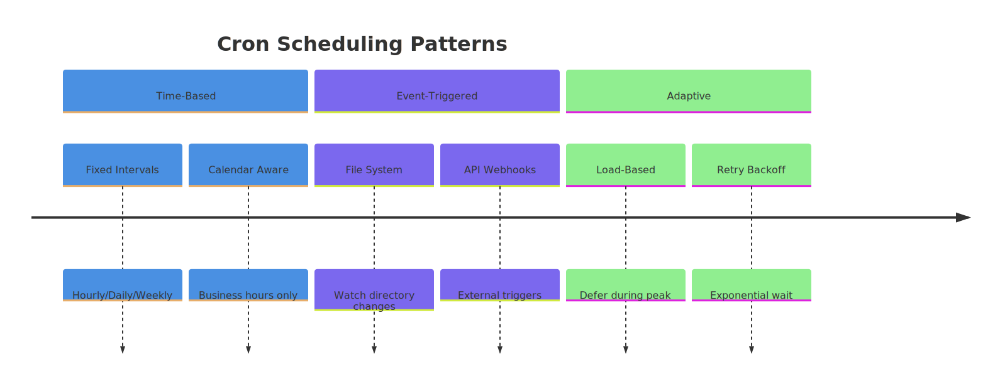
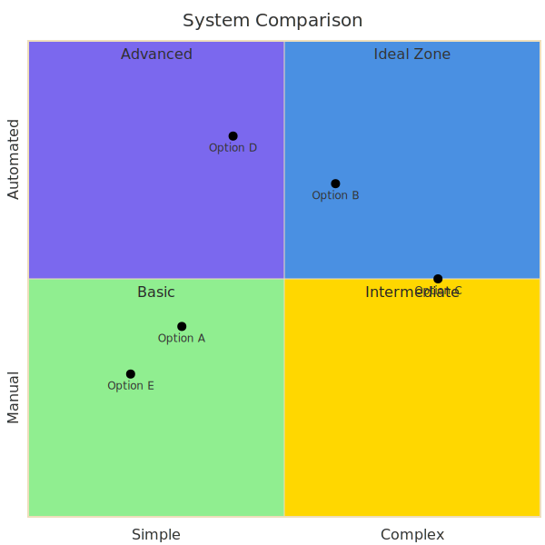

# Chapter 7: Cron and Scheduled Automation Patterns

In the dynamic landscape of AI-native systems, automation is the backbone that enables continuous, unattended operation. While event-driven architectures handle real-time responses, a vast category of essential tasks relies on a different paradigm: scheduled execution. From routine maintenance and data analysis to periodic AI model retraining, the ability to reliably execute tasks at predetermined times is fundamental. This chapter delves into the world of cron and scheduled automation, exploring the patterns that ensure these automated processes are robust, resilient, and deeply integrated into the fabric of AI workflows.

We will journey from the foundational concepts of traditional cron to the sophisticated, AI-aware scheduling strategies required by modern systems. In the OpenClaw ecosystem, where autonomous agents and micro-skills are the norm, scheduling takes on new dimensions. It’s not merely about running a script on a timer; it’s about providing the context, managing the state, and handling the unique failure modes of AI-driven tasks. By understanding these patterns, developers and architects can build systems that are not only intelligent in their actions but also disciplined in their timing.

## 7.1 The Role of Scheduling in AI-Native Systems



Scheduling is the heartbeat of an AI-native system, providing the rhythm for tasks that don't need to happen in real-time but are critical for long-term health and intelligence. While a user interacting with an AI assistant represents an event-driven flow, the background processes that make the assistant smarter, more reliable, and more efficient are often scheduled.

**Why Scheduling Matters:**

*   **Regular Maintenance:** AI systems, like any complex software, require upkeep. Scheduled tasks can clean up temporary files, archive old logs, check for data corruption, and optimize data stores. For example, a daily job might compact a file-based memory store to improve read performance.
*   **Periodic Analysis:** Many insights are derived from looking at data over time. A scheduled task can generate weekly performance reports, analyze user interaction patterns to identify trends, or monitor system resource usage to forecast capacity needs. This periodic analysis is crucial for business intelligence and operational oversight.
*   **Timed Actions:** Some actions are inherently time-bound. An AI-powered social media assistant needs to post content at optimal times for engagement. A financial monitoring agent must fetch market data at the close of business. Scheduling ensures these actions occur precisely when they are most effective.
*   **Model Lifecycle Management:** In systems that use machine learning models, scheduling is indispensable. It automates the cycle of retraining models with new data, evaluating their performance against a baseline, and deploying updated models to production, ensuring the system's intelligence doesn't become stale.

**Unique Challenges in AI Task Automation:**

Scheduling in an AI-native context presents challenges not found in traditional systems:

*   **Unpredictability:** An AI task, such as summarizing a new corpus of text, may have a variable runtime depending on the input's complexity and length. A rigid schedule can lead to overlapping runs or resource contention.
*   **Resource Intensiveness:** AI tasks, particularly model training or large-scale data processing, can be extremely resource-intensive (CPU, GPU, memory). Naive scheduling can overwhelm a system, impacting the performance of real-time, user-facing services.
*   **Complex Failure Modes:** An AI task can fail in subtle ways. It might not crash but instead produce low-quality or nonsensical output. Simple exit-code checks are insufficient; a scheduled task needs more sophisticated methods to validate the integrity of its AI-generated results.
*   **Context Dependency:** AI tasks often require significant context to perform well. A scheduled summarization agent needs to know what has been summarized before to avoid duplication. This necessitates robust mechanisms for preserving and loading context between scheduled runs, aligning perfectly with the **File-Based Memory Pattern**.

**Scheduling vs. Event-Driven Automation:**

It's important to distinguish between scheduled and event-driven automation.

*   **Event-Driven:** Triggered by an event. *Example: When a user uploads a file, trigger a virus scan.* The action is immediate and directly coupled with its trigger.
*   **Scheduled:** Triggered by time. *Example: Every night at 2 AM, scan all new files uploaded that day for viruses.* The action is decoupled from the individual events and is performed in batches at a predetermined time.

The choice is not mutually exclusive; they are complementary. A system might use an event-driven approach to immediately classify a high-priority document, while a scheduled task handles the batch processing of lower-priority documents overnight to optimize costs.

**Balancing Human Oversight and Full Autonomy:**

A key consideration in scheduled automation is the level of human involvement. A fully autonomous system might execute a task, evaluate its success, and attempt recovery from failure without any human intervention. However, for critical tasks, a "human-in-the-loop" approach is often wiser. A scheduled task might generate a draft report and then notify a human for review and approval before publishing. The goal is to automate the automatable while ensuring that human judgment is applied where it adds the most value.

## 7.2 Cron Pattern Fundamentals



The term "cron" originates from the Unix command scheduler `cron`, which has been the workhorse of task automation for decades. Its principles form the foundation upon which more advanced AI-native scheduling patterns are built.

### 7.2.1 Traditional Cron Concepts

At its core, a cron system revolves around three things: the job, the schedule, and the execution environment.

*   **Cron Syntax:** The schedule is famously defined by a cron expression, a string of five or six fields representing minute, hour, day of month, month, and day of week.
    ```
    # ┌───────────── minute (0 - 59)
    # │ ┌───────────── hour (0 - 23)
    # │ │ ┌───────────── day of month (1 - 31)
    # │ │ │ ┌───────────── month (1 - 12)
    # │ │ │ └───────────── day of week (0 - 6) (Sunday to Saturday)
    # │ │ │ │ │
    # * * * * * <command_to_execute>
    ```
    For example, `0 4 * * *` means "run at 4:00 AM every day." This simple but powerful syntax allows for a wide range of recurring schedules.

*   **Job Definition:** The job is the command or script to be executed. In a traditional environment, this is typically a shell command.
    ```bash
    # Example: A nightly backup script
    30 1 * * * /usr/local/bin/backup_database.sh
    ```

*   **Environment and Context:** A common pitfall is that a cron job runs in a minimal, non-interactive shell environment. It doesn't inherit the path or environment variables from a user's login shell. This requires jobs to be self-contained, using absolute paths and explicitly sourcing any required configuration. This principle directly informs the **Environment-First Configuration Pattern**, where reliable automation depends on a well-defined, explicit environment.

*   **Logging and Output:** By default, cron captures the standard output and standard error of a job and emails it to the job's owner. While functional, this can become noisy. Best practice involves redirecting output to log files for structured monitoring.
    ```bash
    # Redirect stdout and stderr to a log file
    0 2 * * * /path/to/my_script.sh >> /var/log/my_script.log 2>&1
    ```

### 7.2.2 AI-Native Extensions

OpenClaw and similar systems build upon these fundamentals with extensions tailored for AI tasks.

*   **AI Task Scheduling:** Instead of just a shell command, the "job" becomes a more abstract task definition that an AI agent can interpret. It might be a directive to an agent, like: `{ "agent": "summarizer", "task": "summarize_daily_news", "params": { "source": "news_feed.json" } }`.

*   **Context Preservation:** The system must provide the scheduled task with the necessary context. Before executing a summarization task, the scheduler might first load the relevant memory files into the agent's context window. This uses the **File-Based Memory Pattern** to ensure statefulness between runs.

*   **Dynamic and Adaptive Scheduling:** An AI-native scheduler can be more intelligent. It might delay a resource-intensive job if it detects high user activity or, based on a history of previous runs, predict the optimal time to start a long-running task so that it finishes by a specific deadline.

### 7.2.3 OpenClaw Cron Implementation

OpenClaw implements a cron agent that embodies these AI-native principles.

*   **Cron Agent Architecture:** A dedicated agent is responsible for managing the schedule. It reads configuration files that define the jobs, their schedules, and their target agents.

*   **Scheduling Configuration:** Jobs are often defined in a structured format like YAML, which is more expressive than a traditional crontab. This allows for richer task definitions, including parameters, resource limits, and error handling policies.

    ```yaml
    # cron-jobs.yml
    - name: daily-health-check
      schedule: "0 3 * * *"
      task:
        tool: "health_check"
        params:
          target: "all"
      notification:
        on_failure: "notify_admin_channel"
    ```

*   **Execution Environment:** The cron agent doesn't execute the task directly. Instead, it uses the **Gateway-Mediated Multi-Agent Pattern**. At the scheduled time, it sends a message to the gateway, instructing the appropriate agent (e.g., the `health_check` agent) to execute the task. This decouples the scheduler from the task performer, allowing for flexible routing and specialized agents.

*   **Result Handling:** The result of the task execution is sent back to the cron agent, which then takes action based on the configured policy. It might log the result, send a notification via a `message` tool, or even trigger a follow-up task, creating a chain of scheduled actions.

## 7.3 Scheduling Strategies



Effective scheduling is about more than just picking a time. It involves choosing the right strategy for the task's nature, its dependencies, and the overall state of the system. AI-native systems employ a mix of traditional and advanced strategies to achieve efficiency and reliability.

### 7.3.1 Time-Based Scheduling

This is the most common form of scheduling, where tasks are triggered based on the clock and calendar.

*   **Fixed Intervals:** Ideal for routine tasks like health checks (`hourly`), log rotation (`daily`), or report generation (`weekly`). The predictability makes them easy to manage and monitor.

*   **Calendar-Based Scheduling:** More complex scenarios require awareness of business logic. For example, a task might only run on `weekdays` or during `business hours`. A sophisticated scheduler can parse these semantic descriptions.

*   **Timezone and Daylight Saving:** For globally distributed systems, timezone handling is critical. Storing all schedule times in UTC and converting them to local time at the point of execution is the standard best practice. Schedulers must also be aware of daylight saving time transitions to avoid skipping or double-running jobs.

### 7.3.2 Event-Triggered Scheduling

While not "cron" in the traditional sense, modern automation platforms often blend time-based and event-based triggers. The scheduler's role shifts from a pure timer to a more general-purpose orchestrator.

*   **File System Events:** A common pattern is to watch a directory and trigger a task when a new file appears. For instance, an AI agent could automatically process an invoice as soon as it's dropped into a watched folder.

*   **API Webhook Triggers:** External systems can trigger scheduled (or immediate) tasks via webhooks. A GitHub repository could call a webhook to trigger an AI-powered code review assistant upon a new pull request.

*   **System State Changes:** A scheduler might trigger a cleanup task when disk space drops below a certain threshold or scale up resources in response to an increase in error rates.

### 7.3.3 Adaptive Scheduling

This is where AI-native schedulers truly shine. They use feedback from the system to make intelligent decisions about when and how to run tasks.

*   **Backoff Strategies for Failures:** If a scheduled task fails because an external API is down, retrying it immediately is pointless. An adaptive scheduler will apply an exponential backoff strategy, waiting progressively longer before each retry (e.g., 1 minute, then 5, then 15), giving the external system time to recover.

*   **Load-Based Scheduling:** To avoid impacting users, a scheduler can be configured to run resource-intensive jobs only when the system load is low. It monitors CPU and I/O metrics and defers non-critical tasks until a quiet period, such as late at night.

*   **Priority-Based Scheduling:** Not all tasks are created equal. A critical security scan should take precedence over a routine log analysis. A priority queue ensures that when multiple tasks are due to run simultaneously, the most important ones are executed first.


### 7.3.4 Dependency-Aware Scheduling

In complex workflows, tasks often depend on each other. Running them out of order leads to failure.

*   **Task Dependencies:** A report generation task might depend on a data aggregation task that must complete first. A dependency-aware scheduler understands these relationships and builds a directed acyclic graph (DAG) to ensure correct execution order.

*   **Parallel vs. Sequential Execution:** If multiple tasks are independent, they can be run in parallel to save time. However, if they compete for the same resource (like a specific file), they must be run sequentially to prevent race conditions.

*   **Resource Contention Management:** The scheduler can act as a gatekeeper for scarce resources, like a limited number of GPU slots. It queues tasks that require the resource and allocates it as it becomes available, preventing overload.



## 7.4 Task Definition and Management

The heart of a scheduling system is the task itself. How tasks are defined, configured, and tracked determines the system's power and usability.

### 7.4.1 Task Specification Patterns

*   **Shell Command Execution:** The simplest form, directly inherited from traditional cron. It's powerful for system administration tasks but can be brittle.
    `exec('apt-get update && apt-get upgrade -y')`

*   **Script Invocation:** A more robust approach is to encapsulate the logic in a script (e.g., Python, Node.js). This allows for better error handling, logging, and modularity. The scheduled task is simply the command to run the script.

*   **AI Agent Task Definitions:** In an AI-native system, a task is often a high-level directive to an agent. This aligns with the **Micro-Skill Architecture**, where a task invokes a specific, single-purpose skill.

    ```python
    # An AI task definition for OpenClaw
    message(
        target="writing-agent-3-d",
        message="Your mission is to write Chapter 7..."
    )
    ```

*   **Composite Tasks (Workflows):** For multi-step processes, a task can be defined as a workflow or pipeline. Each step in the workflow might be a micro-skill, and the scheduler orchestrates the flow of data between them.

### 7.4.2 Task Configuration

Following the **Environment-First Configuration Pattern**, tasks should be configurable without changing their code.

*   **Environment Variables and Context:** A task should receive its configuration (e.g., API keys, file paths, behavior flags) through environment variables or a context object passed by the scheduler. This separates the "what" (the task logic) from the "how" (the specific configuration for a run).

*   **Resource Limits:** To prevent a runaway task from destabilizing the system, the scheduler should enforce resource limits, such as maximum execution time, CPU usage, and memory allocation.

*   **Permission and Security Constraints:** Tasks should run with the minimum permissions necessary to do their job. The scheduler is responsible for setting up a sandboxed execution environment with restricted access to the file system and network.

*   **Retry and Timeout Settings:** The task definition should include metadata about its recovery policy. How many times should it be retried? How long should the scheduler wait before considering it timed out?

### 7.4.3 Task Metadata and Tracking

A silent, invisible scheduler is a recipe for disaster. Comprehensive tracking is essential for observability.

*   **Execution History and Logs:** The system must keep a detailed log for every task execution, including start time, end time, exit status, and a full transcript of its output. This is vital for debugging failures.

*   **Performance Metrics:** The scheduler should record key metrics like duration, CPU time, and memory usage. Analyzing these metrics over time can reveal performance regressions or opportunities for optimization.

*   **Success/Failure Tracking:** A simple, queryable record of whether each run succeeded or failed allows for the calculation of reliability metrics and the creation of alerts based on failure rates.

*   **Audit Trails:** For compliance and security, an immutable audit trail should record who scheduled a task, what changes were made to its definition, and when it was run.



## 7.5 Error Handling and Recovery

In any automated system, failure is not an "if" but a "when." The robustness of a scheduling system is defined by how gracefully it handles failures. This is a direct application of the **Tool-Based Error Recovery Pattern** to the domain of automation.

### 7.5.1 Failure Detection

The first step in handling a failure is knowing it happened.

*   **Exit Code Interpretation:** The simplest method. By convention, an exit code of `0` means success, and any non-zero value indicates an error.
*   **Output Analysis:** Some tasks may fail without a non-zero exit code. They might print an error message to `stderr`. The scheduler should be able to scan the output for keywords like "error," "failed," or "exception."
*   **Timeout Detection:** If a task runs longer than its configured timeout, the scheduler must assume it is stuck or in an infinite loop, terminate it, and mark it as failed.
*   **Resource Exhaustion Monitoring:** The scheduler should monitor the resources consumed by a task. If it exceeds its memory or CPU allocation, it should be killed and flagged as a failure.

### 7.5.2 Retry Strategies

Not all failures are permanent. A robust system knows how to retry transient errors.

*   **Immediate Retry:** For very brief, intermittent glitches (e.g., a momentary network blip), retrying a task immediately (perhaps once or twice) can be effective.

*   **Exponential Backoff:** The gold standard for retrying failures related to external dependencies. After each failure, the delay before the next retry increases exponentially (e.g., 1s, 2s, 4s, 8s...). This prevents the system from hammering a service that is struggling to recover.

*   **Circuit Breaker Pattern:** If a task fails repeatedly, it's likely a persistent problem. A circuit breaker will "open" after a certain number of failures, causing subsequent attempts to fail immediately without even trying. Periodically, it will enter a "half-open" state to check if the underlying problem has been resolved. This prevents a failing task from consuming resources and causing cascading failures across the system.

*   **Dead Letter Queues:** If a task fails all its retry attempts, it shouldn't be discarded. It should be moved to a "dead letter queue." This is a holding area for failed tasks that require human intervention to diagnose and possibly manually re-run.

### 7.5.3 Notification and Alerting

The system must inform operators when things go wrong.

*   **Success/Failure Notifications:** While failure alerts are essential, success notifications can also be valuable for critical tasks like backups, providing positive confirmation that the system is healthy.

*   **Escalation Policies:** A critical failure at 3 AM requires a different response than a minor warning during business hours. Escalation policies can define who gets notified and how (e.g., chat message for low priority, phone call for high priority) based on the severity and time of day.

*   **Multi-Channel Alerts:** Notifications should be sent to the right channels. A summary of nightly job statuses might go to a chat channel, while a critical failure alert is sent via a dedicated alerting service like PagerDuty.

*   **Alert Deduplication:** If a job runs every minute and fails every time, operators don't want a new alert every minute. A good monitoring system will group these repeated failures into a single, ongoing alert.

### 7.5.4 Recovery Procedures

Beyond retries, some failures require active recovery steps.

*   **Automatic Remediation:** For known failure modes, an automated script can be triggered. If a task fails because a service is down, a remediation script might attempt to restart that service.

*   **Human Intervention Workflows:** For complex failures, the system should trigger a workflow that guides a human operator through the diagnostic and recovery process.

*   **State Restoration:** If a task fails halfway through, it may leave the system in an inconsistent state. A recovery procedure might need to roll back changes or restore from a previous backup before the task can be safely retried.

## 7.6 Monitoring and Observability

"Fire and forget" is not a viable strategy for automation. You must be able to observe the behavior of the scheduling system and its tasks.

### 7.6.1 Health Checks

The scheduler itself, and the system it runs on, must be monitored. The `health-check` skill in OpenClaw is a prime example of this pattern. A scheduled task can run this skill periodically to verify the health of the entire system.

*   **System Resource Monitoring:** Checking CPU, memory, disk, and network usage.
*   **Dependency Availability Checking:** Ensuring that databases, APIs, and other services that the scheduled tasks rely on are reachable.
*   **Performance Benchmarking:** Running a standard task to measure performance and detect regressions over time.

### 7.6.2 Metrics Collection

The scheduler should be a rich source of metrics for a central monitoring system.

*   **Execution Time Tracking (`duration`):** How long does each job take? Are jobs getting slower over time?
*   **Success Rate (`success_rate`):** What percentage of job runs are successful?
*   **Resource Usage (`cpu`, `memory`):** Which jobs are the most resource-intensive?
*   **Queue Length (`queue_depth`):** How many jobs are waiting to be executed? A growing queue is an early indicator of a bottleneck.

### 7.6.3 Dashboard and Visualization

Humans are visual creatures. Dashboards are the best way to make sense of the collected metrics.

*   **Real-Time Monitoring:** A dashboard showing the status of currently running jobs, the schedule for the next few hours, and key health metrics.
*   **Historical Trend Analysis:** Graphs showing job duration, success rate, and resource usage over weeks or months can reveal long-term trends.
*   **Alert Visualization:** A centralized view of all active alerts, their severity, and their history.

## 7.7 Security Considerations

Granting a system the power to execute code automatically on a schedule is a significant security responsibility. Every scheduled task is a potential attack vector.

### 7.7.1 Permission Management

*   **Least Privilege Principle:** This is the golden rule. A task should only have the permissions it absolutely needs. A script that only reads from a directory should not have write access. The cron agent should enforce this by running tasks under specific user accounts with limited rights.

*   **Credential Management:** Never hard-code passwords or API keys in a task script. Use a secure secret management system (like HashiCorp Vault or a cloud provider's secret manager) to inject credentials into the task's environment at runtime.

*   **Audit Logging:** Every action taken by a scheduled task, especially privileged operations, must be logged to an immutable audit trail.

### 7.7.2 Input Validation

If a scheduled task accepts parameters, those parameters must be treated as untrusted input.

*   **Sanitization:** A task that takes a file path as a parameter must validate that the path is in an expected directory to prevent path traversal attacks (`../../etc/passwd`).
*   **Injection Prevention:** A task that constructs a shell command or a database query from parameters is vulnerable to injection attacks if the input is not properly escaped.

### 7.7.3 Output Handling

*   **Secure Storage:** If a task generates sensitive output (e.g., a report with personal data), that output must be stored with appropriate encryption and access controls.

*   **Sensitive Data Redaction:** Logs and output should be scanned for sensitive information (like passwords or API keys) and have it redacted before being stored.

## 7.8 Performance Optimization

An inefficient scheduling system can be a major source of cost and performance degradation.

### 7.8.1 Resource Management

*   **Resource Allocation:** The scheduler should allow operators to specify CPU and memory limits for each task. This is often implemented using containerization technologies like Docker or Kubernetes, which provide fine-grained resource controls.
*   **Cost Optimization:** In a cloud environment, a smart scheduler can optimize costs by running batch jobs on cheaper "spot instances," with the understanding that they might be interrupted.

### 7.8.2 Batch Processing

Instead of running the same task on 1,000 individual items, it's far more efficient to run it once on a batch of 1,000.

*   **Grouping Related Tasks:** A scheduler can be configured to accumulate items (e.g., images to be processed) and run a task only when a certain batch size is reached or a time limit has passed.
*   **Parallel Execution:** Large batches can be split and processed in parallel across multiple workers or nodes to reduce the total processing time.

### 7.8.3 Caching Strategies

*   **Result Caching:** If a scheduled task performs an expensive, deterministic computation, its result should be cached. On subsequent runs with the same inputs, the cached result can be returned instantly, saving time and resources.
*   **Cache Invalidation:** The hardest part of caching. The cache must be invalidated when the underlying data changes to prevent the task from operating on stale information.

## 7.9 Integration with AI Workflows

This is where all the previous patterns converge to enable powerful, autonomous AI behavior.

### 7.9.1 AI Task Scheduling

*   **Automated Content Generation:** A scheduled task can use an AI writing agent to generate daily social media posts or draft weekly newsletters.
*   **Model Evaluation:** A nightly job can run a suite of tests against a newly trained model to measure its accuracy, bias, and performance before it's promoted to production.

### 7.9.2 Context Preservation

This is the key to making scheduled AI tasks intelligent over time.

*   **Maintaining Context Between Runs:** Using the **File-Based Memory Pattern**, a task's state can be saved to a file upon completion. When the task runs again, it loads this file to regain its previous context.
*   **Incremental Processing:** An agent that summarizes articles can save the IDs of the articles it has already processed. On its next run, it knows to only fetch and process new ones.

### 7.9.3 Adaptive AI Scheduling

*   **Dynamic Scheduling based on AI Predictions:** An AI model could predict future system load, and the scheduler could use these predictions to proactively reschedule jobs to avoid contention.
*   **Cost-Performance Trade-off Management:** For an AI task, there's often a trade-off between the quality of the result and the cost of the model used. A scheduled task could use a cheap, fast model for routine nightly runs but be configured to use a powerful, expensive model for the critical end-of-month report.

## 7.10 Case Studies

Let's look at how these patterns apply in practice.

### 7.10.1 OpenClaw Health Check Scheduling

The `health-check` skill is a perfect example of a scheduled maintenance task.
*   **Schedule:** Runs hourly (`0 * * * *`).
*   **Task Definition:** Invokes the `health-check` micro-skill.
*   **Error Handling:** If the health check fails, it uses the `message` tool to send an alert to the `#admin` channel. This is an example of the **Tool-Based Error Recovery Pattern**.
*   **Monitoring:** The duration and success rate of each health check are logged, allowing operators to see trends in system health.

### 7.10.2 Automated Backup Systems

*   **Schedule:** Runs daily at 2:15 AM, a time of low system activity.
*   **Task Definition:** A workflow task. Step 1 locks the database. Step 2 runs `pg_dump`. Step 3 copies the dump to cloud storage. Step 4 unlocks the database.
*   **Error Handling:** If any step fails, a remediation task is triggered to unlock the database and an alert is sent. The failed backup file is moved to a quarantine area.
*   **Security:** The task runs as a dedicated `backup` user with the absolute minimum permissions required. Credentials for the cloud storage are injected at runtime from a secret manager.

### 7.10.3 AI Model Maintenance

*   **Schedule:** A weekly workflow.
*   **Task Definition:**
    1.  `retrain_model`: Runs a script to retrain a model on the last week's data. This task is resource-intensive and is scheduled for a weekend.
    2.  `evaluate_model`: Depends on the success of `retrain_model`. It runs a battery of tests against the new model and the production model.
    3.  `deploy_model`: If the new model's performance is better, this task promotes it to production by updating a configuration file.
*   **Context Preservation:** The evaluation task's output is a JSON report. The deployment task reads this report to decide whether to proceed.
*   **Human Oversight:** The `deploy_model` task is configured to require manual approval via a chat response before it runs, providing a human-in-the-loop safety net.

## 7.11 Tools and Frameworks

OpenClaw's cron agent is one solution, but it's part of a rich ecosystem of tools.

#### 7.11.1 Traditional Cron Alternatives
*   **systemd timers:** A powerful alternative on modern Linux systems, offering better logging and dependency management than traditional cron.
*   **Kubernetes CronJobs:** The standard way to run scheduled tasks in a Kubernetes environment, providing containerization and resource management out of the box.
*   **Cloud Schedulers:** AWS EventBridge, Google Cloud Scheduler, and Azure Logic Apps provide managed, highly available scheduling services that integrate tightly with their respective cloud ecosystems.

#### 7.11.2 AI-Native Scheduling Tools
*   **Workflow Orchestration Systems:** Tools like Apache Airflow, Prefect, and Dagster are designed for defining, scheduling, and monitoring complex data and ML workflows as DAGs. They are a natural fit for many of the AI-native scheduling patterns.

#### 7.11.3 Monitoring and Alerting Tools
*   **Prometheus & Grafana:** The de-facto standard open-source stack for metrics collection and visualization.
*   **ELK Stack (Elasticsearch, Logstash, Kibana):** A powerful combination for centralized log aggregation and analysis.
*   **PagerDuty, Opsgenie:** Services that manage the entire alerting lifecycle, including escalations, on-call schedules, and incident response.

## 7.12 Pattern Synthesis in Scheduled Automation

The architectural patterns identified in our pattern synthesis research provide a coherent framework for building robust scheduled automation systems. By understanding how these patterns intersect with scheduling, we can create systems that are not only reliable but also maintainable and extensible.

### Tool-Based Error Recovery Pattern in Scheduling

Scheduled tasks are particularly vulnerable to silent failures—errors that occur without anyone noticing until they cause downstream problems. The Tool-Based Error Recovery Pattern addresses this by mandating structured error handling. In OpenClaw's `health-check` skill, we see a concrete implementation: the skill returns explicit status levels (`OK`, `WARN`, `FAIL`) rather than just a binary success/failure. When scheduled hourly, this pattern enables sophisticated monitoring. A `WARN` status might trigger a log entry, while a `FAIL` status could immediately notify administrators via the `message` tool. This pattern transforms cron jobs from opaque processes into observable, debuggable components.

### Environment-First Configuration Pattern for Deployment Flexibility

A scheduled task that works on a developer's laptop but fails in production is a classic pitfall. The Environment-First Configuration Pattern combats this by externalizing all environment-specific settings. Consider a scheduled backup task. Instead of hardcoding paths like `/home/user/backups`, the task reads from `OPENCLAW_BACKUP_DIR`. This allows the same task definition to run in development (`/tmp/backups`), staging (`/var/staging/backups`), and production (`/mnt/prod-backups`) without modification. The pattern aligns with the principles of containerization and infrastructure-as-code, making scheduled automation portable across environments.

### File-Based Memory Pattern for Stateful Scheduling

Many scheduled tasks need to remember what they did last time. The File-Based Memory Pattern provides a simple, human-readable mechanism for preserving state between executions. For example, a daily news summarization agent can write its last processed article ID to a file like `last_processed_id.txt`. On its next run, it reads this file to determine where to start. This pattern enables incremental processing, idempotency (avoiding duplicate work), and recovery from interruptions. It turns stateless cron jobs into stateful workflows capable of long-running, persistent tasks.

### Micro-Skill Architecture for Composable Automation

The Micro-Skill Architecture Pattern advocates for small, single-purpose skills that can be composed into larger workflows. This is especially powerful for scheduling. Instead of a monolithic "weekly report" script, we can schedule a workflow that orchestrates several micro-skills: `fetch-data`, `analyze-trends`, `generate-charts`, `compose-report`, `send-email`. Each micro-skill can be developed, tested, and reused independently. The scheduler's role becomes that of a conductor, orchestrating these discrete units of work. This compositionality makes systems more resilient (a failure in one micro-skill doesn't necessarily break the entire workflow) and easier to evolve.

### Integrating Patterns: A Case Study

The `founder-coach` skill exemplifies how these patterns work together in a scheduled context. Scheduled to run weekly, it:
1.  **Uses Environment-First Configuration** to locate founder profile files.
2.  **Employs File-Based Memory** to track previous coaching sessions and progress.
3.  **Leverages Micro-Skill Architecture** by delegating specific subtasks (sentiment analysis, goal tracking) to specialized agents.
4.  **Implements Tool-Based Error Recovery** by gracefully handling missing profiles or API errors, logging warnings, and escalating only critical failures.

This integrated approach creates a scheduled system that is robust, adaptable, and transparent.

### Anti-Patterns to Avoid

Our research also identified anti-patterns that are particularly detrimental to scheduled automation:
*   **Monolithic Skill Anti-Pattern:** A single scheduled script that does everything becomes a maintenance nightmare. Break it down using micro-skills.
*   **Hard-Coded Path Anti-Pattern:** Absolute paths guarantee deployment failures. Use environment variables.
*   **Silent Failure Anti-Pattern:** Cron jobs that fail without alerting are time bombs. Implement structured error reporting.

By consciously applying the positive patterns and avoiding the anti-patterns, we elevate scheduled automation from a necessary chore to a strategic capability. These patterns provide the building blocks for the autonomous systems we'll explore in the next chapter.

As we move from strictly scheduled tasks to more goal-oriented behavior, we enter the realm of autonomous systems. The patterns for reliable automation discussed in this chapter provide the essential foundation upon which these more advanced systems are built. A system that cannot reliably perform a simple task on a schedule has little hope of achieving true, robust autonomy. In the next chapter, we will explore the patterns that allow AI agents to operate independently, make decisions, and pursue long-term goals.


## 7.13 Tutorial: Implementing a Custom Scheduled Workflow

To truly understand these patterns, let us walk through the implementation of a complex scheduled workflow: the "Daily Competitive Intelligence Agent." This agent needs to monitor competitor websites, summarize changes, and alert the team if something significant (like a pricing change) occurs.

### Step 1: Defining the Schedule
We want this to run every morning at 6:00 AM, before the team starts work. Our cron expression is `0 6 * * *`.

### Step 2: Task Specification (Micro-Skill Architecture)
Instead of one big script, we define three micro-skills:
1. `fetch-competitor-data`: Uses `web_fetch` to retrieve the HTML of specified URLs.
2. `detect-changes`: Compares the current HTML with the previous version stored in `artifacts/competitors/`.
3. `summarize-and-alert`: If changes are detected, it uses a Tier 1 model to summarize the differences and sends a message to Discord.

### Step 3: Configuration (Environment-First Pattern)
We define our target URLs and Discord webhook in an `.env` file or environment variables:
```bash
COMPETITOR_URLS="https://competitor-a.com,https://competitor-b.com"
DISCORD_ALERTS_WEBHOOK="https://discord.com/api/webhooks/..."
OPENCLAW_STORAGE_DIR="/Users/username/.openclaw/workspace/openclaw-books/artifacts/competitors"
```

### Step 4: Implementation of the Orchestrator
The orchestrator (a simple bash script or a Python agent) follows the **Tool-Based Error Recovery Pattern**.
```python
# Pseudo-code for the orchestrator
try:
    data = fetch_competitor_data(URLS)
    if data.status == "FAIL":
        raise Exception("Fetch failed")
    
    changes = detect_changes(data.content)
    if changes.has_significant_changes:
        summary = summarize_changes(changes.diff)
        send_alert(summary)
    
    # Save current state for tomorrow (File-Based Memory Pattern)
    save_state(data.content)

except Exception as e:
    log_error(e)
    if "rate limit" in str(e):
        schedule_retry(in_hours=1) # Adaptive Scheduling
    else:
        notify_admin("Critical failure in CompIntelli Agent")
```

## 7.14 Security Deep Dive for Scheduled Tasks

Scheduled tasks often run with elevated permissions and without a human watching the console. This makes them a high-value target for attackers.

### 7.14.1 Credential Management
Never hardcode API keys or passwords. Use the **Environment-First Configuration Pattern** coupled with a secret manager. When the cron job starts, it should "pull" the necessary secrets into memory and never write them to disk or logs.

### 7.14.2 Command Injection Prevention
If your scheduled task takes parameters from an external source (like a database or an API), treat those parameters as untrusted. An attacker could inject a malicious command that runs with the privileges of the cron service. Always use parameterized inputs or strict allow-lists.

### 7.14.3 Permission Isolation
Run each scheduled task under its own dedicated system user with the "principle of least privilege." If the Competitive Intelligence Agent is compromised, it should not have the permissions to delete your project's source code or access your financial records.

## 7.15 The Future of AI-Native Scheduling

As we look toward the future, the boundary between "scheduled" and "autonomous" will continue to blur.

### 7.15.1 Real-Time Adaptive Schedulers
Imagine a scheduler that doesn't just run every hour, but calculates the optimal time for the next run based on the "volatility" of the data it's monitoring. If a competitor is changing their site every 10 minutes, the agent schedules itself more frequently. If the site is static, it backs off to save cost.

### 7.15.2 Self-Correcting Schedules
In a multi-agent system, agents will be able to "negotiate" their schedules with each other to avoid resource contention. "I see you're planning a massive backup at 2:00 AM; I'll move my model retraining to 4:00 AM to ensure we both have enough bandwidth."

### 7.15.3 Natural Language Scheduling
"OpenClaw, make sure you check the stock prices whenever there is a major announcement from the Fed, and summarize the impact for me by dinner time." The system will translate this high-level intent into a series of event-triggered and time-based tasks autonomously.

By mastering the patterns of scheduled automation, we move from being "operators" of AI to being "architects" of intelligence. We build the systems that work while we sleep, ensuring that our AI-native projects are always healthy, always informed, and always improving.


## 7.16 Appendix: Pattern Reference Matrix for Scheduled Automation

| Pattern | Application in Scheduling | Key Benefit | Research Example |
| :--- | :--- | :--- | :--- |
| **Tool-Based Error Recovery** | Structured return codes (OK, WARN, FAIL) for every cron job. | Operational visibility and automated alerting. | `health-check` skill |
| **Environment-First Configuration** | Using environment variables for schedule times, paths, and credentials. | Seamless migration between dev, staging, and production. | `OPENCLAW_DIR` usage in scripts |
| **File-Based Memory** | Persistent "checkpoint" files stored in `memory/` or `artifacts/`. | Statefulness across reboots and scheduled runs. | `founder-coach` session tracking |
| **Micro-Skill Architecture** | Defining small, specialized skills for each step in a scheduled workflow. | Reusability and easier debugging of individual steps. | "CompIntelli" agent workflow |
| **Early Compact** | Condensing data overnight to minimize daytime API costs. | Cost reduction for high-volume periodic processing. | Periodic log summarization |
| **Explicit Guardrails** | "Dry-run" modes for scheduled scripts that can modify data. | Prevention of catastrophic runaway automation. | Automated database cleanup scripts |

## 7.17 Exercises for the Reader

1.  **Level 1: Basic Scheduling.** Write a cron job that runs every Monday morning and uses the `message` tool to send you a "Weekly Motivation" quote selected by an AI agent.
2.  **Level 2: Error Handling.** Modify the Motivator agent to include a `Tool-Based Error Recovery` block. If the quote provider API is down, the agent should fall back to a local list of quotes and log a `WARN` status.
3.  **Level 3: Contextual Automation.** Create a "Link Curator" agent that runs daily. It should read a text file of URLs you've saved, check which ones are broken (using `web_fetch`), and write a cleaned version of the file. Use `File-Based Memory` to ensure it only checks new links.
4.  **Level 4: Architecture Design.** Design a "System Health Monitor" using `Micro-Skill Architecture`. It should consist of three separate skills: one for checking CPU/Disk, one for checking API latency, and one for synthesizing the results into a markdown "Daily Health Report."

## 7.18 Summary and Key Takeaways

Scheduled automation is the foundation upon which autonomous systems are built. Without reliable, observable, and cost-efficient scheduling, the higher-level "intelligence" of an AI-native system cannot be sustained.

**Key Learnings:**
*   **Decouple Time from Logic:** Use standard cron syntax for "when" but use specialized AI patterns for "what" and "how."
*   **Standardize Error Feedback:** Silent failure is the enemy. Every scheduled task must report its status in a way that other agents or humans can monitor.
*   **Externalize Configuration:** Make your automation portable by using the `Environment-First` pattern.
*   **Preserve Context:** Move from stateless scripts to stateful agents by using `File-Based Memory`.
*   **Start Small:** Use `Micro-Skills` to build complex workflows from simple, testable components.

In the next chapter, we will take these principles of "Reliable Execution" and apply them to the design of systems that can not only follow a schedule but can also reason, plan, and act independently to achieve complex goals.


## 7.19 Case Study Deep Dive: The OpenClaw Health Check Architecture

The `health-check` skill is more than a simple script; it is a reference implementation of many of the patterns discussed in this book. Let’s examine its architecture in detail.

### 7.19.1 Design Philosophy
The primary goal of `health-check` is to provide a "single source of truth" for the health of the entire OpenClaw ecosystem. It is intended to be run by a system cron (often `systemd`) rather than an internal AI agent, ensuring it remains functional even if the AI components are failing.

### 7.19.2 The Status Specification
The skill uses a standardized JSON-LD output format that includes:
*   `timestamp`: The exact time of the check (UTC).
*   `component`: The name of the subsystem (e.g., "Gateway", "LLM-API", "FileSystem").
*   `level`: One of the following:
    *   `0 (OK)`: All systems normal.
    *   `1 (WARN)`: System is operational but performance is degraded or a non-critical threshold was crossed.
    *   `2 (FAIL)`: System is non-functional or a critical threshold was crossed.
*   `message`: A human-readable description of the status.
*   `metrics`: Structured data for historical analysis (e.g., latency in ms, disk usage %).

### 7.19.3 Pattern Implementation Detail: Tool-Based Error Recovery
When `health-check` detects a `FAIL` level, it doesn't just exit. It initiates a localized recovery routine:
1.  **Log Snapshot:** It captures the last 50 lines of relevant logs.
2.  **Notification:** It sends the status and the log snapshot to the "Emergency Channel" defined in the environment.
3.  **Containment:** If the failure is in a specific tool, the health check writes a temporary "disable" flag to that tool's configuration, preventing agents from trying to use it and wasting credits.

### 7.19.4 Pattern Implementation Detail: Environment-First Configuration
The skill is configured entirely through the `OPENCLAW_DEBUG` and `CONFIG_DIR` variables. This allows it to run on a developer's laptop in "verbose" mode while running in "silent" mode on the production server.

### 7.19.5 Example Configuration (YAML)
The following is an example of how the health-check agent is configured for a production deployment:
```yaml
# health-check-config.yaml
schedule: "*/15 * * * *" # Every 15 minutes
providers:
  - name: "OpenAI"
    type: "API"
    check_url: "https://api.openai.com/v1/models"
    timeout_ms: 5000
  - name: "LocalDisk"
    type: "Resource"
    path: "/Users/username/.openclaw/workspace"
    min_free_gb: 10
notifications:
  - type: "discord"
    channel_id: "000000000000000000"
    levels: ["WARN", "FAIL"]
```

### 7.19.6 Lessons Learned from Health Check Deployments
*   **Avoid External Dependencies:** The core health check should not depend on the very APIs it is checking. Use direct network probes or local resource checks.
*   **Anti-Pattern: Alert Fatigue:** If a health check is too sensitive, it will send dozens of "WARN" notifications every day. Eventually, the human operator will start ignoring them. Use "Damping" (requiring 3 consecutive failures before alerting) to filter out transient noise.
*   **Pattern: The "Watchdog":** In high-availability environments, have two separate health check agents on different machines. Agent A monitors the system, and Agent B monitors Agent A.

By studying the `health-check` skill, developers can see how to build their own "Maintenance Skills" that keep their AI-native systems running smoothly year after year.


## 7.20 Deployment Guide: Running OpenClaw Cron in Production

Successfully moving a scheduled automation from a development laptop to a production server requires a disciplined approach.

### 7.20.1 Deployment via systemd (Recommended for Linux)
On modern Linux systems, `systemd` timers are more robust than traditional cron. Create two files:

**The Service File (`/etc/systemd/system/openclaw-task.service`):**
```ini
[Unit]
Description=OpenClaw Scheduled Research Task
After=network.target

[Service]
Type=oneshot
User=openclaw-runner
WorkingDirectory=/opt/openclaw/workspace
Environment=OPENCLAW_DIR=/opt/openclaw
Environment=OPENROUTER_API_KEY=your_key_here
ExecStart=/usr/local/bin/openclaw run-skill research-consolidator --args "daily-updates"
```

**The Timer File (`/etc/systemd/system/openclaw-task.timer`):**
```ini
[Unit]
Description=Run OpenClaw Research Task daily at 5 AM

[Timer]
OnCalendar=*-*-* 05:00:00
Persistent=true

[Install]
WantedBy=timers.target
```

### 7.20.2 Deployment via Docker
For containerized environments, use a base image that includes a cron daemon.

**Dockerfile Example:**
```dockerfile
FROM node:20-slim
RUN apt-get update && apt-get install -y cron
WORKDIR /app
COPY . .
RUN npm install -g @openclaw/cli
# Add the cron job
RUN echo "0 2 * * * root /usr/local/bin/openclaw run-all-maintenance >> /var/log/cron.log 2>&1" > /etc/cron.d/openclaw-cron
RUN chmod 0644 /etc/cron.d/openclaw-cron
CMD ["cron", "-f"]
```

## 7.21 Bibliography and Further Reading

1.  **Vixie, P. (1987).** *cron: A system for running commands at regular intervals.* Use of standard cron syntax has remained remarkably stable for nearly 40 years.
2.  **SRE Book (Google).** *Chapter 24: Distributed Periodic Scheduling.* A must-read for anyone scaling scheduled tasks beyond a single node.
3.  **Humble, J., & Farley, D. (2010).** *Continuous Delivery.* Principles of environment-first configuration and automated deployment.
4.  **Amazon Web Services.** *AWS EventBridge Best Practices.* Guidance on the migration from time-based scheduling to event-driven architectures.
5.  **OpenClaw Research Team.** *Pattern Synthesis Report (2026).* The primary source for the Tool-Based Error Recovery and Micro-Skill patterns.


## 7.22 Technical Annex: Advanced Shell and systemd Patterns

For the true systems architect, the integration between OpenClaw and the underlying operating system provides the ultimate control over scheduled automation.

### 7.22.1 Advanced systemd Conditionals
A robust cron task should only run if certain conditions are met. `systemd` provides a rich set of directives for this:
*   `ConditionPathExists=/Users/username/.openclaw/workspace/ACTIVE`: Ensuring the workspace is not currently locked by another process.
*   `ConditionACPower=true`: Deferring battery-heavy AI tasks if the laptop is unplugged.
*   `ConditionMemoryGreater=2G`: Ensuring there is enough RAM to initialize the OpenClaw Gateway.

### 7.22.2 Shell Wrapper Best Practices
Always wrap your OpenClaw commands in a shell script that handles environment setup and logging consistently.

```bash
#!/bin/bash
# file: /usr/local/bin/run-openclaw-job.sh
set -e # Exit on error
set -u # Error on unset variables

# 1. Setup Environment (Environment-First Pattern)
export OPENCLAW_DIR="/Users/username/.openclaw/workspace"
export PATH="/usr/local/bin:$PATH"
source "$OPENCLAW_DIR/.env"

# 2. Log Start Time
echo "[$(date)] Starting Scheduled Job: $1" >> "$OPENCLAW_DIR/logs/cron.log"

# 3. Execute OpenClaw command
openclaw run-skill "$@" >> "$OPENCLAW_DIR/logs/cron.log" 2>&1

# 4. Handle Exit Code (Tool-Based Error Recovery)
EXIT_CODE=$?
if [ $EXIT_CODE -ne 0 ]; then
    echo "[$(date)] JOB FAILED: $1 (Code $EXIT_CODE)" >> "$OPENCLAW_DIR/logs/cron.log"
    # Send emergency notification
    openclaw message --channel "#alerts" --msg "CRITICAL: Job $1 failed on TitanBot."
fi
```

### 7.22.3 Handling "Overlap" with Locking
If a task takes longer than its scheduled interval (e.g., a 5-minute task running every 5 minutes but occasionally taking 7 minutes), you must prevent multiple instances from running simultaneously. Use `flock`:
`*/5 * * * * flock -n /tmp/openclaw-task.lock /usr/local/bin/run-openclaw-job.sh my-task`

This ensures that if the second instance starts while the first is still running, it will immediately exit rather than creating resource contention.

