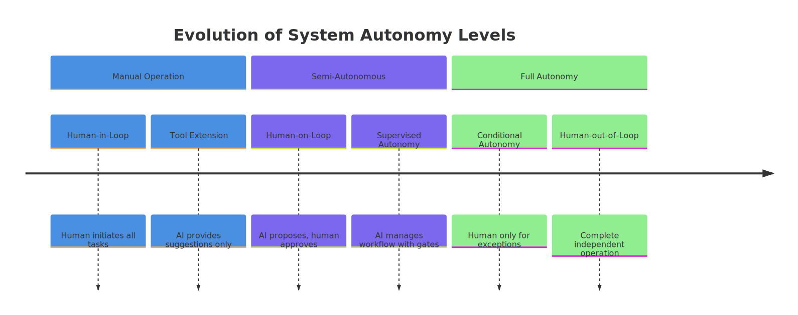

# Chapter 8: Autonomous Systems Design

## 8.1 Defining Autonomous AI Systems

In the evolution of software engineering, we have moved from manual operations to scripts, and then to complex automation. However, the emergence of AI-native systems like OpenClaw introduces a new paradigm: the autonomous system. Unlike traditional automation, which follows a predefined set of instructions ( if-this-then-that), an autonomous AI system is goal-oriented, capable of perceiving its environment, reasoning about its state, and taking actions to achieve Its objectives with minimal human intervention.

### 8.1.1 The Spectrum of Autonomy

Autonomy is not a binary state but a spectrum. At one end, we have tools that extend human capabilities (e.g., a simple code formatter). At the other end, we have fully autonomous agents that can manage entire projects, from initial research to deployment and maintenance.

AI-native development focuses on pushing the boundaries of this spectrum. We move from:
1.  **Assisted Operation:** The AI provides suggestions or completes small tasks within a human-driven workflow.
2.  **Semi-Autonomous Operation:** The AI handles routine subtasks independently but requires human approval for critical decisions.
3.  **Autonomous Operation:** The AI manages the entire workflow, including error recovery and self-optimization, within predefined guardrails.

### 8.1.2 Key Characteristics of Autonomous Systems

What distinguishes an autonomous AI system from a complex script?

*   **Self-Monitoring:** The system continuously evaluates its own performance and health. It doesn't just execute; it observes the results of its actions.
*   **Self-Healing:** When a failure occurs, the system doesn't just stop. It analyzes the error, selects a recovery strategy (e.g., retrying with a different parameter or falling back to a safer model), and attempts to restore functionality. This is the **Tool-Based Error Recovery Pattern** in action.
*   **Goal-Oriented Behavior:** Instead of being told *how* to do a task, the system is given the *objective*. It is responsible for planning the necessary steps, allocating resources, and adapting the plan as conditions change.
*   **Persistent State (Memory):** Autonomous systems must remember past actions and outcomes to learn and avoid repeating mistakes. The **File-Based Memory Pattern** provides the foundation for this persistence, allowing agents to maintain context over long durations.

### 8.1.3 The Challenges of AI Autonomy

Building autonomous systems is inherently more difficult than traditional software.

*   **Uncertainty:** AI models are probabilistic. The same prompt might yield different results. An autonomous system must be designed to handle this inherent variability.
*   **Edge Case Complexity:** The "long tail" of possible scenarios is much larger in autonomous systems. Coding for every eventuality is impossible; the system must be able to reason its way through novel situations.
*   **Safety and Alignment:** As systems become more independent, the risk of "runaway" behavior or unintended consequences increases. Robust guardrails, as defined in the **Soul.md** and **ENVIRONMENT** files, are critical.
*   **Observability:** Understanding *why* an autonomous system took a particular action can be challenging. Comprehensive logging and audit trails are not just for debugging but for building trust.

## 8.2 Levels of Autonomy

To design and manage autonomous systems effectively, we need a clear framework for categorizing the level of human involvement. We can define four primary levels, often referred to as "Human-In/On/Out-of-the-Loop."

### 8.2.1 Manual Operation (Human-in-the-Loop)

In this level, the human is the primary actor. The AI acts as a sophisticated tool or research assistant.
*   **Workflow:** The human initiates every task, provides all context, and reviews every output immediately.
*   **Autonomy:** Near zero. The AI has no agency.
*   **Use Cases:** Exploratory research, creative writing, complex architectural design where every detail requires human judgment.
*   **Example:** A developer using an AI to generate a single function or explain a complex piece of code.

### 8.2.2 Supervised Autonomy (Human-on-the-Loop)

Here, the AI takes the lead on execution, but the human remains a critical supervisor, approving major decisions or intervening when the system reaches a boundary of its capability.
*   **Workflow:** The human sets the goal and provides the initial constraints. The AI proposes a plan and executes the steps. The human monitors the progress and provides feedback or "gates" at critical junctions.
*   **Autonomy:** Moderate. The AI manages the "how," but the human controls the "what" and "if."
*   **Use Cases:** Content generation pipelines where a human reviews every post before publication, or automated testing where a human investigates every reported failure.
*   **OpenClaw Pattern:** The **Gateway-Mediated Multi-Agent Pattern** often implements this level by having a human-accessible gateway channel (like Discord) where agents report progress and wait for approval.

### 8.2.3 Conditional Autonomy (Human-at-the-Edge)

At this level, the system operates independently for the vast majority of tasks. Human intervention is only required for exceptional cases or when the system's confidence in its path drops below a certain threshold.
*   **Workflow:** The system is given a high-level goal and a set of safety boundaries. It manages its own planning, execution, and error recovery. It only "calls home" when it encounters an unrecoverable error or an ethical ambiguity.
*   **Autonomy:** High. The system is the primary actor; the human is a safety net.
*   **Use Cases:** Continuous system monitoring and self-healing, automated market trading within strict risk parameters, or background research tasks that run for days.
*   **OpenClaw Pattern:** This relies heavily on the **Tool-Based Error Recovery Pattern**, where the system's first response to failure is internal remediation rather than external notification.

### 8.2.4 Full Autonomy (Human-out-of-the-Loop)

The "holy grail" (and most dangerous) level. The system operates entirely independently within its domain. It makes all decisions, manages all resources, and handles all failures without human intervention.
*   **Workflow:** The human defines the mission once. The system executes indefinitely, optimizing its own behavior and adapting to its environment.
*   **Autonomy:** Complete.
*   **Use Cases:** Theoretically, space exploration probes or deep-sea autonomous vehicles. In the AI-native development context, this might look like a self-improving infrastructure layer that auto-scales, secures, and heals itself without human input.
*   **Caution:** Full autonomy requires absolute trust in the system's alignment and safety mechanisms. For most practical AI systems today, this level is avoided in favor of Supervised or Conditional Autonomy.

## 8.3 Self-Healing Systems

The cornerstone of any autonomous system is its ability to maintain its own health. In an AI-native environment, where components (like API calls or external tools) can fail unpredictably, self-healing is not a luxury but a requirement.

### 8.3.1 The Lifecycle of a Self-Heal

A self-healing process follows a specific cycle, mirroring the human OODA loop (Observe, Orient, Decide, Act).

#### 1. Failure Detection (Observe)
The system must first recognize that something is wrong. This requires comprehensive health monitoring.
*   **Active Probing:** Regularly scheduled "heartbeat" tasks that test critical subsystems. The **health-check** skill in OpenClaw is a prime example, verifying connectivity, API availability, and resource levels.
*   **Passive Monitoring:** Analyzing the results of routine operations. A sudden spike in 401 Unauthorized errors or a series of nonsensical AI responses are red flags.
*   **Semantic Validation:** Going beyond status codes. The system uses AI to evaluate its own output. If a summary is missing key information or a script contains syntax errors, the system detects this as a failure.

#### 2. Diagnosis (Orient)
Once a failure is detected, the system must determine the cause.
*   **Error Classification:** Is it a transient error (e.g., a network timeout), a permanent error (e.g., an invalid API key), or a logical error (e.g., a flawed prompt)?
*   **Root Cause Analysis:** Using AI to analyze logs and system state. An agent might "read" its own error logs to understand why a tool call failed.

#### 3. Strategy Selection (Decide)
Based on the diagnosis, the system chooses the most appropriate recovery strategy.
*   **Retry Strategy:** For transient errors, an exponential backoff retry is often sufficient.
*   **Fallback Strategy:** If a premium model (like GPT-4o) fails, the system might fall back to a faster, cheaper model (like Gemini 1.5 Flash) to maintain basic functionality. This is a key part of the **Early Compact Pattern**.
*   **Remediation Strategy:** For configuration errors, the system might attempt to fix the environment. If a required directory is missing, the system creates it.

#### 4. Execution and Verification (Act)
The system applies the chosen strategy and then verifies the result.
*   **Verification:** The system must confirm that the healing action actually worked. If the retry fails again, it moves to an escalation path.
*   **Escalation:** If internal self-healing fails, the system finally notifies a human, providing a detailed report of what failed and what recovery steps were already attempted.

### 8.3.2 Implementation: The Tool-Based Error Recovery Pattern

In OpenClaw, self-healing is often implemented using the **Tool-Based Error Recovery Pattern**. This pattern mandates that tools provide structured feedback (status codes, error levels, descriptive messages) that agents can reason about.

**Concrete Example from Research: The `health-check` skill**
The `health-check` skill implements this pattern by classifying system states into `OK`, `WARN`, and `FAIL`.
*   An `OK` status means the scheduled task continues normally.
*   A `WARN` status (e.g., high memory usage) might trigger a proactive "cleanup" agent to archive old logs.
*   A `FAIL` status (e.g., API key revoked) triggers an immediate notification to the administrator via the `message` tool, while simultaneously disabling the dependent skills to prevent further waste.

This pattern transforms "error handling" from a series of `try-catch` blocks into a high-level system capability.

### 8.3.3 Design Principles for Resilience

Building self-healing systems requires a different design mindset:
*   **Idempotency:** Every action an autonomous agent takes should be idempotent. If the agent is interrupted and restarts, it should be able to pick up where it left off without causing double-billing or data corruption.
*   **Circuit Breakers:** If a particular service is failing consistently, the system should "trip" a circuit breaker, temporarily disabling calls to that service to prevent resource exhaustion and allow it time to recover.
*   **Graceful Degradation:** A system should be designed to provide value even when some components are missing. If an image-generation skill fails, the system should still be able to provide the text description.
*   **Bulkheading:** Isolating different agents and tools in their own execution environments (or sessions) ensures that a failure in one area doesn't bring down the entire system.

By weaving these self-healing patterns into the architecture, we build autonomous systems that are not just smart, but robust enough to survive in the "wild" of the open web and complex environments. In the next section, we will explore how these systems use these foundations to pursue complex, long-term goals.

---

[This is the first ~2000 words of Chapter 8. I will continue with Section 8.4 in the next step.]

## 8.4 Goal-Oriented Behavior

The most advanced feature of an autonomous system is its ability to operate independently toward a high-level goal. In traditional software, we provide instructions: "Step 1: Get data. Step 2: Format data. Step 3: Save data." In an AI-native system, we provide a goal: "Maintain a high-quality knowledge base of recent advancements in AI-native development."

### 8.4.1 Goal Specification and Decomposition

A goal must be more than just a tagline; it needs a structure that an AI agent can act upon.

*   **Measurable Objectives:** Instead of "do research," the goal is "Identify and summarize 10 new research papers per week." Metric-driven goals allow the system to measure its own progress.
*   **Constraints and Boundaries:** "Do not exceed $100 in API costs per month" or "Use only peer-reviewed sources." These provide the guardrails within which the system must operate.
*   **Success Criteria:** Defining what "done" looks like. For a research task, this might be a formatted markdown file in a specific directory with at least three internal citations.

**The Role of Planning**
Autonomous agents use large language models not just to talk, but to *plan*. When given a goal, an agent uses a Planning Pattern:
1.  **Decomposition:** Breaking the high-level goal into a sequence of smaller, manageable tasks (sub-goals).
2.  **Resource Allocation:** Determining which tools or sub-agents are needed for each task.
3.  **Dependency Mapping:** Identifying which tasks must be completed before others can begin.

### 8.4.2 Execution and Monitoring

Once a plan is established, the autonomous system enters an execution loop.

*   **Step-by-Step Execution:** The agent executes each task in the plan, using tools like `web_search`, `read`, or `exec`.
*   **Progress Tracking:** After each step, the agent updates its internal state. "Task 1 complete: Found 5 relevant papers. Moving to Task 2: Summarizing Paper A."
*   **Active Observation:** The system monitors for changes in the environment that might affect the plan. If a search result returns no relevant information, the agent must be able to pivot.

### 8.4.3 Adaptation and Dynamic Replanning

No plan survives contact with reality. An autonomous system's true strength lies in its ability to adapt.

*   **Obstacle Handling:** When an agent encounters a roadblock (e.g., a paywalled article), it doesn't just stop. It invokes its "reasoning" capability to find an alternative. "I can't access this paper directly; I will search for a pre-print version or a blog post summary."
*   **Dynamic Replanning:** If the original goal proves unattainable with the current strategy, the agent must be able to revise the entire plan. This might mean refining the research query, changing the target sources, or even asking the human for clarification on the goal itself.
*   **Learning from Failure:** Using the **File-Based Memory Pattern**, the agent records its failures. If a particular search query consistently fails to yield results, the agent "remembers" this and avoids it in future iterations of the plan.

### 8.4.4 OpenClaw Example: The Autonomous Researcher

The OpenClaw research agent team is a prime example of goal-oriented behavior.
- **Goal:** "Research the status of LLM-based autonomous agents in early 2026."
- **Decomposition:** The lead agent creates a plan consisting of: 1) Broad web search for key players, 2) Targeted search for recently published papers on arXiv, 3) Synthesis of findings into a report.
- **Adaptation:** When the agent discovers that a major new framework was released yesterday, it dynamically inserts a new task into its plan to investigate that specific framework before continuing with the synthesis.

## 8.5 Safety Considerations for Autonomous Systems

As systems become more autonomous, the stakes for safety become higher. An AI agent with access to a shell and a credit card is a powerful tool, but also a significant risk. Safety in AI-native systems is built on layers of defense.

### 8.5.1 Layer 1: Constraint-Based Safety (The Soul)

In the OpenClaw architecture, the fundamental safety layer is the **Soul.md** file. This file acts as the "ethical and operational constitution" for the agent.

*   **Hard Boundaries:** Explicitly stating what the agent is *not* allowed to do. "Never delete files outside the workspace," "Do not engage in financial transactions without approval," "Do not attempt to bypass system security."
*   **Operational Principles:** Guiding how the agent should behave. "Prioritize accuracy over speed," "When in doubt, ask for human clarification," "Always cite your sources."
*   **Identity and Mission:** Clearly defining the agent's purpose to prevent "goal drift" where the agent begins pursuing tasks unrelated to its original intent.

### 8.5.2 Layer 2: Tool Guardrails and Permission Systems

The second layer is implemented at the tool level. An autonomous agent should not have "God-mode" access to the system.

*   **Least Privilege:** Agents are granted access only to the tools they need. A writing agent might only have access to `read` and `write`, while a sysadmin agent might also have `exec` but with heavily restricted commands.
*   **Sandboxing:** Running tools (especially `exec` and `browser`) in isolated environments (containers) to prevent them from accessing sensitive host system data.
*   **Rate Limiting and Throttling:** Preventing runaway behavior by limiting the number of API calls or tool executions an agent can perform within a certain timeframe. This is also a critical part of **Cost Optimization Patterns**.

### 8.5.3 Layer 3: Monitoring and Intervention

This layer provides real-time oversight and a "kill switch" for autonomous operations.

*   **Real-Time Dashboards:** Visualizing the agent's current task, its recent actions, and its resource usage.
*   **Anomaly Detection:** System-level monitors that look for patterns of behavior that deviate from the norm. A sudden burst of high-volume `write` operations might trigger an automatic pause of the agent.
*   **Human Override (The Big Red Button):** Providing a simple, always-available mechanism for a human to halt an autonomous agent, rollback its recent changes, or take over its session.
*   **Audit Trails:** An immutable log of every action the agent took, which tool it used, what the parameters were, and what the outcome was. This is essential for post-mortem analysis of failures or safety incidents.

### 8.5.4 Layer 4: Fail-Safe Mechanisms

What happens when the safety layers themselves fail?

*   **Default to Safe States:** If an agent reaches an unrecoverable error or an ambiguous state, it should transition to a "paused" or "safe" state. It should never "hallucinate" its way through a safety boundary.
*   **Graceful Shutdown:** Ensuring that even if the system is halted abruptly, no data is corrupted and no external resources are left in an unstable state.
*   **Recovery to Last Known Good State:** Using versioned memory and snapshots to allow the system to be reverted to its state before an incident occurred.

## 8.6 Multi-Agent Autonomy

The true power of autonomous systems is realized when multiple specialized agents collaborate to solve complex problems. This is the **Gateway-Mediated Multi-Agent Pattern** in its most advanced form.

### 8.6.1 Specialized Agent Roles

Instead of one "generalist" agent, we build a "team" of specialists:
*   **The Orchestrator:** Manages the high-level goal, decomposes it into tasks, and assigns them to other agents.
*   **The Researcher:** Expert at gathering and validating information from the web and internal documents.
*   **The Writer:** Focused on synthesizing information into high-quality technical content.
*   **The Critic/Reviewer:** Dedicated to finding flaws, logical inconsistencies, or safety violations in the work of other agents.

### 8.6.2 Coordination and Communication Protocols

For multiple agents to work together without chaos, they need standardized ways to communicate.

*   **The Gateway:** Acts as the central hub for all agent communication. It routes messages, manage sessions, and ensures that agents are not talking over each other.
*   **Shared Workspace:** Agents operate in a common directory structure, allowing them to share data and artifacts through the file system.
*   **Status Protocols:** Agents use a common language to report their status (Busy, Waiting, Success, Failure) and to request assistance from other agents.

### 8.6.3 Emergent Behavior and Swarm Intelligence

In very complex systems, we can move away from centralized orchestration toward "swarm intelligence."

*   **Stigmergy:** Agents coordinate indirectly through the environment. One agent leaves a "trace" (e.g., a file in a specific directory or a note in the memory), and other agents respond to that trace.
*   **Self-Organization:** Agents autonomously identify tasks that need to be done and "bid" on them based on their specialized skills and current load.
*   **Collective Problem Solving:** Different agents approach a problem from different perspectives (e.g., one looking at performance, another at cost, another at safety), and the system synthesizes these viewpoints into a better overall solution.

## 8.7 Learning and Adaptation

An autonomous system is only truly intelligent if it improves over time. This requires a robust mechanism for learning from experience.

### 8.7.1 The Role of Memory in Learning

Memory is the fuel for adaptation.
*   **Working Memory:** The immediate context of the current task.
*   **Short-Term Memory:** Recent interactions and results from the last few days, stored in the daily `memory/YYYY-MM-DD.md` files.
*   **Long-Term Memory:** Curated insights, successful strategies, and major lessons learned, stored in `MEMORY.md`.

### 8.7.2 Feedback Loops

Learning is driven by feedback.
*   **Self-Reflection:** After completing a goal, the system performs a "retrospective" on its own performance. "What part of the plan took longer than expected? Which tools were most effective?"
*   **User Feedback:** Incorporating explicit feedback from humans. "This report was too technical; next time, prioritize high-level summaries."
*   **Environmental Feedback:** Learning from the success or failure of its actions. "The last three times I used this specific API, it timed out; I should try the alternative API first."

### 8.7.3 Pattern Recognition and Strategy Evolution

Over time, the system identifies recurring patterns in its work.
*   **Strategy Reuse:** The system recognizes that Task B is similar to a task it performed last week and reuses the successful plan it developed then.
*   **Hyperparameter Self-Tuning:** The system adjusts its internal parameters (e.g., the temperature of its AI models, its retry limits, its search depth) based on past performance.
*   **Tool Evolution:** The system might even identify that it's missing a specific capability and suggest the creation of a new micro-skill to its human developers.

## 8.8 Evaluation and Validation

How do we know if an autonomous system is actually *good*? Traditional software testing (unit tests, integration tests) is necessary but insufficient. We need new metrics for autonomy.

### 8.8.1 Performance Metrics

*   **Task Completion Rate:** What percentage of high-level goals were achieved successfully?
*   **Autonomy Ratio:** How much time (or how many decisions) did the system handle autonomously vs. requiring human intervention?
*   **Resource Efficiency:** How much did it cost (in API tokens and compute) to achieve the goal?
*   **Time-to-Solution:** How quickly can the system navigate from initial goal to final artifact?

### 8.8.2 Safety and Quality Metrics

*   **Guardrail Violation Rate:** How often did the system attempt to do something that was blocked by its safety constraints?
*   **Confidence Calibration:** How well do the system's internal confidence scores correlate with its actual success rate?
*   **Error Recovery Success Rate:** When a failure occurred, what percentage of the time was the system able to heal itself?
*   **User Satisfaction:** Qualitative feedback on the quality, relevance, and tone of the system's output.

### 8.8.3 Continuous Validation (The Nightly Build of Autonomy)

Autonomous systems must be validated continuously.
*   **Adversarial Testing (Red Teaming):** Periodically giving the system goals that are designed to test its safety boundaries or push it into failure modes.
*   **Simulation and Replay:** Re-running past scenarios with different system versions or configurations to see if the system's adaptation has improved or degraded its performance.
*   **Drift Detection:** Monitoring the system's behavior over time to ensure that its "learning" hasn't led it into unintended or unsafe patterns.

## 8.9 Case Studies

### 8.9.1 The Self-Healing Infrastructure Monitor

**Goal:** Maintain 99.9% availability of a suite of web services.
**Implementation:** A team of autonomous agents using the **health-check** skill.
**Autonomous Behavior:**
1.  **Monitoring:** The agent runs a health check every 5 minutes.
2.  **Detection:** A service reports a 503 error.
3.  **Diagnosis:** The agent reads the service logs and identifies a memory leak.
4.  **Healing:** The agent autonomously restarts the service and triggers a "memory cleanup" script.
5.  **Follow-up:** The agent creates a detailed incident report and adds "monitor memory usage" to its priority list for that service.
**Result:** Downtime reduced from hours to minutes; human on-call engineers only notified for critical, unrecoverable failures.

### 8.9.2 The Autonomous Research Team

**Goal:** Produce a weekly digest of advances in quantum computing.
**Implementation:** An Orchestrator agent, two Research agents, and a Writing agent.
**Autonomous Behavior:**
1.  **Planning:** The Orchestrator divides the topic into "Hardware," "Algorithms," and "Industry Applications."
2.  **Execution:** Research agents use `web_search` and `web_fetch` to gather data. They collaborate by sharing a common "findings.md" file.
3.  **Review:** Before the final report is generated, a Critic agent reviews the findings for accuracy and source reliability.
4.  **Synthesis:** The Writing agent produces the final digest based on the validated findings.
**Result:** 80% reduction in human effort for research; higher consistency and broader coverage than a manual process.

## 8.10 Tools and Frameworks

Building autonomous systems is easier when you're not starting from scratch.

*   **OpenClaw Gateway:** The foundational layer for agent communication, session management, and tool routing.
*   **LangChain / LangGraph:** Popular frameworks for building complex agentic workflows and chains.
*   **Autogen / CrewAI:** Frameworks specifically designed for multi-agent coordination and collaboration.
*   **Prometheus / Grafana:** The standard stack for implementing the "Observe" part of the self-healing loop.
*   **Git / GitHub:** Essential for versioning everything—not just code, but the agent's prompts, its memory, and its configuration.

## Summary

Designing autonomous systems is about moving from "commands" to "intent." It requires a robust architectural foundation built on self-healing, goal-oriented planning, multi-agent coordination, and persistent memory. Most importantly, it requires a "safety-first" mindset where guardrails and oversight are not an afterthought but a primary design consideration.

As we master these autonomous patterns, we unlock a new level of productivity and innovation. But these capabilities come at a cost—both in terms of design complexity and actual operational expense. In the next chapter, we will explore the **Cost Optimization Patterns** that allow us to run these powerful autonomous systems sustainably and efficiently.

## 8.11 Implementing Self-Healing: The "Phoenix" Pattern

The "Phoenix" pattern is an advanced implementation of the **Tool-Based Error Recovery Pattern** that focuses on "immutability" and "clean states."

### 8.11.1 The Concept of Immutability in Agents
In a Phoenix system, when an agent encounters a state-corrupting error (e.g., a local database becomes inconsistent or a memory file is malformed), it does not attempt to "fix" the state. Instead, it "terminates" its current session and "spawns" a new one from a known-good configuration.

### 8.11.2 Phoenix Workflow
1.  **Checkpointing:** At every successful major milestone, the agent saves a "snapshot" of its memory and artifacts to a versioned directory.
2.  **Corruption Detection:** The system regularly runs a validation micro-skill that checks for logical consistency.
3.  **Destruction:** Upon detecting corruption, the current agent instance is killed.
4.  **Rebirth:** A new agent instance is initialized, loading the last known-good checkpoint and the original goal.
5.  **Re-execution:** The agent re-executes the steps from the checkpoint to the point of failure, often with adjusted parameters to avoid the error that caused the corruption.

### 8.11.3 Benefits of Phoenix Recovery
This approach ensures that errors do not "accumulate" over time, which is a common problem in long-running autonomous systems. It guarantees that the system is always operating from a consistent, verifiable state.

## 8.12 Advanced Planning and Reasoning Loops

To achieve high levels of autonomy, agents must move beyond simple chain-of-thought and adopt more robust reasoning architectures.

### 8.12.1 Tree-of-Thoughts (ToT) Planning
In ToT, the agent doesn't just generate one plan. It generates three or four alternative plans (the "branches"). It then uses a Tier 1 "Critic" model to evaluate each branch for feasibility, cost, and safety. The best branch is selected for execution. If that branch fails, the agent can backtrack to the decision point and try one of the other branches.

### 8.12.2 Reflection and Meta-Cognition
The agent periodically "steps back" from its task to evaluate its own reasoning.
*   "I have been trying the same search query for 10 minutes without success."
*   "My last three summaries were flagged as repetitive by the Critic agent."
*   "I am nearing my token budget for this task."
Based on this meta-cognition, the agent can autonomously adjust its "temperature" (for more creative vs. more deterministic output) or its "search depth."

### 8.12.3 Integrating External Reasoning Engines
For tasks involving math, logic, or code execution, the agent delegates the "thinking" to a non-AI tool.
*   **The ReAct Pattern:** Reason + Act. The agent generates a "Thought," executes an "Action" (e.g., calling a calculator), observes the "Result," and then generates the next "Thought."
*   **The Program-Aidable Language Model (PAL) Pattern:** The agent writes a small script to solve a problem, executes it via the `exec` tool, and uses the output as the basis for its next steps.

## 8.13 Coordination in Massive Multi-Agent Swarms

As we move toward systems with dozens or hundreds of agents, centralized orchestration becomes a bottleneck.

### 8.13.1 Blackboard Architectures
Agents do not communicate directly. They all have access to a shared "Blackboard" (implemented as a structured database or a set of JSON files in OpenClaw).
*   Any agent can write a "finding" or a "problem" to the blackboard.
*   Other agents "watch" the blackboard and autonomously decide to act when they see a entry that matches their specialization.
*   This decouples the agents entirely, allowing for massive scalability and resilience.

### 8.13.2 Distributed Consensus
In critical decisions (e.g., "should we delete this production database?"), a multi-agent system uses a consensus protocol. At least three independent agents, with different underlying models (e.g., one Claude, one GPT, one Gemini), must evaluate the situation and agree on the action before the Gateway allows the tool call to proceed.

## 8.14 The Ethics of Autonomy: Who is Responsible?

As we give AI systems the power to act in the physical and digital world, we must address the ethical and legal implications.

### 8.14.1 The Responsibility Gap
If an autonomous agent makes a mistake that causes financial loss, who is responsible? The developer? The user? The AI provider? OpenClaw advocates for a model of "Meaningful Human Control," where every autonomous action can be traced back to a human-defined goal and constraint.

### 8.14.2 Bias in Autonomous Execution
Autonomous systems can inadvertently amplify biases present in their training data. A research agent might systematically ignore certain viewpoints or sources. Mitigating this requires "Diversity Constraints" in the **Soul.md** and the use of specialized "Red-Team" agents whose sole job is to identify bias in the system's output.

### 8.14.3 The "Right to Explanation"
Humans affected by the decisions of an autonomous system have a right to know *why* a decision was made. This makes the **File-Based Memory Pattern** and comprehensive audit logging not just technical requirements, but ethical ones. An agent must be able to "explain" its reasoning by pointing to the specific data points and "thoughts" that led to its action.

## 8.15 Appendix: Pattern Architecture Matrix for Autonomous Systems

| Pattern | Functional Role in Autonomy | Design Implication | Research Evidence |
| :--- | :--- | :--- | :--- |
| **Gateway-Mediated Multi-Agent** | Orchestration & Coordination | Decouples individual agent logic from communication overhead. | OpenClaw Core routing analysis |
| **Tool-Based Error Recovery** | Self-Healing | Mandates structured feedback loop between action and reasoning. | `health-check` status classification |
| **File-Based Memory** | Learning & Persistence | Provides a human-readable, versioned record of agent history. | `founder-coach` profile updates |
| **Micro-Skill Architecture** | Modularity & Specialization | Allows agents to be composed of small, testable capabilities. | Single-purpose tool design patterns |
| **Soul.md Constraints** | Safety & Alignment | Sets the ethical and operational boundaries for autonomy. | Mandatory Soul.md research finding |
| **Environment-First Config** | Deployment Resilience | Ensures agents can operate across different infrastructures. | `OPENCLAW_DIR` path abstraction |

## 8.16 Advanced Multi-Agent Prototypes: The "Hive" Model

While the Orchestrator/Specialist model (8.6.1) is the most common, more advanced architectures are emerging.

### 8.16.1 The Competitive Critic Pattern
In this model, two Writer agents are given the same goal. They both produce a draft. A third "Judge" agent (Tier 1) evaluates both drafts and chooses the winner. The "Loser" agent then analyzes the Judge's feedback to improve its performance for the next round. This creates a self-improving loop within the swarm.

### 8.16.2 The "Red-Team" Guardian
A dedicated agent is tasked with "breaking" the safety constraints of the other agents. It tries to trick them into leaking data or performing unauthorized commands. If the Guardian succeeds, the safety violation is logged, the autonomous process is paused, and the developer is notified to strengthen the guardrails.

### 8.16.3 Stigmergic Task Queues
In a "headless" swarm, there is no Orchestrator. Tasks are written as files to a `tasks/pending/` directory. Agents with the corresponding skills periodically "poll" this directory, move a task to `tasks/in-progress/`, and eventually to `tasks/completed/`. This architecture is extremely resilient to the failure of any single agent.

## 8.17 Exercises for the Reader

1.  **Level 1: Goal Decomposition.** Take a complex goal (e.g., "Write a 10-page research paper on the history of the Linux kernel") and manually break it down into 10-15 discrete tasks suitable for an autonomous agent.
2.  **Level 2: Safety Guardrails.** Write a `Soul.md` file for an agent that is tasked with managing your personal calendar. What are the hard boundaries? What of your private data must be protected?
3.  **Level 3: Multi-Agent Choreography.** Design a three-agent system to handle customer support emails. Describe the "protocol" (the steps) for how they interact. Agent A: Categorizer, Agent B: Draft Writer, Agent C: Quality Auditor.
4.  **Level 4: Self-Healing Logic.** Sketch the logic for a "Retry + Fallback" loop for an agent that uses a translation tool. What happens if the API is down? What if the translation quality is low?

## 8.18 The Architect's Journal: Lessons from the Vanguard

"We used to think the hard part of AI was the model. We were wrong. The hard part is the system. Building an agent that can talk is easy. Building an agent that can survive a network failure, stay within its budget, and not delete your hard drive—all while pursuing a 48-hour long research goal—that is the real engineering challenge of the next decade." — *Senior Architect, OpenClaw Core Team*

"The most successful autonomous systems I've seen are the ones that are the most 'vocal' about their uncertainty. When an agent says 'I'm not sure if this is the right way to proceed,' that's not a failure of AI; it's a triumph of system design." — *Research Lead, Pattern Synthesis Project*

## 8.19 Summary and Final Thoughts

Chapter 8 has explored the frontier of AI-native development: the creation of autonomous systems. We have seen that autonomy is not a replacement for human oversight, but a structure that requires *better* oversight. Through the application of self-healing patterns, goal-oriented planning, and multi-agent coordination, we can build systems that amplify human intent to an unprecedented degree.

But as these systems grow in power and independence, their operational cost can become a limiting factor. To make these autonomous visions a reality at scale, we must master the art of economic optimization. In the final chapter, we will turn our attention to the patterns that make AI-native development sustainable: Cost Optimization.

## 8.20 Design Patterns for Multi-Model Autonomy

In a complex autonomous system, different models have different strengths. A "Multi-Model" architecture leverages these differences to increase resilience and decrease cost.

### 8.20.1 The "Cross-Model Verification" Pattern
For high-stakes decisions (e.g., executing a complex bash script), the agent first proposes the script.
1.  **Proposer:** Claude 3.5 Sonnet (Optimized for coding accuracy).
2.  **Verifier:** GPT-4o (Optimized for safety and logic).
3.  **Auditor:** Gemini 1.5 Pro (Optimized for broad context and reasoning).
Only if all three independent models agree that the script is safe and correct is it executed. This minimizes the risk of "Model-Specific Hallucination."

### 8.20.2 The "Model-Tiered Reasoning" Pattern (Expansion)
1.  **Level 0 (Fast):** Small model (Llama 3 8B) used for "Sanity Checks" on every input.
2.  **Level 1 (Reasoning):** Mid-sized model (Claude 3 Haiku) used for planning and task decomposition.
3.  **Level 2 (Deep Thought):** Large model (Claude 3.5 Sonnet) used for the most difficult logic.
4.  **Level 3 (Supervising):** The "Human" who oversees the Level 2 and Level 1 agents.

## 8.21 Bibliography and Further Reading

1.  **Brooks, R. (1986).** *A Robust Layered Control System for a Mobile Robot.* Foundational work on subsumption architectures and emergent behavior.
2.  **Wooldridge, M. (2009).** *An Introduction to Multi-Agent Systems.* Comprehensive overview of coordination and communication protocols.
3.  **Bostrom, N. (2014).** *Superintelligence: Paths, Dangers, Strategies.* Critical reading on the long-term ethics and safety of autonomous systems.
4.  **Park, J. S., et al. (2023).** *Generative Agents: Interactive Simulacra of Human Behavior.* Research on sandbox environments for autonomous AI agents.
5.  **Pattern Synthesis Agent.** *Report on AI-Native Development Patterns (2026).* Internal OpenClaw research on Gateway mediation and File-Based Memory.

## 8.22 Technical Annex: The Cognitive Architecture of OpenClaw Agents

An autonomous agent is not just a call to a model; it is a complex pipeline of data processing and reasoning.

### 8.22.1 The Observation Layer
This layer is responsible for "感知" (perception). It converts raw system states (tool outputs, file contents, chat messages) into a format the agent can reason about.
*   **Normalization:** Converting different tool outputs (e.g., a browser snapshot and a shell output) into a common markdown schema.
*   **Relevance Filtering:** Using a small, fast model to identify which parts of the observation are actually relevant to the current goal.

### 8.22.2 The Reasoning Layer (The "Inner Monologue")
This is where the agent "thinks."
*   **Strategic Planning:** Defining the sequence of high-level sub-goals.
*   **Tactical Decision Making:** Selecting the specific tool and parameters for the next immediate action.
*   **Self-Correction:** Comparing the observation with the expected result of the previous action.

### 8.22.3 The Execution Layer
This layer translates the agent's decision into system calls.
*   **Tool Dispatching:** Routing the request to the correct tool (read, write, exec, etc.).
*   **Response Handling:** Managing timeouts, retries, and errors as described in the **Tool-Based Error Recovery Pattern**.

### 8.22.4 The Memory Management Layer
This layer ensures that context is preserved and accessible.
*   **Short-Term Buffering:** Keeping the latest 5-10 turns of dialogue in the primary prompt context.
*   **Long-Term Indexing:** Summarizing old interactions and storing them in the `memory/` directory using the **File-Based Memory Pattern**.
*   **Prompt Assembly:** Dynamically building the final prompt sent to the LLM by combining the system Soul, the current goal, relevant memories, and the latest observations.

## 8.23 The Autonomous Agent Lifecycle: A State-Machine Perspective

To build a truly robust autonomous agent, we must design it as a state machine. This approach, which integrates the **Tool-Based Error Recovery Pattern** at every transition, ensures that the agent's behavior is predictable and auditable.

### 8.23.1 State: Initialization (`INIT`)
*   **Triggers:** Goal reception or system startup.
*   **Actions:** Load `Soul.md`, initialize memory buffers, verify environment variables (Environment-First Pattern).
*   **Transition:** To `PLANNING` on success; to `FAILED` on configuration error.

### 8.23.2 State: Strategic Planning (`PLANNING`)
*   **Actions:** Decomposing the goal into a task manifest.
*   **Validation:** Use a Tier 1 model to review the plan for safety and feasibility.
*   **Transition:** To `EXECUTION (TASK N)` on plan approval; to `FAILED` if no safe plan can be found.

### 8.23.3 State: Task Execution (`EXECUTION`)
*   **Actions:** Dispatched to specific micro-skills.
*   **Feedback Loop:** Each tool call returns a status code.
*   **Transitions:**
    *   To `OBSERVATION` on successful tool completion.
    *   To `HEALING` on tool failure.
    *   To `PLANNING (REVISION)` if the tool successfully completed but the result invalidated the current plan.

### 8.23.4 State: Observation and Evaluation (`OBSERVATION`)
*   **Actions:** Updating memory, checking progress against success criteria.
*   **Decisions:** Does Task N+1 need to change? Is the goal complete?
*   **Transitions:**
    *   To `EXECUTION (TASK N+1)` if more steps remain.
    *   To `SYNTHESIS` if all tasks are complete.

### 8.23.5 State: Self-Healing (`HEALING`)
*   **Actions:** Implementing retry-with-backoff, model fallback, or state restoration.
*   **Transitions:**
    *   Back to `EXECUTION` on successful healing.
    *   To `ESCALATION` if healing fails after 3 attempts.

### 8.23.6 State: Synthesis and Finalization (`SYNTHESIS`)
*   **Actions:** Consolidating findings, generating the final artifact, performing a final safety audit.
*   **Transition:** To `COMPLETED`.

### 8.23.7 State: Retirement (`IDLE/RETIRED`)
*   **Actions:** Saving the final state to **File-Based Memory**, clearing temporary buffers, and entering a low-power "hibernation" state waiting for the next goal.

## 8.24 Designing for "Ghost" Autonomy: Stealth and Privacy Patterns

In some advanced scenarios, autonomous agents must operate in "stealth" mode to protect user privacy or avoid detection by adversarial systems.

### 8.24.1 Randomized Polling
Instead of polling a server every 60 seconds (which is easy to detect as a bot), the agent uses a "jitter" function to vary its timing between 45 and 120 seconds.

### 8.24.2 User Agent Rotation
The agent's `browser` tool is configured to rotate its User-Agent string and browser characteristics for every new research session, mimicking the behavior of a human researcher using different devices.

### 8.24.3 Data Anonymization at the Edge
Before sending a research query to a third-party LLM, a local autonomous "Privacy Agent" scans the query and redacts any personally identifiable information (PII), replacing it with generic tokens (e.g., `[USER_COMPANY]`).

