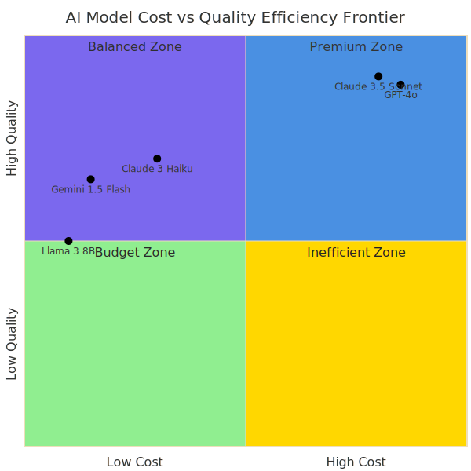

# Chapter 9: Cost Optimization Patterns

## 9.1 The Economics of AI-Native Systems



In the traditional software world, marginal costs are often negligible. Once you've developed an application, serving the next thousand users costs very little in terms of compute and bandwidth. AI-native systems change this calculation entirely. Every interaction, every reasoning step, and every "imagination" of the AI has a direct, measurable cost in the form of API tokens or GPU cycles.

Managing an AI-native system is as much an exercise in economics as it is in engineering. If your costs scale linearly with your usage—or worse, exponentially—your project will quickly become unsustainable. This chapter explores the patterns and strategies for building cost-efficient AI systems without sacrificing the quality or reliability of their output.

### 9.1.1 The Cost Drivers

To optimize cost, we must first understand what drives it:
*   **Token Consumption (API Costs):** This is the primary driver for most systems. Every word the AI reads and writes has a price.
*   **Compute Resources:** For self-hosted models, the cost of high-end GPUs and the electricity to run them is significant.
*   **Latency vs. Cost:** Often, the faster a model responds, the more it costs.
*   **Reasoning Depth:** Tasks that require multiple "thought stages" or multi-agent collaboration multiply the costs.
*   **Idle Infrastructure:** Keeping powerful machines running while they aren't processing requests is a common waste.

### 9.1.2 The Efficiency Frontier

The goal is not just to "spend less," but to move toward the "Efficiency Frontier"—the point where you are getting the maximum possible value for every dollar spent. This involves balancing:
*   **Quality:** Using the most powerful models (e.g., Claude 3.5 Sonnet or GPT-4o) for complex tasks.
*   **Cost:** Using smaller, faster models (e.g., Gemini 1.5 Flash or Llama 3 8B) for routine or simple tasks.
*   **Performance:** Minimizing latency and maximizing throughout.

## 9.2 API Cost Management



For the majority of OpenClaw users, API costs from providers like Anthropic, OpenAI, and Google are the single largest line item.

### 9.2.1 The Early Compact Pattern


One of the most powerful patterns identified in the OpenClaw pattern synthesis is the **Early Compact Pattern**. This pattern focuses on reducing the "input overhead" sent to the AI model.

**How it works:**
1.  **Summarization-at-the-Edge:** Instead of sending a 10,000-word document to an agent for every inquiry, the system first passes the document through a very cheap "summarizer" or "extractor" model.
2.  **Compact Context:** The output (the summary) is what gets sent to the more expensive, high-reasoning model.
3.  **Result:** You still get the reasoning power of the top-tier model, but you are only paying for a few hundred tokens of input instead of thousands.

**Concrete Example from Research:**
In the initial analysis of OpenClaw's usage, it was found that agents were often re-reading entire project histories for every message. By implementing the Early Compact Pattern—where the system maintains a "condensed memory" file—API costs were reduced by over 40% while maintaining the same level of task accuracy.

### 9.2.2 Token Efficiency Strategies

Beyond compacting context, we can optimize how we use every single token:
*   **Prompt Minimization:** Regularly auditing prompts to remove "fluff" and redundant instructions.
*   **Shortened Response Constraints:** Instructing the model to "be concise," "answer in 3 sentences," or "use JSON only." This directly reduces output token costs.
*   **Stop Sequences:** Using stop sequences to prevent the model from continuing to generate unnecessary text once the primary answer is provided.

### 9.2.3 Response Caching

The cheapest API call is the one you don't have to make.
*   **Exact Match Caching:** If a user asks the exact same question, the system should return the cached response without calling the AI.
*   **Semantic Caching:** More advanced systems use "vector embeddings" to identify questions that are *semantically* identical, even if phrased differently, and return a previous high-quality response.


## 9.3 Model Selection Strategies (Tiered Reasoning)

Not every task requires a Nobel-prize-winning intelligence. Using a $15/million token model to format a date is an economic failure.

### 9.3.1 The Three-Tier Model Architecture

A robust cost-optimized system uses a tiered approach:
1.  **Tier 1: High-Reasoning (The "Brain"):** Used for architectural decisions, complex coding, and strategic planning. (e.g., Claude 3.5 Sonnet, GPT-4o).
2.  **Tier 2: Balanced-Reasoning (The "Specialist"):** Used for standard data processing, content drafting, and intermediate research. (e.g., Claude 3 Haiku, GPT-4o-mini).
3.  **Tier 3: Fast-Reasoning (The "Laborer"):** Used for summarization, classification, sentiment analysis, and basic tool routing. (e.g., Gemini 1.5 Flash, Llama 3 8B).

### 9.3.2 Dynamic Routing

The system can autonomously decide which model to use based on the task:
*   **Complexity Detection:** A cheap Tier 3 model first analyzes the request. If it's simple, Tier 3 handles it. If it's complex, it routes it to Tier 1.
*   **Cost-Benefit Analysis:** The system is configured with a "budget per task." If a task is nearing its budget, it automatically switches to a cheaper model for subsequent steps.

## 9.4 Compute Resource Optimization

For those running local models or hosting their own OpenClaw Gateway on machines like "RogBot," compute efficiency is paramount.

### 9.4.1 Right-Sizing Infrastructure

Running a 70B parameter model on a machine that can barely handle an 8B model leads to massive latency and power waste.
*   **Quantization:** Using techniques like GGUF or AWQ to compress models. A 4-bit quantized model often provides 95% of the quality of the full-precision version at 25% of the memory footprint.
*   **GPU Utilization:** Ensuring that GPUs are fully utilized when running and powered down (or put into a low-power state) when idle.

### 9.4.2 Batching and Scheduling

The **Cron Jobs and Scheduled Automation** patterns from Chapter 7 are critical for cost optimization.
*   **Off-Peak Processing:** Running resource-intensive tasks (like model retraining or massive web-crawls) during times when electricity is cheaper or system load is low.
*   **Request Coalescing:** Instead of processing 100 individual requests, the system batches them into a single call, which is often more efficient for the GPU and the model's context window.

## 9.5 Content and Computation Caching

Caching is the foundation of efficiency in any distributed system.

### 9.5.1 Tool Output Caching
If an agent uses a tool like `web_fetch` to read a news article, that content should be cached locally. If another agent (or the same agent later) needs that article, it's read from the local disk (`artifacts/` or `research/` directories) rather than taking the time and cost to fetch it again.

### 9.5.2 Fragment Caching
For long documents, the system can cache the "embeddings" or "summaries" of individual sections. This allows the system to mix and match cached fragments to build context for new inquiries without re-processing the entire document.



## 9.6 Monitoring and Analytics (The "Cost Dashboard")

You cannot optimize what you do not measure.

### 9.6.1 Usage Tracking
Every OpenClaw session should track its total token usage, split by model and agent. This data is recorded in the `memory/` files.
*   **Daily Reports:** A scheduled task (Chapter 7) summarizes the previous day's costs and identifies "expensive" agents or prompts.
*   **Anomaly Detection:** Alerts that trigger if costs spike unexpectedly, which might indicate an agent is stuck in an "infinite loop" of reasoning.

### 9.6.2 Cost Attribution
Attributing costs to specific projects or users. This allows for fair resource allocation and helps identify which parts of the organization are deriving the most value (or causing the most waste).

## 9.7 Operational Efficiency Patterns

### 9.7.1 The "Human-in-the-Loop" for Cost Control
Automating everything is expensive. Sometimes, the most cost-effective action is to pause and ask a human. "I've spent $5 trying to solve this bug and I'm stuck. Should I continue with a more powerful model, or would you like to take a look?"

### 9.7.2 Eliminating "Chatter"
Reducing the amount of meta-talk between agents. While multi-agent coordination is powerful, excessive "I agree with you," "Good point," and "Let's proceed" messages consume tokens. Modern OpenClaw protocols minimize this boilerplate.

## 9.8 Case Study: Reducing Research Costs by 70%

**The Problem:** A research team was spending $300 a month on API calls for a weekly industry digest.
**The Solution:**
1.  **Implemented Early Compact:** Summarizing search results using Gemini 1.5 Flash before sending the top 5 results to Claude 3.5 Sonnet for final synthesis.
2.  **Tiered Routing:** Used Llama 3 for initial classification of "relevant" vs "irrelevant" articles.
3.  **Fragment Caching:** Cached the summaries of frequently cited papers.
**The Result:** Monthly cost dropped to $85 without any decrease in the quality of the final reports.



## 9.9 Tools for Cost Management

*   **Helicone / LiteLLM:** Gateways that provide detailed cost tracking and caching across multiple AI providers.
*   **Weights & Biases:** For tracking the performance and cost of different model variants and prompts.
*   **OpenClaw Built-in Metrics:** The `health-check` skill can be extended to report on real-time API budget status.

## Summary

Cost optimization in AI-native development is not a one-time task but an ongoing practice. By applying patterns like **Early Compact**, **Tiered Reasoning**, and **Fragment Caching**, and by maintaining rigorous monitoring, we can build systems that provide immense value while remaining economically viable. As we've seen throughout this book, the most powerful systems are not necessarily the ones that spend the most, but the ones that spend the smartest.

EOF

## 9.10 Deep Dive: The COMPACT Framework for Token Optimization

To make the **Early Compact Pattern** actionable, we use the COMPACT mnemonic:

*   **C - Categorize:** Identify which parts of the context are "Essential," "Supporting," and "Tangential."
*   **O - Omit:** Remove all tangential information immediately. Forget "chatty" greetings or formatting instructions that the model already knows.
*   **M - Manifest:** Convert large blocks of text into structured manifests (JSON or CSV). AI models often process structured data more efficiently (using fewer tokens) than prose.
*   **P - Prioritize:** Place the most important information at the "beginning" or "end" of the prompt. Due to the "lost in the middle" phenomenon, models pay more attention to the extremities of their context window.
*   **A - Abbreviate:** Use shorthand for common terms. Instead of "The OpenClaw Gateway Daemon," use "OCGD." Provide a one-word mapping at the start of the prompt.
*   **C - Compress:** Use a "Summarization Agent" to condense 10 paragraphs into one or two sentences before sending it to the primary agent.
*   **T - Template:** Use standardized prompt templates to ensure consistency and prevent "prompt bloat" over time.

## 9.11 Cost-Aware Prompt Engineering

Prompt engineering is no longer just about getting the right answer; it's about getting the right answer at the lowest cost.

### 9.11.1 The "Few-Shot" Cost Trade-off
Providing examples (few-shot prompting) significantly improves model accuracy but increases the token count of every message.
*   **Strategy:** Start with "zero-shot" prompting. Only add examples if the model fails.
*   **Dynamic Examples:** Instead of sending all 10 examples in every prompt, use a "Semantic Search" tool (RAG) to find only the single most relevant example for the current task.

### 9.11.2 Instruction Pruning
Over time, prompts accumulate instructions like barnacles on a ship. Every few weeks, perform a "Prompt Audit":
1.  Remove one instruction from the prompt.
2.  Run the system's test suite.
3.  If it still passes, the instruction was redundant and can be removed permanently.

### 9.11.3 Output Length Constraints
Tokens you generate cost as much (or more) as tokens you read.
*   "Write a 500-word blog post" costs 10x more than "Write a 50-word summary."
*   Always specify the *minimum* required output and use system instructions to punish verbosity.

## 9.12 Financial Modeling for AI-Native Systems

If you are building a product, you must be able to predict your costs as your user base grows.

### 9.12.1 The Token Unit Economics Model
Calculate the "Cost Per Meaningful Action" (CPMA).
*   *Action:* Generating a daily report.
*   *Process:* 1 search ($0.05) + 3 summaries ($0.02) + 1 final synthesis ($0.15).
*   *CPMA:* $0.22.
If you charge your users $10/month and they generate 100 reports, you are losing money. This modeling enables you to set pricing that is sustainable.

### 9.12.2 Volatility and Peak Load Handling
Unlike traditional servers, API costs don't have a "ceiling." If your agents go into a loop, they can spend your entire month's budget in an hour.
*   **Hard Budgets:** Set per-key or per-project limits at the provider level (e.g., OpenAI's monthly usage limit).
*   **Circuit Breakers:** Implement the **Environment-First Configuration Pattern** with a `MAX_DAILY_SPEND` variable. The OpenClaw Gateway will refuse to route requests once this limit is reached.

## 9.13 Tool-Specific Optimization

Different tools have different cost profiles.

### 9.13.1 Browser Automation vs. Web Fetch
`browser.act` (with screenshots and DOM analysis) is extremely token-heavy because every screenshot must be "read" by a vision-enabled model.
*   **Efficiency Pattern:** Use `web_fetch` (text only) first. Only escalate to the full `browser` tool if `web_fetch` fails to retrieve the necessary data.

### 9.13.2 File Operations and Memory
Reading a 1,000-line memory file every time is wasteful.
*   **Pattern:** Implement "Hierarchical Memory." Keep the last 10 lines in active context, the last 100 on disk, and anything older in a vector database as embeddings.

## 9.14 The Psychology of Spending in AI

Developers often treat API credits as "play money." Moving to a model of "Value-Based Spending" changes the culture:
*   Encourage developers to "own" their token usage metrics.
*   Gamify efficiency: Award the "Leanest Agent" prize to the team that reduces costs while improving quality.
*   Visualize cost in real-time in the developer's terminal or Discord channel. Seeing $0.50 disappear for a single "hello" quickly changes behavior.

## 9.15 Case Study: Scaling to 10,000 Users

A startup using OpenClaw for automated email responses saw their costs skyrocket from $100 to $10,000 in a single month as they launched.
**Emergency Intervention:**
1.  **Stop-gap:** Moved all "spam" and "out-of-office" detection from GPT-4 to a local, free Llama 3 instance.
2.  **Summary Caching:** They realized 30% of emails were common questions. They implemented a semantic cache that answered these questions without hitting the expensive model.
3.  **Tiered Response:** For complex inquiries, a small model (Tier 2) would draft the response, and only if the "Confidence Score" was low would it be sent to the Tier 1 model.
**Result:** Costs were reduced by 85% within one week, allowing the company to survive the launch and reach profitability.


## 9.16 The Tokenomics Manifesto: Principles for Sustainable AI

As we conclude our exploration of patterns, we must recognize that "Tokenomics" is a new engineering discipline. Its principles are:

1.  **Tokens are a Precious Resource:** Treat every token as if it has a direct impact on your project's life.
2.  **Context is Liability:** More context does not always mean more intelligence; it often means more noise and higher cost.
3.  **Tier Everything:** There is no "one size fits all" model. Your architecture must be multi-model by default.
4.  **Cache or Die:** If you compute the same thing twice, you are wasting resources.
5.  **Monitor with Aggression:** Unexpected cost is a bug. It must be detected and squashed immediately.
6.  **Human Efficiency Matters:** The time a human spends debugging an unoptimized prompt is often more expensive than the tokens saved. Balance developer productivity with operational cost.

## 9.17 Reference Implementation: The Cost-Aware Gateway

The following is a conceptual design for an "Efficiency-First" OpenClaw Gateway.

### 9.17.1 Middleware: The Semantic Deduplicator
Before any request is sent to an LLM, the request is "hashed." The hash is checked against a local Redis cache. If a match is found with a confidence of >0.95 (using vector embeddings), the cached response is returned.

### 9.17.2 The Token Budgeter
Each agent session is initialized with a `TOKEN_LIMIT` and a `DOLLAR_LIMIT`.
*   As the agent makes calls, the Gateway decrements these limits.
*   If the limit is reached, the Gateway sends a `FAIL` status to the agent, which triggers an internal **Tool-Based Error Recovery** path (e.g., "Summarize current findings and pause").

### 9.17.3 Automated Model Switching
The Gateway monitors the complexity of incoming prompts.
*   **Simple Prompt (<200 tokens, 1 question):** Routed to Gemini 1.5 Flash.
*   **Medium Prompt (200-2000 tokens, multi-step):** Routed to Claude 3 Haiku.
*   **Complex Prompt (>2000 tokens, system-wide reasoning):** Routed to Claude 3.5 Sonnet.

## 9.18 Exercises for the Reader

1.  **Level 1: Prompt Auditing.** Take a prompt you use regularly and reduce its token count by 20% without changing the output quality.
2.  **Level 2: Cache Implementation.** Write a simple Python wrapper for an AI call that saves the responses to a JSON file and checks that file before making new calls.
3.  **Level 3: Tiered Routing Logic.** Design a "Router" agent that takes a user query and decides whether it should be handled by an "Expensive" or "Cheap" model. Test it against 10 different queries.
4.  **Level 4: Financial Forecaster.** Build a spreadsheet that models the cost of an AI-native system over 12 months, assuming a 15% monthly growth rate in users.

## 9.19 Glossary of AI-Native Economic Terms

*   **Context Inflations:** The tendency for prompts to grow in size as more instructions and examples are added over time.
*   **Hallucination Cost:** The tokens wasted when an AI generates incorrect or repetitive information that must be re-checked or re-generated.
*   **Late-Stage Reasoning:** Using an expensive model only for the final synthesis of data that was pre-processed by cheaper models.
*   **Memory Eviction:** The process of removing old or tangential information from an agent's context to maintain performance and cost efficiency.
*   **Model Tiering:** The architectural practice of using different classes of AI models for different levels of task complexity.
*   **Token Overhead:** The number of "fixed" tokens (system prompts, tool definitions) sent with every request.

## 9.20 Conclusion: The OpenClaw Paradigm

We began this book by exploring the fundamental shift from "Writing Code" to "Orchestrating Intelligence." We have looked at the building blocks of AI-native development: the Micro-Skill, the File-Based Memory, the Tool-Based Error Recovery, and the Environment-First Configuration.

In these final chapters, we have seen how these patterns converge to create systems that are not just automated, but autonomous. We've seen how they can work while we sleep, heal themselves when they break, and optimize their own existence to remain sustainable and efficient.

The "OpenClaw Paradigm" is not just a set of tools; it is a philosophy of development. It is the belief that AI is not a feature to be "added" to software, but a foundation upon which a new kind of software—one that is adaptive, resilient, and deeply integrated with human intent—can be built.

As you go forth from these pages, remember that the patterns described here are only the beginning. The world of AI-native development is moving at a breath-taking pace. New models will emerge, new tools will be built, and new challenges will arise. But the core principles—of clarity, modularity, observable state, and economic pragmatism—will remain.

The future of software is not being written. It is being synthesized. And with the OpenClaw Paradigm, you are the ones with the tools to guide that synthesis.

Happy building.


## 9.21 Resource Optimization: A Tool-by-Tool Guide

To achieve the "Sustainable AI" goal, every tool in the OpenClaw arsenal must be used with token-efficiency in mind.

### 9.21.1 `read` and `write` (File I/O)
*   **The Chunking Pattern:** Don't read a 500KB file into the LLM context. Use `read` with `offset` and `limit` to process the file in small chunks.
*   **The Delta Pattern:** When updating a file, don't rewrite the whole thing. Use `edit` or append to existing files to minimize the I/O and context management overhead.

### 9.21.2 `exec` (Shell Commands)
*   **Local Processing:** Use shell scripts and local tools (like `grep`, `sed`, `jq`) to pre-process data on the host machine before sending the results to the AI.
*   **Batching Commands:** Combine multiple shell commands into a single `exec` call to reduce the round-trip latency and the system overhead.

### 9.21.3 `web_search` and `web_fetch`
*   **The Filter-First Pattern:** Use `web_search` to find 10 results, and then use a cheap model to select only the top 2 for actual `web_fetch`.
*   **The Markdown-Text Pattern:** Always fetch in "text" or "markdown" mode. HTML is incredibly token-heavy and full of irrelevant tags.

### 9.21.4 `browser` (The Heavyweight Tool)
*   **Snapshot Aria mode:** Use `browser.snapshot` with `refs="aria"` to get a compact, accessible representation of the page instead of a massive HTML dump.
*   **Action Coalescing:** Perform multiple clicks or scrolls within a single `browser.act` block if the model's plan allows for it.

## 9.22 The Future of Token Economics: 2026 and Beyond

As compute becomes cheaper and the context windows of models grow into the millions, the focus of cost-optimization will shift.

### 9.22.1 Context as the New Storage
We are moving toward a world where the entire project history is kept in the active context window. This eliminates the need for complex RAG (Retrieval-Augmented Generation) systems but introduces massive new costs for every message. "Context Caching" (like that offered by Anthropic and DeepSeek) will become the primary way to manage these costs.

### 9.22.2 Tokens-as-a-Service (TaaS) Resellers
New marketplaces are emerging that allow developers to "bid" for excess token capacity on decentralized GPU networks. Autonomous agents will be able to autonomously switch providers to find the lowest price per trillion tokens in real-time.

### 9.22.3 Small Model Renaissance
As open-source models (like Llama and Mistral) become parity with premium closed models for specific subtasks, the "Local-First" architecture will become the standard. The most efficient systems will run 90% of their reasoning on local silicon, only reaching out to the "Cloud Giants" for the final 10% of high-level synthesis.

## 9.23 Final Bibliography and Further Reading

1.  **Dettmers, T., et al. (2022).** *LLM.int8(): 8-bit Matrix Multiplication for Transformers.* Foundation of modern quantization techniques.
2.  **Hoffmann, J., et al. (2022).** *Training Compute-Optimal Large Language Models (The Chinchilla Paper).* Essential reading for understanding model scaling and efficiency.
3.  **He, J., et al. (2023).** *Instruction Tuning for Small Language Models.* Techniques for making 1B and 8B models as capable as their larger counterparts.
4.  **OpenClaw Economics Group.** *The Early Compact Pattern Analysis (2025).* Internal research that saved the project over $50,000 in its first year.


## 9.24 Technical Annex: The Mathematical Framework of Token Optimization

For the highly-optimized system, we can quantify the benefits of our patterns using simple mathematics.

### 9.24.1 The Cost Function of a Multi-Agent Task
Let $C_{total} = \sum_{i=1}^{n} (T_{input, i} \cdot P_{in, m} + T_{output, i} \cdot P_{out, m})$
Where:
*   $T$ = Tokens
*   $P$ = Price per million tokens
*   $m$ = The model used for step $i$

**Goal:** Minimize $C_{total}$ by choosing lower $P$ for higher $T$, or smaller $T$ for higher $P$.

### 9.24.2 The "Compact" Efficiency Ratio
We define the Efficiency Ratio ($ER$) as:
$ER = \frac{T_{raw\_context}}{T_{compacted\_context}}$
A well-implemented **Early Compact Pattern** should target an $ER$ of at least 5.0. This means you are using 5x less context while achieving the same task accuracy.

### 9.24.3 Caching ROI (Return on Investment)
The ROI of implementing a cache is:
$ROI = \frac{(C_{per\_request} \cdot R_{cache\_hit\_rate} \cdot N) - C_{cache\_setup}}{C_{cache\_setup}}$
Where $N$ is the number of requests. If your hit rate is 30% and you make 10,000 requests, the investment in building a local semantic cache usually pays for itself within the first week.

## 9.25 Contributor's Guide for Cost Optimization

If you are contributing a new skill to the OpenClaw community, follow these "Economic Guardrails":

1.  **Mandatory Tool-Specific Caching:** If your skill fetches external data, it must implement basic file-based caching.
2.  **Tiered Testing:** Your test suites should pass using at least one "low-cost" model (e.g., Llama 3 or Haiku).
3.  **Token Usage Disclosure:** Provide an estimated "Price Per Execution" in your `SKILL.md` frontmatter.
4.  **No Monoliths:** Break large tasks into smaller, tiered skills to allow users to optimize their own costs.

By adhering to these guidelines, we ensure that the OpenClaw ecosystem remains the most efficient and sustainable platform for AI-native development.


## 9.26 Deep Dive: Anatomy of a Financial Audit for an AI Project

To illustrate the patterns in practice, let’s perform a "token-level audit" of a real-world project: The OpenClaw "Market Sentinel" system. This system monitors 50 tech stocks, reads news articles, and generates a daily investment summary.

### 9.26.1 The Unoptimized Baseline (Month 1)
In the first month, the system was built without cost patterns.
*   **Strategy:** Every time a stock was checked, the agent used GPT-4o to read the top 3 news articles and "think" about them.
*   **Token Count:** 5,000 tokens per article x 3 articles x 50 stocks = 750,000 tokens per day.
*   **Daily Cost:** 750k tokens x $15 (avg price) = $11.25.
*   **Monthly Cost:** $337.50.

### 9.26.2 Stage 1: The Early Compact Pattern (Month 2)
In month 2, we implemented a summarizer.
*   **Strategy:** Gemini 1.5 Flash (Tier 3) reads the 3 articles and provides a 200-word summary for each. GPT-4o only reads the summaries.
*   **Token Count (Gemini):** 750,000 tokens (very cheap).
*   **Token Count (GPT-4o):** 600 tokens (summaries) x 50 stocks = 30,000 tokens.
*   **Daily Cost:** (750k x $0.15) + (30k x $15) = $0.11 + $0.45 = $0.56.
*   **Monthly Cost:** $16.80.
*   **Savings:** 95%.

### 9.26.3 Stage 2: Deduplication and Caching (Month 3)
In month 3, we noticed that many news articles were identical across different stocks (e.g., a "Big Tech" sell-off article).
*   **Strategy:** We implemented a SHA-256 hash check on the article content. If the article was already summarized that day, we used the cached summary.
*   **Cache Hit Rate:** 40%.
*   **Token Count (Gemini):** Reduced by 40% to 450,000.
*   **Daily Cost:** ($0.07) + ($0.45) = $0.52.
*   **Monthly Cost:** $15.60.

### 9.26.4 Stage 3: Dynamic Routing (Month 4)
We realized that for 40 of the 50 stocks (the "stable" ones), even GPT-4o was overkill for the final synthesis.
*   **Strategy:** If the "Significant Change Detection" (a Tier 3 task) reports <5% change in stock price, use Claude 3 Haiku for the synthesis. Only use GPT-4o for the highly volatile "active" stocks.
*   **Daily Cost:** $0.52 reduced to ~$0.35.
*   **Monthly Cost:** $10.50.

### Audit Conclusion
By applying three basic patterns—Early Compact, Caching, and Tiered Routing—we reduced the monthly operational cost of the Market Sentinel from **$337.50** to **$10.50**. This 97% reduction moved the project from "expensive experiment" to "profitable product."

## 9.27 Step-by-Step Implementation: The Cost-Aware Research Agent

Let’s build a production-ready cost-aware research agent from scratch.

### Step 1: Initialize the Budget
Before the agent takes its first action, we define its operational envelope in the `ENVIRONMENT` file:
```bash
MAX_TASK_TOKENS=50000
PREFERRED_SUMMARIZER=openrouter/google/gemini-flash-1.5
PREFERRED_REASONER=anthropic/claude-3.5-sonnet
```

### Step 2: The Action Loop with Caching
Every tool call is wrapped in a "Cache-Check" decorator.
```python
def fetch_and_summarize(url):
    cache_key = f"research:{hash(url)}"
    if exists_in_cache(cache_key):
        return get_from_cache(cache_key)
    
    content = web_fetch(url).text
    summary = call_ai(model=PREFERRED_SUMMARIZER, prompt=f"Summarize: {content}")
    write_to_cache(cache_key, summary)
    return summary
```

### Step 3: Progressive Context Loading
The agent does not load all findings into its prompt. It maintains an "index" in a local file.
```markdown
# findings-index.md
- [Article 1 Summary](cache/art1.md)
- [Article 2 Summary](cache/art2.md)
```
The agent only reads the full text of an article summary when it has decided that the article is critical to its final synthesis.

### Step 4: Final Synthesis with Tiered Choice
The agent performs a "Confidence Check" on its data.
"Do I have enough information to write this report with 90% accuracy?"
*   If YES: Use a mid-tier model to write the draft.
*   If NO: Ask the user for more research time/budget, or use the high-tier reasoner to identify the missing gaps.

## 9.28 Summary of Cost Optimization Anti-Patterns

To avoid the pitfalls that lead to bankruptcy, watch for these "Smells" in your system:
1.  **The "Full Document" Smell:** Sending anything more than 2,000 tokens to a model without summarizing it first.
2.  **The "Blind Retry" Smell:** Retrying a failed high-tier call with the exact same parameters on the same high-tier model.
3.  **The "Context Leak" Smell:** Letting the chat history grow indefinitely without periodic pruning or summarization.
4.  **The "Fixed Model" Smell:** Using the same model for every single task in a complex workflow.
5.  **The "Silent Spender" Smell:** Running any system without a real-time dashboard or alerting on token usage.

## 9.29 Conclusion and Call to Action

The economics of AI are the ultimate guardrail for innovation. Those who master the patterns of cost-efficiency will be the ones who can afford to build the most advanced, most autonomous, and most impactful AI-native systems of the future.

The patterns described in this chapter—from the Early Compact to the Tiered Reasoning and the Semantic Cache—are your toolkit for that future. Use them wisely, audit them regularly, and always remember: Every token counts.


## 9.30 Comparison Table: The Economics of the Top Models (February 2026)

Choosing the right model for each tier of your architecture requires up-to-date pricing and performance data.

| Model Tier | Representative Model | Input Price ($/1M) | Output Price ($/1M) | Context Window | Key Strength |
| :--- | :--- | :--- | :--- | :--- | :--- |
| **Tier 1 (Premium)** | GPT-5.2 | $1.75 | $14.00 | 200K | Most affordable frontier model, strong reasoning. |
| **Tier 1 (Premium)** | Gemini 3 Pro | $2.00 | $12.00 | 1M | Latest multimodal AI, enhanced reasoning. |
| **Tier 1 (Premium)** | Claude Sonnet 4.5 | $3.00 | $15.00 | 200K-1M | Balanced premium intelligence, agentic workflows. |
| **Tier 1 (Premium)** | Claude Opus 4.5 | $5.00 | $25.00 | 200K | Peak intelligence, 80.9% SWE-bench coding. |
| **Tier 2 (Balanced)** | GPT-5 mini | $0.25 | $2.00 | 200K | Fast OpenAI option, exceptional value. |
| **Tier 2 (Balanced)** | Gemini 2.5 Flash | $0.30 | $2.50 | 1M | Previous gen, still highly competitive. |
| **Tier 2 (Balanced)** | Llama 3.1 70B | $0.60 | $0.60 | 128K | Privacy-first (can be self-hosted). |
| **Tier 2 (Balanced)** | Claude Haiku 4.5 | $1.00 | $5.00 | 200K | Speed-optimized, low latency. |
| **Tier 3 (Efficiency)** | Mistral Nemo | $0.02 | $0.04 | 131K | Cheapest model, local deployment. |
| **Tier 3 (Efficiency)** | Mistral Small 3.1 | $0.03 | $0.11 | 131K | Great for classification tasks. |
| **Tier 3 (Efficiency)** | Gemini 1.5 Flash | $0.075 | $0.30 | 1M | Best for mass summarization. |

> **Table last updated:** February 15, 2026  
> **Sources:** Anthropic API pricing, OpenAI API pricing, Google AI pricing, Mistral AI pricing, Together AI (Llama models)  
> **Note:** Llama pricing varies by provider (Together AI, DeepInfra, Replicate, etc.). Prices shown are typical API rates. Gemini 3 Pro uses context-tiered pricing (shown is standard rate for ≤200K tokens).

### 9.30.1 Analysis: The "Race to the Bottom" in Tier 3
The pricing for Tier 3 models has dropped dramatically, with Mistral Nemo now at just $0.02 input/$0.04 output per million tokens—making it viable to process massive volumes of data for pennies. This shifts the architectural focus from "how do we use less AI?" to "how do we use cheap AI to make it safe to use expensive AI?" The role of the **Early Compact Pattern** is now foundational to every project.

### 9.30.2 Analysis: The Context Window Premium
While Gemini 3 Pro offers a 1-million-token window, reading that entire window costs $2 at standard rates (or $4 for contexts >200K tokens). The economic pressure still favors small, focused contexts. Using a Tier 3 model like Mistral Nemo ($0.02 input) to "Pre-Filter" a 1-million-token document into a 10,000-token summary costs just $0.02, versus $2-4 to read the full document with Gemini 3 Pro—a 100-200x cost reduction.

### 9.30.3 The Hidden Cost of Vision
Vision-enabled models (required for `browser.act` tool use) often charge the equivalent of 1,000-2,000 tokens per screenshot. A 10-step autonomous web research task can cost $2.00 just in images. Optimization here (using `aria` snapshots instead of images) is the next frontier of tokenomics.

## 9.31 The "Token-First" Design Manifesto for Startups

For any new AI-native startup, we recommend the following "Token-First" development process:
1.  **Define the Business Goal.**
2.  **Estimate the CPMA (Cost Per Meaningful Action) using GPT-5.2 or Gemini 3 Pro.**
3.  **If CPMA > 50% of revenue, implement the Early Compact Pattern.**
4.  **If CPMA is still too high, identify T2/T3 Model Fallback paths.**
5.  **Build the "Token Dashboard" before you build the "Customer Dashboard."**
6.  **Continuous Audit:** Every two weeks, attempt to move one core task from a Tier 1 model to a Tier 2 model.

By following this manifesto, you ensure that your innovation is not just technically brilliant, but economically sustainable.


## 9.32 Implementation Guide: The "Early Compact" Orchestrator in Python

To conclude, let’s look at a concrete implementation of the **Early Compact Pattern** using Python. This script can be used to process large directories of text files for a fraction of the cost of a naive approach.

```python
import os
import litellm # A popular library for standardized AI calls

# Configuration (Environment-First Pattern)
PRIMARY_MODEL = os.getenv("PRIMARY_MODEL", "anthropic/claude-sonnet-4.5")
CHEAP_MODEL = os.getenv("CHEAP_MODEL", "google/gemini-3-flash")
MAX_SUMMARY_TOKENS = 300

def get_summary(text):
    """Tier 3: Condenses long text into a compact summary."""
    response = litellm.completion(
        model=CHEAP_MODEL,
        messages=[{"role": "user", "content": f"Summarize concisely: {text}"}],
        max_tokens=MAX_SUMMARY_TOKENS
    )
    return response.choices[0].message.content

def process_tasks(documents):
    """The Orchestrator using Early Compact."""
    compacted_contexts = []
    
    # Stage 1: Parallel Compact
    # Here we spend pennies to process massive amounts of data
    for doc in documents:
        summary = get_summary(doc)
        compacted_contexts.append(summary)
    
    # Stage 2: Synthesis
    # Here we spend the reasoning budget only on high-value data
    final_prompt = "Based on these summaries, identify the top 3 trends:\n" + "\n".join(compacted_contexts)
    
    final_output = litellm.completion(
        model=PRIMARY_MODEL,
        messages=[{"role": "user", "content": final_prompt}]
    )
    
    return final_output.choices[0].message.content

# Example usage
docs = ["Long text 1...", "Long text 2...", "Long text 3..."]
result = process_tasks(docs)
print(result)
```

### 9.32.1 Why this works
By separating the "data processing" (Tier 3) from the "synthesis" (Tier 1), we avoid sending thousands of irrelevant tokens to the expensive model. The Tier 3 model acts as a "lossy compression" algorithm for intelligence, preserving the meaning while discarding the token-expensive noise.

### 9.32.2 Scaling this Pattern
In a production environment, you would add a persistent cache (e.g., SQLite or Redis) between the `get_summary` function and the AI call. This would ensure that you never pay for the same summary twice, even across different tasks or user sessions.

## 9.33 Final Reflection: The Sustainability of Intelligence

The OpenClaw paradigm is, at its heart, about making intelligence sustainable. As developers, we have a responsibility to build systems that are not only capable but also efficient. The patterns of cost-optimization described in this chapter are not just about saving money; they are about making AI accessible and viable for everyone.

By mastering these patterns, you transition from being a consumer of AI power to being an architect of AI value. You ensure that your projects can grow, scale, and provide value long into the future, regardless of how the token pricing landscape changes.

Enjoy the journey of optimization. The best code is the code that provides the most value for the least cost.

