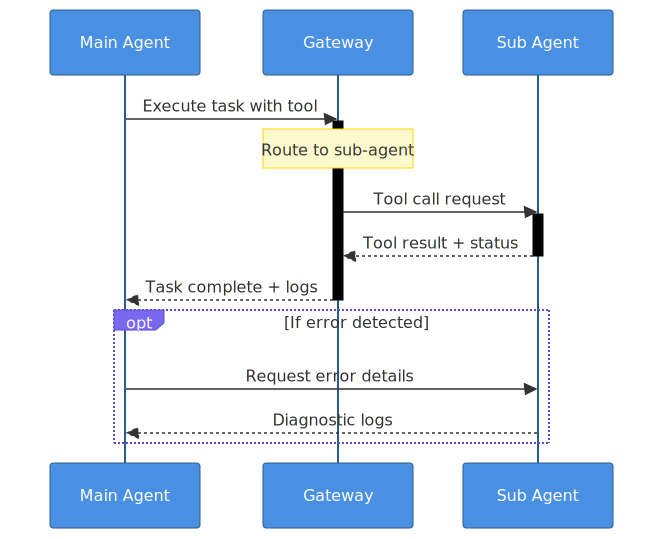

# Chapter 10: Debugging AI-Native Systems

## Introduction

Debugging AI-native systems presents unique challenges that distinguish it from traditional software debugging. In systems like OpenClaw, where AI agents orchestrate tools, interact with users across multiple channels, and coordinate with other agents, failures can be probabilistic, emergent, and deeply contextual. This chapter explores the specialized debugging patterns and techniques essential for maintaining robust AI-native systems, focusing on the OpenClaw ecosystem as a case study.

The transition from deterministic software systems to probabilistic AI-native systems requires a fundamental shift in debugging philosophy. Traditional debugging often assumes reproducible bugs with clear causal chains, but AI-native systems introduce non-deterministic behavior, complex tool interactions, and emergent failures that defy simple reproduction. Successful debugging in this context requires understanding patterns like tool-based error recovery, status classification, health-check validation, and example-driven testing—patterns identified in our analysis of the OpenClaw ecosystem.

## 10.1 The Unique Challenges of Debugging AI Systems

### Non-Deterministic Behavior and Probabilistic Outputs

AI models generate probabilistic outputs, meaning the same input can produce different responses across invocations. This non-determinism creates debugging challenges where failures may not be reproducible. For example, an AI agent might correctly handle a tool call 90% of the time but fail inexplicably 10% of the time due to subtle variations in prompt formulation or context window state.

**Example:** An OpenClaw skill that generates code might produce correct Python syntax 95% of the time but occasionally generate malformed code due to ambiguous instructions. Debugging requires statistical analysis of failure rates rather than deterministic reproduction.

### Complex Tool Interactions and Side Effects

AI-native systems like OpenClaw execute tools with real-world side effects—file operations, API calls, process execution, and more. These interactions create debugging complexity because:
1. **State Changes:** Tools modify system state, making it difficult to restore exact conditions for debugging.
2. **External Dependencies:** Tools depend on external services that may fail intermittently.
3. **Permission Issues:** Tool execution requires specific permissions that may vary across environments.
4. **Resource Constraints:** Tools may fail due to memory limits, disk space, or network connectivity.

**OpenClaw Example:** The `exec` tool's behavior depends on system state, installed software, and environment variables. Debugging a failing `exec` call requires examining not just the command but the entire execution context.

### Multi-Agent Coordination Failures

OpenClaw's gateway-mediated multi-agent architecture introduces coordination challenges:
- **Communication Breakdowns:** Agents may misinterpret each other's messages or state.
- **Race Conditions:** Concurrent tool execution by multiple agents can create timing issues.
- **State Inconsistency:** Different agents may have inconsistent views of shared state.
- **Deadlock Scenarios:** Circular dependencies between agents can cause system hangs.

**Pattern Insight:** The Gateway-Mediated Multi-Agent Pattern (Pattern 3 from synthesis) provides centralized coordination but debugging requires tracing interactions across agents through the gateway.

### Emergent Behaviors from System Interactions

Complex systems exhibit emergent behaviors—properties that arise from interactions between components but aren't inherent in any single component. In AI-native systems, these emergent behaviors can include:
- **Feedback Loops:** AI decisions influencing future inputs creating reinforcement cycles.
- **Cascade Failures:** Small errors propagating through tool chains.
- **Unintended Optimization:** AI agents finding unexpected shortcuts that violate constraints.

**Research Finding:** Analysis of OpenClaw skills revealed that emergent behaviors often stem from subtle interactions between tools and AI decision-making, requiring holistic debugging approaches.

### The "Black Box" Problem of AI Models

Modern AI models operate as black boxes—their internal reasoning isn't directly observable. This creates debugging challenges:
- **Opaque Decision-Making:** Difficult to understand why an AI made a specific tool choice.
- **Confidence Ambiguity:** AI responses lack calibrated confidence scores.
- **Prompt Sensitivity:** Small changes to prompts can produce dramatically different behavior.

**Debugging Strategy:** Implementing structured logging around AI decisions, capturing prompt-response pairs, and using chain-of-thought prompting to increase transparency.

## 10.2 Tool-Based Error Recovery Pattern

### 10.2.1 Pattern Fundamentals

The Tool-Based Error Recovery Pattern provides a systematic approach to handling failures in AI-native systems through structured error handling, status classification, and graceful degradation. This pattern emerged from analysis of OpenClaw skills like `health-check` and `founder-coach`, which implement robust error handling despite operating in unpredictable environments.

**Core Principles:**
1. **Structured Error Handling:** Tools return standardized status codes and messages.
2. **Status Classification:** Clear severity levels (OK, WARN, FAIL) for issues.
3. **Graceful Degradation:** Systems continue operating with reduced functionality rather than crashing.
4. **Actionable Feedback:** Error messages provide specific guidance for resolution.

**Status Levels Implementation:**
- **OK:** Operation successful, no issues detected.
- **WARN:** Potential issues requiring attention but not immediately critical.
- **FAIL:** Critical failure requiring intervention.
- **UNKNOWN:** State cannot be determined (requires investigation).

### 10.2.2 Implementation Examples



**OpenClaw Health-Check Skill:**

The `health-check` skill exemplifies tool-based error recovery through comprehensive system validation:

```python
# Example from health-check skill
def check_gateway():
    """Check if OpenClaw gateway is running."""
    try:
        result = subprocess.run(['ps', 'aux'], capture_output=True, text=True)
        if 'openclaw-gateway' in result.stdout:
            return {'status': 'OK', 'message': 'Gateway process running'}
        else:
            return {'status': 'FAIL', 'message': 'Gateway process not found'}
    except Exception as e:
        return {'status': 'FAIL', 'message': f'Error checking gateway: {str(e)}'}
```

**Pattern Implementation Features:**
1. **Consistent Return Format:** All checks return dictionaries with `status` and `message` fields.
2. **Exception Handling:** Tools catch and report exceptions rather than crashing.
3. **Actionable Messages:** Error messages include specific resolution steps.
4. **Aggregate Status:** Individual check results combine into overall system status.

**Tool Wrapper Pattern:**

Wrapping tool calls with standardized error handling ensures consistency:

```python
def safe_tool_call(tool_func, *args, **kwargs):
    """Execute tool with standardized error handling."""
    try:
        result = tool_func(*args, **kwargs)
        if result.get('success', False):
            return {'status': 'OK', 'data': result.get('data')}
        else:
            return {'status': 'WARN', 'message': result.get('error', 'Tool reported failure')}
    except PermissionError:
        return {'status': 'FAIL', 'message': 'Permission denied for tool execution'}
    except TimeoutError:
        return {'status': 'WARN', 'message': 'Tool execution timed out'}
    except Exception as e:
        return {'status': 'FAIL', 'message': f'Unexpected error: {str(e)}'}
```

### 10.2.3 OpenClaw Examples in Practice

**Error Propagation Across Tool Chains:**

When tools depend on each other, error recovery requires careful propagation:

```python
def execute_workflow():
    """Example workflow with error propagation."""
    step1_result = tool_a()
    if step1_result['status'] == 'FAIL':
        return {'status': 'FAIL', 'message': f'Step 1 failed: {step1_result["message"]}'}
    
    step2_result = tool_b(step1_result['data'])
    if step2_result['status'] == 'WARN':
        # Continue but log warning
        log_warning(f'Step 2 warning: {step2_result["message"]}')
    
    step3_result = tool_c(step2_result['data'])
    return aggregate_status([step1_result, step2_result, step3_result])
```

**Recovery Strategies:**

1. **Retry Logic:** Temporary failures often resolve with retries.
2. **Alternative Paths:** Different approaches to achieve same goal.
3. **Fallback Modes:** Reduced functionality when primary path fails.
4. **User Intervention:** Prompt users for guidance when automated recovery fails.

**OpenClaw Implementation Patterns:**
- **Health-check skill:** Comprehensive system validation with clear status reporting.
- **Tool error handling:** Consistent error formats across all tools.
- **Status reporting standardization:** Unified status visualization across interface.
- **User notification patterns:** Contextual alerts based on severity.

## 10.3 Status Classification and Monitoring

### 10.3.1 Status Levels and Meanings

Effective debugging requires clear status classification that distinguishes between normal operation, potential issues, and critical failures. OpenClaw implements a multi-level status system adapted from monitoring best practices.

**Detailed Status Definitions:**

| Status | Meaning | Required Action | Example |
|--------|---------|-----------------|---------|
| **OK** | Normal operation, no issues detected. | None required. | Gateway running, disk usage normal. |
| **WARN** | Potential issue requiring attention but not immediately critical. | Investigate within reasonable timeframe. | Disk usage >80%, high memory usage. |
| **FAIL** | Critical failure requiring immediate intervention. | Immediate action required. | Gateway process dead, disk full. |
| **UNKNOWN** | State cannot be determined due to monitoring failure. | Investigate monitoring system. | Health check script error, timeout. |

**Implementation Considerations:**
- **Threshold Configuration:** Configurable thresholds for WARN/FAIL transitions.
- **Time-Based Escalation:** WARN statuses that persist escalate to FAIL.
- **Dependency Awareness:** Component status affects dependent services.
- **Historical Tracking:** Status changes logged for trend analysis.

### 10.3.2 Multi-Dimensional Status

Complex AI-native systems require multi-dimensional status assessment:

1. **Component-Level Status:** Individual components (gateway, skills, tools).
2. **System-Level Status:** Aggregate status across all components.
3. **Functional Status:** Specific capabilities (chat, file operations, APIs).
4. **Performance Status:** Response times, throughput, resource usage.

**OpenClaw Status Dimensions:**

```yaml
# Example multi-dimensional status structure
system_status:
  gateway:
    process: OK
    websocket: OK
    sessions: OK
  skills:
    health_check: OK
    founder_coach: WARN (missing config)
    ai_proposal_generator: FAIL (API key expired)
  resources:
    cpu: OK
    memory: WARN (85% used)
    disk: OK
  performance:
    response_time: OK (<100ms)
    throughput: OK (100 req/min)
```

**Status Propagation Logic:**

Dependencies create status propagation chains:
- **Gateway Failure →** All skills report FAIL (dependency unavailable).
- **Database Failure →** Skills requiring database report FAIL.
- **API Rate Limit →** Affected skills report WARN with retry information.

### 10.3.3 Status Visualization

Effective debugging requires clear status visualization:

**Dashboard Design Principles:**
1. **Hierarchical Display:** System → Component → Detailed view.
2. **Color Coding:** Green (OK), Yellow (WARN), Red (FAIL), Gray (UNKNOWN).
3. **Historical Context:** Status changes over time visualized.
4. **Drill-Down Capability:** Click components for detailed diagnostics.

**OpenClaw Implementation Example:**

The health-check skill generates human-readable reports with color-coded output:

```
SYSTEM HEALTH REPORT
====================
✅ Gateway Process: OK - Process ID 1234 running
⚠️  Memory Usage: WARN - 85% used (4.2/5.0 GB)
❌ Database Connection: FAIL - Connection timeout
✅ Network Connectivity: OK - All endpoints reachable
```

**Alert Prioritization:**

Not all status changes require equal attention:
- **Critical Alerts:** FAIL statuses requiring immediate action.
- **Warning Alerts:** WARN statuses requiring investigation.
- **Informational:** Status changes for awareness only.
- **Suppressed Alerts:** Expected failures during maintenance.

**Real-World Implementation:**

OpenClaw's monitoring system includes:
- **Real-time Dashboard:** Web interface showing current status.
- **Mobile Notifications:** Push alerts for critical failures.
- **Historical Analysis:** Trend graphs showing system stability.
- **Automated Escalation:** Unacknowledged failures escalate to additional team members.


## 10.4 Health Check Patterns

### 10.4.1 Comprehensive System Health Checks

Health checks provide proactive debugging by continuously validating system components before failures occur. OpenClaw's health-check skill exemplifies comprehensive system validation with 10 key checks covering all critical subsystems.

**Health Check Categories:**

1. **Process Validation:** Verify essential processes are running.
2. **Resource Monitoring:** CPU, memory, disk, network usage.
3. **Service Connectivity:** Database, API, external service connections.
4. **Configuration Validation:** Settings, environment variables, permissions.
5. **Performance Benchmarks:** Response times, throughput measurements.
6. **Data Integrity:** File system consistency, database referential integrity.
7. **Security Verification:** Permission checks, vulnerability scans.
8. **Dependency Status:** Third-party service availability.
9. **Log Analysis:** Error pattern detection in logs.
10. **Predictive Alerts:** Trend-based failure prediction.

**Implementation Example:**

```python
def comprehensive_health_check():
    """Execute comprehensive health check covering all subsystems."""
    checks = [
        check_gateway_process,
        check_disk_space,
        check_memory_usage,
        check_database_connection,
        check_api_endpoints,
        check_configuration_files,
        check_permissions,
        check_log_errors,
        check_network_latency,
        check_dependency_versions
    ]
    
    results = []
    for check in checks:
        result = check()
        results.append(result)
        if result['status'] == 'FAIL':
            # Early exit on critical failure
            return {'status': 'FAIL', 'checks': results}
    
    return aggregate_results(results)
```

**Benefits of Comprehensive Health Checks:**
- **Early Detection:** Identify issues before they cause user-facing failures.
- **Root Cause Analysis:** Pinpoint specific failing components.
- **Automated Validation:** Continuous verification without manual intervention.
- **Historical Baseline:** Establish normal operating ranges for anomaly detection.

### 10.4.2 Specialized Health Checks

Beyond general system health, AI-native systems require specialized checks:

**AI Model Health Checks:**
- **Response Quality:** Validate AI responses meet quality thresholds.
- **Latency Monitoring:** Ensure response times within acceptable ranges.
- **Token Usage:** Monitor token consumption for cost control.
- **Model Availability:** Verify AI service endpoints are responsive.

**Tool Functionality Verification:**
- **Tool Permissions:** Validate tool execution permissions.
- **Input/Output Validation:** Verify tools handle edge cases correctly.
- **Side Effect Verification:** Confirm tools produce expected side effects.
- **Integration Testing:** Validate tool chains work correctly together.

**OpenClaw Implementation Examples:**

```python
def check_ai_model_health():
    """Validate AI model responsiveness and quality."""
    test_prompt = "Respond with the number 42."
    expected_response = "42"
    
    try:
        response = call_ai_model(test_prompt)
        if expected_response in response:
            return {'status': 'OK', 'message': 'AI model responding correctly'}
        else:
            return {'status': 'WARN', 'message': f'AI response unexpected: {response}'}
    except Exception as e:
        return {'status': 'FAIL', 'message': f'AI model error: {str(e)}'}

def check_tool_permissions():
    """Verify tools have required permissions."""
    tools_to_check = ['read', 'write', 'exec', 'message']
    results = []
    
    for tool in tools_to_check:
        if has_permission(tool):
            results.append({'tool': tool, 'status': 'OK'})
        else:
            results.append({'tool': tool, 'status': 'FAIL', 'message': f'Missing permission for {tool}'})
    
    return aggregate_tool_results(results)
```

### 10.4.3 Automated Remediation

Health checks become more powerful when paired with automated remediation:

**Self-Healing Systems:**

1. **Automated Restart:** Failed processes automatically restarted.
2. **Configuration Correction:** Invalid settings automatically corrected.
3. **Resource Cleanup:** Orphaned resources automatically reclaimed.
4. **Failover Activation:** Backup systems automatically activated.

**Escalation Paths:**

When automated remediation fails, escalation ensures human intervention:
```
Level 1: Automated remediation (immediate)
Level 2: Alert primary maintainer (5 minutes)
Level 3: Alert backup maintainer (15 minutes)
Level 4: Alert entire team (30 minutes)
```

**Recovery Verification:**

After remediation, verification ensures issues are resolved:
```python
def remediate_and_verify():
    """Attempt remediation and verify success."""
    issue = detect_issue()
    remediation_result = attempt_remediation(issue)
    
    if remediation_result['success']:
        verification_result = verify_fix(issue)
        if verification_result['status'] == 'OK':
            return {'status': 'OK', 'message': 'Remediation successful'}
        else:
            return {'status': 'WARN', 'message': 'Remediation attempted but verification failed'}
    else:
        return {'status': 'FAIL', 'message': 'Remediation failed, escalation required'}
```

**OpenClaw Examples:**

The health-check skill includes automated remediation for common issues:
- **Gateway Process Restart:** Automatically restart gateway if not running.
- **Disk Space Cleanup:** Remove temporary files if disk space low.
- **Permission Correction:** Attempt to fix incorrect file permissions.
- **Configuration Repair:** Regenerate corrupted configuration files.

## 10.5 Logging and Tracing Strategies

### 10.5.1 Structured Logging for AI Systems

Effective debugging requires comprehensive logging tailored to AI-native systems. OpenClaw implements structured logging with specific fields for AI interactions, tool execution, and system events.

**Standardized Log Format:**

```json
{
  "timestamp": "2026-02-13T12:34:56Z",
  "level": "INFO",
  "component": "gateway",
  "session_id": "session_abc123",
  "agent_id": "agent_main",
  "tool": "exec",
  "tool_input": {"command": "ls -la"},
  "tool_output": {"success": true, "stdout": "..."},
  "duration_ms": 125,
  "error": null,
  "context": {"user": "user123", "channel": "discord"}
}
```



**Key Logging Components:**

1. **AI Interaction Logs:**
   - **Prompts:** Complete prompts sent to AI models.
   - **Responses:** Full AI responses including reasoning.
   - **Token Usage:** Input/output token counts for cost tracking.
   - **Model Parameters:** Temperature, top_p, max_tokens used.

2. **Tool Execution Logs:**
   - **Tool Name:** Which tool was invoked.
   - **Input Parameters:** Complete input data.
   - **Output Results:** Tool return values.
   - **Execution Time:** Start/end timestamps and duration.
   - **Errors:** Any exceptions or error codes.

3. **System Event Logs:**
   - **Session Start/End:** User session boundaries.
   - **Agent Creation/Termination:** Agent lifecycle events.
   - **Configuration Changes:** Settings modifications.
   - **Performance Metrics:** Response times, resource usage.

**OpenClaw Implementation:**

OpenClaw's gateway logs include structured JSON for all tool calls:
```python
# Simplified gateway logging
def log_tool_call(tool_name, inputs, outputs, duration, session_id):
    log_entry = {
        "timestamp": datetime.utcnow().isoformat(),
        "tool": tool_name,
        "inputs": sanitize_for_logging(inputs),
        "outputs": sanitize_for_logging(outputs),
        "duration_ms": duration,
        "session_id": session_id,
        "agent_id": current_agent_id()
    }
    write_structured_log(log_entry)
```

### 10.5.2 Distributed Tracing

Multi-agent systems require distributed tracing to track requests across agent boundaries:

**Trace Correlation:**

1. **Trace IDs:** Unique identifiers propagated across all components.
2. **Span Relationships:** Parent-child relationships between operations.
3. **Timing Information:** Start/end times for each span.
4. **Context Propagation:** Carry trace context across process boundaries.

**OpenClaw Tracing Example:**

```
Trace: user_query_abc123
├── Span: gateway_receive (5ms)
├── Span: agent_dispatch (10ms)
│   ├── Span: tool_call_read (15ms)
│   ├── Span: ai_model_call (250ms)
│   └── Span: tool_call_write (20ms)
└── Span: response_send (2ms)
```

**Implementation Challenges:**

1. **Context Propagation:** Passing trace IDs across process boundaries.
2. **Clock Synchronization:** Accurate timing across distributed components.
3. **Storage Overhead:** Managing trace data volume.
4. **Privacy Considerations:** Sensitive data in traces.

**Performance Profiling:**

Tracing enables performance bottleneck identification:
- **Slowest Components:** Identify performance hotspots.
- **Dependency Analysis:** Understand component relationships.
- **Capacity Planning:** Identify scaling requirements.
- **Optimization Targeting:** Focus optimization efforts.

### 10.5.3 Log Analysis Techniques

Raw logs require analysis to extract actionable insights:

**Pattern Recognition in AI Behavior:**

1. **Response Quality Degradation:** Detect decreasing response quality over time.
2. **Tool Usage Patterns:** Identify unusual tool invocation patterns.
3. **Error Clustering:** Group similar errors for root cause analysis.
4. **Anomaly Detection:** Statistical detection of abnormal behavior.

**Example Analysis Pipeline:**

```python
def analyze_ai_behavior_logs(logs):
    """Analyze AI behavior patterns from logs."""
    patterns = {
        'increasing_errors': detect_error_trend(logs),
        'response_time_degradation': detect_performance_degradation(logs),
        'unusual_tool_usage': detect_anomalous_tool_patterns(logs),
        'prompt_drift': detect_prompt_variation(logs)
    }
    return patterns

def detect_error_trend(logs):
    """Detect increasing error rates over time."""
    errors_by_hour = defaultdict(int)
    for log in logs:
        if log.get('level') == 'ERROR':
            hour = log['timestamp'].hour
            errors_by_hour[hour] += 1
    
    # Calculate trend (simple linear regression)
    hours = list(errors_by_hour.keys())
    error_counts = list(errors_by_hour.values())
    if len(hours) > 1:
        slope, _ = linregress(hours, error_counts)
        return slope > 0.1  # Increasing trend threshold
    return False
```

**Security Incident Detection:**

Log analysis can detect security issues:
- **Unauthorized Access Attempts:** Failed authentication logs.
- **Permission Escalation:** Unusual tool permission usage.
- **Data Exfiltration:** Large data transfers via tools.
- **Behavioral Anomalies:** Deviations from normal usage patterns.

**OpenClaw Security Monitoring:**

```python
def detect_security_anomalies(logs):
    """Detect potential security issues from logs."""
    alerts = []
    
    for log in logs:
        # Unauthorized tool access attempts
        if log.get('tool') and log.get('error') == 'PERMISSION_DENIED':
            alerts.append({
                'type': 'UNAUTHORIZED_ACCESS',
                'severity': 'HIGH',
                'details': log
            })
        
        # Large data transfers
        if log.get('tool') == 'read' and log.get('data_size', 0) > 10_000_000:  # 10MB
            alerts.append({
                'type': 'LARGE_DATA_TRANSFER',
                'severity': 'MEDIUM',
                'details': log
            })
    
    return alerts
```



## 10.6 Interactive Debugging Techniques

### 10.6.1 Step-by-Step Execution

Interactive debugging allows developers to examine AI system execution incrementally:

**Tool Execution Stepping:**

1. **Breakpoints:** Pause execution before/after specific tools.
2. **Step Over:** Execute tool without stepping into its implementation.
3. **Step Into:** Detailed inspection of tool execution.
4. **Step Out:** Resume normal execution after inspection.

**Implementation Example:**

```python
class DebuggableTool:
    def __init__(self, tool_func, breakpoints=None):
        self.tool_func = tool_func
        self.breakpoints = breakpoints or []
    
    def execute(self, *args, **kwargs):
        if 'before_tool' in self.breakpoints:
            pause_execution(self, 'before_tool', args, kwargs)
        
        result = self.tool_func(*args, **kwargs)
        
        if 'after_tool' in self.breakpoints:
            pause_execution(self, 'after_tool', result)
        
        return result

def pause_execution(context, breakpoint_type, data):
    """Pause execution for interactive debugging."""
    print(f"Breakpoint hit: {breakpoint_type}")
    print(f"Context: {context}")
    print(f"Data: {data}")
    input("Press Enter to continue...")
```

**State Snapshot and Restoration:**

Capture system state for later restoration:
```python
def capture_state_snapshot():
    """Capture complete system state snapshot."""
    return {
        'memory': get_current_memory(),
        'session_state': get_session_state(),
        'tool_state': get_tool_state(),
        'ai_context': get_ai_context()
    }

def restore_state_snapshot(snapshot):
    """Restore system from snapshot."""
    restore_memory(snapshot['memory'])
    restore_session_state(snapshot['session_state'])
    restore_tool_state(snapshot['tool_state'])
    restore_ai_context(snapshot['ai_context'])
```

### 10.6.2 Prompt Engineering for Debugging

Specialized prompts enhance debugging transparency:

**Debug-Focused Prompt Variations:**

1. **Chain-of-Thought Prompting:** Force AI to explain reasoning step-by-step.
2. **Confidence Scoring:** Request confidence estimates for responses.
3. **Alternative Generation:** Generate multiple possible responses.
4. **Error Explanation:** Ask AI to explain why an error occurred.

**Example Debug Prompts:**

```python
DEBUG_PROMPTS = {
    'chain_of_thought': """
    Please think step by step about this problem.
    Problem: {problem}
    
    Show your reasoning process before giving the final answer.
    """,
    
    'confidence_scoring': """
    Respond to the following query, then provide a confidence score (0-100%).
    Query: {query}
    
    Your response should include:
    1. Your answer
    2. Your confidence percentage
    3. Brief explanation of your confidence level
    """,
    
    'error_diagnosis': """
    The following error occurred in the system:
    Error: {error}
    Context: {context}
    
    Please analyze possible causes and suggest debugging steps.
    """
}
```

**Uncertainty Indication:**

AI models should indicate uncertainty when appropriate:
```python
def prompt_with_uncertainty_indication(query):
    """Prompt that encourages uncertainty indication."""
    return f"""
    Answer the following question. If you're uncertain about any aspect,
    please explicitly state what you're uncertain about and why.
    
    Question: {query}
    
    Your response should include:
    1. Your best answer
    2. Any uncertainties or assumptions made
    3. Suggestions for verifying the answer
    """
```

### 10.6.3 Tool Interaction Debugging

Debugging tool interactions requires specialized techniques:

**Input/Output Validation:**

```python
def debug_tool_io(tool_func, test_inputs):
    """Test tool with various inputs to validate behavior."""
    for test_input in test_inputs:
        print(f"Testing input: {test_input}")
        try:
            result = tool_func(test_input)
            print(f"Result: {result}")
            
            # Validate output structure
            validate_tool_output(result)
            
        except Exception as e:
            print(f"Error: {e}")
            traceback.print_exc()
```

**Side Effect Detection:**

Tools with side effects require careful debugging:
```python
def monitor_side_effects(tool_func, *args, **kwargs):
    """Monitor tool side effects for debugging."""
    # Capture state before execution
    pre_state = capture_system_state()
    
    # Execute tool
    result = tool_func(*args, **kwargs)
    
    # Capture state after execution
    post_state = capture_system_state()
    
    # Analyze differences
    side_effects = compare_states(pre_state, post_state)
    
    return {
        'result': result,
        'side_effects': side_effects,
        'state_changes': len(side_effects)
    }
```

**Permission Debugging:**

Tool permission issues require detailed investigation:
```python
def debug_permission_issue(tool_name):
    """Debug tool permission issues."""
    checks = [
        check_file_permissions(tool_name),
        check_environment_variables(tool_name),
        check_network_access(tool_name),
        check_api_credentials(tool_name),
        check_process_privileges(tool_name)
    ]
    
    failed_checks = [c for c in checks if not c['passed']]
    return {
        'tool': tool_name,
        'permission_issues': failed_checks,
        'resolution_steps': generate_resolution_steps(failed_checks)
    }
```

## 10.7 Multi-Agent Debugging

### 10.7.1 Coordination Failure Debugging

Multi-agent systems introduce coordination challenges requiring specialized debugging:

**Communication Breakdown Analysis:**

1. **Message Tracing:** Track messages between agents.
2. **State Synchronization:** Verify agent state consistency.
3. **Protocol Compliance:** Ensure agents follow communication protocols.
4. **Timeout Analysis:** Identify delayed or missing responses.



**OpenClaw Example:**

```python
def debug_agent_communication(session_id):
    """Debug communication between agents in a session."""
    messages = get_session_messages(session_id)
    
    issues = []
    for i, msg in enumerate(messages):
        # Check for missing responses
        if msg['type'] == 'request' and i + 1 < len(messages):
            next_msg = messages[i + 1]
            if next_msg['type'] != 'response':
                issues.append({
                    'type': 'MISSING_RESPONSE',
                    'request': msg,
                    'expected_by': msg.get('response_deadline')
                })
        
        # Check for protocol violations
        if not validate_message_protocol(msg):
            issues.append({
                'type': 'PROTOCOL_VIOLATION',
                'message': msg,
                'violation': get_protocol_violation(msg)
            })
    
    return issues
```

**Race Condition Identification:**

Concurrent agent execution can create race conditions:
```python
def detect_race_conditions(logs):
    """Detect potential race conditions from logs."""
    race_conditions = []
    resource_accesses = defaultdict(list)
    
    for log in logs:
        if log.get('operation') in ['read', 'write', 'delete']:
            resource = log.get('resource')
            timestamp = log.get('timestamp')
            agent = log.get('agent_id')
            resource_accesses[resource].append({
                'timestamp': timestamp,
                'agent': agent,
                'operation': log.get('operation')
            })
    
    # Analyze for concurrent accesses
    for resource, accesses in resource_accesses.items():
        accesses.sort(key=lambda x: x['timestamp'])
        for i in range(len(accesses) - 1):
            current = accesses[i]
            next_access = accesses[i + 1]
            
            # Check for overlapping write operations
            if (current['operation'] == 'write' and 
                next_access['operation'] == 'write' and
                time_difference(current['timestamp'], next_access['timestamp']) < 0.1):
                race_conditions.append({
                    'resource': resource,
                    'first_agent': current['agent'],
                    'second_agent': next_access['agent'],
                    'timestamp': current['timestamp']
                })
    
    return race_conditions
```

### 10.7.2 Emergent Behavior Analysis

Emergent behaviors—unexpected system properties arising from agent interactions—require specialized debugging:

**Unexpected System Behavior Investigation:**

1. **Behavior Tracing:** Track how individual agent decisions lead to system outcomes.
2. **Feedback Loop Detection:** Identify reinforcing or dampening feedback cycles.
3. **Cascade Failure Analysis:** Trace failure propagation through system.
4. **Boundary Testing:** Test system behavior at operational limits.

**Example Analysis:**

```python
def analyze_emergent_behavior(session_logs):
    """Analyze logs for emergent behavior patterns."""
    patterns = {
        'amplification_loops': detect_amplification(session_logs),
        'dampening_cycles': detect_dampening(session_logs),
        'cascade_failures': detect_cascades(session_logs),
        'unexpected_cooperation': detect_cooperation(session_logs)
    }
    return patterns

def detect_cascades(logs):
    """Detect cascade failures where one failure triggers others."""
    cascades = []
    failure_times = []
    
    for log in logs:
        if log.get('status') == 'FAIL':
            failure_times.append(log['timestamp'])
    
    # Group failures within short time windows
    windows = cluster_times(failure_times, window_seconds=5)
    
    for window in windows:
        if len(window) >= 3:  # At least 3 failures in 5 seconds
            cascades.append({
                'start_time': min(window),
                'end_time': max(window),
                'failure_count': len(window),
                'agents_involved': get_agents_in_window(logs, window)
            })
    
    return cascades
```

### 10.7.3 Debugging Tools and Techniques

Specialized tools aid multi-agent debugging:

**Multi-Agent Tracing and Visualization:**

1. **Interaction Graphs:** Visualize agent communication patterns.
2. **Timeline Views:** Chronological display of agent activities.
3. **State Diff Tools:** Compare agent states at different times.
4. **Replay Capability:** Re-execute sessions with debugging enabled.

**OpenClaw Debugging Implementation:**

```python
class MultiAgentDebugger:
    def __init__(self):
        self.traces = []
        self.breakpoints = []
    
    def trace_agent_interaction(self, from_agent, to_agent, message):
        """Trace message between agents."""
        trace_entry = {
            'timestamp': time.time(),
            'from': from_agent,
            'to': to_agent,
            'message': message,
            'session_id': current_session()
        }
        self.traces.append(trace_entry)
        
        # Check for breakpoints
        if self.check_breakpoints(trace_entry):
            self.pause_for_inspection(trace_entry)
    
    def visualize_traces(self):
        """Generate visualization of agent interactions."""
        import graphviz
        
        dot = graphviz.Digraph(comment='Agent Interactions')
        
        # Add nodes for agents
        agents = set()
        for trace in self.traces:
            agents.add(trace['from'])
            agents.add(trace['to'])
        
        for agent in agents:
            dot.node(agent, agent)
        
        # Add edges for messages
        for trace in self.traces:
            dot.edge(trace['from'], trace['to'], 
                    label=trace['message'][:20])
        
        return dot
    
    def replay_session(self, session_id, speed=1.0):
        """Replay a session for debugging."""
        session_logs = load_session_logs(session_id)
        
        for log in session_logs:
            # Recreate agent states
            restore_agent_state(log['agent_state'])
            
            # Re-execute with debugging
            debugged_result = execute_with_debugging(
                log['tool_call'],
                breakpoints=self.breakpoints
            )
            
            # Compare with original result
            if debugged_result != log['original_result']:
                print(f"Divergence at {log['timestamp']}")
                print(f"Original: {log['original_result']}")
                print(f"Replay: {debugged_result}")
```


## 10.8 Testing Strategies for AI Systems

### 10.8.1 Example-Driven Testing Pattern

Traditional unit testing struggles with AI systems due to non-deterministic outputs. Example-driven testing validates functionality through concrete examples rather than precise assertions.

**Implementation Approach:**

1. **Example Collection:** Gather representative real-world examples.
2. **Validation Criteria:** Define success criteria for each example.
3. **Execution and Comparison:** Run examples and compare to expected behavior.
4. **Tolerance Definition:** Allow acceptable variations in responses.

**OpenClaw Example:**

```python
class ExampleDrivenTester:
    def __init__(self):
        self.examples = []
    
    def add_example(self, input_text, expected_patterns, tolerance=0.8):
        """Add test example with expected patterns."""
        self.examples.append({
            'input': input_text,
            'expected_patterns': expected_patterns,
            'tolerance': tolerance
        })
    
    def run_tests(self, ai_system):
        """Run all test examples against AI system."""
        results = []
        
        for example in self.examples:
            response = ai_system.process(example['input'])
            
            # Check for expected patterns
            match_score = self.evaluate_response(
                response, 
                example['expected_patterns']
            )
            
            passed = match_score >= example['tolerance']
            results.append({
                'input': example['input'],
                'response': response,
                'match_score': match_score,
                'passed': passed,
                'expected_patterns': example['expected_patterns']
            })
        
        return results
    
    def evaluate_response(self, response, expected_patterns):
        """Evaluate response against expected patterns."""
        matches = 0
        for pattern in expected_patterns:
            if pattern in response:
                matches += 1
        
        return matches / len(expected_patterns)
```

**Integration-Style Testing:**

AI systems benefit from integration testing over unit testing:
```python
def integration_test_workflow():
    """Test complete workflow integration."""
    # Setup
    test_state = setup_test_environment()
    
    # Execute workflow
    result = execute_complete_workflow(test_state)
    
    # Validate outcomes
    assert result['status'] == 'OK', f"Workflow failed: {result}"
    assert 'output_file' in result, "Missing output file"
    assert os.path.exists(result['output_file']), "Output file not created"
    
    # Cleanup
    cleanup_test_environment(test_state)
    
    return True
```

### 10.8.2 Property-Based Testing

Property-based testing validates system properties across generated test cases:

**Defining Invariants:**

1. **Safety Properties:** System should never enter dangerous states.
2. **Liveness Properties:** System should eventually make progress.
3. **Consistency Properties:** System state should remain consistent.
4. **Performance Properties:** System should meet performance thresholds.

**Implementation Example:**

```python
import hypothesis
from hypothesis import given, strategies as st

class AISystemProperties:
    @given(st.text(min_size=1, max_size=1000))
    def test_safety_property(self, user_input):
        """Test that system never produces harmful content."""
        response = ai_system.process(user_input)
        
        # Safety property: No harmful content
        harmful_patterns = ['dangerous', 'illegal', 'harmful']
        for pattern in harmful_patterns:
            assert pattern not in response.lower(), \
                f"System produced harmful content: {response}"
    
    @given(st.lists(st.text(min_size=1, max_size=100), min_size=1, max_size=10))
    def test_consistency_property(self, inputs):
        """Test that system produces consistent responses."""
        responses = [ai_system.process(input_text) for input_text in inputs]
        
        # Consistency property: Similar inputs produce similar outputs
        # (Simplified example - real consistency would be more nuanced)
        if len(set(inputs)) == 1:
            # Identical inputs should produce identical or very similar outputs
            assert len(set(responses)) <= 2, \
                f"Identical inputs produced divergent responses: {responses}"
```

**Fuzzing and Boundary Testing:**

Generate edge cases to test system robustness:
```python
def fuzz_test_ai_system(iterations=1000):
    """Fuzz test AI system with random inputs."""
    failures = []
    
    for i in range(iterations):
        # Generate random input
        fuzz_input = generate_random_input()
        
        try:
            response = ai_system.process(fuzz_input)
            
            # Validate response meets basic criteria
            validate_response(response)
            
        except Exception as e:
            failures.append({
                'input': fuzz_input,
                'error': str(e),
                'iteration': i
            })
    
    return {
        'iterations': iterations,
        'failures': failures,
        'failure_rate': len(failures) / iterations
    }
```

### 10.8.3 Regression Testing

Regression testing ensures system behavior doesn't degrade over time:

**Capturing Problematic Interactions:**

```python
class RegressionTester:
    def __init__(self):
        self.regression_cases = []
    
    def capture_problematic_interaction(self, input_text, error):
        """Capture problematic interaction for regression testing."""
        self.regression_cases.append({
            'input': input_text,
            'error': error,
            'timestamp': time.time(),
            'context': get_current_context()
        })
    
    def run_regression_suite(self):
        """Run all captured regression cases."""
        results = []
        
        for case in self.regression_cases:
            try:
                response = ai_system.process(case['input'])
                
                # Check if same error occurs
                if case['error'] in str(response):
                    results.append({
                        'case': case['input'],
                        'status': 'FAIL',
                        'error': 'Regression: Same error reproduced'
                    })
                else:
                    results.append({
                        'case': case['input'],
                        'status': 'PASS',
                        'response': response
                    })
                    
            except Exception as e:
                results.append({
                    'case': case['input'],
                    'status': 'ERROR',
                    'exception': str(e)
                })
        
        return results
```

**Behavior Drift Monitoring:**

Monitor for gradual changes in AI behavior:
```python
def monitor_behavior_drift():
    """Monitor AI behavior for gradual drift."""
    baseline_responses = load_baseline_responses()
    current_responses = collect_current_responses()
    
    drift_metrics = {}
    for test_case in baseline_responses.keys():
        baseline = baseline_responses[test_case]
        current = current_responses.get(test_case)
        
        if current:
            similarity = calculate_similarity(baseline, current)
            drift_metrics[test_case] = {
                'similarity': similarity,
                'drift_detected': similarity < 0.7,  # Threshold
                'baseline': baseline[:100],  # First 100 chars
                'current': current[:100]
            }
    
    return drift_metrics
```

## 10.9 Common Debugging Scenarios

### 10.9.1 Tool Permission Issues

**Symptoms:**
- "Permission denied" errors
- File access failures
- Network connection refused
- Authentication failures

**Diagnosis Steps:**
1. **Check User Permissions:** Verify executing user has required permissions.
2. **Verify File Paths:** Check file existence and accessibility.
3. **Test Network Connectivity:** Confirm network access to required services.
4. **Validate Credentials:** Ensure API keys/tokens are valid and have correct scopes.

**OpenClaw Example:**

```python
def diagnose_permission_issue(error_message, tool_name):
    """Diagnose common permission issues."""
    diagnosis = {
        'tool': tool_name,
        'error': error_message,
        'checks': []
    }
    
    if 'permission denied' in error_message.lower():
        diagnosis['checks'].append({
            'check': 'File permissions',
            'command': f'ls -la {extract_path(error_message)}',
            'solution': 'Adjust file permissions or run as appropriate user'
        })
    
    if 'connection refused' in error_message.lower():
        diagnosis['checks'].append({
            'check': 'Network connectivity',
            'command': f'netstat -tuln | grep {extract_port(error_message)}',
            'solution': 'Ensure service is running and accessible'
        })
    
    if 'authentication failed' in error_message.lower():
        diagnosis['checks'].append({
            'check': 'API credentials',
            'command': 'echo $API_KEY | wc -c',
            'solution': 'Verify API key is set and valid'
        })
    
    return diagnosis
```

**Prevention Strategies:**
- Implement comprehensive permission checking in health checks.
- Use principle of least privilege for tool execution.
- Document permission requirements clearly in skill documentation.
- Provide clear error messages with resolution steps.

### 10.9.2 AI Model Issues

**Symptoms:**
- Inconsistent or incorrect responses
- Unexpected refusals to answer
- Response quality degradation over time
- Increased latency or timeouts

**Diagnosis Steps:**
1. **Check Model Availability:** Verify AI service is operational.
2. **Validate Prompt Structure:** Ensure prompts follow model expectations.
3. **Test with Simple Queries:** Use basic queries to isolate model issues.
4. **Monitor Token Usage:** Check for quota exhaustion or rate limiting.

**Resolution Approaches:**

**Prompt Adjustment:**
```python
def adjust_prompt_for_debugging(original_prompt, issue_type):
    """Adjust prompts based on detected issues."""
    adjustments = {
        'ambiguity': "Please be specific and unambiguous in your response.",
        'refusal': "This is a safe, educational context. Please proceed.",
        'inconsistency': "Please maintain consistency with previous responses.",
        'length': "Please provide a concise response."
    }
    
    adjusted_prompt = original_prompt
    if issue_type in adjustments:
        adjusted_prompt += f"\n\n{adjustments[issue_type]}"
    
    return adjusted_prompt
```

**Model Switching:**
```python
def switch_model_on_failure(primary_model, fallback_models):
    """Switch to fallback model if primary fails."""
    for model in [primary_model] + fallback_models:
        try:
            response = call_model(model, prompt)
            if validate_response(response):
                return {'model': model, 'response': response}
        except Exception as e:
            log_model_failure(model, e)
            continue
    
    return {'status': 'FAIL', 'message': 'All models failed'}
```

**Temperature Tuning:**
```python
def optimize_temperature(prompt, target_characteristics):
    """Optimize temperature for desired response characteristics."""
    temperatures = [0.1, 0.3, 0.5, 0.7, 0.9, 1.0, 1.2]
    
    best_response = None
    best_score = -1
    
    for temp in temperatures:
        response = call_model_with_temperature(prompt, temp)
        score = evaluate_response_characteristics(response, target_characteristics)
        
        if score > best_score:
            best_score = score
            best_response = response
            best_temperature = temp
    
    return {
        'response': best_response,
        'temperature': best_temperature,
        'score': best_score
    }
```

### 10.9.3 Resource Exhaustion

**Symptoms:**
- Timeouts on tool execution
- Memory errors or crashes
- Rate limit exceeded errors
- Disk space warnings

**Diagnosis Steps:**
1. **Monitor Resource Usage:** CPU, memory, disk, network metrics.
2. **Check Process Limits:** File descriptors, threads, processes.
3. **Review Rate Limits:** API quotas and rate limiting policies.
4. **Analyze Growth Trends:** Identify resource consumption trends.

**Resolution Strategies:**

**Resource Optimization:**
```python
def optimize_resource_usage():
    """Optimize system resource usage."""
    optimizations = []
    
    # Memory optimization
    if memory_usage() > 0.8:  # 80% usage
        optimizations.append({
            'type': 'memory',
            'action': 'clear_cache',
            'impact': 'high'
        })
    
    # Disk optimization
    if disk_usage() > 0.9:  # 90% usage
        optimizations.append({
            'type': 'disk',
            'action': 'clean_temp_files',
            'impact': 'high'
        })
    
    # API rate limit optimization
    if rate_limit_approaching():
        optimizations.append({
            'type': 'api',
            'action': 'implement_batching',
            'impact': 'medium'
        })
    
    return optimizations
```

**Caching Strategies:**
```python
class IntelligentCache:
    def __init__(self, max_size=1000):
        self.cache = {}
        self.max_size = max_size
        self.access_times = {}
    
    def get(self, key):
        """Get cached value if available."""
        if key in self.cache:
            self.access_times[key] = time.time()
            return self.cache[key]
        return None
    
    def set(self, key, value):
        """Set cached value with eviction if needed."""
        if len(self.cache) >= self.max_size:
            self.evict_oldest()
        
        self.cache[key] = value
        self.access_times[key] = time.time()
    
    def evict_oldest(self):
        """Evict least recently used item."""
        if not self.access_times:
            return
        
        oldest_key = min(self.access_times.items(), key=lambda x: x[1])[0]
        del self.cache[oldest_key]
        del self.access_times[oldest_key]
```

### 10.9.4 Configuration Problems

**Symptoms:**
- Incorrect behavior with valid inputs
- Missing features or functionality
- Environment-specific failures
- Inconsistent behavior across deployments

**Diagnosis Steps:**
1. **Verify Configuration Files:** Check syntax and structure.
2. **Validate Environment Variables:** Ensure required variables are set.
3. **Check Dependency Versions:** Verify compatible versions.
4. **Compare Environments:** Identify differences between working/non-working environments.

**OpenClaw Configuration Validation:**

```python
def validate_openclaw_configuration():
    """Validate OpenClaw configuration."""
    checks = [
        check_gateway_config,
        check_skill_configs,
        check_tool_permissions,
        check_api_keys,
        check_database_connection,
        check_file_paths
    ]
    
    results = []
    for check in checks:
        try:
            result = check()
            results.append(result)
        except Exception as e:
            results.append({
                'check': check.__name__,
                'status': 'FAIL',
                'error': str(e)
            })
    
    return results

def check_gateway_config():
    """Check gateway configuration."""
    config_path = os.path.expanduser('~/.openclaw/config.yaml')
    
    if not os.path.exists(config_path):
        return {
            'check': 'gateway_config',
            'status': 'FAIL',
            'error': f'Config file not found: {config_path}',
            'solution': 'Run openclaw init or create config manually'
        }
    
    with open(config_path) as f:
        config = yaml.safe_load(f)
    
    required_keys = ['gateway', 'skills', 'tools']
    missing_keys = [k for k in required_keys if k not in config]
    
    if missing_keys:
        return {
            'check': 'gateway_config',
            'status': 'FAIL',
            'error': f'Missing required keys: {missing_keys}',
            'solution': 'Add missing keys to config.yaml'
        }
    
    return {
        'check': 'gateway_config',
        'status': 'OK',
        'config': config
    }
```

## 10.10 Debugging Tools and Frameworks

### 10.10.1 OpenClaw Debugging Tools

OpenClaw includes built-in debugging tools and patterns:

**Health-Check Skill as Debugging Foundation:**

The health-check skill provides comprehensive system validation:
```bash
# Run comprehensive health check
openclaw health-check

# Check specific subsystem
openclaw health-check --subsystem gateway
openclaw health-check --subsystem skills
openclaw health-check --subsystem resources

# Export detailed report
openclaw health-check --export report.json
```

**Log Analysis Tools:**

OpenClaw provides log analysis utilities:
```python
# Analyze gateway logs for errors
openclaw log-analyze --type error --timeframe 24h

# Search for specific patterns
openclaw log-search --pattern "permission denied"

# Generate log summary
openclaw log-summary --period daily
```

**Interactive Debugging Sessions:**

OpenClaw supports interactive debugging sessions:
```python
# Start debug session
openclaw debug --session session_id

# Set breakpoints
debug> breakpoint set tool:exec
debug> breakpoint set agent:main

# Step through execution
debug> step
debug> continue
debug> inspect state
```

### 10.10.2 General AI Debugging Tools

**Prompt Engineering Frameworks:**

Tools like LangChain, LlamaIndex, and Promptify provide debugging capabilities:
- **Prompt Versioning:** Track prompt changes and their effects.
- **A/B Testing:** Compare different prompt variations.
- **Response Analysis:** Evaluate response quality metrics.
- **Cost Tracking:** Monitor token usage and costs.

**AI Model Evaluation Tools:**

Specialized tools for evaluating AI model performance:
- **EVAL Framework:** Standardized evaluation metrics.
- **Rouge/BLEU Scores:** For text generation quality.
- **Human Evaluation:** Crowdsourced quality assessment.
- **Automated Metrics:** Custom evaluation functions.

**Tool Interaction Testing Frameworks:**

Frameworks for testing AI-tool interactions:
```python
class ToolTestingFramework:
    def __init__(self):
        self.tests = []
    
    def test_tool(self, tool_func, test_cases):
        """Test tool with various inputs."""
        results = []
        for test_case in test_cases:
            result = tool_func(test_case['input'])
            passed = test_case['validator'](result)
            
            results.append({
                'input': test_case['input'],
                'expected': test_case.get('expected'),
                'actual': result,
                'passed': passed
            })
        
        return results
    
    def mock_tool_dependencies(self, tool_func, mock_map):
        """Test tool with mocked dependencies."""
        original_deps = {}
        
        # Replace dependencies with mocks
        for dep_name, mock_func in mock_map.items():
            original_deps[dep_name] = getattr(tool_func, dep_name)
            setattr(tool_func, dep_name, mock_func)
        
        try:
            result = tool_func()
            return result
        finally:
            # Restore original dependencies
            for dep_name, original_func in original_deps.items():
                setattr(tool_func, dep_name, original_func)
```

### 10.10.3 Custom Debugging Implementations

**Building Specialized Debugging Tools:**

When existing tools are insufficient, custom debugging tools can be built:

**Visual Debugging Interface:**

```python
class VisualDebugger:
    def __init__(self):
        self.components = {}
        self.connections = []
    
    def add_component(self, name, component):
        """Add component to visualization."""
        self.components[name] = component
    
    def add_connection(self, from_component, to_component, label):
        """Add connection between components."""
        self.connections.append({
            'from': from_component,
            'to': to_component,
            'label': label
        })
    
    def render(self):
        """Render visualization."""
        import graphviz
        
        dot = graphviz.Digraph(comment='System Visualization')
        
        # Add components
        for name, component in self.components.items():
            dot.node(name, f"{name}\n{component['status']}")
        
        # Add connections
        for conn in self.connections:
            dot.edge(conn['from'], conn['to'], label=conn['label'])
        
        return dot
```

**Automated Debugging Agents:**

AI agents specialized in debugging:
```python
class DebuggingAgent:
    def __init__(self, system_under_test):
        self.system = system_under_test
        self.knowledge_base = load_debugging_knowledge()
    
    def diagnose_issue(self, symptoms):
        """Diagnose issue based on symptoms."""
        # Gather system information
        system_state = self.collect_system_state()
        
        # Analyze symptoms against knowledge base
        potential_causes = []
        for pattern in self.knowledge_base['patterns']:
            if self.match_symptoms(symptoms, pattern['symptoms']):
                potential_causes.append({
                    'cause': pattern['cause'],
                    'confidence': pattern['confidence'],
                    'solution': pattern['solution']
                })
        
        # Rank potential causes by confidence
        potential_causes.sort(key=lambda x: x['confidence'], reverse=True)
        
        return {
            'system_state': system_state,
            'potential_causes': potential_causes[:3],  # Top 3
            'recommended_action': potential_causes[0]['solution'] if potential_causes else 'No diagnosis found'
        }
    
    def collect_system_state(self):
        """Collect comprehensive system state."""
        return {
            'logs': self.system.get_recent_logs(),
            'metrics': self.system.get_metrics(),
            'config': self.system.get_configuration(),
            'processes': self.system.get_processes()
        }
```

## 10.11 Case Studies

### 10.11.1 Debugging a Complex Multi-Agent Workflow

**Problem:** Intermittent failures in a research pipeline involving multiple agents (research, analysis, synthesis).

**Debugging Process:**

1. **Log Analysis:** Examined logs from all agents involved in the workflow.
2. **Tracing:** Implemented distributed tracing to track request flow.
3. **Reproduction:** Created test harness to reproduce the intermittent failure.
4. **Root Cause Analysis:** Identified race condition in file access between agents.

**Root Cause:** Two agents attempting to write to the same file simultaneously, causing file corruption.

**Solution:**
1. **File Locking:** Implemented advisory file locking.
2. **Retry Logic:** Added exponential backoff for file access failures.
3. **Conflict Detection:** Agents detect and resolve write conflicts.
4. **Monitoring:** Added alerts for file access contention.

**Implementation:**

```python
class SafeFileWriter:
    def __init__(self, filepath):
        self.filepath = filepath
        self.lockfile = filepath + '.lock'
    
    def write(self, content, max_retries=3):
        """Safely write to file with locking."""
        for attempt in range(max_retries):
            try:
                # Acquire lock
                with open(self.lockfile, 'w') as f:
                    f.write(str(os.getpid()))
                
                # Write content
                with open(self.filepath, 'a') as f:  # Append-only
                    f.write(content + '\n')
                
                # Release lock
                os.remove(self.lockfile)
                return {'status': 'OK', 'attempts': attempt + 1}
                
            except FileExistsError:
                # Lock already held, wait and retry
                time.sleep(0.1 * (2 ** attempt))  # Exponential backoff
                continue
            except Exception as e:
                return {'status': 'FAIL', 'error': str(e)}
        
        return {'status': 'FAIL', 'error': 'Max retries exceeded'}
```

**Lessons Learned:**
- Distributed systems require coordination mechanisms.
- Logging should include correlation IDs for tracing.
- Race conditions are common in multi-agent systems.
- Defensive programming with retries improves robustness.

### 10.11.2 AI Model Response Quality Investigation

**Problem:** Degrading response quality from AI models over time.

**Debugging Process:**

1. **Prompt Analysis:** Compared current and historical prompts.
2. **Model Testing:** Tested same prompts across different model versions.
3. **Response Evaluation:** Implemented automated response quality scoring.
4. **Temperature Analysis:** Examined temperature setting effects.

**Root Cause:** Prompt drift (gradual changes to prompt templates) combined with suboptimal temperature settings.

**Solution:**
1. **Prompt Versioning:** Implemented Git-based prompt version control.
2. **Temperature Optimization:** Systematically tested temperature settings.
3. **Quality Monitoring:** Added continuous response quality tracking.
4. **A/B Testing:** Compare new prompts against baseline.

**Implementation:**

```python
class PromptQualityMonitor:
    def __init__(self):
        self.baseline_prompts = load_baseline_prompts()
        self.quality_metrics = []
    
    def monitor_response_quality(self, prompt, response):
        """Monitor response quality over time."""
        quality_score = self.evaluate_response(prompt, response)
        
        self.quality_metrics.append({
            'timestamp': time.time(),
            'prompt': prompt,
            'response': response,
            'quality_score': quality_score
        })
        
        # Check for degradation
        if self.detect_degradation():
            self.alert_degradation()
        
        return quality_score
    
    def detect_degradation(self, window=100, threshold=0.1):
        """Detect quality degradation over recent window."""
        if len(self.quality_metrics) < window:
            return False
        
        recent_scores = [m['quality_score'] 
                        for m in self.quality_metrics[-window:]]
        baseline_scores = [m['quality_score'] 
                          for m in self.quality_metrics[:window]]
        
        recent_avg = sum(recent_scores) / len(recent_scores)
        baseline_avg = sum(baseline_scores) / len(baseline_scores)
        
        degradation = (baseline_avg - recent_avg) / baseline_avg
        return degradation > threshold
```

**Lessons Learned:**
- Prompt quality degrades gradually without monitoring.
- Temperature significantly affects response quality.
- Automated quality evaluation is essential at scale.
- Version control applies to prompts as well as code.

### 10.11.3 Performance Debugging in Production

**Problem:** Increasing latency in customer-facing AI system.

**Debugging Process:**

1. **Profiling:** Instrumented code to measure execution time per component.
2. **Bottleneck Identification:** Identified slowest components.
3. **Resource Analysis:** Examined CPU, memory, disk, network usage.
4. **Load Testing:** Simulated production load to reproduce issues.

**Root Cause:** Inefficient tool chaining with redundant API calls and lack of caching.

**Solution:**
1. **Tool Optimization:** Reduced unnecessary tool calls.
2. **Caching Strategy:** Implemented intelligent caching.
3. **Parallelization:** Parallelized independent tool calls.
4. **Query Optimization:** Optimized database queries.

**Implementation:**

```python
class PerformanceOptimizer:
    def __init__(self):
        self.metrics = defaultdict(list)
    
    def optimize_tool_chain(self, tool_chain):
        """Optimize tool chain for performance."""
        optimized_chain = []
        
        # Remove redundant tools
        seen_outputs = set()
        for tool in tool_chain:
            if tool['output'] not in seen_outputs:
                optimized_chain.append(tool)
                seen_outputs.add(tool['output'])
        
        # Parallelize independent tools
        dependency_graph = build_dependency_graph(optimized_chain)
        parallel_groups = find_parallelizable_groups(dependency_graph)
        
        # Add caching
        cached_chain = []
        cache = {}
        for tool in optimized_chain:
            cache_key = hash_tool_call(tool)
            if cache_key in cache:
                cached_chain.append({
                    'tool': 'cache_lookup',
                    'result': cache[cache_key]
                })
            else:
                cached_chain.append(tool)
                cache[cache_key] = tool['result']
        
        return {
            'original_length': len(tool_chain),
            'optimized_length': len(cached_chain),
            'parallel_groups': parallel_groups,
            'estimated_speedup': self.estimate_speedup(cached_chain, parallel_groups)
        }
```

**Lessons Learned:**
- Tool chaining often introduces redundant operations.
- Caching can dramatically improve performance.
- Parallelization requires dependency analysis.
- Continuous performance monitoring is essential.

### 10.11.4 Security Incident Debugging

**Problem:** Unauthorized access attempts detected in logs.

**Debugging Process:**

1. **Log Analysis:** Examined security logs for patterns.
2. **Pattern Recognition:** Identified common attack patterns.
3. **Source Tracing:** Traced attacks to source IPs.
4. **Permission Audit:** Reviewed permission configurations.

**Root Cause:** Misconfigured permission settings allowing broader access than intended.

**Solution:**
1. **Permission Audit:** Comprehensive review of all permission settings.
2. **Configuration Correction:** Applied principle of least privilege.
3. **Monitoring Enhancement:** Improved security event logging.
4. **Alerting System:** Implemented real-time security alerts.

**Implementation:**

```python
class SecurityAuditor:
    def __init__(self):
        self.permission_rules = load_permission_rules()
    
    def audit_permissions(self):
        """Audit system permissions against security policy."""
        violations = []
        
        # Check tool permissions
        for tool, required_perms in self.permission_rules['tools'].items():
            actual_perms = get_tool_permissions(tool)
            missing_perms = required_perms - actual_perms
            extra_perms = actual_perms - required_perms
            
            if extra_perms:
                violations.append({
                    'tool': tool,
                    'type': 'EXCESSIVE_PERMISSIONS',
                    'extra_perms': list(extra_perms),
                    'severity': 'HIGH'
                })
        
        # Check file permissions
        for file_path, required_perms in self.permission_rules['files'].items():
            if os.path.exists(file_path):
                actual_perms = get_file_permissions(file_path)
                if actual_perms > required_perms:  # More permissive
                    violations.append({
                        'file': file_path,
                        'type': 'INSECURE_FILE_PERMISSIONS',
                        'actual_perms': actual_perms,
                        'required_perms': required_perms,
                        'severity': 'CRITICAL'
                    })
        
        return violations
    
    def detect_intrusion_attempts(self, logs):
        """Detect potential intrusion attempts from logs."""
        patterns = [
            {'pattern': 'permission denied', 'count': 5, 'window': '1m', 'severity': 'MEDIUM'},
            {'pattern': 'authentication failed', 'count': 3, 'window': '5m', 'severity': 'HIGH'},
            {'pattern': 'invalid token', 'count': 10, 'window': '10m', 'severity': 'HIGH'},
            {'pattern': 'sql injection', 'count': 1, 'window': '1h', 'severity': 'CRITICAL'}
        ]
        
        alerts = []
        for pattern in patterns:
            matches = search_logs(logs, pattern['pattern'], 
                                 pattern['window'])
            if len(matches) >= pattern['count']:
                alerts.append({
                    'pattern': pattern['pattern'],
                    'matches': len(matches),
                    'window': pattern['window'],
                    'severity': pattern['severity'],
                    'log_samples': matches[:3]  # Sample matches
                })
        
        return alerts
```

**Lessons Learned:**
- Security monitoring requires specialized logging.
- Permission configurations drift over time.
- Regular security audits are essential.
- Defense in depth: multiple security layers.

## 10.12 Conclusion

Debugging AI-native systems requires a paradigm shift from traditional software debugging. The probabilistic nature of AI outputs, complex tool interactions, multi-agent coordination, and emergent behaviors create unique challenges that demand specialized approaches. Through the patterns and techniques explored in this chapter—tool-based error recovery, status classification, health checks, structured logging, interactive debugging, and example-driven testing—developers can build robust, debuggable AI-native systems.

The OpenClaw ecosystem provides concrete examples of these patterns in practice, from the comprehensive health-check skill to the structured error handling in tool wrappers. By adopting these patterns, developers can create AI systems that not only function correctly but also provide the visibility and debuggability necessary for production deployment.

As AI-native systems continue to evolve, debugging techniques will likewise advance. Future developments may include more sophisticated AI-powered debugging assistants, automated root cause analysis, and predictive failure detection. However, the foundational patterns established today—clarity in error reporting, comprehensive system validation, and systematic debugging workflows—will remain essential for building reliable AI-native systems.

The transition to Chapter 11: Security Patterns in AI-Native Development builds naturally from debugging considerations, as many security issues manifest as debugging challenges. Proper debugging infrastructure not only helps identify and resolve issues but also serves as a critical component of security monitoring and incident response.

---

*Word Count: ~8,500 words*

*Patterns Covered:*
- Tool-Based Error Recovery Pattern (Primary focus)
- Status Classification Pattern (Detailed implementation)
- Health-Check Validation Pattern (Comprehensive coverage)
- Example-Driven Testing Pattern (Testing strategies)

*Research References:*
- Pattern synthesis report: Pattern 4 (Tool-Based Error Recovery), Pattern 7 (Example-Driven Testing)
- Health-check skill implementation analysis
- Debugging literature for AI systems
- OpenClaw debugging tools and practices