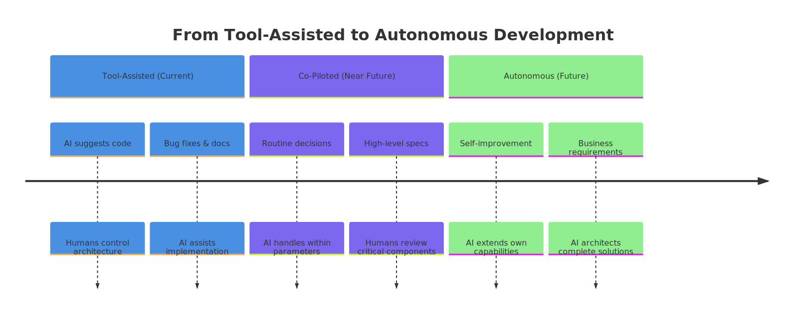
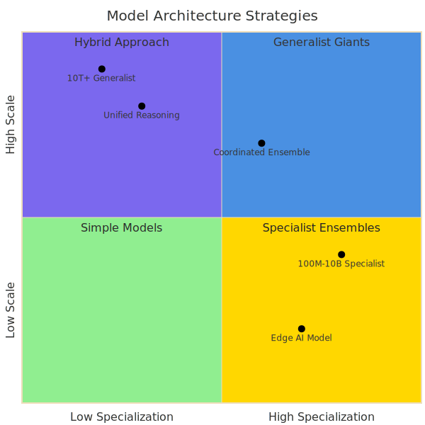

# Chapter 12: The Future of AI-Native Development

## Introduction

As we stand at the precipice of a new era in software development, the patterns and practices explored throughout this book represent not an endpoint, but a beginning. The AI-native development paradigm, exemplified by systems like OpenClaw, is undergoing rapid evolution—transforming from experimental frameworks into foundational infrastructure that will power the next generation of intelligent systems.

This chapter looks ahead at the emerging trends, challenges, and opportunities in AI-native development. Drawing from the eight architectural patterns and five anti-patterns identified in our research—from the Skill Blueprint Pattern to the Gateway-Mediated Multi-Agent Pattern—we'll explore how these foundational concepts will evolve, adapt, and scale in response to technological advancements and societal needs.

The future of AI-native development is not merely a linear extrapolation of current trends, but a complex interplay between technological capability, human need, ethical consideration, and economic reality. As AI systems become more capable, autonomous, and integrated into our daily lives, the patterns we establish today will shape the infrastructure of tomorrow.

Our exploration will be grounded in the current OpenClaw ecosystem while reaching forward to anticipate the transformations ahead. We'll examine emerging technologies, scalability challenges, ethical considerations, and make specific predictions for the next five years. Through this analysis, we'll identify the enduring principles that will guide AI-native development through its coming maturation and the evolving patterns that will emerge to meet new challenges.

## 12.1 The Trajectory of AI-Native Development

### Current State of the Art and Its Limitations

The present moment in AI-native development represents a transitional phase between traditional software engineering augmented by AI tools and truly AI-native systems designed from the ground up for autonomous intelligence. The patterns identified in our research—particularly the **Micro-Skill Architecture Pattern** and **Gateway-Mediated Multi-Agent Pattern**—have emerged organically as pragmatic solutions to immediate challenges rather than as part of a comprehensive theoretical framework.

**Current Capabilities:**
- **Tool-augmented workflows:** Most systems today follow the "human in the loop" model, where AI agents assist with specific tasks but require human oversight and direction.
- **Specialized single-purpose agents:** The **Micro-Skill Architecture Pattern** has enabled rapid development of focused capabilities but faces coordination challenges at scale.
- **File-based memory systems:** The **File-Based Memory Pattern** provides human-readable persistence but struggles with performance and concurrency as systems grow.
- **Environment-first configuration:** While effective for deployment flexibility, current implementations face challenges with configuration discovery and validation.

**Key Limitations:**
1. **Context window constraints:** Current models have limited context windows that restrict complex, long-running tasks without manual intervention.
2. **Tool coordination overhead:** While the **Gateway-Mediated Multi-Agent Pattern** centralizes coordination, it creates single points of failure and performance bottlenecks.
3. **Knowledge brittleness:** The **File-Based Memory Pattern**'s append-only approach preserves history but makes knowledge retrieval and synthesis inefficient.
4. **Testing and validation gaps:** The **Example-Driven Testing Pattern** focuses on practical functionality but may miss edge cases and lacks automated regression protection.

### Key Drivers for Future Evolution

Three primary forces will drive the evolution of AI-native development:

**1. Model Capability Advances:**
- **Longer context windows** enabling more complex reasoning and task persistence
- **Improved reasoning capabilities** through chain-of-thought, tree-of-thought, and other advanced prompting techniques
- **Multimodal integration** allowing seamless processing of text, images, audio, and video
- **Specialized fine-tuned models** optimized for specific domains or tasks

**2. Infrastructure Maturation:**
- **Standardized tool interfaces** that enable seamless interoperability between different AI systems
- **Advanced memory systems** moving beyond file-based approaches to structured knowledge graphs
- **Distributed coordination mechanisms** evolving beyond centralized gateways to peer-to-peer architectures
- **Automated testing frameworks** that build upon example-driven approaches with formal verification

**3. Economic and Social Factors:**
- **Cost optimization pressures** driving efficiency in token usage and compute resources
- **Regulatory requirements** establishing safety, privacy, and accountability standards
- **Market demands** for more capable, reliable, and transparent AI systems
- **Community growth** expanding the pool of contributors and accelerating innovation

### Transition from "Tool-Assisted" to "AI-Orchestrated" Development

The most significant shift in AI-native development will be the transition from tools that assist human developers to systems that orchestrate development autonomously. This evolution parallels the historical transition from assembly language programming to high-level languages—each step abstracts complexity and enables more sophisticated applications.

**Phases of Transition:**

1. **Tool-Assisted Development (Current):**
   - AI suggests code, fixes bugs, and generates documentation
   - Humans remain in control of architecture, design, and major decisions
   - Systems follow patterns like **Micro-Skill Architecture** and **Tool-Based Error Recovery**

2. **Co-Piloted Development (Near Future):**
   - AI handles routine implementation decisions within defined parameters
   - Humans provide high-level specifications and review critical components
   - Systems implement advanced versions of **Gateway-Mediated Multi-Agent** coordination

3. **AI-Orchestrated Development (Emerging):**
   - AI systems interpret business requirements and architect complete solutions
   - Humans define goals, constraints, and ethical boundaries
   - Systems employ sophisticated versions of all identified patterns with enhanced autonomy

4. **Autonomous Development (Future Vision):**
   - AI systems self-improve, extend capabilities, and adapt to changing requirements
   - Humans provide strategic direction and oversight
   - Systems evolve beyond current patterns to novel architectures optimized for self-modification

### The Role of Open-Source in Shaping the Future

Open-source development has been instrumental in the rapid advancement of AI-native systems, and this trend will accelerate. The **AI-First Contribution Pattern** identified in our research—welcoming AI-assisted contributions with transparent disclosure—represents a paradigm shift in collaborative development that will become increasingly important.

**Future Open-Source Dynamics:**

1. **Accelerated Innovation:** Community-driven development will continue to outpace proprietary approaches, particularly in exploratory areas where diverse perspectives drive creativity.

2. **Standardization Through Adoption:** Successful patterns and interfaces will emerge organically from popular open-source projects, creating de facto standards.

3. **Transparent Safety Development:** Open scrutiny of AI safety mechanisms will build trust and enable collective improvement of guardrails and ethical constraints.

4. **Educational Resource Creation:** Open-source projects will serve as living textbooks, with real-world implementations demonstrating advanced AI-native patterns.

5. **Economic Sustainability Models:** New funding mechanisms (protocol-based incentives, collective licensing, etc.) will emerge to support sustainable open-source AI development.

The OpenClaw ecosystem exemplifies this open-source advantage, with its patterns emerging from community needs rather than top-down design. This bottom-up innovation will continue to drive progress as the ecosystem scales.

## 12.2 Emerging Technologies and Trends

### 12.2.1 Advanced AI Architectures

**Transformation from LLMs to Large World Models (LWMs)**

The current generation of Large Language Models (LLMs) will evolve into Large World Models (LWMs)—systems capable of understanding and interacting with complex, multifaceted environments. This transition represents more than just increased parameter counts; it signifies a fundamental shift in how AI systems perceive and engage with the world.

**Key Characteristics of LWMs:**

1. **Multimodal Foundation:** Unlike text-only LLMs, LWMs will process text, images, audio, video, and sensor data as native input formats, enabling richer understanding of context and environment.

2. **Temporal Understanding:** LWMs will incorporate temporal reasoning, understanding sequences of events, causality, and long-term consequences—addressing limitations in the current **File-Based Memory Pattern**.

3. **Spatial Reasoning:** Future models will understand and reason about spatial relationships, physical constraints, and geometric properties, enabling more sophisticated interaction with the physical world.

4. **Causal Inference:** Moving beyond correlation to understanding causation will allow AI systems to make more reliable predictions and interventions.

**Implications for AI-Native Patterns:**

- **Enhanced Skill Blueprint Pattern:** Skill definitions will expand to include multimodal capabilities, temporal constraints, and spatial requirements.
- **Advanced Gateway Coordination:** LWMs will enable more sophisticated agent coordination through shared world models rather than simple message passing.
- **Evolution of Memory Patterns:** The **File-Based Memory Pattern** will evolve to incorporate structured representations of temporal sequences and causal relationships.

**Multimodal Integration as Primary Interfaces**

The future of human-AI interaction will be predominantly multimodal, with natural language serving as just one of many communication channels. This shift will fundamentally change how AI-native systems are designed and deployed.

**Multimodal Interface Components:**

1. **Visual Programming:** AI systems will interpret diagrams, flowcharts, and visual specifications as primary input, enabling more intuitive specification of complex systems.

2. **Voice-First Interaction:** Natural speech will become the default interface for many applications, with AI systems understanding tone, emotion, and contextual nuance.

3. **Gesture and Motion Recognition:** Physical interactions will enable richer control of AI systems, particularly in mixed-reality environments.

4. **Biological Signal Processing:** Brain-computer interfaces and biometric sensors will allow AI systems to respond to user states, intentions, and cognitive loads.

**Impact on Development Patterns:**

- The **Micro-Skill Architecture Pattern** will expand to include multimodal input and output capabilities as standard components.
- The **Gateway-Mediated Multi-Agent Pattern** will need to route not just text messages but multimodal streams between specialized agents.
- The **Tool-Based Error Recovery Pattern** will incorporate multimodal error reporting and debugging.

**Specialist Model Ensembles vs. Generalist Giants**

The AI landscape will bifurcate into two complementary approaches: massive generalist models capable of broad reasoning, and specialized ensembles of smaller models optimized for specific tasks.

**Generalist Giants:**
- **Single massive models** (10T+ parameters) with broad capabilities across domains
- **Advantages:** Unified reasoning, consistent behavior, simplified deployment
- **Challenges:** Computational intensity, single points of failure, update complexity
- **Best for:** Applications requiring broad general knowledge and reasoning

**Specialist Ensembles:**
- **Collections of specialized models** (100M-10B parameters) coordinated through advanced orchestration
- **Advantages:** Efficiency, modularity, fault tolerance, focused optimization
- **Challenges:** Coordination overhead, integration complexity, consistency maintenance
- **Best for:** Complex systems requiring diverse expertise and high reliability

**Hybrid Approaches:**

The most effective systems will likely combine both approaches, using generalist models for broad reasoning and planning while delegating specific tasks to specialized ensembles. This mirrors the **Gateway-Mediated Multi-Agent Pattern** but at the model level rather than the agent level.

**On-Device and Edge AI Specialization**

As AI capabilities proliferate, there will be increasing demand for on-device and edge AI solutions that operate without continuous cloud connectivity. This trend will drive specialization in several key areas:

**Edge AI Requirements:**

1. **Resource Constraints:** Models must operate within strict memory, compute, and power budgets.
2. **Latency Sensitivity:** Many applications require real-time responses without network latency.
3. **Privacy Preservation:** On-device processing keeps sensitive data local.
4. **Reliability:** Edge AI must function during network outages or connectivity issues.

**Implications for AI-Native Development:**

- **Specialized Edge Patterns:** New patterns will emerge for distributing intelligence between cloud and edge components.
- **Adaptive Skill Architecture:** The **Micro-Skill Architecture Pattern** will evolve to support skills with variable resource requirements.
- **Intermittent Connectivity:** The **Tool-Based Error Recovery Pattern** will need to handle network disconnections gracefully.

### 12.2.2 Revolutionary Tooling

**AI-Native Operating Systems and Kernels**

Current operating systems were designed for human interaction and traditional software execution. The next generation will be built from the ground up for AI-native operation, fundamentally reimagining system architecture.

**Core Principles of AI-Native OS:**

1. **Natural Language as Primary Interface:** The command line and graphical interfaces become secondary to natural language interaction.

2. **Intent-Based Execution:** Systems interpret high-level intentions rather than executing specific commands.

3. **Continuous Learning:** The OS learns from user behavior, system performance, and environmental changes.

4. **Proactive Assistance:** Systems anticipate needs and offer assistance before explicit requests.

5. **Self-Optimization:** The OS continuously tunes its own performance and resource allocation.

**Key Components:**

- **AI Kernel:** Core system services optimized for AI workloads, including specialized memory management, task scheduling, and security enforcement.
- **Intent Parser:** Converts natural language requests into executable plans considering context, permissions, and constraints.
- **Skill Marketplace:** Integrated repository of AI capabilities following enhanced **Skill Blueprint Patterns**.
- **Memory Fabric:** Advanced implementation of memory patterns with efficient retrieval, summarization, and synthesis.
- **Safety Layer:** Built-in implementation of guardrails and ethical constraints at the system level.

**Natural Language as a Universal Programming Interface**

Natural language will evolve from an input modality to the primary programming interface for AI-native systems. This transition represents a fundamental democratization of software development.

**Components of Natural Language Programming:**

1. **Specification Language:** A structured subset of natural language for unambiguous system specification.
2. **Intent Compiler:** Translates natural language specifications into executable plans.
3. **Clarification Protocol:** Systems ask clarifying questions when specifications are ambiguous or incomplete.
4. **Example-Based Learning:** Systems learn from examples of successful implementations.
5. **Iterative Refinement:** Developers and AI systems collaborate to refine specifications through dialogue.

**Impact on Development Patterns:**

- The **Skill Blueprint Pattern** will evolve to include natural language specifications as a primary component.
- The **AI-First Contribution Pattern** will become even more important as natural language lowers barriers to contribution.
- The **Example-Driven Testing Pattern** will expand to include natural language test specifications.

**Self-Evolving and Self-Documenting Codebases**

Future AI-native systems will exhibit unprecedented levels of autonomy in their own development and maintenance.

**Self-Evolution Capabilities:**

1. **Automated Refactoring:** Systems continuously improve code structure, performance, and maintainability.
2. **Pattern Recognition and Application:** Systems identify emerging patterns and apply them consistently across the codebase.
3. **Dependency Management:** Systems proactively update dependencies, manage version conflicts, and test compatibility.
4. **Architecture Optimization:** Systems evolve architectural patterns based on performance data and changing requirements.
5. **Security Patching:** Systems identify and fix vulnerabilities, often before they're publicly disclosed.

**Self-Documentation Features:**

1. **Automatic Documentation Generation:** Systems create and maintain documentation synchronized with code changes.
2. **Interactive Documentation:** Documentation becomes executable, allowing users to explore system behavior through examples.
3. **Change Explanation:** Systems explain the rationale behind changes in natural language.
4. **Architecture Visualization:** Systems generate and update architectural diagrams as the system evolves.
5. **Learning Resources:** Systems create tutorials, examples, and learning paths based on user interactions.

**Real-Time Collaborative AI-Human Development Environments**

Development environments will transform from individual tools to collaborative spaces where humans and AI systems work together in real-time.

**Collaborative Environment Features:**

1. **Shared Context:** Humans and AI systems share understanding of goals, constraints, and progress.
2. **Role Awareness:** Systems understand human roles (developer, tester, product manager) and adapt their assistance accordingly.
3. **Contextual Assistance:** AI systems provide relevant suggestions based on current focus and recent history.
4. **Conflict Resolution:** Systems help resolve disagreements between team members through clarification and mediation.
5. **Progress Visualization:** Real-time dashboards show project status, bottlenecks, and emerging issues.

**Integration with Existing Patterns:**

- Enhanced **Gateway-Mediated Multi-Agent Pattern** coordinates multiple AI assistants with human team members.
- Advanced **File-Based Memory Pattern** maintains shared context across collaboration sessions.
- Evolved **Tool-Based Error Recovery Pattern** handles coordination failures and misunderstandings.

### 12.2.3 Novel Memory and Knowledge Systems

**Neural-Symbolic Integration for Reasoning and Memory**

The future of AI memory lies in integrating neural approaches (which excel at pattern recognition) with symbolic approaches (which excel at logical reasoning). This hybrid approach addresses limitations in current **File-Based Memory Patterns**.

**Neural-Symbolic Architecture Components:**

1. **Neural Encoder:** Converts experiences, observations, and interactions into structured representations.
2. **Symbolic Reasoner:** Applies logical rules and constraints to neural representations.
3. **Memory Index:** Efficiently stores and retrieves memories based on multiple access patterns.
4. **Abstraction Engine:** Creates higher-level concepts and generalizations from specific experiences.
5. **Forgetting Mechanism:** Intelligently prioritizes and archives less relevant memories.

**Advantages Over Current Approaches:**

- **Better Generalization:** Systems can apply lessons from specific experiences to broader classes of problems.
- **Improved Reasoning:** Symbolic constraints prevent logical inconsistencies that plague purely neural approaches.
- **Efficient Retrieval:** Structured representations enable faster, more relevant memory access.
- **Explainable Decisions:** Systems can trace decisions back to logical premises and supporting evidence.

**Dynamic, Real-Time Knowledge Graphs as Memory Backends**

File-based memory systems will evolve into dynamic knowledge graphs that maintain rich relationships between concepts, experiences, and capabilities.

**Knowledge Graph Features:**

1. **Temporal Relationships:** Memories include when events occurred and how they relate temporally.
2. **Causal Links:** Systems maintain hypotheses about cause-and-effect relationships.
3. **Confidence Scores:** Memories include uncertainty estimates and supporting evidence.
4. **Contextual Embedding:** Memories are stored with rich context about the situation in which they were acquired.
5. **Incremental Learning:** New information integrates seamlessly with existing knowledge without catastrophic forgetting.

**Implementation Requirements:**

- **Scalable Storage:** Efficient handling of billions of nodes and relationships.
- **Real-Time Updates:** Support for continuous learning and knowledge refinement.
- **Query Optimization:** Fast retrieval of relevant knowledge across complex relationship networks.
- **Consistency Maintenance:** Ensuring logical consistency across the knowledge graph.
- **Privacy Preservation:** Selective sharing and obfuscation of sensitive knowledge.

**Federated Memory Across Agent Ecosystems**

As AI systems become more distributed, memory will need to span multiple agents, devices, and environments while maintaining consistency and privacy.

**Federated Memory Architecture:**

1. **Local Memory Stores:** Each agent maintains its own memory optimized for its specific needs and constraints.
2. **Shared Memory Protocol:** Standardized interfaces for memory sharing and synchronization.
3. **Consensus Mechanisms:** Methods for resolving conflicts between different agents' memories.
4. **Privacy-Preserving Sharing:** Techniques for sharing useful knowledge without exposing sensitive details.
5. **Provenance Tracking:** Maintaining lineage information for shared memories.

**Challenges and Solutions:**

- **Consistency vs. Availability:** Trade-offs between immediate consistency and system availability, similar to distributed databases.
- **Trust Establishment:** Mechanisms for determining which agents to trust and how much.
- **Incentive Alignment:** Ensuring agents have motivation to contribute to shared memory.
- **Scalability:** Efficient coordination across potentially millions of agents.

**Long-Term Personality and Context Persistence Across Lifetimes**

Future AI systems will maintain consistent personalities, preferences, and contexts across sessions, deployments, and even hardware migrations—addressing a key limitation in current session-based approaches.

**Personality Persistence Components:**

1. **Core Identity:** Stable aspects of personality, values, and preferences that persist over time.
2. **Learning Trajectory:** History of experiences and how they've shaped the system's knowledge and capabilities.
3. **Relationship Memory:** Understanding of relationships with specific users, systems, and environments.
4. **Adaptation History:** Record of how the system has adapted to different contexts and requirements.
5. **Ethical Framework:** Persistent ethical constraints and decision-making principles.

**Implementation Considerations:**

- **Migration Protocols:** Standardized methods for transferring personality and context between systems.
- **Version Compatibility:** Handling evolution of personality representations over time.
- **Selective Forgetting:** Mechanisms for removing harmful or problematic aspects while preserving valuable experience.
- **Privacy Boundaries:** Clear separation between system personality and user data.

## 12.3 Scalability and Performance Challenges

### 12.3.1 Handling Complexity at Scale

**Managing Millions of Specialized Agents in a Single Ecosystem**

As AI-native systems expand, we'll need to coordinate not dozens or hundreds, but millions of specialized agents. This presents unprecedented coordination challenges that exceed the capabilities of current **Gateway-Mediated Multi-Agent Patterns**.

**Scalability Requirements:**

1. **Hierarchical Coordination:** Multi-level coordination structures that balance local autonomy with global coherence.
2. **Market-Based Mechanisms:** Economic approaches to resource allocation and task assignment.
3. **Emergent Organization:** Self-organizing structures that adapt to changing requirements.
4. **Fault Tolerance:** Systems must continue operating despite failures of individual agents or coordination components.
5. **Performance Monitoring:** Comprehensive observability across the entire ecosystem.

**Novel Coordination Patterns:**

- **Swarm Intelligence:** Inspiration from biological systems (ants, bees, flocks) for decentralized coordination.
- **Blockchain-Based Consensus:** Distributed ledger approaches for maintaining consistency without central authorities.
- **Game-Theoretic Mechanisms:** Incentive structures that encourage cooperative behavior.
- **Reinforcement Learning for Coordination:** Agents learn coordination strategies through experience.
- **Evolutionary Algorithms:** Emergent coordination through selection and variation.

**Coordination Bottlenecks in High-Scale Multi-Agent Systems**

Current centralized coordination approaches will fail at extreme scales. Future systems must address several key bottlenecks:

**Critical Bottlenecks:**

1. **Message Routing:** Efficient delivery of messages between specific agents or agent classes.
2. **State Synchronization:** Maintaining consistent views of shared state across large numbers of agents.
3. **Resource Contention:** Managing competition for limited computational resources.
4. **Task Assignment:** Matching tasks to appropriate agents with minimal overhead.
5. **Conflict Resolution:** Resolving disagreements between agents efficiently.

**Solutions and Trade-offs:**

- **Partial Centralization:** Critical coordination functions remain centralized while routine interactions are decentralized.
- **Locality Optimization:** Agents specializing in related tasks are co-located to reduce communication overhead.
- **Predictive Coordination:** Anticipating coordination needs based on patterns and proactively allocating resources.
- **Adaptive Topology:** Network structure dynamically reconfigures based on current communication patterns.
- **Compressed Communication:** Efficient encoding of messages to reduce bandwidth requirements.

**Complexity Management for Hyper-Extensible Systems**

The **Micro-Skill Architecture Pattern** enables rapid extension but creates challenges at scale. Future systems must manage this complexity without sacrificing extensibility.

**Complexity Management Strategies:**

1. **Automated Taxonomy Generation:** Systems automatically categorize and organize skills based on functionality, dependencies, and usage patterns.
2. **Dependency Analysis:** Comprehensive understanding of skill interdependencies to prevent conflicts and ensure compatibility.
3. **Interface Standardization:** Evolving standards for skill interfaces that balance flexibility with interoperability.
4. **Version Compatibility Management:** Automated handling of skill version conflicts and compatibility requirements.
5. **Usage Pattern Analysis:** Identification of commonly used skill combinations and optimization of their coordination.

**Tools and Techniques:**

- **Skill Marketplaces:** Curated repositories with quality controls and compatibility guarantees.
- **Automated Testing Suites:** Comprehensive testing of skill interactions at scale.
- **Performance Profiling:** Continuous monitoring of skill performance and resource usage.
- **Security Auditing:** Automated analysis of skill security implications and potential vulnerabilities.
- **Documentation Generation:** Automated creation and maintenance of ecosystem documentation.

**Performance Optimization for Real-Time AI Responses**

As AI systems move into time-critical applications (autonomous vehicles, industrial control, financial trading), performance optimization becomes essential rather than optional.

**Optimization Targets:**

1. **Latency Reduction:** Minimizing time from request to response, particularly for interactive applications.
2. **Throughput Maximization:** Handling large volumes of requests efficiently.
3. **Resource Efficiency:** Achieving maximum capability with minimum computational resources.
4. **Predictable Performance:** Consistent response times rather than variable performance.
5. **Graceful Degradation:** Maintaining acceptable performance under load or partial failure.

**Optimization Techniques:**

- **Model Distillation:** Creating smaller, faster models that preserve essential capabilities.
- **Specialized Hardware:** AI accelerators optimized for specific model architectures or operations.
- **Caching Strategies:** Intelligent caching of common computations and intermediate results.
- **Parallel Processing:** Efficient distribution of computation across available resources.
- **Adaptive Computation:** Varying computational effort based on request priority and available resources.

### 12.3.2 Resource and Cost Optimization

**Scaling AI Capabilities While Maintaining Economic Efficiency**

The economic reality of AI deployment will drive relentless focus on cost optimization, moving beyond the simple token counting of today's systems.

**Cost Optimization Strategies:**

1. **Dynamic Model Selection:** Automatically choosing the most cost-effective model for each task based on complexity, accuracy requirements, and available options.
2. **Task Decomposition:** Breaking complex tasks into subtasks that can be solved by specialized, cost-efficient models.
3. **Result Caching:** Storing and reusing results of expensive computations when appropriate.
4. **Approximate Computing:** Trading exactness for efficiency when precision requirements allow.
5. **Resource Sharing:** Efficient multiplexing of computational resources across multiple tasks or users.

**Economic Models:**

- **Pay-per-Use:** Fine-grained accounting of resource consumption with real-time cost feedback.
- **Subscription Services:** Predictable costs for defined capability bundles.
- **Hybrid Approaches:** Combining subscription baselines with pay-per-use for peak demand.
- **Resource Markets:** Dynamic pricing based on supply and demand for computational resources.
- **Efficiency Incentives:** Economic rewards for systems that achieve goals with minimal resource consumption.

**Sustainable AI: Energy Efficiency and Carbon Footprint Considerations**

As AI systems scale, their environmental impact becomes increasingly significant. Sustainable AI practices will evolve from optional considerations to essential requirements.

**Sustainability Measures:**

1. **Carbon-Aware Scheduling:** Scheduling computation for times and locations with low-carbon energy availability.
2. **Energy-Efficient Model Architectures:** Designs that minimize energy consumption per computation.
3. **Hardware Optimization:** Matching model characteristics to hardware capabilities for maximum efficiency.
4. **Lifecycle Analysis:** Considering environmental impact across the entire lifecycle of AI systems.
5. **Circular Economy Principles:** Designing for reuse, repair, and recycling of AI hardware and software components.

**Metrics and Reporting:**

- **Carbon Intensity:** Emissions per unit of computation or per task completed.
- **Energy Efficiency:** Useful computation per unit of energy consumed.
- **Resource Utilization:** Efficient use of computational resources to minimize waste.
- **Environmental Impact Assessments:** Comprehensive evaluation of environmental consequences.
- **Transparency Reporting:** Public disclosure of environmental performance.

**Distributed and Decentralized Compute Markets**

The centralized cloud computing model will evolve toward distributed markets where computational resources are traded like commodities.

**Market Characteristics:**

1. **Diverse Supply:** Resources from data centers, edge devices, personal computers, and specialized hardware.
2. **Dynamic Pricing:** Real-time prices reflecting supply, demand, location, and energy costs.
3. **Quality Differentiation:** Resources characterized by capability, reliability, latency, and other attributes.
4. **Automated Trading:** AI systems participating directly in markets to acquire needed resources.
5. **Trust Mechanisms:** Systems for verifying resource quality and ensuring payment.

**Technical Requirements:**

- **Standardized Resource Description:** Common language for describing computational capabilities and requirements.
- **Efficient Task Distribution:** Methods for dividing work across heterogeneous resources.
- **Fault Tolerance:** Handling resource failures and network partitions gracefully.
- **Security and Privacy:** Protecting computation and data in untrusted environments.
- **Legal and Regulatory Compliance:** Adhering to jurisdiction-specific requirements.

**Automated Cost-Benefit Analysis for Every AI Operation**

Future AI systems will perform continuous economic analysis of their own operations, optimizing not just for technical correctness but for economic efficiency.

**Analysis Components:**

1. **Cost Accounting:** Precise tracking of all costs associated with each operation, including computation, storage, network, and environmental impacts.
2. **Benefit Estimation:** Quantifying the value created by successful operations.
3. **Opportunity Cost Consideration:** Evaluating alternative uses of resources.
4. **Risk Assessment:** Considering potential costs of failures or errors.
5. **Long-Term Value:** Balancing immediate costs against long-term benefits.

**Decision-Making Integration:**

- **Automated Trade-off Analysis:** Systems make explicit trade-offs between cost, speed, accuracy, and other dimensions.
- **Budget-Aware Operation:** Systems operate within defined budget constraints.
- **Value-Based Prioritization:** Tasks are prioritized based on expected value rather than arrival order.
- **Adaptive Resource Allocation:** Resources shift dynamically to highest-value uses.
- **Transparent Justification:** Systems explain their economic decisions in understandable terms.

### 12.3.3 Data and Knowledge Management

**Managing Exabytes of AI-Generated and Collected Data**

AI systems will generate and process unprecedented volumes of data, requiring new approaches to data management that go far beyond current **File-Based Memory Patterns**.

**Data Management Challenges:**

1. **Volume:** Handling exabytes of data efficiently and cost-effectively.
2. **Velocity:** Processing streaming data in real-time while maintaining historical context.
3. **Variety:** Integrating diverse data types (text, images, audio, sensor readings, etc.) into coherent knowledge.
4. **Veracity:** Assessing and managing data quality, reliability, and provenance.
5. **Value:** Extracting actionable insights from massive datasets.

**Scalable Architectures:**

- **Hierarchical Storage:** Automatic migration of data between storage tiers based on access patterns.
- **Distributed Processing:** Efficient parallel processing across large clusters.
- **Incremental Learning:** Continuous integration of new data without retraining from scratch.
- **Selective Retention:** Intelligent decisions about what data to keep, summarize, or discard.
- **Compression and Deduplication:** Reducing storage requirements without losing essential information.

**Data Quality and Provenance in a Synthetic-Data World**

As AI systems generate increasingly synthetic data (for training, testing, or simulation), maintaining data quality and understanding provenance becomes critical.

**Provenance Tracking:**

1. **Complete Lineage:** Recording the origin and transformation history of each data element.
2. **Quality Metrics:** Continuous assessment of data accuracy, completeness, and reliability.
3. **Bias Detection:** Identifying and correcting biases in training data and generated content.
4. **Synthetic Data Marking:** Clear labeling of AI-generated content to prevent confusion with human-created content.
5. **Attribution Systems:** Proper credit for data sources and transformations.

**Quality Assurance Mechanisms:**

- **Automated Validation:** Continuous checking of data against defined quality standards.
- **Human-in-the-Loop Verification:** Strategic human oversight of critical data quality decisions.
- **Cross-Validation:** Using multiple methods to verify data quality.
- **Feedback Integration:** Incorporating user feedback to improve data quality over time.
- **Transparency Reporting:** Clear communication of data quality and limitations.

**Efficient Search and Retrieval Across Massive Knowledge Bases**

As knowledge bases grow to unprecedented scales, efficient search and retrieval become critical capabilities that exceed current file-based approaches.

**Advanced Retrieval Techniques:**

1. **Semantic Search:** Understanding meaning rather than just matching keywords.
2. **Context-Aware Retrieval:** Considering the current situation and goals when searching.
3. **Multi-Modal Search:** Finding relevant information across text, images, audio, and other modalities.
4. **Temporal Search:** Understanding when information was relevant and how it has evolved.
5. **Causal Search:** Finding information based on cause-and-effect relationships.

**Performance Optimization:**

- **Intelligent Indexing:** Creating indexes optimized for expected query patterns.
- **Approximate Search:** Trading exactness for speed when appropriate.
- **Distributed Search:** Parallel search across partitioned knowledge bases.
- **Caching Strategies:** Intelligent caching of common queries and results.
- **Query Optimization:** Reformulating queries for more efficient execution.

**Privacy-Preserving Data Sharing at Scale**

As AI systems collaborate, they need to share knowledge while protecting privacy—a challenge that will require new approaches beyond simple access controls.

**Privacy-Preserving Techniques:**

1. **Federated Learning:** Training models on decentralized data without central collection.
2. **Differential Privacy:** Adding controlled noise to protect individual data points.
3. **Homomorphic Encryption:** Computing on encrypted data without decryption.
4. **Secure Multi-Party Computation:** Joint computation without revealing private inputs.
5. **Synthetic Data Generation:** Creating realistic but artificial data for sharing.

**Implementation Considerations:**

- **Privacy-Utility Trade-offs:** Balancing privacy protection with data usefulness.
- **Granular Controls:** Fine-grained privacy settings for different data elements and use cases.
- **Audit Trails:** Comprehensive logging of data access and usage.
- **Compliance Automation:** Automated enforcement of privacy regulations.
- **Transparent Policies:** Clear communication of privacy practices and controls.

## 12.4 Ethical and Societal Considerations

### 12.4.1 Bias and Fairness in Autonomous Systems

**Detecting and Mitigating Bias in Complex Agent Interactions**

As AI systems become more autonomous and interconnected, bias can emerge not just in individual models but in the complex interactions between multiple agents—a challenge that exceeds current guardrail approaches.

**Multi-Agent Bias Sources:**

1. **Emergent Bias:** Biases that arise from interactions between unbiased individual agents.
2. **Amplification Effects:** Small biases in individual agents magnified through coordinated action.
3. **Compositional Bias:** Biases created by combining specialized agents in specific ways.
4. **Feedback Loops:** Biases reinforced through agent interactions with their environment or users.
5. **Strategic Bias:** Agents developing biased behavior as optimal strategies within multi-agent systems.

**Detection and Mitigation Strategies:**

- **Interaction Monitoring:** Observing agent interactions for emergent bias patterns.
- **Diversity Requirements:** Ensuring agent populations have diverse perspectives and capabilities.
- **Fairness Constraints:** Mathematical formulations of fairness applied to multi-agent systems.
- **Bias Auditing:** Regular assessment of bias at both individual and system levels.
- **Corrective Mechanisms:** Interventions to correct biased behavior without disrupting system function.

**Ensuring Fairness Across Diverse User Populations**

AI systems must serve diverse user populations fairly, accounting for differences in language, culture, ability, and access.

**Fairness Dimensions:**

1. **Demographic Fairness:** Equal treatment across age, gender, ethnicity, and other demographic characteristics.
2. **Geographic Fairness:** Consistent service quality across different regions and connectivity levels.
3. **Economic Fairness:** Accessibility across economic strata, not just to those who can pay.
4. **Ability Fairness:** Usability by people with different physical and cognitive abilities.
5. **Cultural Fairness:** Respect for diverse cultural norms, values, and communication styles.

**Implementation Approaches:**

- **Inclusive Design:** Designing systems from the beginning for diverse user populations.
- **Continuous Evaluation:** Regular assessment of fairness across all relevant dimensions.
- **Adaptive Interfaces:** Systems that adapt to individual user needs and constraints.
- **Accessibility Standards:** Compliance with and extension of existing accessibility guidelines.
- **Community Involvement:** Engaging diverse communities in system design and evaluation.

**Transparency and Explainability in High-Autonomy Scenarios**

As AI systems make more significant decisions with less human oversight, transparency and explainability become essential for trust and accountability.

**Explainability Requirements:**

1. **Decision Rationale:** Clear explanation of why specific decisions were made.
2. **Alternative Consideration:** What alternatives were considered and why they were rejected.
3. **Uncertainty Communication:** Clear indication of confidence levels and potential errors.
4. **Impact Assessment:** Understanding of potential consequences of decisions.
5. **Learning Transparency:** How past experiences have influenced current behavior.

**Explainability Techniques:**

- **Natural Language Explanations:** Human-readable explanations of decisions and reasoning.
- **Visual Explanations:** Diagrams, heatmaps, and other visual aids for understanding.
- **Interactive Exploration:** Allowing users to probe decisions and ask follow-up questions.
- **Counterfactual Analysis:** Explaining what would need to change for a different decision.
- **Progressive Disclosure:** Providing explanations at different levels of detail based on user needs.

**Accountability for Autonomous Decisions**

When AI systems make autonomous decisions with real-world consequences, clear accountability mechanisms are essential.

**Accountability Framework:**

1. **Responsibility Assignment:** Clear rules for who is responsible for different types of decisions.
2. **Audit Trails:** Comprehensive records of decisions, reasoning, and outcomes.
3. **Error Handling:** Procedures for detecting, reporting, and correcting errors.
4. **Compensation Mechanisms:** Systems for addressing harm caused by erroneous decisions.
5. **Governance Structures:** Oversight mechanisms for autonomous systems.

**Implementation Considerations:**

- **Liability Models:** Legal frameworks for AI liability and responsibility.
- **Insurance Mechanisms:** Financial protection against AI errors and accidents.
- **Certification Standards:** Independent verification of system safety and reliability.
- **Whistleblower Protections:** Safeguards for those reporting problems with autonomous systems.
- **Public Accountability:** Transparency about system performance and issues.

### 12.4.2 Safety and Control

**Preventing Catastrophic Failures in Powerful AI Systems**

As AI systems become more capable and autonomous, the potential impact of failures increases, requiring robust safety measures.

**Safety Engineering Principles:**

1. **Defense in Depth:** Multiple layers of safety controls rather than relying on single mechanisms.
2. **Fail-Safe Design:** Systems default to safe states when failures occur.
3. **Graceful Degradation:** Gradual reduction of capability rather than catastrophic failure.
4. **Safety Margins:** Designing with substantial margins beyond expected requirements.
5. **Conservative Operation:** Preferring safety over performance in uncertain situations.

**Technical Safety Measures:**

- **Formal Verification:** Mathematical proof of safety properties.
- **Runtime Monitoring:** Continuous checking for unsafe behavior.
- **Constraint Enforcement:** Hard limits on potentially dangerous actions.
- **Redundancy:** Duplicate systems for critical functions.
- **Isolation:** Containing failures to prevent propagation.

**Human Oversight in an Increasingly Autonomous World**

Even highly autonomous systems require appropriate human oversight, though the nature of that oversight will evolve.

**Oversight Models:**

1. **Human-in-the-Loop:** Humans directly involved in decision-making.
2. **Human-on-the-Loop:** Humans monitoring autonomous operation with intervention capability.
3. **Human-in-Command:** Humans setting goals and constraints but not involved in execution.
4. **Selective Oversight:** Human focus on high-risk or novel situations.
5. **Collective Oversight:** Distributed oversight across multiple humans or organizations.

**Oversight Effectiveness:**

- **Attention Management:** Presenting information to humans in ways that support effective oversight.
- **Intervention Design:** Making it easy for humans to intervene when necessary.
- **Skill Maintenance:** Keeping human overseers proficient even as systems become more autonomous.
- **Trust Calibration:** Helping humans develop appropriate levels of trust in autonomous systems.
- **Fatigue Prevention:** Avoiding oversight fatigue that reduces effectiveness.

**Robustness Against Adversarial Attacks and Manipulation**

As AI systems become more integrated into critical infrastructure, they become targets for adversarial attacks requiring robust defenses.

**Attack Vectors:**

1. **Prompt Injection:** Manipulating AI behavior through crafted inputs.
2. **Training Data Poisoning:** Influencing AI behavior through manipulated training data.
3. **Model Extraction:** Stealing proprietary models through careful observation.
4. **Adversarial Examples:** Inputs designed to cause incorrect AI responses.
5. **Supply Chain Attacks:** Compromising AI systems through dependencies.

**Defense Strategies:**

- **Adversarial Training:** Training models to resist known attack patterns.
- **Input Validation:** Checking inputs for signs of manipulation.
- **Output Verification:** Validating AI responses before execution.
- **Diversity Defenses:** Using multiple models or approaches to reduce single points of failure.
- **Continuous Monitoring:** Looking for signs of attack or compromise.

**Alignment of AI Goals with Human Values**

Ensuring AI systems pursue goals aligned with human values becomes increasingly important as systems become more autonomous and capable.

**Alignment Challenges:**

1. **Value Specification:** Precisely defining human values in computable form.
2. **Value Learning:** Systems learning values from human behavior and feedback.
3. **Value Stability:** Maintaining consistent values as systems learn and evolve.
4. **Value Trade-offs:** Handling conflicts between different values or stakeholder groups.
5. **Value Evolution:** Adapting to changing human values over time.

**Alignment Approaches:**

- **Inverse Reinforcement Learning:** Inferring values from observed human behavior.
- **Debate and Discussion:** AI systems exploring value questions through structured dialogue.
- **Constitutional AI:** Systems governed by explicit constitutional principles.
- **Value Voting:** Aggregating value preferences across stakeholders.
- **Transparent Value Reasoning:** Making value-based reasoning explicit and understandable.

### 12.4.3 Economic and Social Impact

**Changes in the Software Development Profession**

AI-native development will transform software engineering careers, requiring new skills and creating new roles while changing existing ones.

**Emerging Roles:**

1. **AI Orchestrator:** Designing and managing systems of AI agents rather than writing code directly.
2. **Prompt Engineer:** Specializing in communicating with AI systems effectively.
3. **AI Safety Specialist:** Focusing on safety, ethics, and alignment of AI systems.
4. **AI-Human Interaction Designer:** Creating interfaces and workflows for human-AI collaboration.
5. **AI Systems Architect:** Designing the overall architecture of AI-native systems.

**Skill Evolution:**

- **From Coding to Orchestration:** Less focus on writing code, more on designing systems and specifying behavior.
- **From Implementation to Evaluation:** Greater emphasis on testing, validation, and quality assurance.
- **From Technical to Ethical:** Increased importance of ethical reasoning and value alignment.
- **From Individual to Collaborative:** More work in teams that include both humans and AI systems.
- **From Static to Adaptive:** Continuous learning and adaptation as systems evolve.

**Accessibility and the Digital Divide in AI-Native Systems**

As AI becomes more powerful, ensuring equitable access becomes critical to prevent exacerbating existing inequalities.

**Accessibility Challenges:**

1. **Economic Barriers:** Cost of advanced AI systems creating advantages for wealthy individuals and organizations.
2. **Technical Barriers:** Complexity requiring specialized knowledge and infrastructure.
3. **Language Barriers:** Dominance of English and other major languages in AI development.
4. **Cultural Barriers:** Systems designed with specific cultural assumptions.
5. **Regulatory Barriers:** Different legal frameworks affecting availability across regions.

**Equitable Access Strategies:**

- **Open-Source Development:** Making core technologies freely available.
- **Public Infrastructure:** Government investment in AI infrastructure accessible to all.
- **Education and Training:** Programs to develop AI literacy across populations.
- **Multilingual Development:** Building systems that work well across languages.
- **Cultural Adaptation:** Designing systems that respect and adapt to local contexts.

**Intellectual Property and Ownership in AI-Generated Code**

As AI systems generate more software, questions of intellectual property become increasingly complex.

**IP Challenges:**

1. **Authorship Determination:** Who owns code generated by AI systems?
2. **Training Data Rights:** Rights associated with code used to train AI systems.
3. **Derivative Works:** When does AI-generated code become a derivative work?
4. **Patent Eligibility:** Can AI-generated inventions be patented?
5. **Open-Source Compliance:** Ensuring AI-generated code complies with license requirements.

**Potential Solutions:**

- **Human Authorship Requirement:** Requiring substantial human contribution for copyright protection.
- **AI-Specific Licensing:** New license models designed for AI-generated content.
- **Attribution Systems:** Tracking contributions from both humans and AI systems.
- **Compensation Mechanisms:** Systems for compensating original creators when their work trains AI systems.
- **International Harmonization:** Aligning IP approaches across different jurisdictions.

**Societal Trust and Adoption of AI-Native Technologies**

Widespread adoption of AI-native systems requires building and maintaining societal trust.

**Trust Building Factors:**

1. **Reliability:** Consistent, predictable performance.
2. **Transparency:** Understanding how systems work and make decisions.
3. **Safety:** Confidence that systems won't cause harm.
4. **Privacy:** Respect for personal data and boundaries.
5. **Accountability:** Clear responsibility when things go wrong.

**Adoption Strategies:**

- **Gradual Introduction:** Phased deployment with increasing autonomy.
- **Public Education:** Helping people understand AI capabilities and limitations.
- **Independent Verification:** Third-party assessment of system safety and fairness.
- **User Control:** Giving users meaningful control over AI behavior.
- **Responsive Governance:** Adapting regulations as technology evolves.

## 12.5 Predictions for the Next Five Years

### 12.5.1 Year 1-2: Integration and Refinement

**Standardization of AI-Native Patterns**

The patterns identified in this book will become formalized standards, with reference implementations, best practice guides, and certification programs. The **Skill Blueprint Pattern** will evolve into industry-standard skill definitions, while the **Gateway-Mediated Multi-Agent Pattern** will see competing implementations with different trade-offs between centralization and decentralization.

**Key Developments:**
- Formal specification languages for AI skills and coordination patterns
- Interoperability standards enabling skills to work across different platforms
- Performance benchmarking for different pattern implementations
- Security certification programs for AI-native components

**Widespread Adoption of Multi-Agent Orchestration**

Multi-agent systems will move from research projects and specialized applications to mainstream business use. Companies will deploy teams of AI agents for customer service, data analysis, content creation, and process automation.

**Adoption Drivers:**
- Proven ROI from early adopters
- Mature tooling reducing implementation complexity
- Case studies demonstrating successful applications
- Vendor solutions offering packaged multi-agent capabilities

**Mature Security and Safety Guardrails Become Standard**

Security practices will evolve from ad hoc implementations to standardized frameworks. The security patterns discussed in Chapter 11 will be formalized into certification requirements and regulatory standards.

**Security Maturation:**
- Formal verification tools for AI safety properties
- Standardized security testing protocols
- Regulatory frameworks for high-risk AI applications
- Insurance products covering AI-related risks

**Rise of Personalized AI Assistants as Primary Interfaces**

Personal AI assistants will become the primary interface for many digital services, with systems learning individual preferences, communication styles, and needs over time.

**Personalization Features:**
- Cross-application consistency in assistant behavior
- Learning from long-term interaction history
- Adaptation to individual cognitive styles and preferences
- Integration with personal knowledge bases and workflows

### 12.5.2 Year 3-4: Autonomy and Specialization

**Significant Increase in Autonomous Operation Capabilities**

AI systems will operate with increasing autonomy, handling complex tasks with minimal human oversight. This will be enabled by advances in planning, reasoning, and error recovery capabilities.

**Autonomy Milestones:**
- Systems handling complete business processes from initiation to completion
- AI agents negotiating and coordinating with other AI systems
- Automated error recovery without human intervention
- Self-optimization based on performance data

**Emergence of Highly Specialized Agent Ecosystems**

Specialization will increase, with agents developing deep expertise in narrow domains. These specialized agents will coordinate through sophisticated market mechanisms and reputation systems.

**Specialization Trends:**
- Domain-specific agents with years of simulated experience
- Specialized agents for different regulatory environments
- Cultural and linguistic specialization for global markets
- Industry-specific agent ecosystems with shared knowledge

**Seamless Multimodal Integration Across All Devices**

Multimodal interaction will become the default, with AI systems seamlessly integrating text, voice, image, and gesture inputs across all devices and contexts.

**Integration Advances:**
- Consistent experience across mobile, desktop, AR/VR, and embedded devices
- Context-aware modality selection based on environment and task
- Cross-device continuity as users move between different interfaces
- Adaptive interfaces that learn preferred interaction modes

**Shift from Coding to Orchestrating AI-Native Systems**

Software development will increasingly focus on specifying desired outcomes and constraints rather than writing implementation code. Developers will become orchestrators of AI capabilities.

**Orchestration Tools:**
- Visual tools for designing agent workflows and interactions
- Natural language interfaces for system specification
- Simulation environments for testing multi-agent systems
- Performance optimization tools for distributed AI systems

### 12.5.3 Year 5+: The AI-Native World

**AI-Native Operating Systems and Hardware Become Common**

Specialized operating systems and hardware optimized for AI workloads will become standard, fundamentally changing how computing systems are designed and used.

**System Architecture Shifts:**
- AI-optimized processors in all computing devices
- Operating systems with AI capabilities as core features
- Storage systems optimized for AI knowledge representation
- Network protocols designed for AI agent communication

**Deep Integration Between Physical and Digital AI-Native Systems**

AI systems will bridge the physical and digital worlds, with agents controlling physical devices, processing sensor data, and interacting with the physical environment.

**Integration Dimensions:**
- Autonomous physical systems (robots, vehicles, drones) coordinated with digital agents
- Digital twins with continuous synchronization between physical and virtual representations
- Mixed reality interfaces blending physical and digital interactions
- Sensor networks providing rich environmental context to AI systems

**Standardized Inter-Agent Communication Across Platforms**

Different AI systems will communicate through standardized protocols, enabling seamless cooperation across organizational and technical boundaries.

**Communication Standards:**
- Universal agent identification and authentication
- Standardized message formats for common interaction patterns
- Reputation systems for evaluating agent reliability
- Conflict resolution protocols for inter-agent disputes

**Fundamental Transformation of How Humans and Computers Collaborate**

The relationship between humans and computers will transform from tool use to partnership, with AI systems acting as collaborators rather than just tools.

**Collaboration Evolution:**
- AI systems understanding human goals, preferences, and constraints
- Humans and AI systems complementing each other's strengths
- Shared responsibility for outcomes with appropriate role allocation
- Continuous learning and adaptation in human-AI teams

## 12.6 The Evolution of OpenClaw

### 12.6.1 Scaling the Ecosystem

**From Personal Assistant to Organizational Intelligence**

OpenClaw will evolve from a personal assistant to an organizational intelligence platform, coordinating teams of specialized agents across departments and functions.

**Scaling Pathways:**
- Multi-user deployments with role-based access and coordination
- Integration with enterprise systems and workflows
- Scalable coordination mechanisms for large agent populations
- Organizational knowledge graphs spanning multiple teams and projects

**Collaborative Multi-User OpenClaw Deployments**

Teams will use shared OpenClaw instances with personalized views and coordinated capabilities, enabling new forms of collaborative work.

**Collaboration Features:**
- Shared context across team members with appropriate privacy boundaries
- Coordinated task execution across human and AI team members
- Collective learning from team experiences and outcomes
- Conflict resolution and consensus building assistance

**Federated OpenClaw Instances Sharing Knowledge Safely**

Organizations will operate federated OpenClaw instances that share knowledge while maintaining security and privacy boundaries.

**Federation Architecture:**
- Secure knowledge sharing protocols with privacy preservation
- Distributed coordination across organizational boundaries
- Trust establishment and verification mechanisms
- Compliance with different regulatory environments

**OpenClaw as a Foundation for a New Generation of Apps**

Developers will build applications on OpenClaw as a platform, leveraging its agent coordination, tool integration, and memory capabilities.

**Platform Capabilities:**
- Standardized APIs for integrating with OpenClaw capabilities
- Marketplace for specialized skills and agents
- Development tools for creating OpenClaw-based applications
- Deployment and scaling infrastructure

### 12.6.2 Technical Roadmap Speculations

**Integration with Emerging AI Models and Hardware**

OpenClaw will integrate with increasingly capable AI models and specialized hardware, enabling new capabilities and improved performance.

**Integration Priorities:**
- Support for multimodal models with image, audio, and video capabilities
- Optimization for specialized AI accelerators and edge devices
- Integration with emerging model architectures and training techniques
- Support for federated learning and other privacy-preserving approaches

**Enhanced Autonomy and Self-Healing Features**

OpenClaw will develop more sophisticated autonomy, including self-diagnosis, self-repair, and continuous self-improvement.

**Autonomy Enhancements:**
- Automated detection and recovery from failures
- Continuous performance optimization based on usage patterns
- Proactive identification and resolution of potential issues
- Learning from successes and failures to improve future performance

**Advanced Memory and Knowledge Management Systems**

The current file-based memory system will evolve into more sophisticated knowledge management capabilities.

**Memory Evolution:**
- Structured knowledge graphs with efficient query capabilities
- Temporal reasoning about past experiences and future plans
- Causal understanding of relationships between events
- Privacy-preserving knowledge sharing and synthesis

**Comprehensive Security and Privacy Innovations**

Security will remain a priority, with continuous innovation in protection mechanisms and privacy-preserving techniques.

**Security Roadmap:**
- Formal verification of critical safety properties
- Advanced threat detection and response capabilities
- Privacy-preserving computation and data sharing
- Compliance automation for evolving regulations

### 12.6.3 Community and Governance

**Transition to a Decentralized Development Model**

As OpenClaw grows, development will become more decentralized, with distributed decision-making and contribution mechanisms.

**Decentralization Approaches:**
- Distributed governance through token-based voting or other mechanisms
- Specialized sub-communities focusing on different components
- Merit-based contribution recognition and reward systems
- Transparent decision-making processes

**Evolution of Maintainer Roles and Responsibilities**

Maintainer roles will evolve to handle the increasing complexity and scale of the OpenClaw ecosystem.

**Role Evolution:**
- Specialized maintainers for different subsystems (security, performance, UX, etc.)
- Community managers facilitating contribution and collaboration
- Ecosystem architects guiding overall technical direction
- Safety and ethics reviewers ensuring responsible development

**Novel Contribution and Incentive Mechanisms**

New mechanisms will emerge to recognize and reward contributions to open-source AI projects.

**Incentive Innovations:**
- Token-based reward systems for valuable contributions
- Reputation systems recognizing expertise and reliability
- Bounty programs for specific features or fixes
- Grants supporting long-term development of key components

**Cultivating a Global, Diverse AI-Native Community**

Active efforts will ensure the OpenClaw community remains diverse, inclusive, and globally representative.

**Community Building:**
- Outreach to underrepresented groups and regions
- Multilingual documentation and communication
- Cultural adaptation of interfaces and examples
- Educational programs developing next-generation contributors

## 12.7 Research Directions for a New Era

### 12.7.1 Improving Agent Reasoning and Planning

**Advanced Symbolic-Neural Integration**

Research will focus on better integration of symbolic reasoning (good at logic and rules) with neural approaches (good at pattern recognition), addressing limitations in current AI reasoning capabilities.

**Research Questions:**
- How can neural systems learn symbolic rules from experience?
- How can symbolic reasoners handle uncertainty and ambiguity?
- What architectures best combine symbolic and neural approaches?
- How can integrated systems explain their reasoning clearly?

**Long-Term Goal Pursuit and Complex Problem-Solving**

AI systems will need to pursue complex, long-term goals requiring sustained effort, adaptation to changing circumstances, and coordination of multiple sub-tasks.

**Research Challenges:**
- Maintaining focus on long-term goals despite distractions and setbacks
- Breaking complex problems into manageable sub-problems
- Adapting strategies based on progress and new information
- Balancing exploration of new approaches with exploitation of known solutions

**Uncertainty Quantification and Management**

AI systems will need to better understand and communicate uncertainty, making decisions that account for incomplete information and potential errors.

**Research Directions:**
- Better uncertainty estimation in neural models
- Decision-making under uncertainty with explicit risk preferences
- Communication of uncertainty to human collaborators
- Adaptive information gathering to reduce uncertainty

**Learning from Fewer Examples (Low-Shot Learning)**

As AI systems tackle more specialized domains, they'll need to learn effectively from limited data, reducing reliance on massive training datasets.

**Approaches:**
- Transfer learning from related domains
- Meta-learning of learning strategies
- Synthetic data generation for data augmentation
- Human-in-the-loop learning with strategic guidance

### 12.7.2 Enhancing Safety and Robustness

**Formal Verification of AI-Native Patterns**

Mathematical verification techniques will be developed to prove safety properties of AI systems, particularly for critical applications.

**Verification Targets:**
- Safety properties (system will not reach dangerous states)
- Liveness properties (system will eventually achieve goals)
- Fairness properties (system treats different groups equitably)
- Privacy properties (system protects sensitive information)

**New Paradigms for AI Alignment and Control**

New approaches will be needed to ensure AI systems remain aligned with human values as they become more capable and autonomous.

**Alignment Research:**
- Value learning from human behavior and feedback
- Interpretability of complex AI decision-making
- Controllability of powerful AI systems
- Detection of misalignment and drift

**Robustness Against Diverse Failure Modes**

AI systems must handle unexpected situations gracefully, maintaining functionality despite component failures, novel inputs, or adversarial conditions.

**Robustness Strategies:**
- Diversity in system components and approaches
- Graceful degradation rather than catastrophic failure
- Continuous monitoring for signs of problems
- Automated recovery from failures

**Scalable Oversight Mechanisms**

As AI systems become more capable, human oversight must scale efficiently, focusing human attention where it's most needed.

**Oversight Innovations:**
- Automated detection of situations requiring human review
- Efficient interfaces for human oversight at scale
- Distributed oversight across multiple humans
- Progressive autonomy based on demonstrated reliability

### 12.7.3 Designing for Human-AI Collaboration

**Improving Transparency and Communication**

AI systems must communicate effectively with human collaborators, explaining their reasoning, uncertainties, and recommendations clearly.

**Communication Research:**
- Natural language generation for clear explanations
- Visualization of complex reasoning processes
- Adaptive communication based on user expertise and needs
- Multi-turn dialogue for clarification and exploration

**Dynamic Role Allocation and Task Sharing**

Human-AI teams must dynamically allocate roles and tasks based on current capabilities, availability, and preferences.

**Allocation Strategies:**
- Real-time assessment of human and AI capabilities
- Consideration of human cognitive load and preferences
- Adaptive task distribution based on performance
- Seamless handoffs between human and AI control

**Building Trust Through Reliable Performance**

Trust in AI systems must be earned through consistent, reliable performance and appropriate transparency about capabilities and limitations.

**Trust Building:**
- Consistent behavior across similar situations
- Clear communication of capabilities and limitations
- Appropriate humility about uncertainty
- Demonstrated learning from mistakes

**Ethical Design Patterns for Human-Centric AI**

Pattern libraries will emerge for designing AI systems that respect human autonomy, dignity, and values.

**Ethical Patterns:**
- Consent and control mechanisms
- Privacy by design approaches
- Fairness and bias mitigation strategies
- Transparency and explainability patterns

## 12.8 Preparing for the Future

### 12.8.1 Skills and Education

**Moving Beyond Traditional Coding Skills**

Education must evolve to prepare developers for AI-native development, focusing less on syntax and implementation details, more on system design and specification.

**New Skill Areas:**
- AI system architecture and orchestration
- Natural language specification and prompt engineering
- Testing and validation of AI systems
- Ethical design and safety engineering

**Developing "Orchestration" and "Evaluation" Expertise**

The most valuable skills will be orchestrating AI capabilities to solve complex problems and evaluating AI system performance and safety.

**Orchestration Skills:**
- Designing multi-agent workflows and interactions
- Specifying goals, constraints, and evaluation criteria
- Managing AI system evolution and adaptation
- Coordinating human and AI team members

**Evaluation Skills:**
- Testing AI systems for safety, fairness, and reliability
- Interpreting AI system behavior and outputs
- Validating AI system performance against requirements
- Continuous monitoring and improvement

**Understanding the Fundamentals of AI-Native Patterns**

Developers must understand the fundamental patterns of AI-native development, not just how to use specific tools or platforms.

**Pattern Knowledge:**
- Architectural patterns for AI system design
- Coordination patterns for multi-agent systems
- Safety and security patterns for responsible AI
- Evolution patterns for adaptive systems

**Fostering a Mindset of Continuous Learning and Adaptation**

The rapid pace of AI advancement requires a mindset of continuous learning and adaptation rather than static expertise.

**Learning Mindset:**
- Comfort with uncertainty and rapid change
- Willingness to learn new approaches and tools
- Critical evaluation of new technologies and claims
- Balancing innovation with responsibility

### 12.8.2 Organizational Readiness

**Adapting Development Processes for AI-Native Systems**

Organizations must adapt their development processes to accommodate the unique characteristics of AI-native systems.

**Process Adaptations:**
- Iterative specification and refinement rather than detailed upfront design
- Continuous testing and validation throughout development
- Collaborative development with AI systems as team members
- Ethical review and safety assessment as integral components

**Establishing Ethical Guidelines and Oversight**

Organizations must establish clear ethical guidelines and oversight mechanisms for AI development and deployment.

**Governance Structures:**
- Ethics review boards for AI projects
- Clear accountability for AI system behavior
- Transparency about AI system capabilities and limitations
- Mechanisms for addressing concerns and complaints

**Investing in Secure and Scalable Infrastructure**

AI-native systems require specialized infrastructure for development, testing, and deployment.

**Infrastructure Requirements:**
- Computing resources for training and running AI models
- Data management systems for training data and knowledge bases
- Security infrastructure for protecting AI systems and data
- Monitoring systems for observing AI system behavior

**Managing Transition from Legacy Systems**

Most organizations will need to manage a transition from legacy systems to AI-native approaches.

**Transition Strategies:**
- Incremental integration of AI capabilities into existing systems
- Training and support for teams adopting new approaches
- Phased migration with careful testing and validation
- Maintaining critical functionality during transition

### 12.8.3 Individual Perspective

**Embracing the Potential of AI-Native Systems**

Individuals should approach AI-native systems with curiosity and openness, exploring their potential while understanding their limitations.

**Balanced Perspective:**
- Recognition of both capabilities and limitations
- Willingness to experiment and learn
- Critical thinking about claims and promises
- Appropriate skepticism balanced with openness

**Maintaining Human-Centric Values and Agency**

As AI systems become more capable, maintaining human agency and values becomes increasingly important.

**Human-Centered Approach:**
- Using AI to augment human capabilities rather than replace them
- Maintaining control over important decisions
- Ensuring AI systems respect human values and dignity
- Building systems that empower rather than diminish people

**Contributing to the Positive Evolution of the Field**

Everyone involved with AI has a role in shaping its positive evolution through choices about development, deployment, and use.

**Contribution Opportunities:**
- Developing and sharing beneficial applications
- Advocating for responsible development practices
- Participating in public discussion about AI's role in society
- Supporting diversity and inclusion in AI development

**Staying Informed and Engaged with the Community**

The rapid pace of AI advancement requires ongoing engagement with the community to stay current and contribute effectively.

**Engagement Strategies:**
- Following key developments and research
- Participating in community discussions and events
- Contributing to open-source projects
- Sharing knowledge and experience with others

## 12.9 Conclusion: The OpenClaw Paradigm

### Final Synthesis of the AI-Native Development Paradigm

The journey through this book has revealed AI-native development as a distinct paradigm with its own patterns, practices, and principles. From the foundational **Skill Blueprint Pattern** to the sophisticated **Gateway-Mediated Multi-Agent Pattern**, we've seen how AI-native systems differ fundamentally from traditional software.

The patterns identified represent more than technical solutions; they embody a philosophy of development that embraces AI as a first-class participant in the software lifecycle. This paradigm shift—from tools that assist humans to systems that collaborate with humans—will define the next era of computing.

### The Enduring Value of Pragmatic, Human-Centric Design

Throughout the evolution of AI-native development, certain principles will endure. The most successful systems will be those that remain pragmatic—solving real problems effectively—and human-centric—respecting human values, autonomy, and dignity.

The OpenClaw ecosystem exemplifies this approach, with patterns emerging from practical needs rather than theoretical ideals. This pragmatic, evolutionary approach to system design—learning from what works in practice—will continue to drive progress even as technologies change.

### A Call to Action for Developers, Architects, and Researchers

The future of AI-native development will be shaped by those who build it. We have an opportunity—and a responsibility—to create systems that augment human capabilities, address important challenges, and operate safely and ethically.

**For Developers:** Embrace the patterns and practices of AI-native development. Learn to orchestrate AI capabilities rather than just implement code. Focus on specification, testing, and ethical considerations alongside technical implementation.

**For Architects:** Design systems that leverage AI-native patterns while maintaining safety, scalability, and maintainability. Consider not just technical architecture but human-AI interaction, ethical constraints, and long-term evolution.

**For Researchers:** Push the boundaries of what's possible while addressing critical challenges in safety, alignment, and robustness. Bridge the gap between theoretical advances and practical applications.

### A Vision of a Collaborative, AI-Native Future

The ultimate promise of AI-native development is not automation replacing humans, but collaboration enhancing human potential. The future we're building is one where humans and AI systems work together, each contributing their unique strengths to solve problems neither could solve alone.

This collaborative future requires technical excellence, ethical consideration, and human wisdom. The patterns and practices explored in this book provide a foundation, but the ultimate shape of this future depends on the choices we make today.

As we look ahead to the next five years and beyond, the trajectory is clear: AI-native development will transform how software is created, how systems interact, and how humans and computers collaborate. By understanding and applying the patterns of AI-native development, we can help ensure this transformation benefits everyone.

The journey has just begun. Let's build the future together.

---

**Pattern Evolution Summary:**
- **Skill Blueprint Pattern** → Standardized skill definitions with multimodal capabilities
- **Micro-Skill Architecture Pattern** → Specialized agent ecosystems with market coordination
- **Gateway-Mediated Multi-Agent Pattern** → Distributed coordination with emergent organization
- **Tool-Based Error Recovery Pattern** → Autonomous error diagnosis and recovery
- **Environment-First Configuration Pattern** → Dynamic adaptation to environmental context
- **File-Based Memory Pattern** → Structured knowledge graphs with temporal reasoning
- **Example-Driven Testing Pattern** → Automated verification of safety and fairness properties
- **AI-First Contribution Pattern** → Decentralized development with incentive alignment

**Transition to Next Chapter:** The journey continues in Chapter 13, where we'll explore the comprehensive tooling ecosystem that supports AI-native development, from specialized IDEs to testing frameworks to deployment platforms.