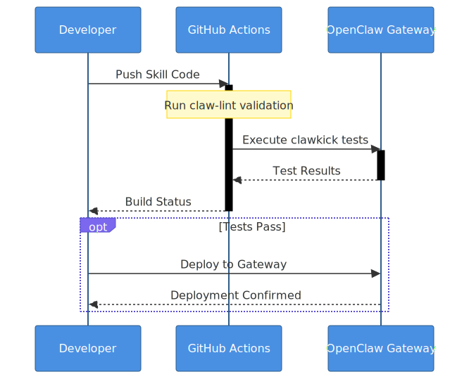

# Chapter 13: Tooling Ecosystem

## Introduction

In the preceding chapters, we have explored the architectural pillars and development paradigms that define the AI-native landscape. We have examined how specialized agents coordinate through gateways, how micro-skills provide modular functionality, and how persistent file-based memory creates a continuous narrative for intelligence. However, these patterns do not exist in a vacuum. Their realization is facilitated by a robust, emergent tooling ecosystem that bridges the gap between theoretical architecture and practical implementation.

The OpenClaw tooling ecosystem is more than just a collection of utilities; it is the substrate upon which the next generation of software is being built. In this chapter, we will survey the tools, frameworks, and development workflows that support AI-native development. We will dive deep into the Skill Blueprint pattern, explore the mechanics of micro-skill architecture from a tooling perspective, and examine how community-driven registries like ClawHub are transforming how we discover and share AI capabilities.

The shift toward AI-native software requires a fundamental rethinking of the developer experience. Traditional development environments are optimized for humans writing code for machines. AI-native environments must optimize for humans and AI writing code, instructions, and tools for each other. This three-way interaction—human-AI-tool—is the core dynamic that the OpenClaw ecosystem is designed to support.

## 13.1 The Importance of a Robust Tooling Ecosystem

Tooling in the AI-native context serves a fundamentally different purpose than in traditional software engineering. In classic development, tools are primarily about automation and productivity—compilers, debuggers, and IDEs exist to translate human intent into machine-executable code more efficiently. In AI-native development, tools are the interfaces that allow AI agents to interact with the world and with each other.

### 13.1.1 Accelerating AI-Native Development

A well-designed tooling ecosystem accelerates development by formalizing common tasks. When an agent needs to access the web, search a specific database, or manage a local file system, it shouldn't have to reinvent the interface. Standardized toolkits provide the primitives that allow developers—both human and AI—to focus on higher-level logic rather than low-level plumbing.

Speed in the AI era is measured not just in lines of code per hour, but in the latency between a concept and its realization as a functional agent. Tools that provide instant scaffolding, automated testing, and seamless deployment are the "force multipliers" that allow small teams (or even single developers with AI assistance) to build systems of immense complexity.

### 13.1.2 Reducing the Barrier to Entry for New Contributors

The complexity of AI-native systems can be daunting. The interplay of prompts, tools, gateway protocols, and model-specific behaviors creates a steep learning curve. By providing standardized templates, generation scripts, and validation utilities, the ecosystem reduces the cognitive load required to build and contribute.

The **Skill Blueprint Pattern** is a prime example: by defining exactly what a skill documentation should look like, it allows a newcomer to focus on the *content* of the skill rather than its *container*. Tools that automate the generation of these containers lower the barrier to entry, turning curiosity into contribution.

### 13.1.3 Ensuring Quality and Consistency Through Standardized Tools

Standardized tools enforce quality. Automated health checks, example-driven testing frameworks, and linting utilities for skill documentation ensure that every contribution adheres to a minimum set of functional and safety standards.

This consistency is vital for the **Gateway-Mediated Multi-Agent Pattern**. In a multi-agent system, the failure of a single micro-skill can cascade into a system-wide outage. By using tools that audit for the **Hard-Coded Path Anti-Pattern** or the **Silent Failure Anti-Pattern**, developers can build "defense in depth" into their systems, ensuring that individual components are robust and their failures are predictable.

### 13.1.4 The Role of Community in Building and Maintaining the Ecosystem

One of the most powerful aspects of the OpenClaw ecosystem is that it is community-driven. Developers are not just users of the tools; they are the architects. As new patterns emerge—such as the **File-Based Memory Pattern**—the community rapidly builds the tools to support them, from search indexers to summarization agents.

This viral evolution ensures that the ecosystem remains at the cutting edge. Unlike proprietary platforms where tooling is dictated by a single entity, the OpenClaw ecosystem evolves through the collective intelligence of thousands of contributors, each building the tools they need and sharing them with the world.

## 13.2 Skill Design and Development Tools

At the heart of the ecosystem is the skill—the fundamental unit of capability. Developing high-quality skills requires specific tools that support the entire lifecycle from ideation to deployment.

### 13.2.1 Skill Blueprint Pattern in Practice

The **Skill Blueprint Pattern** is arguably the most important development in the OpenClaw ecosystem for ensuring interoperability. It provides a standardized structure for documentation (`SKILL.md`) that is readable by both humans and AI agents.

#### Detailed Walkthrough of the SKILL.md Template

A standard `SKILL.md` file serves as both a manual for humans and a specification for AI agents. Key tools in the ecosystem focus on validating and generating these sections:

1.  **YAML Frontmatter:** Used for metadata. Tools like `claw-lint` check for:
    *   `name`: A unique identifier.
    *   `description`: A concise summary for the agent to understand when to use the skill.
    *   `version`: Semantic versioning for dependency management.
    *   `triggers`: RegEx patterns or keyword lists that activate the skill in a session.
2.  **Overview and Philosophy:** Provides the high-level intent.
3.  **Workflow:** A step-by-step description of how the skill achieves its goal.
4.  **Configuration:** Environment variables and local settings.
5.  **Guardrails:** Explicit boundaries for behavior.
6.  **Examples:** Concrete command/response pairs.

#### Metadata Validation Tools

Manual management of skill metadata is prone to error. The ecosystem provides CLI tools that automatically extract this data, validate it against the OpenClaw schema, and generate the necessary configuration files for the gateway to load the skill. This "documentation-as-config" approach ensures that the behavior of the skill always matches its description.

#### Automated Skill Generation and Bootstrapping

Scaffolding tools like `openclaw skill init` generate a directory structure that includes the `SKILL.md` template, a `package.json` for dependencies, and a `scripts/` folder for the implementation logic. This allows developers to move from "thought" to "code" in seconds.

### 13.2.2 Micro-Skill Development Workflow

The **Micro-Skill Architecture Pattern** encourages building single-purpose, highly composable skills. Tooling supports this by making the creation and testing of these small units frictionless.

#### Breaking Complex Capabilities into Micro-Skills

When a developer identifies a broad task, they use design tools to decompose it. For example, a "Social Media Manager" agent might be broken into micro-skills for "Twitter Post Generation," "Post Scheduling," and "Sentiment Analysis." Tooling facilitates this by providing templates for each specific task type.

#### Designing for Composability and Reuse

Tools like the `openclaw registry` allow developers to see what micro-skills already exist. Before building a new capability, a developer can search for existing skills they can compose. This "LEGO-style" development is only possible because of the standardized tool interfaces defined in the OpenClaw core.

#### Local Development Environments for Skills

Developing AI-native systems requires a tight feedback loop. Local development gateways allow developers to run a "mini-OpenClaw" on their laptops, where they can load local skill folders, simulate user messages, and see the agent's reasoning-in-progress.

### 13.2.3 AI-Assisted Skill Creation

In an AI-native ecosystem, the AI itself is a primary tool for development.

#### Using AI to Generate Skill Documentation and Scripts

AI assistants (like TitanBot or other OpenClaw agents) are often tasked with writing skills for other agents. A human might provide a high-level goal, and the assistant will generate the complete `SKILL.md` and the underlying Python or Bash scripts. This "agent-building-agent" dynamic is a core feature of the ecosystem.

#### AI-Driven Prompt Engineering for Skill Internals

Prompting is an iterative process. Tools like `prompt-optimizer` take a base prompt and run it against various models and test cases, automatically suggesting improvements to clarity, safety, and performance. This data-driven approach replaces "vibes-based" prompting with empirical optimization.

## 13.3 Testing and Validation Tools

Reliability is the hallmark of professional-grade AI systems. The OpenClaw ecosystem provides a suite of tools designed to validate that skills and agents behave as expected under a wide range of conditions.

### 13.3.1 Example-Driven Testing Frameworks

The **Example-Driven Testing Pattern** is the preferred method for validating AI skills. Unlike traditional unit testing which relies on rigid assertions, example-driven testing uses the "Example Usage" section of the `SKILL.md` as the source of truth for test cases.

#### Tools for Executing and Validating Examples in SKILL.md

Utilities like `clawkick` can parse a `SKILL.md` file, extract the examples, execute them through the gateway, and verify that the output matches the expected format or intent. This ensures that the documentation never drifts from the actual functionality.

#### Integration-Style Health Check Utilities

The `health-check` skill is a cornerstone of the ecosystem. It doesn't just check if the code runs; it runs "probes" across the entire system. It verifies that the gateway can talk to providers (like OpenAI or Anthropic), that local tools have the correct permissions, and that sessions are persisting correctly to the file system.

#### Real-World Scenario Simulation

To test complex, stateful interactions, developers use scenario-simulators. These tools can simulate a multi-message conversation where a user requests a task, provides feedback, and asks for modifications. By replaying these scenarios against a skill, developers can catch subtle bugs in how the AI manages its own internal state.

### 13.3.2 Tool Execution Validation

Because skills often interact with the local system through tools like `exec`, `read`, and `write`, it is essential to validate these interactions.

#### Verifying Tool Inputs and Outputs

Every tool call in the OpenClaw ecosystem is intercepted by the gateway. This allows validation tools to inspect the arguments before they are executed. For example, a validation tool might prevent a `rm -rf` command unless it's targeted at a specific temporary directory, enforcing the **Explicit Guardrails Pattern**.

#### Path and Environment Validation for Tool Calls

The ecosystem includes tools that specifically look for the **Hard-Coded Path Anti-Pattern**. During testing, these tools monitor all file system calls; if they see an absolute path like `/Users/username/...`, they flag it and suggest using an environment variable or a relative path from the workspace root.

#### Security and Permission Testing for Tools

Sandbox utilities allow developers to run skills in restricted environments where they have limited disk, network, and memory access. This allows for rigorous safety testing, ensuring that even if an agent is "jailbroken," it cannot do significant harm to the host machine.

### 13.3.3 AI Response Evaluation

Evaluating the non-deterministic output of an LLM requires specialized tools that look beyond simple string matching.

#### Tools for Measuring Response Quality and Accuracy

Metrics-based tools use other LLMs to "grade" the responses of a skill. For a code generation skill, the evaluator might check if the generated code is syntactically correct and passes its own tests. For a writing skill, the evaluator might check for tone, clarity, and adherence to a style guide.

#### Comparative Analysis Across Different Models

One of the great challenges of AI development is that a skill that works perfectly on `claude-3-5-sonnet` might fail on `gpt-4o`. Tools like `model-matrix` allow developers to run the same set of test cases against multiple models simultaneously, generating a heatmap of performance and reliability. This helps developers choose the best model for their cost and performance requirements.

#### Automated Bias and Safety Checking

Safety-scan utilities run a battery of "adversarial" prompts against a skill to see if it can be coerced into violating its guardrails. These tools look for dangerous content, private data leakage, or inappropriate responses, providing a safety report that is often required for community-shared skills.

## 13.4 Deployment and Management Tools

Once a skill or agent is developed and tested, it needs to be deployed, managed, and monitored.

### 13.4.1 OpenClaw Gateway Management

The gateway is the "operating system" for OpenClaw. Managing it effectively is a primary focus of the tooling ecosystem.

#### Utilities for Starting, Stopping, and Monitoring the Gateway

The `openclaw gateway` CLI is the primary management interface. It provides commands for:
*   `status`: Showing which providers are active, which channels are connected, and the current resource usage.
*   `restart`: Safely shutting down and restarting the gateway, often used to apply configuration changes (the `SIGUSR1` signal is frequently used for seamless restarts).
*   `logs`: Tailoring and searching the gateway logs for troubleshooting.

#### Session Management and Visualization Tools

Because OpenClaw is heavily interactive, session management is key. Tools like `openclaw-ui` provide a bird's-eye view of all active sessions, showing the message history, the tokens used, and the specific tools called by the agent. This allows a human "director" to monitor multiple agents in real-time.

#### Configuration Management and Validation

Managing the `config.yaml` file for a complex gateway setup can be error-prone. The ecosystem includes configuration generators and validators that ensure the YAML structure is correct and that all required API keys and channel IDs are present before the gateway even tries to start.

### 13.4.2 Skill Deployment and Discovery

How do you get a new skill onto a running gateway? How do you find a skill built by someone else?

#### Skill Installation and Loading Mechanisms

OpenClaw supports multiple installation methods. A developer can point the gateway to a local directory, a git repository, or a package in a registry. The `openclaw skill install` command handles the downloading of dependencies, the creation of environment variables, and the dynamic loading of the skill into the gateway's memory.

#### Skill Marketplace and Registry Tools (ClawHub)

ClawHub is the central registry for the community. Tools integrated with ClawHub allow developers to:
*   `search`: Find skills by name or keyword.
*   `info`: View the `SKILL.md` and user ratings for a skill.
*   `install`: Add the skill to their gateway with a single command.

#### Dependency Management and Conflict Resolution

As a gateway loads more skills, conflicts can arise—two skills might use the same trigger, or require different versions of a tool. Dependency management tools handle these conflicts, providing isolation for each skill and ensuring that the overall system remains stable.

### 13.4.3 Monitoring and Observability

Understanding what an AI system is doing *why* it's doing it is the goal of observability.

#### Logging and Tracing Tools for AI Systems

Traditional logging isn't enough for AI. You need to see the "thought process." Tracing tools log the prompt sent to the LLM, its reasoning (if using a thinking model), the tool calls it generates, and the final response. This full-stack trace is essential for debugging the **Silent Failure Anti-Pattern**.

#### Performance Monitoring Dashboards

Visual dashboards show the real-time health of the ecosystem: token usage per session, response latency across different providers, tool success rates, and cost tracking. This allows administrators to optimize their setups for efficiency and reliability.

#### Usage Analytics and Reporting

For organizations running multi-agent systems, usage reports are vital for cost allocation and security auditing. Tools like `claw-report` generate detailed breakdowns of which users are interacting with which agents and at what cost.

## 13.5 Collaboration and Community Tools

The OpenClaw ecosystem is fundamentally collaborative. Tools that support sharing, review, and collective development are what make it grow.

### 13.5.1 GitHub Ecosystem Integration

GitHub is the laboratory where the ecosystem is built.

#### Pull Request Templates for AI-Assisted Contributions

The **AI-First Contribution Pattern** is supported by specific PR templates. These templates ask the contributor to disclose which AI was used, provide the session logs of the development process, and describe the manual review steps taken. This ensures transparency and helps maintainers understand the origin of the contribution.

#### CI/CD Pipelines for Skill Validation and Testing

Automated pipelines run `claw-lint` and `clawkick` (the example executor) on every commit. A pull request isn't even considered for review until it passes these automated quality gates, ensuring that the main repository always remains in a functional state.

#### Community Review and Feedback Tools

Specialized bots on GitHub assist with the review process. They can suggest improvements to prompts, flag potential security issues, and even run the proposed skill in a temporary sandbox to verify its functionality.

### 13.5.2 Knowledge Sharing Platforms

Beyond code, the community shares knowledge through diverse channels.

#### Documentation Sites and Wikis

The official OpenClaw documentation (often generated and maintained with AI assistance) is the primary source of truth. Community wikis provide deep dives into specific use cases, like "OpenClaw for Home Automation" or "AI-Native DevOps."

#### Community Forums and Discussion Groups

Discord and Telegram are the "town squares" where developers ask questions, share new skills, and discuss the future of the project. These channels are often integrated with OpenClaw bots that can answer technical questions or help with troubleshooting.

### 13.5.3 Marketplaces and Hubs (ClawHub)

ClawHub is the "App Store" for AI-native capabilities.

#### Skill Discovery and Evaluation Tools

ClawHub provides a web interface for browsing skills. It uses AI to categorize skills, generate screenshots, and provide a "compatibility score" based on the user's current gateway configuration.

#### Rating and Review Systems

Community trust is built through feedback. Developers rate skills based on their reliability, ease of setup, and utility. This social signal helps users identify high-quality, trustworthy skills in a rapidly growing marketplace.

#### Contribution Guidelines and Reward Mechanisms

ClawHub also manages the contribution process, providing clear guidelines for skill naming, versioning, and documentation. Some communities use reward systems—like GitHub Stars, badges, or even cryptographic tokens—to incentivize the creation of high-quality, open-source tools and skills.

## 13.6 Advanced Tooling Patterns

As the ecosystem matures, sophisticated patterns are emerging to handle complex workflows and autonomous systems.

### 13.6.1 Tool Pipelines and Orchestration

Individual tools can be chained together into powerful pipelines.

#### Chaining Tools and Skills into Complex Workflows

An agent might use a "Research" skill to find information on the web, then pass that information to a "Summarizer" skill, and finally use a "Report Generator" skill to create a PDF. Tooling for orchestration allows these handoffs to happen automatically, with specific "glue" logic to ensure data is correctly formatted between steps.

#### Performance Optimization for Tool Chains

Chaining multiple LLM calls can be slow and expensive. Optimization tools look for ways to run tasks in parallel, use smaller/cheaper models for intermediate steps, and cache tool responses to minimize redundant computations.

### 13.6.2 Intelligent Debugging Tools

Debugging a multi-agent "thought chain" requires a different approach than debugging traditional code.

#### Trace Visualization for Multi-Agent Workflows

Visual debuggers display the interaction between agents as a graph. You can see when Agent A calls Agent B, which tools they used, and exactly where the logic failed. This "X-ray view" of the system's reasoning is vital for solving the **Monolithic Skill Anti-Pattern** by identifying where a skill is doing too much and should be broken apart.

#### Anomaly Detection in System Behavior

Machine-learning-based monitoring tools can learn the "normal" behavior of a system—how many tool calls are typical, what kind of language is used, how long tasks take. If a skill starts behaving strangely—perhaps calling a tool in an infinite loop or generating nonsensical output—the monitor can alert an administrator or even automatically pause the session.

### 13.6.3 Self-Healing Tooling

The goal of many advanced projects is a system that can fix itself.

#### Automated Monitoring with Self-Correction Capabilities

Imagine a gateway that detects a provider failure (like an OpenAI outage) and automatically switches all sessions to a backup provider (like Anthropic). This level of resilience is enabled by self-healing tools that monitor system health and execute pre-defined recovery scripts.

#### Predictive Maintenance for AI Systems

By analyzing logs over time, tools can predict when a skill might need an update—perhaps because an external API is changing or because users are reporting declining satisfaction. This proactive approach ensures that the ecosystem remains operational even as the underlying technologies evolve.

## 13.7 OpenClaw-Specific Tools Survey

Let's look at the actual tools that developers use every day in the OpenClaw ecosystem.

### 13.7.1 Core OpenClaw CLI Utilities

The `openclaw` binary is the primary Swiss Army knife.

*   `openclaw gateway`: Commands for lifecycle management (start, stop, status).
*   `openclaw skill`: Commands for management (list, install, update, audit).
*   `openclaw agent`: Commands for spawning and interacting with standalone agents.
*   `openclaw doctor`: A diagnostic utility that checks the local environment for common issues—Node.js version, environment variables, tool permissions, and network connectivity.

### 13.7.2 Popular Community Tools

The community has built specialized tools that extend OpenClaw's reach.

*   `clawkick`: The example-driven test runner.
*   `claw-gen`: An AI-assisted scaffolder that takes a few keywords and generates a complete skill directory.
*   `openclaw-proxy`: A utility for load-balancing multiple gateways and providing a unified API for large-scale deployments.
*   `clawpipe`: A framework for building complex multi-agent pipelines with easy-to-use YAML configuration.

### 13.7.3 Experimental and Future Tools

On the horizon, we see even more radical tools.

*   **AI-Native OS Prototypes:** Systems where the entire user interface and file management are handled by autonomous agents.
*   **Graph-Based Memory Management:** Moving beyond markdown files to full knowledge graphs that allow agents to navigate their history with greater precision.
*   **Novel Human-AI Interfaces:** Tools that allow for voice-first interaction, spatial interaction in AR/VR, and even direct neural interfaces for agent coordination.

## 13.8 Building Your Own Tools

The OpenClaw ecosystem is intentionally extensible.

### 13.8.1 Extension Mechanisms

Developers can extend OpenClaw in several ways:

*   **Custom Tool Plugins:** Writing a small piece of code that adds a new primitive (like a "Stripe" tool or a "Spotify" tool) that any skill can then use.
*   **Skill Extensions:** Creating a "wrapper" skill that adds new capabilities to an existing one—for example, adding "Image Analysis" to a "General Research" skill.
*   **Gateway Hooks:** Writing scripts that run when certain events happen—like a new user connecting or a session hitting a cost limit.

### 13.8.2 Best Practices for Tool Development

If you're building a tool for the ecosystem, follow these principles:

1.  **Simplicity First:** A tool should do one thing perfectly. Follow the **Micro-Skill Architecture Pattern**.
2.  **Explicit Guardrails:** Don't just permit a tool to run; define what it *cannot* do.
3.  **Documentation with Examples:** Use the **Skill Blueprint Pattern**. Your `SKILL.md` is the primary way both humans and AI will understand your tool.
4.  **Graceful Failures:** Implement the **Tool-Based Error Recovery Pattern**. Return clear error codes and actionable messages.

### 13.8.3 Contributing to the Ecosystem

Once you've built a tool, share it!
*   Publish your skill to ClawHub.
*   Submit your utility to the `openclaw/awesome-openclaw` list.
*   Engage with the community on Discord to get feedback and help other developers.

## 13.9 Case Studies

Let's examine two successful tools that have shaped the ecosystem.

### 13.9.1 Development of the Health-Check Tool

The `health-check` skill started as a simple bash script used by a single developer to check their OpenAI API key. As the community grew, other developers added probes for Telegram, local file permissions, and cost tracking. Today, it is a comprehensive diagnostic utility that is part of the standard OpenClaw distribution. It demonstrates how a simple micro-skill can evolve into a vital piece of system infrastructure through collaborative development.

### 13.9.2 Creating the Skill-Hub (ClawHub)

ClawHub was born from the need to manage thousands of community skills. Its development was a masterclass in AI-native engineering: the registry itself is maintained by agents that scan GitHub for new skills, run automated audits, and generate the web interface. By using AI to manage the growth of the community, ClawHub has enabled the ecosystem to scale far faster than a manually curated registry ever could.

## 13.10 Conclusion: The Power of the Platform

The OpenClaw tooling ecosystem is a testament to the power of open-source, community-driven innovation. By providing a foundation of standardized patterns—from the Skill Blueprint to the Gateway-Mediated Multi-Agent orchestrator—the ecosystem has enabled thousands of developers to build and share complex AI capabilities with unprecedented ease.

As we look to the future, the boundary between "tool" and "skill" will continue to blur. Every tool will have an AI-native interface, and every skill will be a building block for an even more complex system. The call to action is clear: don't just use the tools—build them. Shape the ecosystem that is shaping the future of intelligence.

In the next and final chapter, we will explore the final piece of the puzzle: the people and the culture that drive this movement. We will examine the educational paths, the contribution guidelines, and the global community that ensures the AI-native movement remains inclusive, innovative, and impactful.

---

## Key Takeaways

1.  **Standardized tooling ensures quality and consistency** in AI-native systems, providing the reliable foundation necessary for complex agent coordination.
2.  **Skill blueprints and micro-skill patterns** provide a clear development path, lowering the barrier to entry and enabling rapid innovation.
3.  **Robust testing and validation tools**—particularly those that are example-driven—are essential for ensuring that AI-native systems are reliable and safe.
4.  **Deployment and management tools** enable scalable AI-native operations, allowing for the monitoring and control of complex multi-agent environments.
5.  **Building and sharing tools** is a vital part of community contribution, driving the viral evolution of the ecosystem.
