# Chapter 14: Education and Community

## Introduction

The preceding chapters have documented a series of technical breakthroughs, architectural patterns, and specialized tools that together define the AI-native landscape. We have explored the "how" of AI-native development—the mechanics of coordination, the structure of skills, and the engineering of resilience. However, even the most sophisticated technology is sterile without a vibrant human community to give it purpose. The most important component of any technological shift is not the code or the circuits, but the people who build them and the culture they create.

The OpenClaw ecosystem is a sociotechnical system. Its success depends as much on the robustness of its community and the accessibility of its education as it does on the sophistication of its gateway. In this final chapter, we will explore the educational resources, learning paths, and community-driven development culture that underpin the OpenClaw movement. We will examine how the **AI-First Contribution Pattern** is redefining collaboration, and how a global, inclusive community is ensuring that the future of intelligence is built by everyone, for everyone.

The transition to an AI-native world represents a shift in power. In the traditional world, software creation was the domain of a specialized priesthood of coders. In the AI-native world, someone with a clear idea and the right orchestration tools can build a meaningful software system. This democratization of creation is the ultimate promise of OpenClaw, and it is the community's mission to make that promise a reality through education and support.

## 14.1 The Importance of Education and Community

In a rapidly evolving field like AI-native development, knowledge is the most valuable currency. A community that cannot effectively share what it knows will eventually stall. But beyond just technical knowledge, the community provides the social fabric—the motivation, the mentorship, and the collective purpose—that makes a project sustainable.

### 14.1.1 Creating a Sustainable Ecosystem Through Knowledge Sharing

Sustainability in open-source is often framed in economic terms—funding, maintenance, and sponsorships. But its true foundation is structural and educational. A sustainable ecosystem is one where the "pool" of knowledge is constantly replenished. When a developer solves a unique problem using the **Gateway-Mediated Multi-Agent Pattern**, that solution is only useful to the community if it is documented, shared, and taught.

The "virtuous cycle" of knowledge sharing works like this: a contributor builds a tool, documents it using the **Skill Blueprint Pattern**, and shares it. A new learner finds the tool, uses the documentation to understand it, and eventually contributes an improvement. This cycle creates a shared intelligence that is far greater than the sum of its parts.

### 14.1.2 Lowering the Barrier to Entry for Diverse Participants

The AI-native world can seem exclusive, guarded by high technical barriers, complex math, and a rapidly changing vocabulary. Education's primary role is to dismantle these barriers. By providing clear, accessible, and multi-modal learning resources (text, video, interactive), the community ensures that builders from all backgrounds—regardless of their prior experience with traditional software engineering—can contribute to the future.

This inclusivity is not just a moral imperative; it's a practical necessity. The problems that AI can solve are diverse and widespread. To build AI that truly serves humanity, we need the perspectives of doctors, farmers, artists, and community leaders. Education is the bridge that brings these people into the development process.

### 14.1.3 Fostering Innovation Through Collaborative Development

The most innovative ideas often happen at the intersection of different perspectives. A vibrant, diverse community acts as a massive parallel processor for ideas. When a human expert (like a legal specialist) collaborates with an AI specialist (who understands prompt architecture), they can build an "AI for Legislation" skill that is both technically robust and domain-accurate.

Community platforms like Discord and GitHub facilitate these serendipitous interactions. They provide the space for questions to be asked, for ideas to be critiqued, and for "collaborative experiments" to flourish. The OpenClaw ecosystem is a laboratory where innovation is a collective endeavor.

### 14.1.4 Building Trust and Accountability in AI Systems

Transparency is the bedrock of trust in AI. A community that prioritizes peer review, open discussion, and explicit disclosure of AI's role in the development process builds trust not just within the ecosystem, but with the broader world.

As AI systems become more autonomous, the collective accountability of the community becomes more important. By establishing shared values, safety standards, and review processes, the community ensures that OpenClaw remains a force for good. Education around ethical AI use and safety guardrails is not an elective; it is a core requirement for responsible community participation.

## 14.2 Learning Paths for AI-Native Development

Becoming a proficient AI-native developer involves more than just learning a new programming language; it requires a fundamental shift in mindset.

### 14.2.1 Core Knowledge and Skills

The transition from traditional software engineering to AI-native development involves unlearning some old habits and embracing new paradigms.

*   **AI-Native vs. Traditional Paradigms:** Learners must understand that in the AI world, code is no longer the only way to express intent. Instructions (prompts) are often "fuzzy," logic is non-deterministic, and the developer's role shifts from *writing every step* of an algorithm to *orchestrating the intent* and providing the necessary tools.
*   **Mastering the Architectural Patterns:** A deep understanding of the eight core patterns identified in our research—from the **Micro-Skill Architecture** to the **File-Based Memory Pattern**—is the baseline for any serious OpenClaw developer. These are the "periodic table" of elements from which all OpenClaw systems are built.
*   **Proficiency in Key Tools:** Proficiency means more than just knowing command-line arguments. It means understanding *how* the gateway manages sessions, *how* agents use tools, and *how* to troubleshoot the **Silent Failure Anti-Pattern**.
*   **Developing an AI-Orchestration Mindset:** This is the meta-skill of the era. It involves learning how to break a complex goal down into specialized agents, how to design the communication between those agents, and how to verify that the final output meets the requirements.

### 14.2.2 Hands-On Learning Resources

Knowledge is best acquired through practice. The ecosystem provides a rich array of hands-on resources:

*   **OpenClaw Documentation and Tutorials:** The "Book of Knowledge" provides the foundational theory and step-by-step guides for common tasks, such as "How to build your first skill" or "How to configure a multi-agent workflow."
*   **Interactive Learning Environments and Sandboxes:** Pre-configured development environments allow learners to experiment with skills and gateway configurations without the need for complex local setup. This "play-based learning" is key to rapid skill acquisition.
*   **Community-Shared Skill Examples and Case Studies:** Every skill on ClawHub is a potential textbook. New developers are encouraged to "reverse-engineer" popular skills, reading their `SKILL.md` and their code to understand the clever tricks and patterns they use.
*   **Mentorship Programs:** More experienced contributors often give back by mentoring newcomers, helping them navigate the complexities of the ecosystem and fostering the next generation of leaders.

### 14.2.3 Specialized Roles and Paths

As the ecosystem matures, we see the emergence of specialized roles, each with its own learning path:

*   **Skill Developers:** Focus on the "capabilities" of the system. They are artists of the prompt and the micro-tool.
*   **System Architects:** Focus on the "orchestration" and the "plumbing." They design complex multi-agent workflows and ensure the system is scalable and resilient.
*   **Tool Builders:** Focus on the "infrastructure." They build the utilities, the testers, and the gateway extensions that everyone else uses.
*   **Quality Assurance and Safety Reviewers:** Focus on the "reliability" and the "ethics." They specialize in finding edge cases, auditing for bias, and ensuring the system stays within its guardrails.
*   **Community Managers and Educators:** Focus on the "people." They create content, facilitate discussion, and ensure that the community remains healthy and growing.

## 14.3 AI-First Contribution Pattern

The **AI-First Contribution Pattern** is perhaps the most radical cultural shift in the OpenClaw community. It is the formal recognition that AI is not just a tool for the individual, but a primary participant in the collective development process.

### 14.3.1 Pattern Fundamentals

*   **Welcoming AI-Assisted Contributions:** Unlike traditional projects that might be skeptical of AI-generated code, the OpenClaw project embraces it. The goal is the highest quality result, regardless of whether the initial draft came from a human brain or an LLM.
*   **Redefining "Contribution":** In an AI-native world, a contribution might be a well-crafted set of instructions, a new dataset for training a specialized model, or a set of example-driven tests. The community values *intellectual intent* as much as *line-of-code execution*.
*   **Lowering Barriers While Maintaining Quality:** AI-assisted contributions allow people with limited coding experience to contribute high-quality technical work (like building a new skill). The key is the rigorous "final human review" that ensures the output meets standards.

### 14.3.2 Transparency and Accountability (Transparent AI Use Pattern)

Trust is built on transparency. The community has established clear guidelines for AI use:

*   **Disclosure Guidelines:** Every contribution (like a Pull Request) must clearly state if and how AI was used. Contributors are encouraged to include "AI-assisted" tags and describe the specific role the AI played (e.g., "Drafted the initial Python script then manually reviewed and debugged").
*   **Sharing Prompts and Session Logs:** For reproducibility and peer review, contributors often share the exact prompts and session logs they used to generate the contribution. This "trail of intent" is vital for understanding the reasoning behind a design choice.
*   **Human Responsibility:** The human contributor remains 100% responsible for the AI-generated content. You cannot blame the AI for a bug; you must stand behind the work as if you wrote every character yourself.

### 14.3.3 Community Review Process (Specialized Maintainers Pattern)

Reviewing AI-assisted work requires a different approach.

*   **Specialized Maintainers:** The project is broken into specialized domains (Skills, Gateway, Core, UI), each with maintainers who are experts in that specific area. This ensures that even high-volume contributions are reviewed with the appropriate level of depth.
*   **AI-Assisted Review Tools:** Maintainers use their own AI agents to help with the review process—automatically running tests, flagging security issues, and summarizing the changes. The review process is itself an AI-native workflow.
*   **Collaborative Human-AI Review:** The final "merge" decision is always a human one, informed by both automated checks and manual inspection. It is a process of "collaborative validation" that ensures the system remains robust.

## 14.4 Building a Vibrant and Inclusive Community

Culture is what keeps people coming back. The OpenClaw community is built on a set of core values that emphasize openness, safety, and collective growth.

### 14.4.1 Community Governance

*   **Maintainer Teams and the Core Council:** The project follows a model of distributed leadership. While there is a "Core" team for foundational decisions, individual sub-projects (like a specific channel plugin) are often run by independent maintainer groups.
*   **Open and Transparent Decision-Making:** Major architectural changes or policy shifts are discussed openly in "RFC" (Request for Comment) documents. This ensures that anyone in the community can voice their opinion or concern.
*   **Values-Driven Guidelines:** The community's Code of Conduct is not just a bureaucratic document; it's a statement of culture. It prioritizes respect, psychological safety, and the celebration of diversity.

### 14.4.2 Inclusivity and Diversity

The "Open" in OpenClaw means everyone.

*   **Attracting Diverse Perspectives:** The community actively seeks to bring in people from different backgrounds. We know that the best AI for social good is built by people who understand the social challenges firsthand.
*   **Ensuring Accessibility:** From high-quality localized documentation to accessible web interfaces, the project strives to remove the physical and cognitive barriers that can prevent participation.
*   **Psychological Safety:** A healthy community is one where it is safe to "be wrong" and safe to ask "stupid questions." Fostering this safety is a primary goal of the community managers.

### 14.4.3 Global Collaboration

AI knows no borders, and neither does the OpenClaw community.

*   **Handling Timezone and Language Diversity:** Community work is asynchronous and global. We use platforms that facilitate "slow communication," ensuring that a contributor in Tokyo can collaborate seamlessly with a developer in London and another in New York.
*   **Global Events and Local Meetups:** From global virtual hackathons to local developer meetups, the community provides opportunities for people to connect, learn, and build together in the "real world."
*   **Localizing Resources:** Translating documentation and learning resources is a high-priority community effort, ensuring that the movement can take root in every region of the world.

## 14.5 Educational Initiatives and Resources

The project invests heavily in the "infrastructure of knowledge."

### 14.5.1 Official Documentation and the "Book of Knowledge"

The official OpenClaw docs are more than just a reference manual; they are a curriculum.

*   **Creating Clear, Actionable Guides:** The goal of the documentation is to get the user from "zero to skill" as quickly as possible. Every page is designed to be practical and example-rich.
*   **Using AI to Maintain Quality:** The project uses specific agents to monitor the documentation for broken links, outdated examples, and confusing explanations. The "Book" is a living document that improves every day.
*   **Multi-Channel Content:** We recognize that people learn differently. The project provides text-based guides, video walkthroughs, and even "AI-narrated" audio for learners on the go.

### 14.5.2 Community-Driven Education

The community is the primary content creator.

*   **User-Generated Tutorials and Blogs:** Some of the most valuable resources are the "how-I-did-it" stories from community members. These posts provide real-world context and "hard-won lessons" that a formal manual might miss.
*   **Workshops and Learning Circles:** Community members often organize their own study groups or virtual workshops to dive deep into specific topics, like "Advanced Multi-Agent Orchestration" or "The Soul of the Agent."
*   **Shared Learning Repositories:** Reusable code examples, prompt templates, and testing suites are shared across the community, allowing everyone to stand on the shoulders of giants.

### 14.5.3 Academic and Industry Partnerships

We bridge the gap between theory and practice.

*   **Collaborative Research Projects:** OpenClaw maintainers often collaborate with university researchers on the next generation of AI-native architectures, contributing to academic publications and fostering a rigorous scientific approach.
*   **Integration Into Curricula:** More universities and bootcamps are using OpenClaw as the foundational platform for teaching AI-native development.
*   **Industry Certification:** As the field matures, we see the emergence of competency frameworks that help employers identify skilled OpenClaw developers and help developers showcase their expertise.

## 14.6 Future of AI-Native Education

The future of learning won't look like a classroom; it will look like an agent.

### 14.6.1 AI-Driven Personalized Learning

Imagine a personalized "Learning Coach" agent that knows your current skills, your goals, and your learning style. It can generate a custom curriculum, provide real-time feedback on your code, and answer your "why" questions instantly. This is the goal of our aI-driven personalized learning initiative.

### 14.6.2 Continuous and Embedded Learning

Learning shouldn't be a separate activity; it should be part of the work.

*   **Real-Time Knowledge Assistance:** Tools that provide contextual help inside the development environment. If a developer is trying to implement the **Tool-Based Error Recovery Pattern**, the tool can provide immediate examples and best practices.
*   **Learning-by-Doing:** The ecosystem encourages a "build-first" approach, where knowledge is acquired through the act of creation. The gateway itself becomes the teacher.

### 14.6.3 Evolving Roles and Competencies

We are constantly monitoring the field to understand how roles are changing.

*   **Addressing the "Meta-Skills":** Education will increasingly focus on "how to manage AI" rather than "how to write code." These meta-skills include critical thinking, ethical reasoning, and complex systems architecture.
*   **Lifelong Learning and Curiosity:** The most valuable trait of an AI-native developer is not what they know today, but their ability to learn what they need tomorrow. Fostering this "growth mindset" is the ultimate goal of community education.

## 14.7 Contribution Guidelines and Best Practices

Everyone can contribute. Here's how:

### 14.7.1 For New Contributors

1.  **Start Small:** Look for "good first issues" on GitHub. This might be fixing a typo, adding an example to a skill, or improving a localized translation.
2.  **Join the Conversation:** Jump into the Discord or Telegram channels. Introduce yourself, ask questions, and see where you can help.
3.  **Read the Patterns:** Familiarize yourself with the eight core patterns. They are the language the community speaks.

### 14.7.2 For Experienced Contributors

1.  **Mentor and Teach:** Share what you know. Write a tutorial, record a video, or help someone through a difficult pull request.
2.  **Take on Leadership:** Step up as a maintainer for a sub-project or a regional community hub.
3.  **Propose Major Features:** Use the RFC process to drive the architectural future of the project.

### 14.7.3 For Community Managers and Educators

1.  **Facilitate, Don't Dictate:** Your role is to clear the path for others. Foster an environment where everyone feels heard and valued.
2.  **Curate the Best Content:** Identify the highest quality community-generated resources and make sure they are easy for others to find.
3.  **Monitor Health:** Use data and qualitative feedback to ensure the community remains vibrant, inclusive, and aligned with its core values.

## 14.8 Measuring Community Health and Success

We use both data and stories to understand how we're doing.

### 14.8.1 Key Metrics

*   **Contribution Volume and Diversity:** How many people are contributing? From how many different regions? To how many different parts of the project?
*   **Engagement Levels:** How many new users are joining? How active are the community channels?
*   **Feedback Loops:** How quickly are pull requests reviewed? How often do new contributors become repeat contributors?

### 14.8.2 Qualitative Feedback

*   **Community Surveys:** We regularly ask the community for their thoughts on the project's direction, its governance, and its culture.
*   **Success Stories:** We collect and share stories of how individuals and organizations are using OpenClaw to solve real problems. These stories are the ultimate proof of the project's impact.
*   **Lessons Learned:** We are open about our challenges. Postmortems on community incidents or failed initiatives provide the "hard lessons" that help us grow.

## 14.9 Case Studies

Let's look at how education and community have shaped the project.

### 14.9.1 Evolution of the OpenClaw Contributor Base

Five years ago, the contributor base was a handful of researchers. Today, it is over 100,000 strong. This exponential growth was enabled by the **AI-First Contribution Pattern**, which allowed non-coders to contribute, and a robust educational platform that allowed new coders to level up quickly. By lowering the "barrier of skill," the project has tapped into a global reservoir of talent.

### 14.9.2 Collaborative Development of the Health-Check Skill

The `health-check` skill is more than just a tool; it was a community exercise in education. By including extensive "Example Usage" and a very clear `SKILL.md`, the authors turned a complex diagnostic utility into a teaching tool. New contributors frequently used the `health-check` skill as their "template" for learning how to build their own skills.

### 14.9.3 Implementing an AI-First Education Program

The recent "OpenClaw University" pilot program demonstrated the power of AI-assisted learning. Participants were given a "Learning Agent" that guided them through the process of building their own multi-agent system. The result was a 50% reduction in the "time to first contribution" compared to traditional learning methods.

## 14.10 Conclusion: Cultivating the Future

The OpenClaw journey is not just a technical history; it is a human one. The education we provide and the community we build are the final pieces of the puzzle. They are what transforms a collection of architectural patterns and specialized tools into a movement that can change the way humanity interacts with intelligence.

Our goal is not just to build a better gateway, but to build a better world—one where the power of AI-native development is in the hands of everyone who has a story to tell, a problem to solve, or a vision to share. As we close this book, the final call to action is for you: join the movement. Learn the patterns, use the tools, but most importantly, contribute your unique perspective to the community. The future of intelligence is ready to be built. Let's build it together.

---

## Key Takeaways

1.  **Education and community are the foundations** of the AI-native movement, ensuring sustainability, inclusivity, and continuous innovation.
2.  **The AI-First Contribution Pattern** lowers the barriers to participation, allowing a diverse global community to contribute to the future of software.
3.  **Transparency and accountability** are essential for building trust in AI systems and ensuring they remain aligned with human values.
4.  **Continuous, personalized learning paths** support the growth and development of the community, fostering the meta-skills of the AI era.
5.  **A vibrant and inclusive community culture** is the secret ingredient that transforms a technical project into a global movement with lasting impact.
