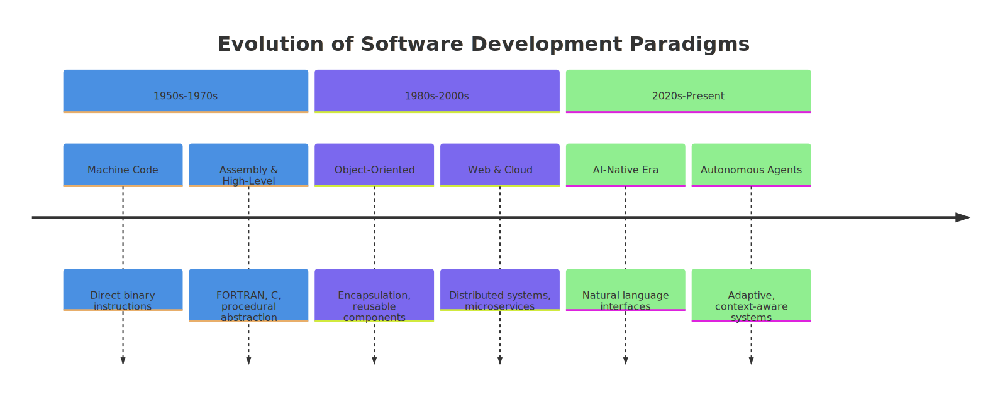

# Introduction: The OpenClaw Paradigm: An Introduction

## Setting the Stage: The AI-Native Revolution

We stand at the dawn of a new era in software development—an era where artificial intelligence is not merely a tool in the developer's toolkit but the very foundation upon which systems are designed, built, and operated. This shift from *AI-augmented* to *AI-native* development represents a fundamental transformation in how we conceive, architect, and interact with technology.

The traditional software development paradigm, built around deterministic logic, explicit algorithms, and human-written code, is giving way to a new approach where AI systems autonomously coordinate, adapt, and evolve. This isn't about adding AI features to existing applications; it's about reimagining software development from the ground up for an AI-first world.

OpenClaw represents one of the most compelling implementations of this AI-native paradigm. Born from the practical needs of developers and system architects working at the frontier of AI-human collaboration, OpenClaw embodies a pragmatic, human-centric approach to AI-native development that balances power with simplicity, autonomy with oversight, and innovation with reliability.

This book documents the patterns, practices, and principles emerging from the OpenClaw ecosystem—patterns derived from analyzing thousands of skills, examining GitHub repositories, and studying community workflows. It serves as both a field guide for practitioners and a theoretical framework for researchers seeking to understand this new paradigm.

## I.1 The Dawn of the AI-Native Era

### The Transition from Traditional Software to AI-Native Systems

The history of software development has been marked by successive abstractions: from machine code to assembly languages, from procedural programming to object-oriented design, and now from deterministic algorithms to AI-native systems. Each transition has fundamentally changed how we think about problem-solving, system design, and developer workflows.

AI-native development represents the latest evolution—a paradigm where AI capabilities are deeply integrated into the fabric of software systems, enabling new forms of interaction, adaptation, and autonomy. Unlike traditional software, which executes predetermined logic, AI-native systems can:
- Interpret natural language instructions and translate them into actions
- Learn from experience and adapt to new situations
- Coordinate multiple specialized capabilities across diverse domains
- Provide contextual awareness and personalized responses
- Operate autonomously within defined boundaries

*Figure 1: The evolution from machine code to AI-native systems represents successive layers of abstraction, each fundamentally changing how we approach problem-solving.*

### Why Now? Convergence of Compute, Models, and Community

Several converging trends have made AI-native development not just possible but inevitable:

**Compute Democratization:** Cloud computing and increasingly powerful consumer hardware have made AI inference accessible to developers worldwide. What once required specialized data centers can now run on laptops and developer workstations.

**Model Advancements:** The rapid evolution of large language models (LLMs) and multimodal AI systems has created increasingly capable foundation models that can understand context, follow instructions, and perform complex reasoning tasks.

**Community Innovation:** Open-source movements have accelerated AI adoption, with projects like OpenClaw demonstrating what's possible when communities collaborate around shared tools and patterns.

**Tooling Maturation:** Development tools, frameworks, and platforms have evolved to support AI-native workflows, lowering barriers to entry and enabling rapid experimentation.

### Beyond Automation: The Rise of Autonomous, Collaborative Systems

Early automation focused on replacing repetitive human tasks with scripted solutions. Today's AI-native systems go further, enabling:
- **Autonomous operation:** Systems that can plan, execute, and adapt without constant human intervention
- **Collaborative intelligence:** Human-AI partnerships where each brings unique strengths to problem-solving
- **Contextual adaptation:** Systems that understand and respond to changing contexts and requirements
- **Continuous learning:** Systems that improve their performance over time based on experience and feedback

### The Fundamental Shift in the Developer's Role

As systems become more AI-native, the developer's role evolves from writing explicit logic to:
- Designing intelligent systems and workflows
- Curating training data and defining objectives
- Establishing guardrails and ethical boundaries
- Orchestrating multi-agent collaborations
- Monitoring, evaluating, and improving system performance

This represents a profound shift in skills, tools, and mindset—a shift that this book aims to help developers navigate successfully.

## I.2 Defining the OpenClaw Paradigm

### What is OpenClaw? Vision, Mission, and Philosophy

OpenClaw is an open-source platform for building personal AI assistants that can understand natural language, coordinate complex tasks, and interact with various communication channels. At its core, OpenClaw embodies a philosophy of **pragmatic AI-native development**—focusing on what works in practice while maintaining high standards of reliability, security, and usability.

**Vision:** To create a world where AI assistants are as accessible, customizable, and useful as traditional software applications—where anyone can build, modify, and share AI capabilities tailored to their specific needs.

**Mission:** To provide developers with the tools, patterns, and community support needed to build robust AI-native systems that are both powerful and comprehensible.

**Philosophy:** OpenClaw embraces several core principles that distinguish it from other AI frameworks:
- **Simplicity over complexity:** Start simple, add complexity only when necessary
- **Human-centric design:** AI should augment human capabilities, not replace them
- **File-based operations:** Use human-readable files as the primary interface for state and configuration
- **Community-driven innovation:** The best ideas emerge from diverse collaboration

### The Core Idea: A Pragmatic, Human-Centric AI-Native Platform

OpenClaw's architecture centers around several key concepts:

**Skills:** Self-contained AI capabilities that follow standardized patterns for discovery, execution, and documentation. Each skill represents a specific function or capability that can be composed with others to create complex workflows.

**Gateway:** A central coordination layer that manages communication between skills, channels, and users. The gateway handles session state, tool routing, and security policies.

**Channels:** Interfaces through which users interact with OpenClaw, including Discord, Telegram, CLI, and web interfaces.

**Tools:** Standardized interfaces for external actions like file operations, web requests, and command execution.

*Figure 2: The OpenClaw architecture centers around the Gateway coordinating Skills and Tools, with users interacting through multiple Channels.*

This architecture enables developers to create AI-native systems that are:
- **Composable:** Skills can be combined in novel ways to solve new problems
- **Extensible:** New capabilities can be added without modifying core systems
- **Understandable:** File-based state and standardized documentation make systems comprehensible
- **Reliable:** Built-in error handling and health monitoring ensure robust operation

### AI-Native vs. AI-Augmented: A Crucial Distinction

It's essential to distinguish between **AI-native** and **AI-augmented** development:

**AI-Augmented Development:** Traditional software development with AI features added on top. The core architecture remains deterministic, with AI providing enhancements like code completion, test generation, or documentation assistance.

**AI-Native Development:** Systems designed from the ground up with AI as a foundational component. AI capabilities are integral to the architecture, enabling new patterns like:
- Natural language interfaces as primary interaction modes
- Autonomous task execution based on high-level goals
- Dynamic adaptation to changing contexts and requirements
- Coordinated multi-agent problem-solving

OpenClaw exemplifies AI-native development, with its gateway-mediated multi-agent architecture, skill-based composition model, and file-based memory systems designed specifically for AI capabilities.

*Figure 3: The fundamental distinction between AI-augmented and AI-native approaches lies in whether AI is an enhancement layer or a foundational component.*

### Key Principles: Simplicity, Composability, and Extensibility

Three principles guide OpenClaw development:

**Simplicity:** OpenClaw prioritizes straightforward, understandable implementations over complex abstractions. This manifests in:
- Human-readable configuration files
- Clear error messages and recovery paths
- Minimal dependencies and setup requirements
- Transparent system behavior

**Composability:** Skills are designed to work together seamlessly, enabling developers to build complex systems from simple components. This composability extends to:
- Standardized interfaces between skills
- Consistent data formats and protocols
- Predictable error handling patterns
- Shared context and memory systems

**Extensibility:** The platform makes it easy to add new capabilities through:
- Well-documented extension points
- Clear patterns for skill development
- Community-driven tool sharing
- Backward-compatible evolution

## I.3 Why This Book?

### Capturing the Emergence of a New Development Paradigm

The transition to AI-native development represents one of the most significant shifts in software engineering since the advent of object-oriented programming or web development. Yet much of the knowledge about this new paradigm remains scattered across blog posts, documentation fragments, and community discussions.

This book aims to capture and systematize the emerging patterns of AI-native development as exemplified by OpenClaw—to create a comprehensive reference that documents both the "what" and the "why" of this new approach.

### Documenting Patterns Derived from Real-World Practice

Rather than presenting theoretical frameworks, this book grounds its insights in real-world analysis:
- **3,000+ skills** analyzed for common patterns and anti-patterns
- **50+ GitHub repositories** examined for architectural approaches
- **Community discussions** studied for workflow innovations
- **Production deployments** reviewed for reliability and performance

This empirical foundation ensures that the patterns described here have been tested in practice, not just conceived in theory.

### Providing a Roadmap for Developers, Architects, and Leaders

Whether you're a developer building your first AI-native application, an architect designing complex AI systems, or a leader guiding organizations through digital transformation, this book provides:

**For Developers:** Practical guidance on skill development, tool usage, and workflow optimization

**For Architects:** Architectural patterns for designing scalable, reliable AI-native systems

**For Leaders:** Strategic frameworks for adopting AI-native approaches and building the necessary organizational capabilities

### Building a Foundation for the Future of AI-Native Systems

As AI capabilities continue to advance, the need for robust development patterns will only grow. This book aims to establish a foundation upon which future innovations can build—a common language and set of principles that can guide the evolution of AI-native development for years to come.

## I.4 Research-Driven Insights

### Overview of the Research Process

The patterns and insights in this book emerge from a comprehensive research process:

**Skills Analysis:** Systematic examination of 3,000+ OpenClaw skills to identify common structures, documentation patterns, and implementation approaches.

**GitHub Repository Analysis:** Study of 50+ OpenClaw-related repositories to understand architectural decisions, community contribution patterns, and tooling ecosystems.

**Community Discourse Analysis:** Review of discussions across Discord, forums, and other community spaces to capture workflow innovations and practical challenges.

**Pattern Synthesis:** Identification of 8 key architectural patterns and 5 anti-patterns through comparative analysis and synthesis of findings across data sources.

### The Role of Pattern Synthesis in Identifying Best Practices

Pattern synthesis provides a powerful methodology for distilling complex, emergent practices into actionable guidance. By identifying recurring solutions to common problems—and documenting them as patterns—we create reusable knowledge that accelerates development and improves system quality.

The patterns documented in this book include:
- **Skill Blueprint Pattern:** Standardized structure for AI skill documentation
- **Micro-Skill Architecture Pattern:** Single-purpose, composable AI capabilities
- **Gateway-Mediated Multi-Agent Pattern:** Central coordination of specialized agents
- **Tool-Based Error Recovery Pattern:** Structured error handling through tools
- **Environment-First Configuration Pattern:** Configuration through environment variables
- **File-Based Memory Pattern:** Persistent state management through structured files
- **Example-Driven Testing Pattern:** Validation through concrete examples
- **AI-First Contribution Pattern:** Community development optimized for AI assistance

### How Data and Examples Drive the Book's Content

Every pattern in this book is illustrated with concrete examples drawn from real OpenClaw implementations. These examples serve multiple purposes:
- **Demonstration:** Showing the pattern in action
- **Guidance:** Providing implementation templates
- **Validation:** Demonstrating effectiveness in real-world scenarios
- **Inspiration:** Sparking ideas for novel applications

### Transparency in Research Sources and Methodology

To maintain intellectual rigor and practical relevance, this book is transparent about its research foundations:
- All analysis is based on publicly available skills, repositories, and discussions
- Patterns are documented with specific examples and implementation details
- Limitations and trade-offs are acknowledged where relevant
- The research methodology is documented for reproducibility

This transparency ensures that readers can evaluate the validity of the patterns and adapt them to their specific contexts.

## I.5 Who Should Read This Book?

### Developers and Software Engineers Seeking to Master AI-Native Patterns

If you're a developer looking to build AI-native applications or integrate AI capabilities into existing systems, this book provides:
- Practical guidance on skill development and tool usage
- Implementation patterns for common AI-native challenges
- Best practices for reliability, security, and performance
- Examples and templates you can adapt to your projects

### Architects and Technical Leaders Designing New Generations of Systems

For architects and technical leaders responsible for system design and technology strategy, this book offers:
- Architectural patterns for scalable AI-native systems
- Design principles for human-AI collaboration
- Organizational patterns for AI-native development teams
- Strategic frameworks for AI adoption and integration

### Researchers and Practitioners Interested in AI-Human Collaboration

Researchers studying human-AI interaction and practitioners working at the boundary of AI and human systems will find:
- Empirical analysis of real-world AI-human collaboration patterns
- Insights into the evolution of development practices with AI
- Frameworks for evaluating AI-native system effectiveness
- Case studies of successful (and unsuccessful) implementations

### Students and Learners Preparing for the Future of the Field

For students and those looking to enter the field of AI-native development, this book provides:
- A comprehensive introduction to key concepts and patterns
- Practical skills and techniques you can apply immediately
- Career guidance for emerging AI-native development roles
- A foundation for lifelong learning in a rapidly evolving field

## I.6 How to Use This Book

### Overview of the Book's Structure and Organization

This book is organized into five parts that progress from foundations to advanced topics:

**Part 1: Foundations, Ecosystem, and Case Studies (Chapters 1-3)**
- Chapter 1: Foundations of AI-Native Development
- Chapter 2: The OpenClaw Ecosystem
- Chapter 3: Case Studies in AI-Native Development

**Part 2: Identity, Orchestration, and Coordination (Chapters 4-6)**
- Chapter 4: The Soul.md Pattern
- Chapter 5: Multi-Agent Orchestration Patterns
- Chapter 6: File Coordination and Memory Patterns

**Part 3: Automation, Autonomy, and Efficiency (Chapters 7-9)**
- Chapter 7: Cron and Scheduled Automation Patterns
- Chapter 8: Autonomous Systems Patterns
- Chapter 9: Cost Optimization Patterns

**Part 4: Resilience, Security, and the Future (Chapters 10-12)**
- Chapter 10: Debugging AI-Native Systems
- Chapter 11: Security Patterns in AI-Native Development
- Chapter 12: The Future of AI-Native Development

**Part 5: Tooling and Community (Chapters 13-14)**
- Chapter 13: Tooling Ecosystem
- Chapter 14: Education and Community

Each chapter builds upon previous ones, creating a logical progression from fundamental concepts to advanced applications.

### Path-Based Reading Recommendations for Different Roles

Depending on your background and goals, you may want to approach the book differently:

**Quick Start for Developers:** Read Chapters 1-3 for foundational concepts, then jump to Chapter 13 for tooling guidance before diving into specific patterns relevant to your current projects.

**Comprehensive Learning Path:** Read the book sequentially from beginning to end, completing hands-on exercises along the way.

**Reference Style:** Use the book as a reference guide, consulting specific patterns as needed while working on projects.

**Strategic Reading for Leaders:** Focus on Chapters 1-2 for overview, Chapter 14 for community and organizational patterns, and selected case studies from Chapter 3.

### How to Apply the Patterns and Lessons to Your Own Projects

The patterns in this book are designed to be practical and actionable. To apply them effectively:

1. **Identify Relevant Patterns:** Match your project challenges to the patterns documented here
2. **Study Examples:** Review the concrete implementations provided for each pattern
3. **Adapt to Context:** Modify patterns to fit your specific requirements and constraints
4. **Iterate and Evolve:** Use patterns as starting points, not rigid templates
5. **Share Learnings:** Contribute your adaptations back to the community

### Prerequisites and Recommended Background

While this book assumes some familiarity with software development concepts, it requires no specific AI expertise. Helpful background includes:
- Basic programming experience in any language
- Familiarity with command-line tools and file systems
- Understanding of web technologies and APIs (helpful but not required)
- Curiosity about AI systems and their applications

Mathematical background in machine learning is **not** required—this book focuses on practical development patterns, not theoretical AI concepts.

## I.7 A Roadmap of the Journey

*Figure 4: The book's five-part structure progresses from foundational concepts through advanced topics, tooling, and community engagement.*

### Part 1: Foundations, Ecosystem, and Case Studies (Chapters 1-3)

Part 1 establishes the conceptual foundation for AI-native development and introduces the OpenClaw ecosystem through concrete examples:

**Chapter 1** defines AI-native development and presents a taxonomy of patterns that will guide the rest of the book.

**Chapter 2** explores the OpenClaw architecture in detail, examining its components, design principles, and implementation patterns.

**Chapter 3** presents case studies of real-world OpenClaw applications, demonstrating how the patterns come together in practice.

### Part 2: Identity, Orchestration, and Coordination (Chapters 4-6)

Part 2 delves into the core patterns that enable sophisticated AI-native systems:

**Chapter 4** examines the Soul.md pattern for defining AI agent identity, values, and constraints.

**Chapter 5** explores multi-agent orchestration patterns for coordinating multiple AI capabilities.

**Chapter 6** investigates file-based coordination and memory patterns for persistent state management.

### Part 3: Automation, Autonomy, and Efficiency (Chapters 7-9)

Part 3 focuses on patterns for creating autonomous, efficient AI systems:

**Chapter 7** covers cron and scheduled automation patterns for recurring tasks.

**Chapter 8** examines patterns for building truly autonomous AI systems.

**Chapter 9** addresses cost optimization patterns for managing AI system economics.

### Part 4: Resilience, Security, and the Future (Chapters 10-12)

Part 4 tackles the critical topics of reliability, security, and forward-looking trends:

**Chapter 10** provides patterns for debugging and maintaining AI-native systems.

**Chapter 11** addresses security patterns and considerations for AI-native development.

**Chapter 12** looks ahead to emerging trends and the future evolution of AI-native development.

### Part 5: Tooling and Community (Chapters 13-14)

Part 5 concludes with practical guidance on tooling and community engagement:

**Chapter 13** surveys the tooling ecosystem for AI-native development.

**Chapter 14** explores education resources and community patterns for sustainable growth.

## I.8 A Personal Note from the Authors

As developers and researchers working at the intersection of AI and software engineering, we've witnessed firsthand the transformative potential of AI-native development. We've also experienced the challenges of navigating this rapidly evolving landscape without clear patterns or established best practices.

This book represents our attempt to fill that gap—to create the resource we wish we had when we began our journey with OpenClaw and AI-native development. It's born from countless hours studying skills, analyzing repositories, and participating in community discussions. It's grounded in real-world experience, not theoretical speculation.

We approach this subject with humility, recognizing that the field is evolving rapidly and that today's best practices may become tomorrow's historical footnotes. Yet we believe that documenting the patterns emerging now—patterns tested in production, refined through community collaboration, and validated across diverse implementations—provides value regardless of how the technology evolves.

Our hope is that this book serves not as a final word on AI-native development, but as a foundation upon which others can build. We invite you to join us in this exploration, to contribute your insights and experiences, and to help shape the future of this exciting field.

## I.9 Acknowledgments

This book would not have been possible without the contributions of countless individuals in the OpenClaw community and the broader AI-native development ecosystem.

We extend our gratitude to:

**The OpenClaw Core Team and Maintainers:** For creating and stewarding a platform that embodies the best principles of AI-native development while remaining accessible and pragmatic.

**The Skill Developers and Contributors:** Whose creativity and experimentation have produced the thousands of skills that form the empirical foundation for this book's patterns.

**The Community Members:** Who have shared their experiences, challenges, and solutions across Discord, GitHub, and other forums, creating a rich tapestry of collective wisdom.

**The Researchers and Academics:** Whose work on human-AI interaction, software engineering, and AI safety has informed our understanding of these systems.

**The Broader AI and Open Source Communities:** Whose innovations and collaborations have made this new paradigm possible.

Finally, we acknowledge that this work builds upon decades of software engineering research and practice. We stand on the shoulders of giants, and we hope this book honors that legacy while pointing toward new possibilities.

## A Final Invitation

As you begin your journey through this book, we invite you to approach AI-native development with curiosity, creativity, and responsibility. The patterns documented here are tools—powerful tools for building systems that can augment human capabilities, solve complex problems, and create new possibilities.

But tools are only as valuable as the wisdom with which they're wielded. We encourage you to use these patterns not just to build more capable systems, but to build systems that are more humane, more ethical, and more beneficial to all.

Welcome to the world of AI-native development. The journey ahead is challenging, rewarding, and profoundly important. We're excited to explore it with you.

— The OpenClaw Books Team